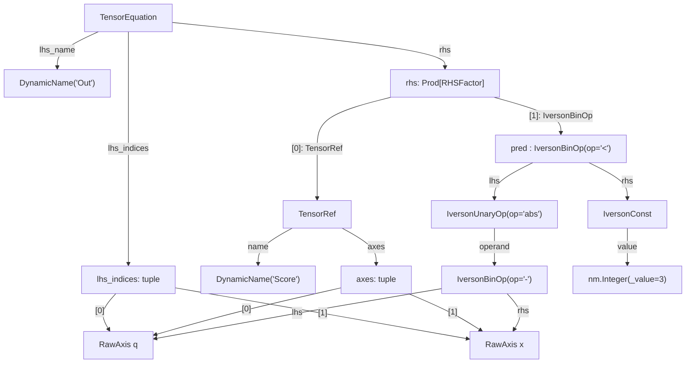

# Boolean Semiring Extension

**Status:** Implemented (pyncd layer and torch compilation complete; tsncd rendering deferred)  
**Context:** Design notes for extending pyncd and tsncd to support the Boolean semiring `(𝔹, ∨, ∧)` alongside the existing arithmetic semiring `(ℝ, +, ×)`, enabling predicate tensors to be realised at the `Datatype` level.

---

## Motivation

### Why mix predicates with tensors?

Many useful tensor expressions combine real-valued arrays with boolean-valued predicates. The canonical example from the transformer is the causal mask:

$$S[\ell, h, x, x'] = \mathrm{Comp}[\ell, h, x, x'] \cdot [x' \leq x]$$

where $\mathrm{Comp}[\ell, h, x, x'] \in \mathbb{R}$ is the raw attention score and $[x' \leq x] \in \{0,1\}$ is the Iverson bracket of a positional predicate. The predicate is promoted to a real value — $\top \mapsto 1$, $\bot \mapsto 0$ — so that it acts as a multiplicative mask: future positions are zeroed out, past positions pass through unchanged.

This promotion is multiplicatively consistent: $[a \wedge b] = [a] \cdot [b]$, so conjunctions of predicates correspond to products of masks. It is the natural way to express any **gating** or **filtering** pattern within a tensor contraction — selecting which terms contribute to a sum by multiplying by a 0/1 indicator:

$$Y[i, j] = \sum_k X[i, k] \cdot W[k, j] \cdot \mathrm{Mask}(i, k)$$

The predicate $\mathrm{Mask}(i, k)$ restricts the contraction to a subset of positions without requiring a separate sparse data structure or explicit index enumeration. More generally, any logical condition on indices — triangular masking, padding masks, type filters — can participate directly in tensor equations via this promotion.

A second example is **embedding lookup**. An embedding table $E[v, m]$ maps vocabulary index $v$ to a real-valued vector component at index $m$. Given a sequence of token positions, $\mathrm{token\_at\_position}[x] = v$ maps position $x$ to vocabulary index $v$. The embedding of the tokens in the sequence is then:

$$X[v, m] = [\mathrm{token\_at\_position}[x] = v] \cdot E[v, m]$$

where $[\mathrm{token\_at\_position}[x] = v] \in \{0,1\}$ is a boolean equality predicate promoted to a real indicator. Contracting over $x$ selects the unique row of $E$ corresponding to the token at each position — a row lookup expressed as a masked contraction. This unifies embedding with the general pattern: a boolean predicate on indices gates which entries of a real-valued table contribute to the output.

To support these mixed expressions cleanly, we have proposals for declaration syntax that attaches kind and shape metadata to named tensors before any equations are written:

```python
tl.Mask.predicate(real_axis('x'), real_axis("x'"))   # 𝔹-valued, shape (x, x')
tl.E.selection(nat_axis('v', 50257), real_axis('m', 512))  # lookup table
tl.W.tensor(real_axis('m', 512), real_axis('k', 64))  # ℝ-valued weight
```

These declarations distinguish predicates (`.predicate()`), embedding tables (`.selection()`), and ordinary real tensors (`.tensor()`) by name, making the boolean/real distinction machine-checkable at equation parse time rather than inferred from usage. The shape annotations also provide the axis sizes needed to construct the correct `Broadcasted` type for each kind.

### Current gap

The tensor logic DSL currently encodes the Boolean vs arithmetic distinction at the axis level only: `.predicate()` declarations promote indices to `PredAxis`, and `T(x, y)` via `__call__` signals a predicate at the call site. However, `TensorEquation.bc_signature()` produces `Broadcasted[Reals, ...]` for all equations regardless of kind — the ∨/∧ semantics are not yet carried into the pyncd type system. A predicate einsum and an arithmetic einsum are indistinguishable in the resulting morphism.

Realising the full distinction requires:

1. A `Bool` datatype in pyncd
2. `bc_signature()` emitting `Broadcasted[Bool, ...]` for predicate equations
3. The `Einops` operator encoding which semiring it uses
4. Rendering support in both pyncd and tsncd

---

## Categorical structure

### What fits naturally

**Weave structure is datatype-agnostic.** A weave classifies each axis of an array as either a target axis (operated on by the base operation) or a tiling axis (`TILED`, supplied by the reindexing loop). This classification depends only on the *shape* of the array, not on whether its values are in $\mathbb{B}$ or $\mathbb{R}$. The degree $P$, the reindexings $\eta_i : P \to Q_i$, the permutations $\Omega_w$, and the canonical split form $A_i \otimes Q_i$ are all unchanged by introducing a Bool datatype. The GPU tiling machinery carries over without modification.

**`Broadcasted` already parameterises over datatype.** The existing type `Broadcasted[B: Datatype, A: Axis, O: Operator]` anticipates datatype variation — `B` is already a free parameter. Homogeneous Bool morphisms (`Broadcasted[Bool, ...]`) fit the existing structure directly, with `Einops` using $(\mathbb{B}, \vee, \wedge)$ in place of $(\mathbb{R}, +, \times)$. The contraction *structure* (which axes are contracted, which are free) is the same for both semirings.

**The Iverson bracket is a morphism in Br.** The pointwise promotion $\iota_A : [\mathbb{B}, A] \to [\mathbb{R}, A]$ defined by $\iota_A(b)_p = [b_p]$ ($1$ if true, $0$ if false) is a well-defined morphism in **Br** — it has the right domain and codomain, composes correctly, and respects the weave structure (target axes remain target, tiling axes remain tiling). Functorially, $\iota$ interacts cleanly with batch lifting: $[\iota_A, P] = \iota_{A \otimes P}$.

**Multiplicative consistency.** For the masking use case the promotion is semantically sound: $[a \wedge b] = [a] \cdot [b]$. A conjunction of predicates corresponds exactly to a product of indicators. Masked contractions of the form $\sum_k X[i,k] \cdot W[k,j] \cdot M(i,k)$ are arithmetically coherent — the Bool input enters the arithmetic semiring multiplicatively and the result is well-typed as $\mathbb{R}$.

**The operator/structure separation.** The weave framework already separates *what the base operation computes* (the `Operator` field) from *how the arrays are tiled and indexed* (the weave and reindexing fields). Adding a `semiring` field to `Einops` is a purely local change to the operator; the surrounding weave machinery is unaffected. This separation is exactly what makes the extension tractable.

---

### Challenges

**Heterogeneous input datatypes break the type parameter.** `Broadcasted[B, ...]` uses a single `B` for all input *and* output weaves. A mixed expression like $S \cdot [x' \leq x]$ has one `Reals` input and one `Bool` input. The existing type parameter cannot express this directly. Two resolutions are possible:

- **Explicit coercion:** insert $\iota$ as a morphism in **Br** before composition, converting the Bool input to `Reals` before it reaches the `Broadcasted`. This preserves homogeneity of `B` but adds a morphism to the composition chain.
- **Heterogeneous input weaves:** allow each input weave to carry its own datatype $b_i$, with the output type determined by the join $b_\text{out} = \bigsqcup_i b_i$ in the lattice $\mathbb{B} \sqsubseteq \mathbb{R}$. This is more expressive but requires loosening the type parameter from a single `B` to a tuple — splitting the covariant (output) and contravariant (input) positions.

Neither is entirely clean; each introduces complexity somewhere in the type system.

**$\iota$ and $H$ form a retraction.** The promotion $\iota$ alone does not preserve addition — $[\top \vee \top] = 1 \neq 2 = [\top] + [\top]$ — but composing with the Heaviside step function $H(x) = \mathbf{1}[x > 0]$ recovers the Boolean sum: $H \circ \sum_k \iota(b_k) = \bigvee_k b_k$ for any finite sequence of Bool values (since $\sum_k \iota(b_k) > 0$ iff any $b_k = \top$). The multiplicative part is already preserved by $\iota$ alone. So $\iota : (\mathbb{B}, \vee, \wedge) \to (\{0,1\} \subset \mathbb{R},\, H{\circ}{+},\, \times)$ is a semiring homomorphism into the *thresholded* arithmetic semiring.

$H : [\mathbb{R}, A] \to [\mathbb{B}, A]$ is a morphism in **Br** (pointwise, respects weave structure) acting as a **demotion** operator. On non-negative reals, $H$ is a semiring homomorphism $(\mathbb{R}_{\geq 0}, +, \times) \to (\mathbb{B}, \vee, \wedge)$: for $a, b \geq 0$, $a + b > 0$ iff $a > 0$ or $b > 0$, so $H(a+b) = H(a) \vee H(b)$; and $ab > 0$ iff both are positive, so $H(ab) = H(a) \wedge H(b)$. This fails on all of $\mathbb{R}$ — $H(1 + (-2)) = \bot$ but $H(1) \vee H(-2) = \top$ — but the non-negativity restriction is automatically satisfied whenever the input is an arithmetic contraction of $\iota$-promoted Bool values, since sums of products of $\{0,1\}$ are always $\geq 0$.

Together, $H \circ \iota = \mathrm{id}_\mathbb{B}$ (since $H(0) = \bot$ and $H(1) = \top$), making $\mathbb{B}$ a **retract** of $\mathbb{R}_{\geq 0}$. Categorically, $A$ is a retract of $B$ when there exist morphisms $s : A \to B$ and $r : B \to A$ with $r \circ s = \mathrm{id}_A$; $s$ is the **section** and $r$ is the **retraction**. Here $s = \iota$ and $r = H$. The reverse composition $\iota \circ H : \mathbb{R}_{\geq 0} \to \mathbb{R}_{\geq 0}$ is not the identity — it is lossy — but is **idempotent**: $(\iota \circ H)^2 = \iota \circ H$, with image exactly $\{0,1\}$. So $\mathbb{B}$ sits inside $\mathbb{R}_{\geq 0}$ as an idempotent-split subobject, and the pair can be written:

$$[\mathbb{B}, A] \underset{H}{\overset{\iota}{\rightleftharpoons}} [\mathbb{R}_{\geq 0}, A] \qquad H \circ \iota = \mathrm{id}$$

The practical consequence is clean: a purely Boolean contraction $Y(i,j) = \exists_k X(i,k) \wedge Z(k,j)$ is computed as the arithmetic einsum $\tilde{Y}[i,j] = \sum_k [X(i,k)] \cdot [Z(k,j)]$ followed by a pointwise $H$. For mixed Bool+Real expressions where the output is $\mathbb{R}$ (masking), $H$ is omitted. The same arithmetic `Einops` infrastructure handles both cases — the only difference is whether the output weave has datatype $\mathbb{B}$ (apply $H$) or $\mathbb{R}$ (do not).

**Composition typing.** `Context.append_iter` currently unifies axis objects when composing morphisms in **Br**. With mixed datatypes, composition also needs to check datatype compatibility — a `Bool` output cannot be fed directly to an input expecting `Reals` without an intervening $\iota$. This adds a datatype-unification step to the composition rule that does not exist today.

**The embedding chain.** The $\iota/H$ retraction handles $\mathbb{B}$ and $\mathbb{R}_{\geq 0}$, but embedding introduces $\mathbb{N}_{<v}$ as a third datatype. A $\mathbb{N}_{<v}$-valued tensor is a function $f : A \to V$, where $a \in A$ is an index into the domain shape and $V$ is a shape axis of size $v$ representing the codomain — the set of possible output values (e.g. $f = \mathrm{token\_at\_position}$). Promoting $f$ to $[\mathbb{B}, A \otimes V]$ turns it into a **relation** — $V$ becomes an explicit extra column (note the shape change from $A$ to $A \otimes V$) and the Bool type identifies which tuples $(a, v)$ are in the relation:

$$R_f[a, v] = [f(a) = v]$$

Embedding lookup then follows the same pattern as masking: promote via $\iota$ and contract. With $f = \mathrm{token\_at\_position}$, this gives $X[a,m] = \sum_v R_{\mathrm{token\_at\_position}}[a,v] \cdot E[v,m]$. Since the relation is functional (exactly one $\top$ per row), the sum collapses to a single row. The demotion — recovering the function from the relation — is $\mathrm{argmax}_V : [\mathbb{B}, A \otimes V] \to [\mathbb{N}_{<v}, A]$, which returns the index $v \in V$ of the unique $\top$ entry for each $a \in A$, satisfying $\mathrm{argmax}_V \circ R_f = \mathrm{id}$. The three datatypes form a **tower of retracts** in **Br**:

$$[\mathbb{N}_{<v}, A] \underset{\mathrm{argmax}_V}{\overset{R}{\rightleftharpoons}} [\mathbb{B}, A \otimes V] \underset{H}{\overset{\iota}{\rightleftharpoons}} [\mathbb{R}_{\geq 0}, A \otimes V]$$

---

## Design

### Overview

The tensor logic DSL is a declarative interface for expressing tensor contractions as Python assignment statements and compiling them to pyncd morphisms. The central object is `TL`, a registry of `TensorEquation`s.

**DSL objects.** Tensor names are accessed as attributes on `TL` — `tl.W` — returning a `TensorProxy`. Subscripting a proxy with axes — `tl.W[i, k]` — returns an `IndexedTensor`. Multiplying `IndexedTensor`s with `*` accumulates them into an `RHSExpression`. Assignment via `__setitem__` captures a complete `TensorEquation` into the registry:

```python
from data_structure.TensorDSL import TL, axes

tl = TL()
i, j, k = axes('i j k')
tl.Y[i, j] = tl.W[i, k] * tl.X[k, j]
```

**Contraction structure from UID identity.** `TensorEquation` stores `lhs_indices` (the output axes) and `rhs` (a tuple of `RHSFactor`s, each carrying their own axes). An axis whose UID appears in `lhs_indices` is *retained* (it appears in the output); an axis present only in `rhs` is *contracted* (summed over). There is no string parsing — axis identity is object identity, tracked by UID.

**Compilation.** `TL.bc_signature()` compiles a single-equation registry to a `Broadcasted` type — the pyncd type of the resulting morphism. `TL.to_morphism()` produces the morphism itself; for multi-equation programs, it topologically sorts equations by dependency before compiling. `ConstructedModule.construct()` in `torch_compile` then lowers a `Broadcasted[B, A, TensorEquation]` to a PyTorch `nn.Module` via `ConstructedTensorEquation`, which runs the contraction as an einsum and applies the Heaviside step $H(x) = \mathbf{1}[x > 0]$ when the output weave carries `Bool()`. Pre-materialised Iverson tensors are passed as ordinary inputs in RHS factor order; their materialisation is a separate upstream step.

**Declarations.** Tensor names can be annotated before use with `.tensor()`, `.predicate()`, or `.selection()`. These record kind and shape metadata that enforce arity at subscript/assignment time and control axis promotion. `.selection()` promotes slots declared as `NatAxis` so the morphism carries the correct `Natural` datatype; `.predicate()` records the name as `Bool`-typed without promoting axes.

**Bool typing in this extension.** Three additions implement Bool/Real mixing:

1. **`Bool` datatype** — a new `Datatype` subclass that travels in `Weave.datatype`, giving predicate arrays a distinct type at the pyncd level.
2. **`TensorRef` and the Iverson expression tree** — a typed representation of RHS factors, replacing raw `(name, axes)` tuples and adding first-class inline predicates.
3. **Acset serialisation** — `DataTag.BOOL` and `iverson_expr` so that Bool and Iverson information survives the round-trip through CSV.

When `bc_signature()` or `to_morphism()` is called, `TL` builds a name→datatype map from its declarations: every name registered with `.predicate()` maps to `Bool()`, all others are absent. This map is passed into `TensorEquation.bc_signature()`, which assigns a datatype to each input weave: a `TensorRef` factor looks up its name in the map and uses `Bool()` if found, `Reals()` if not; an inline Iverson factor like `q <= x` is always `Bool()` regardless of any declaration. The output weave is `Reals()` by default, since predicate inputs typically gate a real-valued contraction rather than produce a Bool result.

---

### 1. `Bool` datatype

`Bool` is a frozen dataclass alongside `Reals` and `Natural`:

```python
# data_structure/BroadcastedCategory.py
@dataclass(frozen=True)
class Bool(Datatype): ...
```

It carries no parameters — unlike `Natural(max_value=n)`, there is no size to record. `Bool` flows through `Weave.datatype` exactly as `Reals` does; no structural changes to `Weave`, `Broadcasted`, `lift.py`, or `composition.py` were required because those components already operate per-weave.

---

### 2. Iverson expression tree

Predicates on axes are represented as a Term-based expression tree, so that `deep_reconstruct` unifies the axes inside predicates alongside tensor axes during `to_morphism()`.

**Types:**

```python
@dataclass(frozen=True)
class IversonConst(fd.Term):
    value: nm.Numeric          # e.g. nm.Integer(5)

@dataclass(frozen=True)
class IversonBinOp(fd.Term):
    op: str                    # '<', '<=', '>', '>=', '==', '+', '-', '*', '&', '|'
    lhs: IversonExpr
    rhs: IversonExpr

@dataclass(frozen=True)
class IversonUnaryOp(fd.Term):
    op: str                    # 'abs', 'not', '-'
    operand: IversonExpr

type IversonExpr = sc.RawAxis | IversonConst | IversonBinOp | IversonUnaryOp
```

`RawAxis` serves directly as a leaf — no wrapper required — because it is already a `Term`.

**Operator syntax.** Importing `TensorExpr` monkey-patches `RawAxis` with the comparison and arithmetic operators that build Iverson nodes. `__mul__` is intentionally excluded to avoid collision with tensor-product semantics in the DSL.

```python
from data_structure.TensorExpr import iabs, ieq  # importing patches RawAxis

q, x = axes('q x')
pred = q < x           # IversonBinOp('<', q, x)
pred = q <= x          # IversonBinOp('<=', q, x)
pred = ieq(q, x)       # IversonBinOp('==', q, x)   — __eq__ can't be overridden on Term
pred = iabs(q - x) < IversonConst(nm.Integer(3))
#      IversonBinOp('<', IversonUnaryOp('abs', IversonBinOp('-', q, x)), IversonConst(3))
```

`IversonBinOp` and `IversonUnaryOp` also define their own comparison and arithmetic operators so that compound expressions chain naturally: `(q - x) < IversonConst(nm.Integer(3))` works even when the left operand is itself an `IversonBinOp`.

**Using an Iverson factor in an equation.** An `IndexedTensor` — the object produced by subscripting a `TensorProxy`, e.g. `tl.Score[q, x]` — can be multiplied by an Iverson predicate to include it as a Bool-typed factor:

```python
tl = TL()
q, x, h, k = axes('q x h k')

# Causal mask: Attn[q, x] = Score[q, x] * [q <= x] — Bool factor, Real output
tl.Attn[q, x] = tl.Score[q, x] * (q <= x)
# eq.rhs == (TensorRef(DynamicName('Score'), (q, x)),
#            IversonBinOp('<=', q, x))
```

---

### 3. Typed RHS: `TensorRef` and `RHSFactor`

`TensorEquation.rhs` previously held raw Python tuples `(DynamicName, tuple[RawAxis])`. These have been replaced by a proper `Term` subclass:

```python
# data_structure/TensorExpr.py
@dataclass(frozen=True)
class TensorRef(fd.Term):
    name: fd.DynamicName
    axes: fd.Prod[sc.RawAxis] = ()
```

The unified RHS type — covering both named tensor references and the Iverson types defined above — is:

```python
type RHSFactor = TensorRef | IversonBinOp | IversonUnaryOp
```

`TensorEquation.rhs: fd.Prod[RHSFactor]`. Because all three variants are `fd.Term` subclasses, `Context.apply()` and `deep_reconstruct` traverse their axis fields correctly during UID unification in `to_morphism()`.

The DSL produces `TensorRef` automatically — `TensorProxy.__setitem__` wraps each `IndexedTensor` factor:

```python
tl = TL()
i, j, k = axes('i j k')
tl.Y[i, j] = tl.W[i, k] * tl.X[k, j]
# eq.rhs == (TensorRef(DynamicName('W'), (i, k)),
#            TensorRef(DynamicName('X'), (k, j)))
```

`_factor_axes` extracts the `RawAxis` leaves from any `RHSFactor`, which `contracted_axes`, `bc_signature`, and `topological_sort` use in place of iterating `(name, axes)` pairs:

```python
from data_structure.TensorExpr import _factor_axes

_factor_axes(TensorRef(name, (q, x)))  # → (q, x)
_factor_axes(q < x)                    # → (q, x)
```

Using `pred` from the Iverson section as a factor alongside an `IndexedTensor` —

```python
tl.Out[q, x] = tl.Score[q, x] * pred
```

— builds this structure. `rhs` holds both a `TensorRef` and an `IversonBinOp` under the common `RHSFactor` type. `q` and `x` are the same objects in all three locations (`lhs_indices`, `TensorRef.axes`, and the Iverson subtree); their shared UIDs are what the contraction engine uses to identify retained and contracted axes.



---

### 4. Bool typing via `.predicate()` declarations

The `.predicate()` declaration on `TensorProxy` no longer promotes indices to a subclass. It is now purely a kind annotation that feeds `bc.Bool()` into the `array_datatypes` dict:

```python
tl = TL()
q, x = axes('q x')
tl.Mask.predicate(q, x)

tl._array_datatypes()
# → {DynamicName('Mask'): Bool()}
```

`TL.bc_signature()` and `TL.to_morphism()` both pass this dict to the equation:

```python
tl.Attn[q, x] = tl.Score[q, x] * tl.Mask[q, x]
sig = tl.bc_signature()
sig.input_weaves[0].datatype  # Reals()   — Score
sig.input_weaves[1].datatype  # Bool()    — Mask
sig.output_weaves[0].datatype # Reals()   — Attn (undeclared → Reals)
```

Inline Iverson factors are automatically `Bool`-typed in `bc_signature()` without a declaration:

```python
tl2 = TL()
tl2.Attn[q, x] = tl2.Score[q, x] * (q <= x)
sig2 = tl2.bc_signature()
sig2.input_weaves[1].datatype  # Bool()   — inline predicate
```

`array_datatypes` is also accepted directly by `TensorEquation.bc_signature()` and `TensorProgram.to_morphism()` for callers that bypass the DSL:

```python
from data_structure.TensorLogic import TensorEquation, TensorProgram
from data_structure.TensorExpr import TensorRef
import data_structure.BroadcastedCategory as bc
import data_structure.Term as fd

eq = TensorEquation(
    lhs_name=fd.DynamicName('Out'),
    lhs_indices=(q, x),
    rhs=(TensorRef(fd.DynamicName('Score'), (q, x)), q <= x),
)
br = eq.bc_signature(array_datatypes={fd.DynamicName('Score'): bc.Reals()})
br.input_weaves[1].datatype  # Bool()
```

---

### 5. Acset layer

**`DataTag.BOOL`** is a new value in the `DataTag` enum (`'bool'`), accepted wherever `DataTag.REALS` and `DataTag.NATURAL` are.

**`ArrayRow.iverson_expr`** is a new optional field (`str | None`). When `_add_equation` encounters an Iverson factor in `rhs`, it writes a `Bool`-typed `ArrayRow` with `name=None` and `iverson_expr` holding a human-readable serialisation of the expression tree:

```text
(q <= x)              ← IversonBinOp('<=', q, x)
(abs((q - x)) < 3)   ← nested tree
```

The CSV columns for `arrays.csv` include `iverson_expr`; `write_sbr`/`read_sbr` round-trip the field transparently.

**`_dt_fields`** dispatches on `Bool`:

```python
def _dt_fields(dt):
    if isinstance(dt, bc.Natural):  return DataTag.NATURAL, dt.max_value
    if isinstance(dt, bc.Bool):     return DataTag.BOOL, None
    return DataTag.REALS, None
```

---

### 6. `PredAxis` removal

`PredAxis` is deleted entirely (`data_structure/AxisAnnotations.py`, `acset/csv_io.py` UID registry). There is no backward-compatibility shim.

The `.predicate()` declaration is retained — it controls the Bool/Reals dispatch in `_array_datatypes()` and the arity check in `_promote()`. Only the axis promotion is gone.

---

### 7. What is not yet done

- **Iverson materialisation** — inline Iverson factors (`q <= x`) are typed as `Bool` inputs in `bc_signature()` but have no runtime evaluation path in `torch_compile`. They must currently be pre-built as concrete tensors by the caller and passed in RHS factor order. A future materialisation step would evaluate `IversonExpr` trees to generate these tensors automatically.
- **tsncd rendering** — the TypeScript `Bool` class, `DatatypeAnchor` branch, and wire-styling changes are described in the Rendering section below but not yet implemented.
- **Embedding DSL** — `ops.Embedding.template()` is unchanged; the Iverson-based embedding derivation is possible but not exposed.

---

## Implementation against the challenges

The four challenges identified in the Categorical structure section have different statuses in the current implementation.

### Challenge 1: Heterogeneous input datatypes

**Adopted resolution:** heterogeneous input weaves, with Python's type erasure absorbing the gap.

`Broadcasted[B, A, O]` carries a single type parameter `B` that nominally applies to all input and output weaves. For a mixed equation — one `Reals` input and one `Bool` input — this is technically wrong: the `B` in the returned `Broadcasted` describes the output weave only, and the Bool input weave is stored silently under the same type parameter. Python does not enforce `B` on individual weave instances at runtime; the fields are just lists of `Weave` objects, each carrying its own `.datatype` attribute independently.

The practical consequence is that **all downstream code reads `weave.datatype` per-weave**, not from the type parameter. `ConstructedTensorEquation` checks `target.output_weaves[0].datatype` to decide whether to apply $H$; `bc_signature()` assigns `Bool()` or `Reals()` to each input weave individually from `array_datatypes`; the tsncd renderer will style each wire from `input_weave.datatype`. None of these sites rely on `B` being correct.

This is not a formal resolution of the type-system challenge — it is a pragmatic side-step that exploits the fact that Python's generic type parameters are unenforced. The "explicit coercion" alternative (inserting $\iota$ before composition) would keep `B` correct throughout but adds a morphism to every mixed equation. We chose the simpler path: store heterogeneous weaves, ignore the broken type parameter, dispatch per-weave.

A future refactor could split `B` into `B_in: tuple[Datatype, ...]` and `B_out: Datatype` to recover type accuracy. This is not currently planned.

---

### Challenge 2: ι and H retraction

**Fully resolved** for the torch compilation path.

The promotion $\iota : \mathbb{B} \to \{0,1\} \subset \mathbb{R}$ is handled implicitly: pre-materialised Bool tensors are float tensors containing $0.0$ and $1.0$, so no explicit cast is needed. When a caller supplies a Mask or an inline Iverson tensor in RHS factor order, the values are already in $\{0,1\}$ by construction.

The demotion $H : \mathbb{R}_{\geq 0} \to \mathbb{B}$ is implemented in `ConstructedTensorEquation.forward`:

```python
if self.demote:
    return (result > 0).to(result.dtype)
```

`self.demote` is set at construction time as `isinstance(target.output_weaves[0].datatype, cat.Bool)`. When `demote` is `True`, the einsum result — which is always $\geq 0$ when inputs are $\{0,1\}$ — is thresholded: strictly positive values become $1.0$, zero becomes $0.0$. The `.to(result.dtype)` preserves the float dtype so the output is a float tensor of $0.0$/$1.0$ values rather than a `torch.bool` tensor, keeping it compatible with downstream arithmetic.

The same flag that controls $H$ in the compiler is the signal for `∃`/`∧` display in tsncd (pending).

---

### Challenge 3: Composition typing

**Not yet resolved.**

`Context.append_iter` in `data_structure/Composition.py` unifies axis UIDs when composing morphisms in **Br** but does not check datatype compatibility. A `Bool`-output weave composed directly with a `Reals`-input weave will silently type-check — the framework will not raise an error, and the resulting `Composed` morphism will carry a datatype mismatch across the composition boundary.

The practical mitigation is that the current use cases do not compose Bool outputs directly with Reals inputs: masked contractions produce `Reals` output (the output weave is `Reals()`, so no mismatch); Bool-output equations (where `demote=True`) are terminal in the current patterns. The risk is latent — it surfaces as soon as someone writes a `Composed` morphism that feeds a Bool result to an arithmetic step without an explicit $\iota$.

Resolving this properly requires `append_iter` to check `output_weave.datatype == input_weave.datatype` and either raise or insert $\iota$ automatically. That change is deferred.

---

### Challenge 4: The embedding chain

**Not yet implemented.**

The embedding derivation — treating an embedding table as a masked contraction over a `Natural`-typed axis, with a `Natural`→`Bool` promotion step — is theoretically grounded (see the tower of retracts in the Categorical structure section) but not yet exposed in the DSL. `ops.Embedding.template()` is unchanged; the `ConstructedEmbedding` module continues to use `torch.nn.Embedding` directly without routing through the Iverson/Bool path. Implementing the embedding chain would require adding the $\mathbb{N}_{<v} \overset{R}{\to} [\mathbb{B}, A \otimes V]$ promotion step to the DSL and wiring it through `to_morphism()`.

---

## Rendering

Three aspects of the diagram can distinguish Boolean morphisms from arithmetic ones, in increasing implementation cost. All required signals are already present in the pyncd layer; what remains is purely tsncd display code.

### 1. Equation string inside the operator box

The highest-signal change. Instead of `Σ`/`×` notation, Boolean equations render with `∃`/`∧`:

```text
Y[i,z] = Σ_k  W[i,k] × X[k,z]    ← arithmetic
Y(x,z) = ∃_y  R(x,y) ∧ S(y,z)    ← boolean
```

The signal is `output_weave.datatype`: `Bool()` for a predicate-LHS equation, `Reals()` otherwise. This is the same flag that `ConstructedTensorEquation.demote` already reads to decide whether to apply the Heaviside step — no new infrastructure is needed. The display renderer reads it directly from the `Broadcasted`.

### 2. Wire styling for `Bool` input weaves

Styling applies per input weave, not per equation. A mixed equation — one `Reals` input and one `Bool` input — has two wires entering the same operator box, rendered differently. The `Bool()` vs `Reals()` distinction is available on `input_weave.datatype` for each wire individually.

Dashed lines are a standard convention for discrete/Boolean types in categorical diagrams. However, tsncd already uses a `'5,5'` dash pattern on broadcaster separator curves (the lines dividing product elements in `Separated<T, S>`). Reusing the same pattern for Boolean wires would create a visual collision.

Two ways to avoid it:

- **Different dash pattern.** The `'5,5'` separator reads as "dashed"; Boolean wires could use `'2,6'` (short dot, long gap), which reads distinctly as "dotted" — a conventional signal for discrete types and perceptually different at a glance.
- **Color instead of dashing.** A solid wire in a distinct hue avoids the collision entirely. The `Natural` anchor already uses lime-green; a complementary color on the wire ties it visually to the `𝔹` anchor without ambiguity. Color communicates semantic type more naturally than stroke pattern, and the existing separator dashes are structural (they mark composition boundaries) — a type annotation should look different in kind, not just degree.

The most robust option is both: a `'2,6'` dotted stroke in a distinct color, redundantly encoding the distinction so it reads correctly in greyscale and for users who notice only one cue. Of the two alone, color is preferred.

**Iverson factor wires.** An inline Iverson factor (`q <= x`) produces an anonymous `Bool`-typed input weave — there is no tensor name to label the wire with. Its wire label should show the serialised expression string instead, which `_serialize_iverson` already produces and `ArrayRow.iverson_expr` already stores (e.g., `(q <= x)`, `abs((q - x)) < 3`). Named predicate tensors (declared via `.predicate()`) label their wires with the tensor name as usual.

### 3. `𝔹` datatype anchor

tsncd renders datatypes explicitly only for `Natural` — via a `DatatypeAnchor` (lime-green border, curved line with triangle arrow, LaTeX max-value annotation). `Reals` produces no visual element. A bare `Bool` would be equally invisible without an explicit rendering branch.

**`tsncd/src/data_structure/BroadcastedCategory.ts`**  
Add the TypeScript mirror class:

```typescript
export class Bool extends Datatype {}
```

**`tsncd/src/display/Framework/BroadcastedCategoryRenderer.ts`**  
Add an `instanceof cat.Bool` branch alongside the existing `Natural` check (currently around line 96):

```typescript
if (this.target.datatype instanceof cat.Bool) {
    this.datatype_anchor = new DatatypeAnchor(categoryRenderer, this.target.datatype);
}
```

The `DatatypeAnchor` displays a `𝔹` annotation rather than a numeric max-value, following the same curved-line-with-triangle-arrow visual convention used for `Natural`.

**pyncd text renderer (`display/node_category.py`)** requires no changes: the `datatype()` function already renders the first two characters of the class name, so `Bool()` appears as `"Bo"` automatically.

---

The combination of per-wire Bool styling, `∃`/`∧` in the equation string, and `𝔹` datatype anchors gives a redundantly encoded visual language: a Boolean morphism is identifiable from the wires entering and leaving it, the label inside the box, and the anchor on its output wire independently.

---

## Summary of changes

| File | Change |
|---|---|
| `data_structure/TensorExpr.py` | **New.** `TensorRef`, `IversonConst`, `IversonBinOp`, `IversonUnaryOp`; `_factor_axes`, `_serialize_iverson`; `ieq`/`imul`/`iabs`; monkey-patches `RawAxis` operators |
| `data_structure/BroadcastedCategory.py` | Add `Bool(Datatype)` |
| `data_structure/Category.py` | Re-export `Bool` |
| `data_structure/AxisAnnotations.py` | Delete `PredAxis` |
| `data_structure/TensorLogic.py` | `rhs` type → `fd.Prod[TensorRef \| IversonBinOp \| IversonUnaryOp]`; `bc_signature` and `to_morphism` accept `array_datatypes`; `topological_sort` and `contracted_axes` use `_factor_axes` |
| `data_structure/TensorDSL.py` | Remove `_pred_wrap`, PREDICATE axis promotion; `__setitem__` produces `TensorRef`; add `_array_datatypes()`; `RHSExpression` accepts Iverson factors; re-export `ieq`/`imul`/`iabs` |
| `acset/instances.py` | Add `DataTag.BOOL`; add `ArrayRow.iverson_expr: str \| None` |
| `acset/convert.py` | `_dt_fields` handles `Bool`; `_add_equation` dispatches `TensorRef` vs Iverson |
| `acset/csv_io.py` | Remove `PredAxis` from UID registry; add `iverson_expr` to arrays CSV read/write |
| `torch_compile/torch_compile.py` | Add `generate_tensor_equation_signature`; add `ConstructedTensorEquation` (registered for `TensorEquation` operator; applies $H$ when `output_weave.datatype == Bool()`) |
| `tests/test_torch_compile.py` | **New.** Signature generation, dispatch, Reals forward, Bool/Heaviside forward, pre-materialised Iverson interface |
