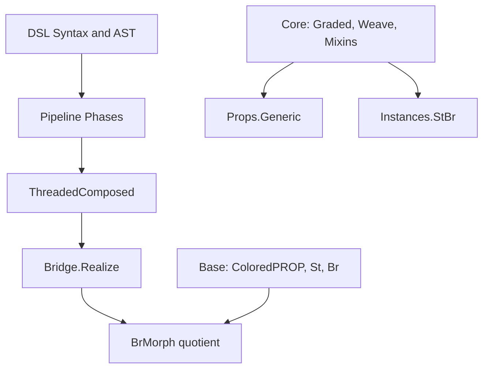
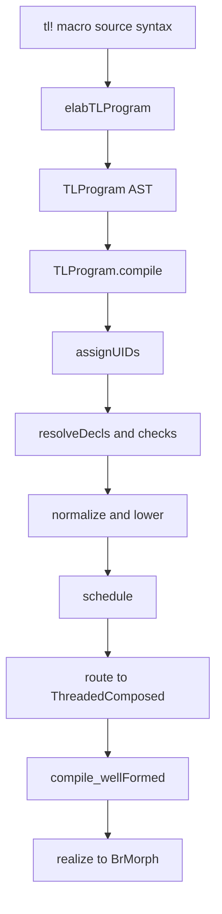
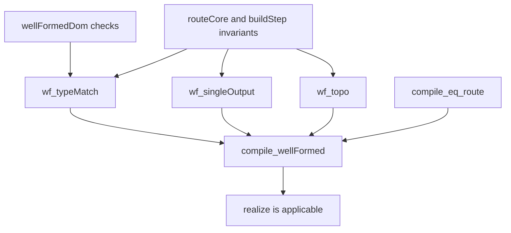

# LeanNCD Code Walkthrough: Compilation Pipeline, Category Theory, and Proofs

This document is a guided walkthrough of the Lean 4 code in `leanncd/`, aimed at programmers who know functional programming but are new to Lean.

The central story is:

1. parse tensor-logic syntax,
2. compile through a staged pipeline,
3. produce a routed presentation ([`ThreadedComposed`](https://github.com/william-macready/pyncd/blob/agents/tutorial-lean4-compilation-guide/leanncd/LeanNCD/DSL/Target.lean#L114-L118)),
4. realize it as a formal [`BrMorph`](https://github.com/william-macready/pyncd/blob/agents/tutorial-lean4-compilation-guide/leanncd/LeanNCD/Base/Br.lean#L141-L141) in the categorical model.

## Table of contents

- [1) How to read this guide](#1-how-to-read-this-guide)
- [2) Codebase structure (where things live)](#2-codebase-structure-where-things-live)
  - [2.1 Directory map](#21-directory-map)
  - [2.2 What each main directory does](#22-what-each-main-directory-does)
  - [2.3 High-value files and their primary jobs](#23-high-value-files-and-their-primary-jobs)
- [3) Lean concepts you will see immediately](#3-lean-concepts-you-will-see-immediately)
- [4) Compilation pipeline walkthrough (stagewise)](#4-compilation-pipeline-walkthrough-stagewise)
  - [4.1 Big-picture flow](#41-big-picture-flow)
  - [4.2 Stage 0-1: grammar and elaboration](#42-stage-0-1-grammar-and-elaboration)
  - [4.3 Stage 2: AST model](#43-stage-2-ast-model)
  - [4.4 Stage 3: compile entrypoint and macro](#44-stage-3-compile-entrypoint-and-macro)
  - [4.5 Stage 4: structural normalization/checking](#45-stage-4-structural-normalizationchecking)
  - [4.6 Stage 5: lowering, scans, scheduling, routing to `ThreadedComposed` (construction + inspection)](#46-stage-5-lowering-scans-scheduling-routing-to-threadedcomposed-construction--inspection)
  - [4.7 Stage 7: from routed presentation to formal Br morphism](#47-stage-7-from-routed-presentation-to-formal-br-morphism)
- [5) Running examples through the pipeline](#5-running-examples-through-the-pipeline)
  - [5.1 Example A: matmul](#51-example-a-matmul)
  - [5.2 Example B: scan vs scanAffine](#52-example-b-scan-vs-scanaffine)
  - [5.3 Routing sanity example](#53-routing-sanity-example)
- [6) Category-theory mapping to implementation](#6-category-theory-mapping-to-implementation)
  - [6.1 Mapping table](#61-mapping-table)
  - [6.2 Why there are multiple representations](#62-why-there-are-multiple-representations)
  - [6.3 Important conceptual nuance](#63-important-conceptual-nuance)
- [7) Proof roadmap (what is proved, what drives compiler trust)](#7-proof-roadmap-what-is-proved-what-drives-compiler-trust)
  - [7.1 Compiler-to-bridge trust chain](#71-compiler-to-bridge-trust-chain)
  - [7.2 Key theorem clusters](#72-key-theorem-clusters)
  - [7.3 Open/deferred proof areas (important for readers)](#73-opendeferred-proof-areas-important-for-readers)
- [8) ACSet interoperability (code + proof tutorial)](#8-acset-interoperability-code--proof-tutorial)
  - [8.1 What interoperates (and what does not)](#81-what-interoperates-and-what-does-not)
  - [8.2 Python ACSet path (external/export representation)](#82-python-acset-path-externalexport-representation)
  - [8.3 Lean ACSet path (bridge representation + proofs)](#83-lean-acset-path-bridge-representation--proofs)
  - [8.4 Walkthrough: DSL compile -> ACSet tables -> realized `BrMorph`](#84-walkthrough-dsl-compile---acset-tables---realized-brmorph)
  - [8.5 Proof coverage, caveats, and trust boundary](#85-proof-coverage-caveats-and-trust-boundary)
  - [8.6 Interop verification checklist](#86-interop-verification-checklist)
- [9) Lean concept callouts at encounter points](#9-lean-concept-callouts-at-encounter-points)
- [10) Suggested reading itinerary (fast to deep)](#10-suggested-reading-itinerary-fast-to-deep)
- [11) Practical checkpoints while reading](#11-practical-checkpoints-while-reading)
- [12) Closing note](#12-closing-note)

---

## 1) How to read this guide

Use this in two passes:

- **Pass A (systems view):** read Sections 2–5 quickly to understand the architecture and dataflow.
- **Pass B (proof/category view):** read Sections 6–9 and follow the file pointers.

Two running examples are threaded throughout:

- **Example A (matmul):** `Y[i,j] := W[i,k] · X[k,j]`
- **Example B (scan recurrence):**
  - affine: `S[j, 0] := X[j] ; S[j, l +1] := S[j, l] · A[j, k]`
  - nonlinear: `S[j, l +1] := relu(S[j, l] · A[j, k])`

Primary test anchors:

- `leanncd/test/DSL/CompileExamplesTest.lean`
- `leanncd/test/DSL/Pipeline/ScanAffineTest.lean`
- `leanncd/test/DSL/Pipeline/RouteWeaveTest.lean`

---

## 2) Codebase structure (where things live)

Start with `leanncd/LeanNCD.lean`. Its top-level comment explains the major split:

- **Track 1:** categorical/noncomputable math tower
- **Track 2:** executable/computable DSL + pipeline
- **Bridge:** converts executable presentation to formal categorical morphism

### 2.1 Directory map



How to interpret the non-pipeline boxes:

- [`Core`](https://github.com/william-macready/pyncd/tree/agents/tutorial-lean4-compilation-guide/leanncd/LeanNCD/Core) ([`Graded`](https://github.com/william-macready/pyncd/blob/agents/tutorial-lean4-compilation-guide/leanncd/LeanNCD/Core/Graded.lean), [`Weave`](https://github.com/william-macready/pyncd/blob/agents/tutorial-lean4-compilation-guide/leanncd/LeanNCD/Core/Weave.lean), [`Mixins`](https://github.com/william-macready/pyncd/tree/agents/tutorial-lean4-compilation-guide/leanncd/LeanNCD/Mixins)) is the abstraction layer on top of categorical foundations ([`Base`](https://github.com/william-macready/pyncd/tree/agents/tutorial-lean4-compilation-guide/leanncd/LeanNCD/Base)).
- [`Props.Generic`](https://github.com/william-macready/pyncd/blob/agents/tutorial-lean4-compilation-guide/leanncd/LeanNCD/Props/Generic.lean) proves reusable theorems parameterized by those `Core` abstractions.
- [`Instances.StBr`](https://github.com/william-macready/pyncd/blob/agents/tutorial-lean4-compilation-guide/leanncd/LeanNCD/Instances/StBr.lean) supplies the concrete flagship instance (`D = St`, `C = Br`) so those generic theorems can specialize to this project.

So these three boxes are primarily a **theory stack** (`Base -> Core -> Props/Instances`), while the `DSL -> ThreadedComposed -> Bridge.Realize` path is the **executable compiler path**.

### 2.2 What each main directory does

| Directory | Role | Key files to start with |
|---|---|---|
| `LeanNCD/DSL` | surface syntax, AST, elaboration, compile entrypoint | [`Syntax.lean`](https://github.com/william-macready/pyncd/blob/agents/tutorial-lean4-compilation-guide/leanncd/LeanNCD/DSL/Syntax.lean), [`Elab.lean`](https://github.com/william-macready/pyncd/blob/agents/tutorial-lean4-compilation-guide/leanncd/LeanNCD/DSL/Elab.lean), [`Ast.lean`](https://github.com/william-macready/pyncd/blob/agents/tutorial-lean4-compilation-guide/leanncd/LeanNCD/DSL/Ast.lean), [`Compile.lean`](https://github.com/william-macready/pyncd/blob/agents/tutorial-lean4-compilation-guide/leanncd/LeanNCD/DSL/Compile.lean), [`Target.lean`](https://github.com/william-macready/pyncd/blob/agents/tutorial-lean4-compilation-guide/leanncd/LeanNCD/DSL/Target.lean) |
| `LeanNCD/DSL/Pipeline` | phase-by-phase lowering/routing | [`Types.lean`](https://github.com/william-macready/pyncd/blob/agents/tutorial-lean4-compilation-guide/leanncd/LeanNCD/DSL/Pipeline/Types.lean), [`Structural.lean`](https://github.com/william-macready/pyncd/blob/agents/tutorial-lean4-compilation-guide/leanncd/LeanNCD/DSL/Pipeline/Structural.lean), [`Lowering.lean`](https://github.com/william-macready/pyncd/blob/agents/tutorial-lean4-compilation-guide/leanncd/LeanNCD/DSL/Pipeline/Lowering.lean), [`RouteSpec.lean`](https://github.com/william-macready/pyncd/blob/agents/tutorial-lean4-compilation-guide/leanncd/LeanNCD/DSL/Pipeline/RouteSpec.lean) |
| `LeanNCD/Base` | categorical foundations (ColoredPROP, St, Br) | [`ColoredPROP.lean`](https://github.com/william-macready/pyncd/blob/agents/tutorial-lean4-compilation-guide/leanncd/LeanNCD/Base/ColoredPROP.lean), [`St.lean`](https://github.com/william-macready/pyncd/blob/agents/tutorial-lean4-compilation-guide/leanncd/LeanNCD/Base/St.lean), [`Br.lean`](https://github.com/william-macready/pyncd/blob/agents/tutorial-lean4-compilation-guide/leanncd/LeanNCD/Base/Br.lean) |
| `LeanNCD/Bridge` | convert routed presentation to formal morphisms; agreement results | [`Realize.lean`](https://github.com/william-macready/pyncd/blob/agents/tutorial-lean4-compilation-guide/leanncd/LeanNCD/Bridge/Realize.lean), [`Agreement.lean`](https://github.com/william-macready/pyncd/blob/agents/tutorial-lean4-compilation-guide/leanncd/LeanNCD/Bridge/Agreement.lean), [`SBr.lean`](https://github.com/william-macready/pyncd/blob/agents/tutorial-lean4-compilation-guide/leanncd/LeanNCD/Bridge/SBr.lean), [`AcsetCodec.lean`](https://github.com/william-macready/pyncd/blob/agents/tutorial-lean4-compilation-guide/leanncd/LeanNCD/Bridge/AcsetCodec.lean) |
| `LeanNCD/Core`, `Mixins`, `Props`, `Instances` | graded structure, temporal mixins, generic propositions, flagship instance | [`Graded.lean`](https://github.com/william-macready/pyncd/blob/agents/tutorial-lean4-compilation-guide/leanncd/LeanNCD/Core/Graded.lean), [`Weave.lean`](https://github.com/william-macready/pyncd/blob/agents/tutorial-lean4-compilation-guide/leanncd/LeanNCD/Core/Weave.lean), [`Temporal.lean`](https://github.com/william-macready/pyncd/blob/agents/tutorial-lean4-compilation-guide/leanncd/LeanNCD/Mixins/Temporal.lean), [`Generic.lean`](https://github.com/william-macready/pyncd/blob/agents/tutorial-lean4-compilation-guide/leanncd/LeanNCD/Props/Generic.lean), [`StBr.lean`](https://github.com/william-macready/pyncd/blob/agents/tutorial-lean4-compilation-guide/leanncd/LeanNCD/Instances/StBr.lean) |
| `LeanNCD/Eval` | reference evaluator path over scheduled program | [`Eval.lean`](https://github.com/william-macready/pyncd/blob/agents/tutorial-lean4-compilation-guide/leanncd/LeanNCD/Eval/Eval.lean), [`Scan.lean`](https://github.com/william-macready/pyncd/blob/agents/tutorial-lean4-compilation-guide/leanncd/LeanNCD/Eval/Scan.lean), [`Contract.lean`](https://github.com/william-macready/pyncd/blob/agents/tutorial-lean4-compilation-guide/leanncd/LeanNCD/Eval/Contract.lean) |
| `leanncd/test` | executable spec of intended behavior | [`test/DSL/`](https://github.com/william-macready/pyncd/tree/agents/tutorial-lean4-compilation-guide/leanncd/test/DSL), [`test/Bridge/`](https://github.com/william-macready/pyncd/tree/agents/tutorial-lean4-compilation-guide/leanncd/test/Bridge), [`test/Base/`](https://github.com/william-macready/pyncd/tree/agents/tutorial-lean4-compilation-guide/leanncd/test/Base), [`test/Core/`](https://github.com/william-macready/pyncd/tree/agents/tutorial-lean4-compilation-guide/leanncd/test/Core) |

### 2.3 High-value files and their primary jobs

| File | Primary functions/types |
|---|---|
| `DSL/Syntax.lean` | declares grammar categories ([`tl_program`](https://github.com/william-macready/pyncd/blob/agents/tutorial-lean4-compilation-guide/leanncd/LeanNCD/DSL/Syntax.lean#L175-L175), [`tl_stmt`](https://github.com/william-macready/pyncd/blob/agents/tutorial-lean4-compilation-guide/leanncd/LeanNCD/DSL/Syntax.lean#L164-L164), [`tl_rhs`](https://github.com/william-macready/pyncd/blob/agents/tutorial-lean4-compilation-guide/leanncd/LeanNCD/DSL/Syntax.lean#L159-L161), etc.) |
| `DSL/Elab.lean` | syntax-to-value elaborators ([`elabTLProgram`](https://github.com/william-macready/pyncd/blob/agents/tutorial-lean4-compilation-guide/leanncd/LeanNCD/DSL/Elab.lean#L259-L284), [`elabTLStmt`](https://github.com/william-macready/pyncd/blob/agents/tutorial-lean4-compilation-guide/leanncd/LeanNCD/DSL/Elab.lean#L246-L250), [`elabTLRHS`](https://github.com/william-macready/pyncd/blob/agents/tutorial-lean4-compilation-guide/leanncd/LeanNCD/DSL/Elab.lean#L200-L207), [`elabTLIdxExpr`](https://github.com/william-macready/pyncd/blob/agents/tutorial-lean4-compilation-guide/leanncd/LeanNCD/DSL/Elab.lean#L110-L118)) |
| `DSL/Ast.lean` | IR data types ([`TLProgram`](https://github.com/william-macready/pyncd/blob/agents/tutorial-lean4-compilation-guide/leanncd/LeanNCD/DSL/Ast.lean#L123-L126), [`Stmt`](https://github.com/william-macready/pyncd/blob/agents/tutorial-lean4-compilation-guide/leanncd/LeanNCD/DSL/Ast.lean#L116-L121), [`RHSExpr`](https://github.com/william-macready/pyncd/blob/agents/tutorial-lean4-compilation-guide/leanncd/LeanNCD/DSL/Ast.lean#L97-L101), [`IdxExpr`](https://github.com/william-macready/pyncd/blob/agents/tutorial-lean4-compilation-guide/leanncd/LeanNCD/DSL/Ast.lean#L25-L31), [`Nonlin`](https://github.com/william-macready/pyncd/blob/agents/tutorial-lean4-compilation-guide/leanncd/LeanNCD/DSL/Ast.lean#L66-L76), [`LHSSlot`](https://github.com/william-macready/pyncd/blob/agents/tutorial-lean4-compilation-guide/leanncd/LeanNCD/DSL/Ast.lean#L103-L109)) |
| `DSL/Compile.lean` | [`TLProgram.compile`](https://github.com/william-macready/pyncd/blob/agents/tutorial-lean4-compilation-guide/leanncd/LeanNCD/DSL/Compile.lean#L19-L29), [`TLProgram.compileToScheduled`](https://github.com/william-macready/pyncd/blob/agents/tutorial-lean4-compilation-guide/leanncd/LeanNCD/DSL/Compile.lean#L34-L35), [`tl!{...}`](https://github.com/william-macready/pyncd/blob/agents/tutorial-lean4-compilation-guide/leanncd/LeanNCD/DSL/Compile.lean#L39-L43) macro |
| `DSL/Pipeline/Structural.lean` | early phases: UID assignment, decl/rank/dtype checks, axis unification, arithmetic lowering prep |
| `DSL/Pipeline/Lowering.lean` | nonlinearity split, scheduling, routing ([`buildExtIndex`](https://github.com/william-macready/pyncd/blob/agents/tutorial-lean4-compilation-guide/leanncd/LeanNCD/DSL/Pipeline/Lowering.lean#L340-L362), [`buildNameToStep`](https://github.com/william-macready/pyncd/blob/agents/tutorial-lean4-compilation-guide/leanncd/LeanNCD/DSL/Pipeline/Lowering.lean#L474-L480), [`buildStep`](https://github.com/william-macready/pyncd/blob/agents/tutorial-lean4-compilation-guide/leanncd/LeanNCD/DSL/Pipeline/Lowering.lean#L482-L553), [`routeCore`](https://github.com/william-macready/pyncd/blob/agents/tutorial-lean4-compilation-guide/leanncd/LeanNCD/DSL/Pipeline/Lowering.lean#L573-L579), [`route`](https://github.com/william-macready/pyncd/blob/agents/tutorial-lean4-compilation-guide/leanncd/LeanNCD/DSL/Pipeline/Lowering.lean#L583-L588)) |
| `DSL/Target.lean` | computable presentation types: [`BrBaseP`](https://github.com/william-macready/pyncd/blob/agents/tutorial-lean4-compilation-guide/leanncd/LeanNCD/DSL/Target.lean#L93-L99), [`StMatP`](https://github.com/william-macready/pyncd/blob/agents/tutorial-lean4-compilation-guide/leanncd/LeanNCD/DSL/Target.lean#L12-L17), [`Wire`](https://github.com/william-macready/pyncd/blob/agents/tutorial-lean4-compilation-guide/leanncd/LeanNCD/DSL/Target.lean#L106-L109), [`ThreadedComposed`](https://github.com/william-macready/pyncd/blob/agents/tutorial-lean4-compilation-guide/leanncd/LeanNCD/DSL/Target.lean#L114-L118) + well-formedness predicates |
| `Bridge/Realize.lean` | presentation-to-formal bridge: [`realizeBrBaseP`](https://github.com/william-macready/pyncd/blob/agents/tutorial-lean4-compilation-guide/leanncd/LeanNCD/Bridge/Realize.lean#L50-L61), [`realizeDom`](https://github.com/william-macready/pyncd/blob/agents/tutorial-lean4-compilation-guide/leanncd/LeanNCD/Bridge/Realize.lean#L68-L73), [`realize`](https://github.com/william-macready/pyncd/blob/agents/tutorial-lean4-compilation-guide/leanncd/LeanNCD/Bridge/Realize.lean#L250-L253) |
| `Bridge/Agreement.lean` | compilation correctness bridge theorem: [`compile_wellFormed`](https://github.com/william-macready/pyncd/blob/agents/tutorial-lean4-compilation-guide/leanncd/LeanNCD/Bridge/Agreement.lean#L379-L383) |
| `Base/St.lean` | affine index morphisms ([`StMat`](https://github.com/william-macready/pyncd/blob/agents/tutorial-lean4-compilation-guide/leanncd/LeanNCD/Base/St.lean#L28-L30)) + [`ColoredPROP`](https://github.com/william-macready/pyncd/blob/agents/tutorial-lean4-compilation-guide/leanncd/LeanNCD/Base/ColoredPROP.lean#L10-L67) instance for shape/index maps |
| `Base/Br.lean` | free strict SMC (raw [`Hom`](https://github.com/william-macready/pyncd/blob/agents/tutorial-lean4-compilation-guide/leanncd/LeanNCD/Base/Br.lean#L53-L63) + quotient [`Rel`](https://github.com/william-macready/pyncd/blob/agents/tutorial-lean4-compilation-guide/leanncd/LeanNCD/Base/Br.lean#L64-L135)) and [`BrMorph`](https://github.com/william-macready/pyncd/blob/agents/tutorial-lean4-compilation-guide/leanncd/LeanNCD/Base/Br.lean#L141-L141) laws |

---

## 3) Lean concepts you will see immediately

As concepts first appear below, they are linked again in context. Keep these references handy:

- inductive and constructor-driven data modeling:
  - [Inductive Types (TPiL4)](https://leanprover.github.io/theorem_proving_in_lean4/Inductive-Types/)
  - [Lean reference: inductive declarations](https://lean-lang.org/doc/reference/latest/)
- structure and record types:
  - [Structures and Records (FPiL)](https://leanprover.github.io/functional_programming_in_lean/)
- pattern matching:
  - [Pattern Matching](https://lean-lang.org/doc/reference/latest/Terms/Pattern-Matching/)
- macros + syntax categories:
  - [Defining New Syntax](https://lean-lang.org/doc/reference/latest/Notations-and-Macros/Defining-New-Syntax/)
  - [Macros](https://lean-lang.org/doc/reference/latest/Notations-and-Macros/Macros/)
- elaboration stages:
  - [Elaboration and Compilation](https://lean-lang.org/doc/reference/latest/Elaboration-and-Compilation/)
- typeclasses:
  - [Type Classes](https://lean-lang.org/doc/reference/latest/Type-Classes/)
- quotients:
  - [Quotients](https://lean-lang.org/doc/reference/latest/The-Type-System/Quotients/)
- tactic-oriented proofs:
  - [Tactic Proofs](https://lean-lang.org/doc/reference/latest/Tactic-Proofs/)
  - [Tactic Reference](https://lean-lang.org/doc/reference/latest/Tactic-Proofs/Tactic-Reference/)

---

## 4) Compilation pipeline walkthrough (stagewise)

This is the core “source to routed/formal morphism” path.

### 4.1 Big-picture flow



### 4.2 Stage 0-1: grammar and elaboration

**Input:** raw Lean source text containing a `tl!{ ... }` expression.

**What happens:** Lean's parser recognises the `tl_*` syntax categories (defined in [`DSL/Syntax.lean`](https://github.com/william-macready/pyncd/blob/agents/tutorial-lean4-compilation-guide/leanncd/LeanNCD/DSL/Syntax.lean#L21-L40)) and builds an untyped `Syntax` tree. The registered elaborator ([`elabTLProgram`](https://github.com/william-macready/pyncd/blob/agents/tutorial-lean4-compilation-guide/leanncd/LeanNCD/DSL/Elab.lean#L259-L284)) then recursively walks that tree, calling helpers for each grammar non-terminal, to produce a typed Lean value.

**Output:** a [`TLProgram`](https://github.com/william-macready/pyncd/blob/agents/tutorial-lean4-compilation-guide/leanncd/LeanNCD/DSL/Ast.lean#L123-L126) — a list of declarations and a list of statements with all axis UIDs set to 0 (unresolved) and no ordering or routing applied.

- Syntax categories are declared in
  [`DSL/Syntax.lean`](https://github.com/william-macready/pyncd/blob/agents/tutorial-lean4-compilation-guide/leanncd/LeanNCD/DSL/Syntax.lean#L21-L40).
- Parsing/elaboration functions in
  [`DSL/Elab.lean`](https://github.com/william-macready/pyncd/blob/agents/tutorial-lean4-compilation-guide/leanncd/LeanNCD/DSL/Elab.lean#L110-L284) build [`TLProgram`](https://github.com/william-macready/pyncd/blob/agents/tutorial-lean4-compilation-guide/leanncd/LeanNCD/DSL/Ast.lean#L123-L126) values from syntax.

In Lean 4, *parsing* and *elaboration* are two distinct phases. The **parser** turns raw text into an untyped `Syntax` tree — a lightweight, generic tree of tokens and node kinds. An **elaborator** is then a function that walks that `Syntax` tree and produces a typed Lean value (or expression). Elaborators run inside the `MetaM` / `TermElabM` monad, which gives them access to the type environment, unification, and fresh-name generation.

For this DSL the flow is:

```
text: "Y[i,j] := W[i,k] · X[k,j]"
  → parser (via syntax rules in Syntax.lean)
  → Syntax tree (untyped)
  → elaborator (functions in Elab.lean)
  → TLProgram value (typed Lean data)
```

The `elab` keyword registers a function as the elaborator for a particular syntax category. So when Lean encounters `tl!{ ... }`, it dispatches to the registered elaborator, which recursively calls helpers like [`elabTLStmt`](https://github.com/william-macready/pyncd/blob/agents/tutorial-lean4-compilation-guide/leanncd/LeanNCD/DSL/Elab.lean#L246-L250) and [`elabTLIdxExpr`](https://github.com/william-macready/pyncd/blob/agents/tutorial-lean4-compilation-guide/leanncd/LeanNCD/DSL/Elab.lean#L110-L118) to convert each sub-tree fragment into the corresponding [`Stmt`](https://github.com/william-macready/pyncd/blob/agents/tutorial-lean4-compilation-guide/leanncd/LeanNCD/DSL/Ast.lean#L116-L121) or [`IdxExpr`](https://github.com/william-macready/pyncd/blob/agents/tutorial-lean4-compilation-guide/leanncd/LeanNCD/DSL/Ast.lean#L25-L31) constructor. This is why the functions are named `elab*`: they are the elaboration handlers for each grammar non-terminal.

**Reference:** [Elaboration and Compilation](https://lean-lang.org/doc/reference/latest/Elaboration-and-Compilation/)

Code anchors:

- [`tl_program` grammar entrypoint](https://github.com/william-macready/pyncd/blob/agents/tutorial-lean4-compilation-guide/leanncd/LeanNCD/DSL/Syntax.lean#L175-L175)
- [`elabTLProgram` top-level elaborator](https://github.com/william-macready/pyncd/blob/agents/tutorial-lean4-compilation-guide/leanncd/LeanNCD/DSL/Elab.lean#L259-L284)
- [`elabTLStmt` statement elaborator](https://github.com/william-macready/pyncd/blob/agents/tutorial-lean4-compilation-guide/leanncd/LeanNCD/DSL/Elab.lean#L246-L250)

What the code actually does:

- [`declare_syntax_cat ...`](https://github.com/william-macready/pyncd/blob/agents/tutorial-lean4-compilation-guide/leanncd/LeanNCD/DSL/Syntax.lean#L21-L40) introduces the DSL grammar categories ([`tl_program`](https://github.com/william-macready/pyncd/blob/agents/tutorial-lean4-compilation-guide/leanncd/LeanNCD/DSL/Syntax.lean#L175-L175), [`tl_stmt`](https://github.com/william-macready/pyncd/blob/agents/tutorial-lean4-compilation-guide/leanncd/LeanNCD/DSL/Syntax.lean#L164-L164), [`tl_rhs`](https://github.com/william-macready/pyncd/blob/agents/tutorial-lean4-compilation-guide/leanncd/LeanNCD/DSL/Syntax.lean#L159-L161), etc.).
- [`syntax ... : tl_*`](https://github.com/william-macready/pyncd/blob/agents/tutorial-lean4-compilation-guide/leanncd/LeanNCD/DSL/Syntax.lean#L45-L175) rules encode precedence/associativity for arithmetic, boolean predicates, products/sums, and statement syntax.
- [`elabTLProgram`](https://github.com/william-macready/pyncd/blob/agents/tutorial-lean4-compilation-guide/leanncd/LeanNCD/DSL/Elab.lean#L259-L284) iterates over parsed children and dispatches each child to declaration or statement elaboration.
- [`elabTLStmt`](https://github.com/william-macready/pyncd/blob/agents/tutorial-lean4-compilation-guide/leanncd/LeanNCD/DSL/Elab.lean#L246-L250) lowers `name[slots] := rhs` into [`Stmt.assign`](https://github.com/william-macready/pyncd/blob/agents/tutorial-lean4-compilation-guide/leanncd/LeanNCD/DSL/Ast.lean#L117-L118) (scatter classification is deferred to lowering).
- [`elabTLIdxExpr`](https://github.com/william-macready/pyncd/blob/agents/tutorial-lean4-compilation-guide/leanncd/LeanNCD/DSL/Elab.lean#L110-L118) canonicalizes index arithmetic into [`IdxExpr`](https://github.com/william-macready/pyncd/blob/agents/tutorial-lean4-compilation-guide/leanncd/LeanNCD/DSL/Ast.lean#L25-L31) constructors (axis, const, scale, shift, affine).

**Lean concept:** syntax quotations and elaboration (`Syntax -> MetaM α`)  
**Where:** [`elabTLProgram`](https://github.com/william-macready/pyncd/blob/agents/tutorial-lean4-compilation-guide/leanncd/LeanNCD/DSL/Elab.lean#L259-L284), [`elabTLStmt`](https://github.com/william-macready/pyncd/blob/agents/tutorial-lean4-compilation-guide/leanncd/LeanNCD/DSL/Elab.lean#L246-L250), [`elabTLRHS`](https://github.com/william-macready/pyncd/blob/agents/tutorial-lean4-compilation-guide/leanncd/LeanNCD/DSL/Elab.lean#L200-L207)  
**Docs:** [Defining New Syntax](https://lean-lang.org/doc/reference/latest/Notations-and-Macros/Defining-New-Syntax/), [Macros](https://lean-lang.org/doc/reference/latest/Notations-and-Macros/Macros/)

You will notice that every function in [`DSL/Elab.lean`](https://github.com/william-macready/pyncd/blob/agents/tutorial-lean4-compilation-guide/leanncd/LeanNCD/DSL/Elab.lean) is declared with `partial def` rather than plain `def`. In Lean 4, all definitions must be provably terminating by default — the kernel checks that every recursive call visits a structurally smaller input. This requirement exists because Lean is simultaneously a theorem prover: a function that could loop forever would let you "prove" anything by never returning a proof term. `partial def` lifts that requirement, telling Lean to trust the programmer rather than verify termination. The trade-off is that a `partial def` is opaque to the proof kernel and cannot be used in theorems.

The elaborators need `partial def` for two reasons. First, they recurse over untyped `Syntax` nodes — a generic tree whose children are accessed by index at runtime — so the termination checker cannot see that each call visits a strictly smaller subtree. Second, elaborators only need to *run* at compile time; no theorem ever reasons about what `elabTLProgram` returns, so losing proof-usability is an acceptable cost. See [partial definitions](https://lean-lang.org/doc/reference/latest/Definitions/#partial-defs) in the Lean reference.

### 4.3 Stage 2: AST model

**Input:** not a transformation stage — this section describes the data model that the elaborator (Stage 0-1) produces and that every pipeline phase below consumes and transforms.

**What the types represent:** [`DSL/Ast.lean`](https://github.com/william-macready/pyncd/blob/agents/tutorial-lean4-compilation-guide/leanncd/LeanNCD/DSL/Ast.lean#L12-L127) defines the compiler's intermediate representation (IR) — the typed data structures that the elaborator produces and that all subsequent pipeline phases consume. At the top level, the AST has two layers:

- **Declarations** describe the *shape* of the program: what tensors exist, what axes they range over, and what their kinds (real, nat) and sizes are.
- **Statements** describe the *computation*: assignments from a right-hand side expression to a named output tensor.

Every statement's right-hand side decomposes as a sum of products of tensor reads (`SumExpr`), an optional nonlinearity applied to the result (`Nonlin`), and a reduction/contraction operation (`AggOp`). The left-hand side decomposes into a list of `LHSSlot`s — one per output axis — which distinguish free output axes, recurrence iteration axes (scan step / next), and affine scatter destinations.

Axes are tracked uniformly as [`AxisSpec`](https://github.com/william-macready/pyncd/blob/agents/tutorial-lean4-compilation-guide/leanncd/LeanNCD/DSL/Ast.lean#L12-L16) values (name + unique ID + kind) throughout the AST. The pipeline assigns these UIDs in the first phase ([`assignUIDs`](https://github.com/william-macready/pyncd/blob/agents/tutorial-lean4-compilation-guide/leanncd/LeanNCD/DSL/Pipeline/Structural.lean#L87-L98)) so that later passes can identify the same axis by UID regardless of how it was spelled in the source.

The types in the AST are:

- [`TLProgram`](https://github.com/william-macready/pyncd/blob/agents/tutorial-lean4-compilation-guide/leanncd/LeanNCD/DSL/Ast.lean#L123-L126) (decls + stmts),
- [`Stmt`](https://github.com/william-macready/pyncd/blob/agents/tutorial-lean4-compilation-guide/leanncd/LeanNCD/DSL/Ast.lean#L116-L121) (assign, scatter, recurMorphism),
- [`IdxExpr`](https://github.com/william-macready/pyncd/blob/agents/tutorial-lean4-compilation-guide/leanncd/LeanNCD/DSL/Ast.lean#L25-L31), [`RHSExpr`](https://github.com/william-macready/pyncd/blob/agents/tutorial-lean4-compilation-guide/leanncd/LeanNCD/DSL/Ast.lean#L97-L101), [`Nonlin`](https://github.com/william-macready/pyncd/blob/agents/tutorial-lean4-compilation-guide/leanncd/LeanNCD/DSL/Ast.lean#L66-L76), [`AggOp`](https://github.com/william-macready/pyncd/blob/agents/tutorial-lean4-compilation-guide/leanncd/LeanNCD/DSL/Ast.lean#L79-L80), [`LHSSlot`](https://github.com/william-macready/pyncd/blob/agents/tutorial-lean4-compilation-guide/leanncd/LeanNCD/DSL/Ast.lean#L103-L109), etc.

Code anchors:

- [`TLProgram`](https://github.com/william-macready/pyncd/blob/agents/tutorial-lean4-compilation-guide/leanncd/LeanNCD/DSL/Ast.lean#L123-L126)
- [`Stmt`](https://github.com/william-macready/pyncd/blob/agents/tutorial-lean4-compilation-guide/leanncd/LeanNCD/DSL/Ast.lean#L116-L121)
- [`RHSExpr`](https://github.com/william-macready/pyncd/blob/agents/tutorial-lean4-compilation-guide/leanncd/LeanNCD/DSL/Ast.lean#L97-L101)
- [`LHSSlot`](https://github.com/william-macready/pyncd/blob/agents/tutorial-lean4-compilation-guide/leanncd/LeanNCD/DSL/Ast.lean#L103-L109)

What the code actually does:

- [`AxisSpec`](https://github.com/william-macready/pyncd/blob/agents/tutorial-lean4-compilation-guide/leanncd/LeanNCD/DSL/Ast.lean#L12-L16) carries source-level axis identity (name, uid, kind).
- [`Decl`](https://github.com/william-macready/pyncd/blob/agents/tutorial-lean4-compilation-guide/leanncd/LeanNCD/DSL/Ast.lean#L18-L23) separates tensor/predicate/linear/axis declarations.
- [`RHSExpr`](https://github.com/william-macready/pyncd/blob/agents/tutorial-lean4-compilation-guide/leanncd/LeanNCD/DSL/Ast.lean#L97-L101) separates algebraic body ([`SumExpr`](https://github.com/william-macready/pyncd/blob/agents/tutorial-lean4-compilation-guide/leanncd/LeanNCD/DSL/Ast.lean#L95-L96)) from nonlinear/reduction behavior (nonlin, agg).
- [`LHSSlot`](https://github.com/william-macready/pyncd/blob/agents/tutorial-lean4-compilation-guide/leanncd/LeanNCD/DSL/Ast.lean#L103-L109) encodes free axes, scan slots (iterAt / iterNext), and affine scatter slots.
- [`Stmt.recurMorphism`](https://github.com/william-macready/pyncd/blob/agents/tutorial-lean4-compilation-guide/leanncd/LeanNCD/DSL/Ast.lean#L119-L121) is the escape hatch for supplying a pre-built routed fragment.

**Lean concept:** inductive and structure as ADT/record backbone  
**Docs:** [Inductive Types](https://leanprover.github.io/theorem_proving_in_lean4/Inductive-Types/), [Pattern Matching](https://lean-lang.org/doc/reference/latest/Terms/Pattern-Matching/)

**`deriving` clauses.** Many AST types end with `deriving Repr, DecidableEq, Inhabited` (or a subset). This instructs Lean to *automatically generate* typeclass instances rather than write them by hand:

- [`Repr`](https://leanprover-community.github.io/mathlib4_docs/Init/Repr.html) — generates a `repr` function that pretty-prints the value. Used by `#eval` and by `throwError s!"{repr e}"` in the `tl!` macro.
- [`DecidableEq`](https://leanprover-community.github.io/mathlib4_docs/Init/Prelude.html#DecidableEq) — generates a decision procedure for `a == b`. Pipeline passes use `==` to compare axis UIDs, tensor names, and error values; without `DecidableEq` those comparisons would not typecheck.
- [`Inhabited`](https://leanprover-community.github.io/mathlib4_docs/Init/Prelude.html#Inhabited) — provides a default value for the type (via `default`). Required by certain array and list operations that need a fallback element.

`deriving` is Lean's equivalent of Haskell's `deriving (Show, Eq)` — it runs a compile-time macro that inspects the type definition and synthesises the instance automatically.

**How to read the AST notation.** Lean 4 has two kinds of type-level building blocks you will see throughout the AST.

An `inductive` type is a tagged union (like a Haskell ADT or a Rust `enum`). Each variant is a *constructor* accessed via dot notation, e.g. `LHSSlot.free`, `Stmt.assign`, `Factor.read`. You pick one constructor and supply its arguments positionally. Pattern matching on an `inductive` must cover every constructor.

A `structure` type is a named record with labelled fields. You construct one using **anonymous constructor syntax** `{ field := value, ... }` — the curly braces mean "build a value of whichever structure type is expected here, filling in its fields". For example, `RHSExpr` is a structure with fields `body`, `nonlin`, and `agg`, so `{ body := ..., nonlin := .identity, agg := .sum }` constructs an `RHSExpr`. Lean infers which structure type is required from the surrounding context (the expected type), so you don't have to write the type name again.

You will also see **angle-bracket syntax** `⟨..., ..., ...⟩`. This is the anonymous constructor for any type with a single constructor — most commonly `structure` types. `⟨"i", 0, .real none⟩` constructs an `AxisSpec` value by position: name = `"i"`, uid = `0`, kind = `.real none`. It is exactly equivalent to `AxisSpec.mk "i" 0 (.real none)` or `{ name := "i", uid := 0, kind := .real none }`.

Finally, **leading-dot constructors** like `.identity`, `.sum`, `.real none` are shorthand for `Nonlin.identity`, `AggOp.sum`, `AxisKind.real none` etc. — Lean infers the namespace from the expected type.

**Example A — matmul AST** (`Y[i,j] := W[i,k] · X[k,j]`)

The elaborator produces this `TLProgram` (UIDs are all 0 before `assignUIDs` runs; the pipeline will replace them with distinct non-zero values):

```lean
TLProgram {
  decls := [],
  stmts := [
    Stmt.assign "Y"
      [ LHSSlot.free ⟨"i", 0, .real none⟩,   -- free output axis i
        LHSSlot.free ⟨"j", 0, .real none⟩ ]  -- free output axis j
      { body   := { terms := [{ factors := [
                      Factor.read "W" [.axis ⟨"i", 0, .real none⟩,
                                       .axis ⟨"k", 0, .real none⟩],
                      Factor.read "X" [.axis ⟨"k", 0, .real none⟩,
                                       .axis ⟨"j", 0, .real none⟩]
                    ]}]},
        nonlin := .identity,
        agg    := .sum }   -- k is contracted by summation
  ]
}
```

Points to note: `k` appears in the RHS reads but not in the LHS slots, so it is a *contracted* (summation) axis. `decls` is empty here because no explicit declarations were written — axes are inferred entirely from usage. After `assignUIDs`, `i`, `j`, and `k` each get a distinct non-zero UID so later passes can distinguish them even when axis names are reused across statements.

**Example B — nonlinear scan AST with declarations** (`axis l : ℕ = 4 ; linear A ; S[j, l+1] := relu(S[j, l] · A[j, k])`)

This variant adds explicit declarations to show non-empty `decls`. The source program would be:

```lean
tl!{
  axis l : ℕ = 4       -- l is a nat axis pinned to size 4
  linear A              -- A is declared as a linear (weight) tensor
  S[j, l+1] := relu(S[j, l] · A[j, k])
}
```

The elaborated `TLProgram`:

```lean
TLProgram {
  decls := [
    Decl.axis ⟨"l", 0, .nat (some (SizeExpr.lit 4))⟩ (some 4),
      -- axis l : ℕ = 4 → kind = nat, pinned size = 4
    Decl.linear "A" [⟨"j", 0, .real none⟩, ⟨"k", 0, .real none⟩] false
      -- linear A[j,k], no bias
  ],
  stmts := [
    Stmt.assign "S"
      [ LHSSlot.free     ⟨"j", 0, .real none⟩,   -- free output axis j
        LHSSlot.iterNext ⟨"l", 0, .nat  none⟩ ]  -- l+1: recurrence step output
      { body   := { terms := [{ factors := [
                      Factor.read "S" [.axis ⟨"j", 0, .real none⟩,
                                       .axis ⟨"l", 0, .nat  none⟩],  -- reads S at current step l
                      Factor.read "A" [.axis ⟨"j", 0, .real none⟩,
                                       .axis ⟨"k", 0, .real none⟩]
                    ]}]},
        nonlin := .relu,
        agg    := .sum }   -- k contracted; relu applied after contraction
  ]
}
```

What the declarations contribute:

- `Decl.axis` pins the size of `l` to 4. The pipeline stores this in [`explicitSizes`](https://github.com/william-macready/pyncd/blob/agents/tutorial-lean4-compilation-guide/leanncd/LeanNCD/DSL/Pipeline/Types.lean#L65-L66) so the evaluator and bridge can use concrete dimensions without further inference.
- `Decl.linear` marks `A` as a *linear* (weight/parameter) tensor rather than a plain data tensor. This affects how `resolveDecls` classifies inputs: `A` will appear in the [`DeclEnv`](https://github.com/william-macready/pyncd/blob/agents/tutorial-lean4-compilation-guide/leanncd/LeanNCD/DSL/Pipeline/Types.lean#L10-L10) with its declared rank, so `checkReadRanks` can validate that every read of `A` uses exactly 2 indices.

The `LHSSlot.iterNext` slot on `l` is what tells the pipeline this is a recurrence — the output is the value of `S` at step `l+1`. The read of `S[j, l]` in the RHS refers to the value at the *current* step. `finalizeScans` later pairs these into a [`ScanStmt.scan`](https://github.com/william-macready/pyncd/blob/agents/tutorial-lean4-compilation-guide/leanncd/LeanNCD/DSL/Pipeline/Types.lean#L17-L18) structure. The linear-contraction/`relu` separation is not performed as a schedule-time phase: [`compileToScheduled`](https://github.com/william-macready/pyncd/blob/agents/tutorial-lean4-compilation-guide/leanncd/LeanNCD/DSL/Compile.lean#L43-L45) emits one `ScanStmt` per source statement, and the split into a pre-activation node and a `relu` node happens privately at the `route` boundary (`Pipeline/RouteFragments.lean`'s `physicalizeForRoute`) or, for the checked plan, inside `prepareEvalPlan`'s two-step `assign → pointwise/axiswise` chain.

### 4.4 Stage 3: compile entrypoint and macro

**Input:** a [`TLProgram`](https://github.com/william-macready/pyncd/blob/agents/tutorial-lean4-compilation-guide/leanncd/LeanNCD/DSL/Ast.lean#L123-L126) value produced by the elaborator — a flat list of declarations and statements with no UIDs assigned, no axis unification, and no scheduling order.

**What happens:** [`TLProgram.compile`](https://github.com/william-macready/pyncd/blob/agents/tutorial-lean4-compilation-guide/leanncd/LeanNCD/DSL/Compile.lean#L19-L29) sequences all ten pipeline phases (stages 4–10 below) in a single monadic `do` chain running inside [`FreshM`](https://github.com/william-macready/pyncd/blob/agents/tutorial-lean4-compilation-guide/leanncd/LeanNCD/Exec/Uid.lean#L34-L34) — a state monad that carries a counter for minting fresh unique IDs and accumulates any [`CompileError`](https://github.com/william-macready/pyncd/blob/agents/tutorial-lean4-compilation-guide/leanncd/LeanNCD/Exec/Uid.lean#L18-L31)s. The `tl!{ ... }` macro runs this entire chain at Lean elaboration time (i.e. at compile time of the Lean source file), so the result is a fully-compiled value embedded directly in the compiled binary.

**Output:** a [`ThreadedComposed`](https://github.com/william-macready/pyncd/blob/agents/tutorial-lean4-compilation-guide/leanncd/LeanNCD/DSL/Target.lean#L114-L118) — the routed, scheduled program graph ready for realization or evaluation. If any phase detects a malformed program it returns a [`CompileError`](https://github.com/william-macready/pyncd/blob/agents/tutorial-lean4-compilation-guide/leanncd/LeanNCD/Exec/Uid.lean#L18-L31) instead and the chain short-circuits.

[`DSL/Compile.lean`](https://github.com/william-macready/pyncd/blob/agents/tutorial-lean4-compilation-guide/leanncd/LeanNCD/DSL/Compile.lean#L19-L43):

- [`TLProgram.compile`](https://github.com/william-macready/pyncd/blob/agents/tutorial-lean4-compilation-guide/leanncd/LeanNCD/DSL/Compile.lean#L19-L29) chains phases in [`FreshM`](https://github.com/william-macready/pyncd/blob/agents/tutorial-lean4-compilation-guide/leanncd/LeanNCD/Exec/Uid.lean#L34-L34)
- [`TLProgram.compileToScheduled`](https://github.com/william-macready/pyncd/blob/agents/tutorial-lean4-compilation-guide/leanncd/LeanNCD/DSL/Compile.lean#L34-L35) stops before [`route`](https://github.com/william-macready/pyncd/blob/agents/tutorial-lean4-compilation-guide/leanncd/LeanNCD/DSL/Pipeline/Lowering.lean#L583-L588)
- [`tl!{ ... }`](https://github.com/william-macready/pyncd/blob/agents/tutorial-lean4-compilation-guide/leanncd/LeanNCD/DSL/Compile.lean#L39-L43) does parse+compile at elaboration time and embeds the result

Code anchors:

- [`TLProgram.compile`](https://github.com/william-macready/pyncd/blob/agents/tutorial-lean4-compilation-guide/leanncd/LeanNCD/DSL/Compile.lean#L19-L29)
- [`TLProgram.compileToScheduled`](https://github.com/william-macready/pyncd/blob/agents/tutorial-lean4-compilation-guide/leanncd/LeanNCD/DSL/Compile.lean#L34-L35)
- [`tl!{...}` macro elaborator](https://github.com/william-macready/pyncd/blob/agents/tutorial-lean4-compilation-guide/leanncd/LeanNCD/DSL/Compile.lean#L39-L43)

What the code actually does:

- [`TLProgram.compile`](https://github.com/william-macready/pyncd/blob/agents/tutorial-lean4-compilation-guide/leanncd/LeanNCD/DSL/Compile.lean#L19-L29) is a concrete do chain; each pass returns a stronger-invariant intermediate program.
- [`compileToScheduled`](https://github.com/william-macready/pyncd/blob/agents/tutorial-lean4-compilation-guide/leanncd/LeanNCD/DSL/Compile.lean#L34-L35) exists because eval uses scan bodies before route-collapse.
- The `elab "tl!{ ... }"` macro calls [`elabTLProgram`](https://github.com/william-macready/pyncd/blob/agents/tutorial-lean4-compilation-guide/leanncd/LeanNCD/DSL/Elab.lean#L259-L284), runs [`TLProgram.compile`](https://github.com/william-macready/pyncd/blob/agents/tutorial-lean4-compilation-guide/leanncd/LeanNCD/DSL/Compile.lean#L19-L29), and embeds the resulting [`ThreadedComposed`](https://github.com/william-macready/pyncd/blob/agents/tutorial-lean4-compilation-guide/leanncd/LeanNCD/DSL/Target.lean#L114-L118) with [`Lean.toExpr`](https://github.com/leanprover/lean4/blob/master/src/Lean/ToExpr.lean).

Pipeline chain (exact order):

1. [`assignUIDs`](https://github.com/william-macready/pyncd/blob/agents/tutorial-lean4-compilation-guide/leanncd/LeanNCD/DSL/Pipeline/Structural.lean#L87-L98)
2. [`resolveDecls`](https://github.com/william-macready/pyncd/blob/agents/tutorial-lean4-compilation-guide/leanncd/LeanNCD/DSL/Pipeline/Structural.lean#L126-L136)
3. [`reclassifyIterSlots`](https://github.com/william-macready/pyncd/blob/agents/tutorial-lean4-compilation-guide/leanncd/LeanNCD/DSL/Pipeline/Structural.lean#L644-L644)
4. [`checkReadRanks`](https://github.com/william-macready/pyncd/blob/agents/tutorial-lean4-compilation-guide/leanncd/LeanNCD/DSL/Pipeline/Structural.lean#L184-L209)
5. [`checkDtypes`](https://github.com/william-macready/pyncd/blob/agents/tutorial-lean4-compilation-guide/leanncd/LeanNCD/DSL/Pipeline/Structural.lean#L228-L249)
6. [`checkScatterNonlin`](https://github.com/william-macready/pyncd/blob/agents/tutorial-lean4-compilation-guide/leanncd/LeanNCD/DSL/Pipeline/Structural.lean#L777-L777)
7. [`checkScatterNoScan`](https://github.com/william-macready/pyncd/blob/agents/tutorial-lean4-compilation-guide/leanncd/LeanNCD/DSL/Pipeline/Structural.lean#L789-L801)
8. [`lowerArith`](https://github.com/william-macready/pyncd/blob/agents/tutorial-lean4-compilation-guide/leanncd/LeanNCD/DSL/Pipeline/Structural.lean#L307-L403)
9. [`finalizeScans`](https://github.com/william-macready/pyncd/blob/agents/tutorial-lean4-compilation-guide/leanncd/LeanNCD/DSL/Pipeline/Structural.lean#L404-L453)
10. [`schedule`](https://github.com/william-macready/pyncd/blob/agents/tutorial-lean4-compilation-guide/leanncd/LeanNCD/DSL/Pipeline/Lowering.lean#L150-L166)
11. [`route`](https://github.com/william-macready/pyncd/blob/agents/tutorial-lean4-compilation-guide/leanncd/LeanNCD/DSL/Pipeline/Lowering.lean#L583-L588) (private preprocessing: [`physicalizeForRoute`](https://github.com/william-macready/pyncd/blob/agents/tutorial-lean4-compilation-guide/leanncd/LeanNCD/DSL/Pipeline/RouteFragments.lean) expands each nonlinear plain statement into a producer/consumer pair before the unchanged [`routeCore`](https://github.com/william-macready/pyncd/blob/agents/tutorial-lean4-compilation-guide/leanncd/LeanNCD/DSL/Pipeline/Lowering.lean#L573-L579) runs)

The historical [`splitNonlins`](https://github.com/william-macready/pyncd/blob/agents/tutorial-lean4-compilation-guide/leanncd/LeanNCD/DSL/Pipeline/Lowering.lean) phase — which formerly ran between `finalizeScans` and `schedule` — survives as a regression-only helper in `Pipeline/Lowering.lean` and is not on the production chain.

**What is `FreshM`?**

[`FreshM`](https://github.com/william-macready/pyncd/blob/agents/tutorial-lean4-compilation-guide/leanncd/LeanNCD/Exec/Uid.lean#L38-L40) is defined as a one-line alias:

```lean
abbrev FreshM := EStateM CompileError Nat
```

**`abbrev` vs `def`.** You will see both in this codebase. A plain `def` introduces a name that is *opaque* during type unification — Lean treats it as a black box unless you explicitly unfold it. An [`abbrev`](https://lean-lang.org/doc/reference/latest/Declarations/abbrev/) is a *transparent* alias: Lean automatically unfolds it whenever it needs to check whether two types match. `FreshM` is an `abbrev` so that any function returning `EStateM CompileError Nat` is also accepted where `FreshM` is expected, and vice versa, without any explicit coercion. Use `abbrev` for thin type aliases you never want the typechecker to treat as opaque; use `def` for named concepts you want to reason about abstractly.

[`EStateM ε σ α`](https://leanprover-community.github.io/mathlib4_docs/Init/Control/EStateM.html) is Lean's built-in *combined error-and-state* monad. At runtime it is essentially a function `σ → Result ε σ α`: it takes an initial state, and returns either `ok (value, newState)` or `error e`. The two type parameters fill specific roles here:

- **`σ = Nat`** — the mutable state is a single counter. [`freshUData`](https://github.com/william-macready/pyncd/blob/agents/tutorial-lean4-compilation-guide/leanncd/LeanNCD/Exec/Uid.lean#L42-L46) reads the counter, increments it by one, and returns a [`UData`](https://github.com/william-macready/pyncd/blob/agents/tutorial-lean4-compilation-guide/leanncd/LeanNCD/Exec/Uid.lean#L11-L15) whose `uid` field holds the *old* value. UIDs are therefore sequential integers — deterministic and reproducible, not random — so compiled programs produce the same graph for the same source every time.

  **What is `UData`?** [`UData`](https://github.com/william-macready/pyncd/blob/agents/tutorial-lean4-compilation-guide/leanncd/LeanNCD/Exec/Uid.lean#L11-L15) is a small structure pairing a unique integer identity with an optional human-readable display name:

  ```lean
  structure UData where
    uid  : UID                     -- UID = Nat; the unique integer identity
    name : Option DynamicName := none  -- DynamicName = String; display-only, may be absent
  ```

  The `uid` field is the identity that matters for all pipeline logic — two axes are the *same* axis if and only if their UIDs are equal. The `name` field is purely cosmetic: it is used for pretty-printing and error messages but never for equality or lookup. After `assignUIDs`, every `AxisSpec` in the program holds a `UData`-derived `uid` that is distinct from every other axis's `uid`, regardless of what the axis was named in the source.

- **`ε = CompileError`** — the [15-variant sum type](https://github.com/william-macready/pyncd/blob/agents/tutorial-lean4-compilation-guide/leanncd/LeanNCD/Exec/Uid.lean#L17-L36) of everything that can go wrong (e.g. `rankMismatch`, `causalityViolation`, `cyclicDataflow`). Any pipeline phase can call `throw e`; Lean's monad machinery immediately short-circuits the rest of the chain and propagates the error upward — no manual `if`/`match`-on-error threading needed.

**How `TLProgram.compile` uses it.** The entire ten-phase pipeline is written as one `do` block:

```lean
def TLProgram.compile (p : TLProgram) : FreshM ThreadedComposed := do
  let a ← assignUIDs p
  let b ← resolveDecls a
  let b ← reclassifyIterSlots b
  let b ← checkReadRanks b
  let b ← checkDtypes b
  let b ← checkScatterNonlin b
  let b ← checkScatterNoScan b
  let d ← lowerArith b
  let e ← finalizeScans d
  let g ← schedule e
  route g
```

Each `let x ← phase y` desugars to `(phase y).bind (fun x => ...)`. `bind` for `EStateM` threads the counter state from one phase to the next and propagates any error immediately. The counter is never visible in the source — it is entirely implicit in the monadic plumbing.

`TLProgram.compileToScheduled` makes the same pipeline explicit using the **Kleisli fish operator** `>=>`, stopping one phase short of `route` so the evaluator can consume a LOGICAL `ScheduledProgram` (one statement per source statement, no generated `%nl…` names — the former `splitNonlins` phase survives only as a regression-only helper in `Pipeline/Lowering.lean`, off the production chain):

```lean
def TLProgram.compileToScheduled : TLProgram → FreshM ScheduledProgram :=
  assignUIDs >=> resolveDecls >=> reclassifyIterSlots >=> checkReadRanks >=> checkDtypes
             >=> checkScatterNonlin >=> checkScatterNoScan >=> lowerArith >=> finalizeScans
             >=> schedule
```

`f >=> g` means "run `f`, then feed its output to `g`, threading the monad state". It is exactly function composition lifted into the monad — mathematically it is the composition law of the Kleisli category of `FreshM`. The two styles (`do`-notation and `>=>`) are equivalent; the `do` form in `compile` names intermediate values (useful for readability), while `>=>` in `compileToScheduled` is more concise for a pure pipeline.

**Running the monad.** In the `tl!{...}` macro, the pipeline is kicked off by:

```lean
match TLProgram.compile prog |>.run 0 with
| .ok tc _   => return Lean.toExpr tc
| .error e _ => throwError s!"tl! compile error: {repr e}"
```

Here `|>` is Lean's **forward pipe** operator. `x |> f` means `f x`: it takes the expression on the left and passes it as the argument to the function on the right. So:

```lean
TLProgram.compile prog |>.run 0
```

means exactly:

```lean
(TLProgram.compile prog).run 0
```

The pipe is just a readability device: it lets you read the expression left-to-right as "compile `prog`, then run the resulting `FreshM` computation with initial state 0". See [functions and evaluation](https://leanprover.github.io/functional_programming_in_lean/getting-to-know/evaluating.html).

**What is `TLProgram.compile`?** In Lean, a definition of the form

```lean
def TLProgram.compile (p : TLProgram) : FreshM ThreadedComposed := ...
```

is an ordinary function whose name is placed in the `TLProgram` namespace. It is not a special method mechanism built into the language — it is just a namespaced function taking a [`TLProgram`](https://github.com/william-macready/pyncd/blob/agents/tutorial-lean4-compilation-guide/leanncd/LeanNCD/DSL/Ast.lean#L123-L126) as input and returning a `FreshM` computation that, when run, produces a [`ThreadedComposed`](https://github.com/william-macready/pyncd/blob/agents/tutorial-lean4-compilation-guide/leanncd/LeanNCD/DSL/Target.lean#L114-L118) or a [`CompileError`](https://github.com/william-macready/pyncd/blob/agents/tutorial-lean4-compilation-guide/leanncd/LeanNCD/Exec/Uid.lean#L17-L36).

So:

```lean
TLProgram.compile prog
```

means "apply the compiler pipeline to the AST value `prog`". Because the result lives in `FreshM`, this expression does **not** execute the pipeline yet; it merely constructs the monadic computation describing the ten compilation phases. The later `.run 0` is what actually executes that computation with initial UID counter `0`.

`.run 0` supplies the initial counter value (0) and executes the whole chain, returning either the finished [`ThreadedComposed`](https://github.com/william-macready/pyncd/blob/agents/tutorial-lean4-compilation-guide/leanncd/LeanNCD/DSL/Target.lean#L114-L118) or the first [`CompileError`](https://github.com/william-macready/pyncd/blob/agents/tutorial-lean4-compilation-guide/leanncd/LeanNCD/Exec/Uid.lean#L17-L36) encountered. The `_` in each branch discards the final counter state — once compilation is done, the exact counter value is irrelevant.

**Lean concept:** [`EStateM`](https://leanprover-community.github.io/mathlib4_docs/Init/Control/EStateM.html), [do-notation and bind](https://leanprover.github.io/functional_programming_in_lean/), [Kleisli composition `>=>`](https://leanprover-community.github.io/mathlib4_docs/Mathlib/Control/Basic.html)

### 4.5 Stage 4: structural normalization/checking

**Input:** a raw [`TLProgram`](https://github.com/william-macready/pyncd/blob/agents/tutorial-lean4-compilation-guide/leanncd/LeanNCD/DSL/Ast.lean#L123-L126) with uid = 0 on every axis, no declaration environment, and no axis-consistency guarantees.

**What happens:** seven passes run in sequence, each strengthening what the program is allowed to assume. The first two build context (assign UIDs, resolve declarations); the next three validate correctness (rank/arity checks, dtype constraints, axis unification); the last two prepare data for lowering (arithmetic normalization, scan grouping). Any violation immediately returns a [`CompileError`](https://github.com/william-macready/pyncd/blob/agents/tutorial-lean4-compilation-guide/leanncd/LeanNCD/Exec/Uid.lean#L18-L31).

**Output:** strictly speaking, the end-of-stage artifact is no longer a raw [`TLProgram`](https://github.com/william-macready/pyncd/blob/agents/tutorial-lean4-compilation-guide/leanncd/LeanNCD/DSL/Ast.lean#L123-L126). The seven passes step through [`LabeledProgram`](https://github.com/william-macready/pyncd/blob/agents/tutorial-lean4-compilation-guide/leanncd/LeanNCD/DSL/Pipeline/Types.lean#L21-L24), [`ResolvedProgram`](https://github.com/william-macready/pyncd/blob/agents/tutorial-lean4-compilation-guide/leanncd/LeanNCD/DSL/Pipeline/Types.lean#L25-L30), [`CanonicalProgram`](https://github.com/william-macready/pyncd/blob/agents/tutorial-lean4-compilation-guide/leanncd/LeanNCD/DSL/Pipeline/Types.lean#L31-L37), and [`LoweredProgram`](https://github.com/william-macready/pyncd/blob/agents/tutorial-lean4-compilation-guide/leanncd/LeanNCD/DSL/Pipeline/Types.lean#L38-L44), and [`finalizeScans`](https://github.com/william-macready/pyncd/blob/agents/tutorial-lean4-compilation-guide/leanncd/LeanNCD/DSL/Pipeline/Structural.lean#L404-L519) finally returns a [`ScanProgram`](https://github.com/william-macready/pyncd/blob/agents/tutorial-lean4-compilation-guide/leanncd/LeanNCD/DSL/Pipeline/Types.lean#L45-L50): axes now have unique non-zero UIDs, declarations have been resolved into a [`DeclEnv`](https://github.com/william-macready/pyncd/blob/agents/tutorial-lean4-compilation-guide/leanncd/LeanNCD/DSL/Pipeline/Types.lean#L10-L10), same-name axes have been coequalized, affine/scatter structure has been normalized, and any recurrence has been grouped into a [`ScanStmt.scan`](https://github.com/william-macready/pyncd/blob/agents/tutorial-lean4-compilation-guide/leanncd/LeanNCD/DSL/Pipeline/Types.lean#L17-L18) node.

The exact point where the representation changes from “flat AST program” to “explicit scan program” is the call to [`finalizeScans`](https://github.com/william-macready/pyncd/blob/agents/tutorial-lean4-compilation-guide/leanncd/LeanNCD/DSL/Pipeline/Structural.lean#L404-L519). Before that, the program still has `stmts : List Stmt`; after that, it has `stmts : List ScanStmt`. In other words, base/step recurrences stop being encoded indirectly by special LHS slots (`iterAt`, `iterNext`) on ordinary statements and start being represented directly as structured [`ScanStmt.scan`](https://github.com/william-macready/pyncd/blob/agents/tutorial-lean4-compilation-guide/leanncd/LeanNCD/DSL/Pipeline/Types.lean#L17-L18) nodes with explicit base-statement and recurrence-body lists.

Why introduce a separate [`ScanProgram`](https://github.com/william-macready/pyncd/blob/agents/tutorial-lean4-compilation-guide/leanncd/LeanNCD/DSL/Pipeline/Types.lean#L45-L50) at all? Because later phases need scans to be explicit compiler objects, not patterns they must rediscover from raw statements. Once `finalizeScans` has recognized that several `Stmt`s together form one recurrence, it packages them as one unit so downstream code can (1) preserve the coupling between base case and step case, (2) keep per-step intermediates inside the scan body, (3) classify the recurrence as `scan` versus `scanAffine`, and (4) schedule and route the whole recurrence using scan-specific logic rather than treating its pieces as unrelated top-level DAG nodes.

In [`DSL/Pipeline/Structural.lean`](https://github.com/william-macready/pyncd/blob/agents/tutorial-lean4-compilation-guide/leanncd/LeanNCD/DSL/Pipeline/Structural.lean#L87-L409):

- [`assignUIDs`](https://github.com/william-macready/pyncd/blob/agents/tutorial-lean4-compilation-guide/leanncd/LeanNCD/DSL/Pipeline/Structural.lean#L87-L98): canonical per-name axis identities
- [`resolveDecls`](https://github.com/william-macready/pyncd/blob/agents/tutorial-lean4-compilation-guide/leanncd/LeanNCD/DSL/Pipeline/Structural.lean#L126-L136): declaration env + external name classification
- [`checkReadRanks`](https://github.com/william-macready/pyncd/blob/agents/tutorial-lean4-compilation-guide/leanncd/LeanNCD/DSL/Pipeline/Structural.lean#L184-L209): read arity consistency
- [`checkDtypes`](https://github.com/william-macready/pyncd/blob/agents/tutorial-lean4-compilation-guide/leanncd/LeanNCD/DSL/Pipeline/Structural.lean#L228-L249): axis-kind and predicate constraints
- [`unifyAxes`](https://github.com/william-macready/pyncd/blob/agents/tutorial-lean4-compilation-guide/leanncd/LeanNCD/DSL/Pipeline/Structural.lean#L265-L305): name-based UID coequalization

This is where malformed programs fail early with [`CompileError`](https://github.com/william-macready/pyncd/blob/agents/tutorial-lean4-compilation-guide/leanncd/LeanNCD/Exec/Uid.lean#L18-L31).

Code anchors:

- [`assignUIDs`](https://github.com/william-macready/pyncd/blob/agents/tutorial-lean4-compilation-guide/leanncd/LeanNCD/DSL/Pipeline/Structural.lean#L87-L98)
- [`checkDtypes`](https://github.com/william-macready/pyncd/blob/agents/tutorial-lean4-compilation-guide/leanncd/LeanNCD/DSL/Pipeline/Structural.lean#L228-L249)
- [`unifyAxes`](https://github.com/william-macready/pyncd/blob/agents/tutorial-lean4-compilation-guide/leanncd/LeanNCD/DSL/Pipeline/Structural.lean#L265-L305)
- [`finalizeScans`](https://github.com/william-macready/pyncd/blob/agents/tutorial-lean4-compilation-guide/leanncd/LeanNCD/DSL/Pipeline/Structural.lean#L404-L453)

What the code actually does:

- [`assignUIDs`](https://github.com/william-macready/pyncd/blob/agents/tutorial-lean4-compilation-guide/leanncd/LeanNCD/DSL/Pipeline/Structural.lean#L87-L98)
  - collects all axis names ([`TLProgram.axisNames`](https://github.com/william-macready/pyncd/blob/agents/tutorial-lean4-compilation-guide/leanncd/LeanNCD/DSL/Pipeline/Structural.lean#L67-L68)),
  - mints one non-zero UID per distinct name ([`freshNonZero`](https://github.com/william-macready/pyncd/blob/agents/tutorial-lean4-compilation-guide/leanncd/LeanNCD/DSL/Pipeline/Structural.lean#L81-L84)),
  - traverses and relabels every [`AxisSpec`](https://github.com/william-macready/pyncd/blob/agents/tutorial-lean4-compilation-guide/leanncd/LeanNCD/DSL/Ast.lean#L12-L16) ([`TermTraversable.traverseUID`](https://github.com/william-macready/pyncd/blob/agents/tutorial-lean4-compilation-guide/leanncd/LeanNCD/DSL/Traverse.lean#L11-L18)).
- [`resolveDecls`](https://github.com/william-macready/pyncd/blob/agents/tutorial-lean4-compilation-guide/leanncd/LeanNCD/DSL/Pipeline/Structural.lean#L126-L136)
  - builds [`DeclEnv`](https://github.com/william-macready/pyncd/blob/agents/tutorial-lean4-compilation-guide/leanncd/LeanNCD/DSL/Pipeline/Types.lean#L10-L10) from declaration list,
  - computes produced names from statement LHS,
  - computes [`extNames`](https://github.com/william-macready/pyncd/blob/agents/tutorial-lean4-compilation-guide/leanncd/LeanNCD/DSL/Pipeline/Types.lean#L29-L30) as “read but never produced”.
- [`checkReadRanks`](https://github.com/william-macready/pyncd/blob/agents/tutorial-lean4-compilation-guide/leanncd/LeanNCD/DSL/Pipeline/Structural.lean#L184-L209)
  - checks declared reads against declared rank,
  - checks undeclared externals for internal consistency,
  - checks produced-but-undeclared intermediates against producer rank ([`stmtLhsRank`](https://github.com/william-macready/pyncd/blob/agents/tutorial-lean4-compilation-guide/leanncd/LeanNCD/DSL/Pipeline/Structural.lean#L174-L183)).
- [`checkDtypes`](https://github.com/william-macready/pyncd/blob/agents/tutorial-lean4-compilation-guide/leanncd/LeanNCD/DSL/Pipeline/Structural.lean#L228-L249)
  - enforces nat-kind for scan iteration axes,
  - enforces real-kind for norm axes,
  - enforces predicate outputs use identity nonlinearity and sum aggregation.
- [`unifyAxes`](https://github.com/william-macready/pyncd/blob/agents/tutorial-lean4-compilation-guide/leanncd/LeanNCD/DSL/Pipeline/Structural.lean#L265-L305)
  - computes `(axis name, uid)` pairs ([`collectAxisNameUID`](https://github.com/william-macready/pyncd/blob/agents/tutorial-lean4-compilation-guide/leanncd/LeanNCD/DSL/Pipeline/Structural.lean#L260-L264)),
  - coequalizes same-name axes to canonical UID and substitutes across program.

At the end of this stage, the running examples look like this.

**Example A after Stage 4** (matmul; no scan structure, so it stays a plain statement inside a `ScanProgram`)

```lean
ScanProgram {
  decls := [],
  stmts := [
    ScanStmt.plain <|
      Stmt.assign "Y"
        [ LHSSlot.free ⟨"i", 1, .real none⟩,
          LHSSlot.free ⟨"j", 2, .real none⟩ ]
        { body := { terms := [{ factors := [
                      Factor.read "W" [.axis ⟨"i", 1, .real none⟩,
                                       .axis ⟨"k", 3, .real none⟩],
                      Factor.read "X" [.axis ⟨"k", 3, .real none⟩,
                                       .axis ⟨"j", 2, .real none⟩]
                    ]}]},
          nonlin := .identity,
          agg := .sum }
  ],
  extNames := {"W", "X"},
  ...
}
```

The only visible change from the raw AST is the UID assignment: `i`, `j`, and `k` are now distinct non-zero identifiers (`1`, `2`, `3`). Because there are no recurrence slots and no affine LHS coordinates, `lowerArith` and `finalizeScans` leave the statement structurally unchanged apart from wrapping it as [`ScanStmt.plain`](https://github.com/william-macready/pyncd/blob/agents/tutorial-lean4-compilation-guide/leanncd/LeanNCD/DSL/Pipeline/Types.lean#L16-L16).

**Example B after Stage 4** (affine scan with declarations: `axis l : ℕ = 4 ; linear A ; S[j,0] := X[j] ; S[j,l+1] := S[j,l] · A[j,k]`)

```lean
ScanProgram {
  decls := [
    Decl.axis ⟨"l", 1, .nat (some (SizeExpr.lit 4))⟩ (some 4),
    Decl.linear "A" [⟨"j", 2, .real none⟩, ⟨"k", 3, .real none⟩] false
  ],
  stmts := [
    ScanStmt.scan "S"
      [⟨"l", 1, .nat none⟩]
      [ Stmt.assign "S"
          [ LHSSlot.free ⟨"j", 2, .real none⟩,
            LHSSlot.iterAt ⟨"l", 1, .nat none⟩ 0 ]
          { body := { terms := [{ factors := [
                        Factor.read "X" [.axis ⟨"j", 2, .real none⟩]
                      ]}]},
            nonlin := .identity,
            agg := .sum } ]
      [ Stmt.assign "S"
          [ LHSSlot.free ⟨"j", 2, .real none⟩,
            LHSSlot.iterNext ⟨"l", 1, .nat none⟩ ]
          { body := { terms := [{ factors := [
                        Factor.read "S" [.axis ⟨"j", 2, .real none⟩,
                                         .axis ⟨"l", 1, .nat none⟩],
                        Factor.read "A" [.axis ⟨"j", 2, .real none⟩,
                                         .axis ⟨"k", 3, .real none⟩]
                      ]}]},
            nonlin := .identity,
            agg := .sum } ]
      true
  ],
  extNames := {"X"},
  ...
}
```

This example shows the main structural effect of [`finalizeScans`](https://github.com/william-macready/pyncd/blob/agents/tutorial-lean4-compilation-guide/leanncd/LeanNCD/DSL/Pipeline/Structural.lean#L404-L519): the base case (`iterAt l 0`) and recurrence step (`iterNext l`) are no longer separate top-level statements. They have been grouped into a single [`ScanStmt.scan`](https://github.com/william-macready/pyncd/blob/agents/tutorial-lean4-compilation-guide/leanncd/LeanNCD/DSL/Pipeline/Types.lean#L17-L18) node carrying:

- the scan state name (`"S"`),
- the advancing scan axis list (`[l]`),
- the base statements,
- the recurrence-body statements,
- and the final `Bool` flag `true`, meaning this is a [`scanAffine`](https://github.com/william-macready/pyncd/blob/agents/tutorial-lean4-compilation-guide/leanncd/LeanNCD/DSL/Target.lean#L62-L62)-eligible scan (one advancing axis, identity nonlinearity throughout).

If we changed the recurrence to `relu(S[j,l] · A[j,k])`, the structure would be the same except the recurrence stmt would still carry `nonlin := .relu` here, and the final Boolean would be `false`. The actual split into a linear pre-activation step plus a separate `relu` step does **not** happen at scheduling: it is done privately at the `route` boundary in Stage 5 by [`physicalizeForRoute`](https://github.com/william-macready/pyncd/blob/agents/tutorial-lean4-compilation-guide/leanncd/LeanNCD/DSL/Pipeline/RouteFragments.lean), or (for the checked plan path) inside `prepareEvalPlan` as a two-step `assign → pointwise/axiswise` chain.

### 4.6 Stage 5: lowering, scans, scheduling, routing to `ThreadedComposed` (construction + inspection)

This fused section has two aspects:

- **Aspect A (transformation):** how Stage 5 computes the routed artifact (`schedule`, `route`; the `route` boundary itself is where each nonlinear plain statement is privately physicalized into a producer/consumer pair).
- **Aspect B (artifact inspection):** what that routed artifact (`ThreadedComposed`) contains and which invariants the bridge requires.

**Input:** the [`ScanProgram`](https://github.com/william-macready/pyncd/blob/agents/tutorial-lean4-compilation-guide/leanncd/LeanNCD/DSL/Pipeline/Types.lean#L45-L50) from Stage 4 — axes resolved, arithmetic normalized, and any recurrences already grouped into [`ScanStmt`](https://github.com/william-macready/pyncd/blob/agents/tutorial-lean4-compilation-guide/leanncd/LeanNCD/DSL/Pipeline/Types.lean#L15-L18) nodes — but still with no execution order and no wire assignments.

**What happens:** the schedule is topologically sorted and each statement is lowered into a [`BrBaseP`](https://github.com/william-macready/pyncd/blob/agents/tutorial-lean4-compilation-guide/leanncd/LeanNCD/DSL/Target.lean#L93-L99) node with explicit [`Wire`](https://github.com/william-macready/pyncd/blob/agents/tutorial-lean4-compilation-guide/leanncd/LeanNCD/DSL/Target.lean#L106-L109) references. `route` first calls [`physicalizeForRoute`](https://github.com/william-macready/pyncd/blob/agents/tutorial-lean4-compilation-guide/leanncd/LeanNCD/DSL/Pipeline/RouteFragments.lean) — a private preprocessing step that expands each nonlinear plain statement into a linear-pre-activation node followed by a nonlinearity-only node — before the unchanged [`routeCore`](https://github.com/william-macready/pyncd/blob/agents/tutorial-lean4-compilation-guide/leanncd/LeanNCD/DSL/Pipeline/Lowering.lean#L573-L579) wires them. The former `splitNonlins` phase (`Pipeline/Lowering.lean`) is retained as a regression-only helper, off the production chain.

**Output:** a [`ThreadedComposed`](https://github.com/william-macready/pyncd/blob/agents/tutorial-lean4-compilation-guide/leanncd/LeanNCD/DSL/Target.lean#L114-L118) — an ordered list of primitive operation steps together with a routing table (one `List Wire` per step) and the count of external inputs.

In [`DSL/Pipeline/Lowering.lean`](https://github.com/william-macready/pyncd/blob/agents/tutorial-lean4-compilation-guide/leanncd/LeanNCD/DSL/Pipeline/Lowering.lean):

- [`schedule`](https://github.com/william-macready/pyncd/blob/agents/tutorial-lean4-compilation-guide/leanncd/LeanNCD/DSL/Pipeline/Lowering.lean#L150-L166): stable topological order ([`topoSort`](https://github.com/william-macready/pyncd/blob/agents/tutorial-lean4-compilation-guide/leanncd/LeanNCD/DSL/Pipeline/Lowering.lean#L133-L134))
- [`buildExtIndex`](https://github.com/william-macready/pyncd/blob/agents/tutorial-lean4-compilation-guide/leanncd/LeanNCD/DSL/Pipeline/Lowering.lean#L340-L362), [`buildNameToStep`](https://github.com/william-macready/pyncd/blob/agents/tutorial-lean4-compilation-guide/leanncd/LeanNCD/DSL/Pipeline/Lowering.lean#L474-L480): pass-1 indexing maps
- [`buildStep`](https://github.com/william-macready/pyncd/blob/agents/tutorial-lean4-compilation-guide/leanncd/LeanNCD/DSL/Pipeline/Lowering.lean#L482-L553): construct one [`BrBaseP`](https://github.com/william-macready/pyncd/blob/agents/tutorial-lean4-compilation-guide/leanncd/LeanNCD/DSL/Target.lean#L93-L99) step + input wires
- [`routeCore`](https://github.com/william-macready/pyncd/blob/agents/tutorial-lean4-compilation-guide/leanncd/LeanNCD/DSL/Pipeline/Lowering.lean#L573-L579) / [`route`](https://github.com/william-macready/pyncd/blob/agents/tutorial-lean4-compilation-guide/leanncd/LeanNCD/DSL/Pipeline/Lowering.lean#L583-L588): produce final [`ThreadedComposed`](https://github.com/william-macready/pyncd/blob/agents/tutorial-lean4-compilation-guide/leanncd/LeanNCD/DSL/Target.lean#L114-L118)

**Lean concept:** proof-producing helper lemmas around data constructors  
Example lemmas: [`dedupByUid_uid_nodup`](https://github.com/william-macready/pyncd/blob/agents/tutorial-lean4-compilation-guide/leanncd/LeanNCD/DSL/Pipeline/Lowering.lean#L245-L272), [`idxToRow_fst_length`](https://github.com/william-macready/pyncd/blob/agents/tutorial-lean4-compilation-guide/leanncd/LeanNCD/DSL/Pipeline/Lowering.lean#L299-L300), [`reindexing_wellFormed`](https://github.com/william-macready/pyncd/blob/agents/tutorial-lean4-compilation-guide/leanncd/LeanNCD/DSL/Pipeline/Lowering.lean#L305-L312)

What the code actually does:

- [`finalizeScans`](https://github.com/william-macready/pyncd/blob/agents/tutorial-lean4-compilation-guide/leanncd/LeanNCD/DSL/Pipeline/Structural.lean#L404-L453) (same pipeline namespace)
  - groups iterAt/iterNext recurrence patterns into [`ScanStmt.scan`](https://github.com/william-macready/pyncd/blob/agents/tutorial-lean4-compilation-guide/leanncd/LeanNCD/DSL/Pipeline/Types.lean#L17-L18).
- [`schedule`](https://github.com/william-macready/pyncd/blob/agents/tutorial-lean4-compilation-guide/leanncd/LeanNCD/DSL/Pipeline/Lowering.lean#L150-L166)
  - stable Kahn-style topological sort ([`topoSortFuel`](https://github.com/william-macready/pyncd/blob/agents/tutorial-lean4-compilation-guide/leanncd/LeanNCD/DSL/Pipeline/Lowering.lean#L119-L129)),
  - explicit cyclic-dataflow failure ([`CompileError.cyclicDataflow`](https://github.com/william-macready/pyncd/blob/agents/tutorial-lean4-compilation-guide/leanncd/LeanNCD/Exec/Uid.lean#L31-L31)),
  - computes [`explicitSizes`](https://github.com/william-macready/pyncd/blob/agents/tutorial-lean4-compilation-guide/leanncd/LeanNCD/DSL/Pipeline/Types.lean#L65-L66) from `axis ... = n` declarations.

  **The fuel pattern.** You will notice [`topoSortFuel`](https://github.com/william-macready/pyncd/blob/agents/tutorial-lean4-compilation-guide/leanncd/LeanNCD/DSL/Pipeline/Lowering.lean#L119-L129) takes an extra `Nat` argument called "fuel". This is a standard Lean idiom for writing recursive functions whose termination cannot be proved structurally. Instead of using `partial def` (which abandons termination checking entirely), the function takes a decreasing counter: each recursive call passes `fuel - 1`, and when `fuel` reaches 0 the function returns a failure case. Lean's termination checker accepts this because the `Nat` argument is structurally decreasing. The caller supplies a fuel value large enough that it is never reached in practice (typically the list length, which bounds the number of steps in Kahn's algorithm). This keeps the function in the kernel's trusted fragment — unlike `partial def`, a fuelled function *can* be used in proofs — while avoiding the need for a full termination proof. See [well-founded recursion](https://lean-lang.org/doc/reference/latest/Definitions/Well-Founded-Recursion/) in the Lean reference.
- [`buildExtIndex`](https://github.com/william-macready/pyncd/blob/agents/tutorial-lean4-compilation-guide/leanncd/LeanNCD/DSL/Pipeline/Lowering.lean#L340-L362)
  - indexes external read names in first-seen read order.
- [`buildNameToStep`](https://github.com/william-macready/pyncd/blob/agents/tutorial-lean4-compilation-guide/leanncd/LeanNCD/DSL/Pipeline/Lowering.lean#L474-L480)
  - maps produced tensor names to producing step/slot.
- [`buildStep`](https://github.com/william-macready/pyncd/blob/agents/tutorial-lean4-compilation-guide/leanncd/LeanNCD/DSL/Pipeline/Lowering.lean#L482-L553)
  - computes [`degree`](https://github.com/william-macready/pyncd/blob/agents/tutorial-lean4-compilation-guide/leanncd/LeanNCD/DSL/Target.lean#L96-L96), weaves, reindexings, and routing wires for one scheduled statement.
- [`routeCore`](https://github.com/william-macready/pyncd/blob/agents/tutorial-lean4-compilation-guide/leanncd/LeanNCD/DSL/Pipeline/Lowering.lean#L573-L579)
  - `mapM` over scheduled statements with [`buildStep`](https://github.com/william-macready/pyncd/blob/agents/tutorial-lean4-compilation-guide/leanncd/LeanNCD/DSL/Pipeline/Lowering.lean#L482-L553),
  - returns aligned `(steps, routing)` lists.

  **`mapM` and monadic list traversal.** [`List.mapM`](https://leanprover-community.github.io/mathlib4_docs/Init/Data/List/Lemmas.html) is the monadic version of `map`: it applies a function `a → M b` to every element of a list, threading the monad `M` through each call in sequence and collecting results into `M (List b)`. Here `M = FreshM`, so `mapM buildStep stmts` runs `buildStep` on each statement in order, threading the UID counter (and propagating any `CompileError` immediately if `buildStep` throws). This is the idiomatic Lean/Haskell way to "loop with effects" — no explicit recursion or mutable state needed at the call site.
- [`route`](https://github.com/william-macready/pyncd/blob/agents/tutorial-lean4-compilation-guide/leanncd/LeanNCD/DSL/Pipeline/Lowering.lean#L583-L588)
  - packages [`routeCore`](https://github.com/william-macready/pyncd/blob/agents/tutorial-lean4-compilation-guide/leanncd/LeanNCD/DSL/Pipeline/Lowering.lean#L573-L579) output into [`ThreadedComposed`](https://github.com/william-macready/pyncd/blob/agents/tutorial-lean4-compilation-guide/leanncd/LeanNCD/DSL/Target.lean#L114-L118),
  - checks [`wellFormedDom`](https://github.com/william-macready/pyncd/blob/agents/tutorial-lean4-compilation-guide/leanncd/LeanNCD/DSL/Target.lean#L142-L153),
  - sets `nExternal := extNames.card`.

Code anchors:

- [`physicalizeForRoute`](https://github.com/william-macready/pyncd/blob/agents/tutorial-lean4-compilation-guide/leanncd/LeanNCD/DSL/Pipeline/RouteFragments.lean) (private preprocessing inside `route` — nonlinearity physicalization)
- [`schedule`](https://github.com/william-macready/pyncd/blob/agents/tutorial-lean4-compilation-guide/leanncd/LeanNCD/DSL/Pipeline/Lowering.lean#L150-L166)
- [`route`](https://github.com/william-macready/pyncd/blob/agents/tutorial-lean4-compilation-guide/leanncd/LeanNCD/DSL/Pipeline/Lowering.lean#L583-L588)

At the end of this stage, the compiler has produced concrete [`ThreadedComposed`](https://github.com/william-macready/pyncd/blob/agents/tutorial-lean4-compilation-guide/leanncd/LeanNCD/DSL/Target.lean#L114-L118) values. Below are the exact `repr` outputs from Lean for the running examples.

**Example A (matmul) — exact `ThreadedComposed`**

```lean
{ steps := [{ op := LeanNCD.BrOp.contract,
              degree := [{ name := some "i", size := LeanNCD.SizeExpr.var "i" },
                         { name := some "j", size := LeanNCD.SizeExpr.var "j" },
                         { name := some "k", size := LeanNCD.SizeExpr.var "k" }],
              inputWeaves := [[LeanNCD.WeaveSlotP.fixed { name := some "W_0", size := LeanNCD.SizeExpr.var "W_0" },
                               LeanNCD.WeaveSlotP.fixed { name := some "W_1", size := LeanNCD.SizeExpr.var "W_1" }],
                              [LeanNCD.WeaveSlotP.fixed { name := some "X_0", size := LeanNCD.SizeExpr.var "X_0" },
                               LeanNCD.WeaveSlotP.fixed { name := some "X_1", size := LeanNCD.SizeExpr.var "X_1" }]],
              outputWeaves := [[LeanNCD.WeaveSlotP.fixed { name := some "i", size := LeanNCD.SizeExpr.var "i" },
                                LeanNCD.WeaveSlotP.fixed { name := some "j", size := LeanNCD.SizeExpr.var "j" },
                                LeanNCD.WeaveSlotP.tiled]],
              reindexings := [{ domLen := 3, codLen := 2, coeffs := [[1, 0, 0], [0, 0, 1]], bias := [0, 0] },
                              { domLen := 3, codLen := 2, coeffs := [[0, 0, 1], [0, 1, 0]], bias := [0, 0] }] }],
  routing := [[LeanNCD.Wire.external 0, LeanNCD.Wire.external 1]],
  nExternal := 2 }
```

**Example B (affine scan) — exact `ThreadedComposed`**

```lean
{ steps := [{ op := LeanNCD.BrOp.scanAffine,
              degree := [{ name := some "j", size := LeanNCD.SizeExpr.var "j" },
                         { name := some "l", size := LeanNCD.SizeExpr.var "l" },
                         { name := some "k", size := LeanNCD.SizeExpr.var "k" }],
              inputWeaves := [[LeanNCD.WeaveSlotP.fixed { name := some "X_0", size := LeanNCD.SizeExpr.var "X_0" }],
                              [LeanNCD.WeaveSlotP.fixed { name := some "A_0", size := LeanNCD.SizeExpr.var "A_0" },
                               LeanNCD.WeaveSlotP.fixed { name := some "A_1", size := LeanNCD.SizeExpr.var "A_1" }]],
              outputWeaves := [[LeanNCD.WeaveSlotP.fixed { name := some "j", size := LeanNCD.SizeExpr.var "j" },
                                LeanNCD.WeaveSlotP.fixed { name := some "l", size := LeanNCD.SizeExpr.var "l" },
                                LeanNCD.WeaveSlotP.tiled]],
              reindexings := [{ domLen := 3, codLen := 1, coeffs := [[1, 0, 0]], bias := [0] },
                              { domLen := 3, codLen := 2, coeffs := [[1, 0, 0], [0, 0, 1]], bias := [0, 0] }] }],
  routing := [[LeanNCD.Wire.external 0, LeanNCD.Wire.external 1]],
  nExternal := 2 }
```

**Example B (nonlinear scan with `relu`) — exact `ThreadedComposed`**

```lean
{ steps := [{ op := LeanNCD.BrOp.scan,
              degree := [{ name := some "j", size := LeanNCD.SizeExpr.var "j" },
                         { name := some "l", size := LeanNCD.SizeExpr.var "l" },
                         { name := some "k", size := LeanNCD.SizeExpr.var "k" }],
              inputWeaves := [[LeanNCD.WeaveSlotP.fixed { name := some "X_0", size := LeanNCD.SizeExpr.var "X_0" }],
                              [LeanNCD.WeaveSlotP.fixed { name := some "A_0", size := LeanNCD.SizeExpr.var "A_0" },
                               LeanNCD.WeaveSlotP.fixed { name := some "A_1", size := LeanNCD.SizeExpr.var "A_1" }]],
              outputWeaves := [[LeanNCD.WeaveSlotP.fixed { name := some "j", size := LeanNCD.SizeExpr.var "j" },
                                LeanNCD.WeaveSlotP.fixed { name := some "l", size := LeanNCD.SizeExpr.var "l" },
                                LeanNCD.WeaveSlotP.tiled]],
              reindexings := [{ domLen := 3, codLen := 1, coeffs := [[1, 0, 0]], bias := [0] },
                              { domLen := 3, codLen := 2, coeffs := [[1, 0, 0], [0, 0, 1]], bias := [0, 0] }] }],
  routing := [[LeanNCD.Wire.external 0, LeanNCD.Wire.external 1]],
  nExternal := 2 }
```

#### Aspect B: routed artifact inspection ([`ThreadedComposed`](https://github.com/william-macready/pyncd/blob/agents/tutorial-lean4-compilation-guide/leanncd/LeanNCD/DSL/Target.lean#L114-L118))

**Input:** the output of Stage 5 (`route`) — a fully built `ThreadedComposed`.

**What happens in this aspect:** no new compiler pass runs here. This is an **artifact boundary/inspection step**: we examine the structure and invariants of the routed value produced in Stage 5 so the Stage 7 bridge can consume it safely.

**What it is:** [`ThreadedComposed`](https://github.com/william-macready/pyncd/blob/agents/tutorial-lean4-compilation-guide/leanncd/LeanNCD/DSL/Target.lean#L114-L118) is the computable, runtime-serialisable representation of the full program graph. It is not yet a formal categorical morphism — it is the *presentation* from which one is constructed.

**Output (this stage):** a [`ThreadedComposed`](https://github.com/william-macready/pyncd/blob/agents/tutorial-lean4-compilation-guide/leanncd/LeanNCD/DSL/Target.lean#L114-L118) value (steps + routing + `nExternal`).

**Successor (next section, §4.7 / Stage 7):** [`realize`](https://github.com/william-macready/pyncd/blob/agents/tutorial-lean4-compilation-guide/leanncd/LeanNCD/Bridge/Realize.lean#L250-L253) consumes that `ThreadedComposed` together with a [`WellFormed`](https://github.com/william-macready/pyncd/blob/agents/tutorial-lean4-compilation-guide/leanncd/LeanNCD/Bridge/Realize.lean#L139-L147) proof and produces a formal [`BrMorph`](https://github.com/william-macready/pyncd/blob/agents/tutorial-lean4-compilation-guide/leanncd/LeanNCD/Base/Br.lean#L141-L141).

In [`DSL/Target.lean`](https://github.com/william-macready/pyncd/blob/agents/tutorial-lean4-compilation-guide/leanncd/LeanNCD/DSL/Target.lean#L12-L158):

- [`BrBaseP`](https://github.com/william-macready/pyncd/blob/agents/tutorial-lean4-compilation-guide/leanncd/LeanNCD/DSL/Target.lean#L93-L99), [`StMatP`](https://github.com/william-macready/pyncd/blob/agents/tutorial-lean4-compilation-guide/leanncd/LeanNCD/DSL/Target.lean#L12-L17), [`AxisP`](https://github.com/william-macready/pyncd/blob/agents/tutorial-lean4-compilation-guide/leanncd/LeanNCD/DSL/Target.lean#L9-L9) are computable presentation types.
- [`Wire`](https://github.com/william-macready/pyncd/blob/agents/tutorial-lean4-compilation-guide/leanncd/LeanNCD/DSL/Target.lean#L106-L109) is an explicit sum type (external or internal step slot).
- [`ThreadedComposed`](https://github.com/william-macready/pyncd/blob/agents/tutorial-lean4-compilation-guide/leanncd/LeanNCD/DSL/Target.lean#L114-L118) stores steps, routing, nExternal.
- [`wellFormedDom`](https://github.com/william-macready/pyncd/blob/agents/tutorial-lean4-compilation-guide/leanncd/LeanNCD/DSL/Target.lean#L142-L153) and [`WellFormed`](https://github.com/william-macready/pyncd/blob/agents/tutorial-lean4-compilation-guide/leanncd/LeanNCD/Bridge/Realize.lean#L139-L147) capture routing/type/topology invariants required by realization.

This is the executable artifact representing the program graph.

What the code actually does:

- [`StMatP`](https://github.com/william-macready/pyncd/blob/agents/tutorial-lean4-compilation-guide/leanncd/LeanNCD/DSL/Target.lean#L12-L17) gives first-order affine maps (domLen, codLen, coeffs, bias) plus [`wellFormed`](https://github.com/william-macready/pyncd/blob/agents/tutorial-lean4-compilation-guide/leanncd/LeanNCD/DSL/Target.lean#L19-L24)/[`validate`](https://github.com/william-macready/pyncd/blob/agents/tutorial-lean4-compilation-guide/leanncd/LeanNCD/DSL/Target.lean#L26-L33).
- [`BrOp`](https://github.com/william-macready/pyncd/blob/agents/tutorial-lean4-compilation-guide/leanncd/LeanNCD/DSL/Target.lean#L54-L88) provides typed operation tags (contract/maxreduce/scatter/relu/softmax/scan/scanAffine/etc.).
- [`ThreadedComposed.externalPort`](https://github.com/william-macready/pyncd/blob/agents/tutorial-lean4-compilation-guide/leanncd/LeanNCD/DSL/Target.lean#L128-L134) finds first consuming port for external slot `k`.
- [`ThreadedComposed.wellFormedDom`](https://github.com/william-macready/pyncd/blob/agents/tutorial-lean4-compilation-guide/leanncd/LeanNCD/DSL/Target.lean#L142-L153) enforces external-slot referencedness and rank consistency across all consumers.
- [`ThreadedComposed.WellFormed`](https://github.com/william-macready/pyncd/blob/agents/tutorial-lean4-compilation-guide/leanncd/LeanNCD/Bridge/Realize.lean#L139-L147) strengthens this with producer/consumer type match, output-arity, and topological membership.

**`Prop` vs `Type` — why `WellFormed` costs nothing at runtime.** In Lean 4 every term has a type, and types themselves live in a *universe*. Ordinary data (integers, lists, `ThreadedComposed`) lives in `Type`. *Propositions* — logical statements that are either true or false — live in `Prop`. A value of type `Prop` is a *proof*, and Lean's kernel erases all `Prop`-valued terms before generating native code: proofs have zero runtime cost.

`ThreadedComposed.WellFormed tc` is a `Prop`. It is a bundle of logical predicates about the routing/type/topology invariants of `tc`. Passing it to `realize` does not allocate anything at runtime — it is erased entirely. What it *does* do is give the type system a guarantee: `realize` can safely assume all invariants hold without re-checking them at runtime. This is the deep reason the codebase separates the *computable* pipeline (which builds `ThreadedComposed`) from the *proof* layer (`compile_wellFormed`, `WellFormed`) — the proof layer exists entirely at the type-checking level and costs nothing when the compiled binary runs. See [propositions as types](https://leanprover.github.io/theorem_proving_in_lean4/propositions_and_proofs.html) in *Theorem Proving in Lean 4*.

Code anchors:

- [`ThreadedComposed`](https://github.com/william-macready/pyncd/blob/agents/tutorial-lean4-compilation-guide/leanncd/LeanNCD/DSL/Target.lean#L114-L118)
- [`externalPort`](https://github.com/william-macready/pyncd/blob/agents/tutorial-lean4-compilation-guide/leanncd/LeanNCD/DSL/Target.lean#L128-L134)
- [`wellFormedDom`](https://github.com/william-macready/pyncd/blob/agents/tutorial-lean4-compilation-guide/leanncd/LeanNCD/DSL/Target.lean#L142-L153)
- [`ThreadedComposed.WellFormed`](https://github.com/william-macready/pyncd/blob/agents/tutorial-lean4-compilation-guide/leanncd/LeanNCD/Bridge/Realize.lean#L139-L147)

### 4.7 Stage 7: from routed presentation to formal Br morphism

**Input:** a [`ThreadedComposed`](https://github.com/william-macready/pyncd/blob/agents/tutorial-lean4-compilation-guide/leanncd/LeanNCD/DSL/Target.lean#L114-L118) from Stage 6 together with a [`ThreadedComposed.WellFormed`](https://github.com/william-macready/pyncd/blob/agents/tutorial-lean4-compilation-guide/leanncd/LeanNCD/Bridge/Realize.lean#L139-L147) proof. The proof is supplied by [`compile_wellFormed`](https://github.com/william-macready/pyncd/blob/agents/tutorial-lean4-compilation-guide/leanncd/LeanNCD/Bridge/Agreement.lean#L379-L383), which establishes that any output of [`TLProgram.compile`](https://github.com/william-macready/pyncd/blob/agents/tutorial-lean4-compilation-guide/leanncd/LeanNCD/DSL/Compile.lean#L19-L29) already satisfies all required invariants.

**What happens:** each presentation-level object and primitive is *realized* into its dependent math-tower counterpart — affine maps become [`StMat`](https://github.com/william-macready/pyncd/blob/agents/tutorial-lean4-compilation-guide/leanncd/LeanNCD/Base/St.lean#L28-L30) values, each step becomes a typed [`BrBase`](https://github.com/william-macready/pyncd/blob/agents/tutorial-lean4-compilation-guide/leanncd/LeanNCD/Base/Br.lean#L44-L51), and the routing wires are used to compose steps using the categorical tensor and composition structure of [`BrMorph`](https://github.com/william-macready/pyncd/blob/agents/tutorial-lean4-compilation-guide/leanncd/LeanNCD/Base/Br.lean#L141-L141).

**Output:** a formal [`BrMorph`](https://github.com/william-macready/pyncd/blob/agents/tutorial-lean4-compilation-guide/leanncd/LeanNCD/Base/Br.lean#L141-L141) — a quotient-level morphism in the free strict symmetric monoidal category over broadcast generators. This is the end of the compilation pipeline.

Why is [`BrMorph`](https://github.com/william-macready/pyncd/blob/agents/tutorial-lean4-compilation-guide/leanncd/LeanNCD/Base/Br.lean#L141-L141) a `Quotient`? The raw syntax type [`Hom`](https://github.com/william-macready/pyncd/blob/agents/tutorial-lean4-compilation-guide/leanncd/LeanNCD/Base/Br.lean#L53-L63) contains many different trees that mean the same categorical morphism (e.g. reassociation, identity insertion/removal, braid coherence rewrites). The relation [`Rel`](https://github.com/william-macready/pyncd/blob/agents/tutorial-lean4-compilation-guide/leanncd/LeanNCD/Base/Br.lean#L64-L138) captures exactly those symmetric-monoidal equations, and [`BrMorph`](https://github.com/william-macready/pyncd/blob/agents/tutorial-lean4-compilation-guide/leanncd/LeanNCD/Base/Br.lean#L141-L141) is the quotient `Hom / Rel`. This design makes equal-up-to-laws programs definitionally equal as morphisms, so downstream theorems reason about categorical semantics instead of fragile syntactic tree shape.

In [`Bridge/Realize.lean`](https://github.com/william-macready/pyncd/blob/agents/tutorial-lean4-compilation-guide/leanncd/LeanNCD/Bridge/Realize.lean#L50-L253):

- [`realizeBrBaseP`](https://github.com/william-macready/pyncd/blob/agents/tutorial-lean4-compilation-guide/leanncd/LeanNCD/Bridge/Realize.lean#L50-L61): realize one presentation step into dependent [`BrBase`](https://github.com/william-macready/pyncd/blob/agents/tutorial-lean4-compilation-guide/leanncd/LeanNCD/Base/Br.lean#L44-L51).
- [`realizeDom`](https://github.com/william-macready/pyncd/blob/agents/tutorial-lean4-compilation-guide/leanncd/LeanNCD/Bridge/Realize.lean#L68-L73): reconstruct external domain object.
- [`realize`](https://github.com/william-macready/pyncd/blob/agents/tutorial-lean4-compilation-guide/leanncd/LeanNCD/Bridge/Realize.lean#L250-L253): fold routed steps into one formal [`BrMorph`](https://github.com/william-macready/pyncd/blob/agents/tutorial-lean4-compilation-guide/leanncd/LeanNCD/Base/Br.lean#L141-L141).

In [`Bridge/Agreement.lean`](https://github.com/william-macready/pyncd/blob/agents/tutorial-lean4-compilation-guide/leanncd/LeanNCD/Bridge/Agreement.lean#L19-L383):

- [`compile_wellFormed`](https://github.com/william-macready/pyncd/blob/agents/tutorial-lean4-compilation-guide/leanncd/LeanNCD/Bridge/Agreement.lean#L379-L383): every compiled program satisfies realization preconditions.

So the endpoint is:

[`TLProgram.compile`](https://github.com/william-macready/pyncd/blob/agents/tutorial-lean4-compilation-guide/leanncd/LeanNCD/DSL/Compile.lean#L19-L29) -> [`ThreadedComposed`](https://github.com/william-macready/pyncd/blob/agents/tutorial-lean4-compilation-guide/leanncd/LeanNCD/DSL/Target.lean#L114-L118) -> [`compile_wellFormed`](https://github.com/william-macready/pyncd/blob/agents/tutorial-lean4-compilation-guide/leanncd/LeanNCD/Bridge/Agreement.lean#L379-L383) -> [`realize`](https://github.com/william-macready/pyncd/blob/agents/tutorial-lean4-compilation-guide/leanncd/LeanNCD/Bridge/Realize.lean#L250-L253) -> formal [`BrMorph`](https://github.com/william-macready/pyncd/blob/agents/tutorial-lean4-compilation-guide/leanncd/LeanNCD/Base/Br.lean#L141-L141).

At this point, the running examples have corresponding formal-output terms of type `Σ (dom cod : BrObj), BrMorph dom cod`:

```lean
import LeanNCD.DSL.Compile
import LeanNCD.Bridge.Realize
import LeanNCD.Bridge.Agreement

open LeanNCD

noncomputable def realizeFromProgram (p : TLProgram) :
    Except CompileError (Σ (dom cod : BrObj), BrMorph dom cod) :=
  match h : (TLProgram.compile p).run 0 with
  | .ok tc s'    => .ok (realize tc (compile_wellFormed p 0 tc s' h))
  | .error e _   => .error e

noncomputable def exampleA_brMorph :
    Except CompileError (Σ (dom cod : BrObj), BrMorph dom cod) :=
  realizeFromProgram (tlprog!{ Y[i,j] := W[i,k] · X[k,j] })

noncomputable def exampleB_affine_brMorph :
    Except CompileError (Σ (dom cod : BrObj), BrMorph dom cod) :=
  realizeFromProgram (tlprog!{
    S[j, 0]    := X[j]
    S[j, l +1] := S[j, l] · A[j, k]
  })

noncomputable def exampleB_relu_brMorph :
    Except CompileError (Σ (dom cod : BrObj), BrMorph dom cod) :=
  realizeFromProgram (tlprog!{
    S[j, 0]    := X[j]
    S[j, l +1] := relu(S[j, l] · A[j, k])
  })
```

Unlike `ThreadedComposed`, these cannot be shown as a stable `repr` dump: [`BrMorph`](https://github.com/william-macready/pyncd/blob/agents/tutorial-lean4-compilation-guide/leanncd/LeanNCD/Base/Br.lean#L141-L141) is a quotient (`Quotient (setoidHom ...)`) and the bridge is intentionally `noncomputable`, so Lean does not expose a canonical printable normal form for the resulting morphism.

What the code actually does:

- [`realizeAxis`](https://github.com/william-macready/pyncd/blob/agents/tutorial-lean4-compilation-guide/leanncd/LeanNCD/Bridge/Realize.lean#L10-L11), [`realizeStObj`](https://github.com/william-macready/pyncd/blob/agents/tutorial-lean4-compilation-guide/leanncd/LeanNCD/Bridge/Realize.lean#L14-L14), [`realizeStMat`](https://github.com/william-macready/pyncd/blob/agents/tutorial-lean4-compilation-guide/leanncd/LeanNCD/Bridge/Realize.lean#L25-L29) map presentation-level objects/matrices into dependent math-tower forms.
- [`realizeBrBaseP`](https://github.com/william-macready/pyncd/blob/agents/tutorial-lean4-compilation-guide/leanncd/LeanNCD/Bridge/Realize.lean#L50-L61) realizes each routed primitive into a [`BrBase`](https://github.com/william-macready/pyncd/blob/agents/tutorial-lean4-compilation-guide/leanncd/LeanNCD/Base/Br.lean#L44-L51) value (dependent on weave targets).
- [`wirePlan`](https://github.com/william-macready/pyncd/blob/agents/tutorial-lean4-compilation-guide/leanncd/LeanNCD/Bridge/Realize.lean#L94-L106), [`stepPiece`](https://github.com/william-macready/pyncd/blob/agents/tutorial-lean4-compilation-guide/leanncd/LeanNCD/Bridge/Realize.lean#L191-L211), [`interpUpto`](https://github.com/william-macready/pyncd/blob/agents/tutorial-lean4-compilation-guide/leanncd/LeanNCD/Bridge/Realize.lean#L214-L219), and [`finalPiece`](https://github.com/william-macready/pyncd/blob/agents/tutorial-lean4-compilation-guide/leanncd/LeanNCD/Bridge/Realize.lean#L222-L238) assemble a single composed [`BrMorph`](https://github.com/william-macready/pyncd/blob/agents/tutorial-lean4-compilation-guide/leanncd/LeanNCD/Base/Br.lean#L141-L141) using routing-driven wiring and tensor/comp composition.
- [`compile_eq_route`](https://github.com/william-macready/pyncd/blob/agents/tutorial-lean4-compilation-guide/leanncd/LeanNCD/Bridge/Agreement.lean#L19-L43) decomposes a successful compile run into scheduled-program + routed-core facts.
- [`compile_wellFormed`](https://github.com/william-macready/pyncd/blob/agents/tutorial-lean4-compilation-guide/leanncd/LeanNCD/Bridge/Agreement.lean#L379-L383) combines route facts ([`wf_typeMatch`](https://github.com/william-macready/pyncd/blob/agents/tutorial-lean4-compilation-guide/leanncd/LeanNCD/Bridge/Agreement.lean#L228-L233), [`wf_singleOutput`](https://github.com/william-macready/pyncd/blob/agents/tutorial-lean4-compilation-guide/leanncd/LeanNCD/Bridge/Agreement.lean#L47-L49), [`wf_topo`](https://github.com/william-macready/pyncd/blob/agents/tutorial-lean4-compilation-guide/leanncd/LeanNCD/Bridge/Agreement.lean#L345-L347)) to discharge [`realize`](https://github.com/william-macready/pyncd/blob/agents/tutorial-lean4-compilation-guide/leanncd/LeanNCD/Bridge/Realize.lean#L250-L253) preconditions for compiled programs.

Code anchors:

- [`realizeBrBaseP`](https://github.com/william-macready/pyncd/blob/agents/tutorial-lean4-compilation-guide/leanncd/LeanNCD/Bridge/Realize.lean#L50-L61)
- [`realizeDom`](https://github.com/william-macready/pyncd/blob/agents/tutorial-lean4-compilation-guide/leanncd/LeanNCD/Bridge/Realize.lean#L68-L73)
- [`realize`](https://github.com/william-macready/pyncd/blob/agents/tutorial-lean4-compilation-guide/leanncd/LeanNCD/Bridge/Realize.lean#L250-L253)
- [`compile_wellFormed`](https://github.com/william-macready/pyncd/blob/agents/tutorial-lean4-compilation-guide/leanncd/LeanNCD/Bridge/Agreement.lean#L379-L383)

---

## 5) Running examples through the pipeline

Before reading the example assertions, it helps to decode the key output fields once:

- [`ThreadedComposed.steps`](https://github.com/william-macready/pyncd/blob/agents/tutorial-lean4-compilation-guide/leanncd/LeanNCD/DSL/Target.lean#L115-L115): ordered list of routed primitive steps (each step is a [`BrBaseP`](https://github.com/william-macready/pyncd/blob/agents/tutorial-lean4-compilation-guide/leanncd/LeanNCD/DSL/Target.lean#L93-L99)).
- [`steps.length`](https://github.com/william-macready/pyncd/blob/agents/tutorial-lean4-compilation-guide/leanncd/LeanNCD/DSL/Target.lean#L115-L115): number of routed primitive operations in the compiled program graph.
- [`ThreadedComposed.nExternal`](https://github.com/william-macready/pyncd/blob/agents/tutorial-lean4-compilation-guide/leanncd/LeanNCD/DSL/Target.lean#L117-L117): number of external input tensors (names read but never produced internally). External slots are indexed `0 .. nExternal-1`.
- [`ThreadedComposed.routing`](https://github.com/william-macready/pyncd/blob/agents/tutorial-lean4-compilation-guide/leanncd/LeanNCD/DSL/Target.lean#L116-L116): per-step input wiring. `routing[i]` is the list of wires feeding step `i`.
- [`Wire.external k`](https://github.com/william-macready/pyncd/blob/agents/tutorial-lean4-compilation-guide/leanncd/LeanNCD/DSL/Target.lean#L107-L109): this step input comes from external input slot `k`.
- [`Wire.internal j s`](https://github.com/william-macready/pyncd/blob/agents/tutorial-lean4-compilation-guide/leanncd/LeanNCD/DSL/Target.lean#L108-L109): this step input comes from output slot `s` of earlier step `j`.
- [`BrBaseP.op`](https://github.com/william-macready/pyncd/blob/agents/tutorial-lean4-compilation-guide/leanncd/LeanNCD/DSL/Target.lean#L94-L94): operation tag (`contract`, `scanAffine`, `scan`, `relu`, etc.).
- [`BrBaseP.outputWeaves`](https://github.com/william-macready/pyncd/blob/agents/tutorial-lean4-compilation-guide/leanncd/LeanNCD/DSL/Target.lean#L97-L97): output axis pattern; [`WeaveSlotP.tiled`](https://github.com/william-macready/pyncd/blob/agents/tutorial-lean4-compilation-guide/leanncd/LeanNCD/DSL/Target.lean#L44-L47) marks a contracted/broadcast axis, while `fixed` marks an output-retained axis.

### 5.1 Example A: matmul

Source:

```lean
tl!{ Y[i,j] := W[i,k] · X[k,j] }
```

Observed in tests:

- [`nExternal`](https://github.com/william-macready/pyncd/blob/agents/tutorial-lean4-compilation-guide/leanncd/LeanNCD/DSL/Target.lean#L117-L117) == 2 (W, X)
- [`steps.length`](https://github.com/william-macready/pyncd/blob/agents/tutorial-lean4-compilation-guide/leanncd/LeanNCD/DSL/Target.lean#L115-L115) == 1
- output weave has one contracted (tiled) axis (k)

See [`test/DSL/CompileExamplesTest.lean`](https://github.com/william-macready/pyncd/blob/agents/tutorial-lean4-compilation-guide/leanncd/test/DSL/CompileExamplesTest.lean).

### 5.2 Example B: scan vs scanAffine

From [`test/DSL/Pipeline/ScanAffineTest.lean`](https://github.com/william-macready/pyncd/blob/agents/tutorial-lean4-compilation-guide/leanncd/test/DSL/Pipeline/ScanAffineTest.lean):

- identity-nonlinearity recurrence routes as [`BrOp.scanAffine`](https://github.com/william-macready/pyncd/blob/agents/tutorial-lean4-compilation-guide/leanncd/LeanNCD/DSL/Target.lean#L62-L62)
- nonlinear recurrence (relu) routes as [`BrOp.scan`](https://github.com/william-macready/pyncd/blob/agents/tutorial-lean4-compilation-guide/leanncd/LeanNCD/DSL/Target.lean#L61-L61)

This cleanly demonstrates a semantic split at the `route` boundary: [`physicalizeForRoute`](https://github.com/william-macready/pyncd/blob/agents/tutorial-lean4-compilation-guide/leanncd/LeanNCD/DSL/Pipeline/RouteFragments.lean) expands each nonlinear plain statement into a producer/consumer pair before the unchanged [`routeCore`](https://github.com/william-macready/pyncd/blob/agents/tutorial-lean4-compilation-guide/leanncd/LeanNCD/DSL/Pipeline/Lowering.lean#L573-L579) runs.

### 5.3 Routing sanity example

Use this as the primary “walk routing + scheduling” example:

```lean
tl!{
  H[i,k] := W1[k,d] · X[i,d]
  Y[i,j] := relu(W2[j,k] · H[i,k])
}
```

Anchor:
[`test/DSL/Pipeline/RouteWeaveTest.lean#L6-L11`](https://github.com/william-macready/pyncd/blob/agents/tutorial-lean4-compilation-guide/leanncd/test/DSL/Pipeline/RouteWeaveTest.lean#L6-L11)

Expected routed wiring from the test:

```lean
[[Wire.external 0, Wire.external 1],
 [Wire.external 2, Wire.internal 0 0],
 [Wire.internal 1 0]]
```

This value is the full [`routing : List (List Wire)`](https://github.com/william-macready/pyncd/blob/agents/tutorial-lean4-compilation-guide/leanncd/LeanNCD/DSL/Target.lean#L116-L116) field of `ThreadedComposed`.

The corresponding `steps` list (same example, same ordering) is:

 ```lean
 [BrOp.contract, BrOp.contract, BrOp.relu]
 ```

 This value is the full [`steps : List BrBaseP`](https://github.com/william-macready/pyncd/blob/agents/tutorial-lean4-compilation-guide/leanncd/LeanNCD/DSL/Target.lean#L115-L115) field of `ThreadedComposed`.

 So indices align as:

 - `steps[0] = contract`, `routing[0] = [external 0, external 1]`
 - `steps[1] = contract`, `routing[1] = [external 2, internal 0 0]`
 - `steps[2] = relu`,     `routing[2] = [internal 1 0]`

- Outer list index `i` = **which step** is being wired (`routing[i]` feeds `steps[i]`).
- Inner list index `j` = **which input port** of that step (`routing[i][j]` is wire for input port `j`).
- Each inner element is either:
  - [`Wire.external k`](https://github.com/william-macready/pyncd/blob/agents/tutorial-lean4-compilation-guide/leanncd/LeanNCD/DSL/Target.lean#L107-L107): read external input slot `k`, or
  - [`Wire.internal s o`](https://github.com/william-macready/pyncd/blob/agents/tutorial-lean4-compilation-guide/leanncd/LeanNCD/DSL/Target.lean#L108-L108): read output slot `o` from earlier step `s`.

So `routing.length == steps.length`, and each `routing[i].length` equals the arity (number of input weaves) of `steps[i]`.

How to read this:

1. **Step 0** computes H from externals W1 and X.
2. **Step 1** computes the linear pre-activation for Y from external W2 and internal H (Wire.internal 0 0).
3. **Step 2** applies relu to Step 1 output (Wire.internal 1 0).

Why this is a good walkthrough:

- It shows **scheduling** (producer H before consumer Y).
- It shows **routing** from external and internal sources.
- It shows **nonlinearity splitting** into an extra stage (linear step + [`relu`](https://github.com/william-macready/pyncd/blob/agents/tutorial-lean4-compilation-guide/leanncd/LeanNCD/DSL/Target.lean#L58-L58) step).

---

## 6) Category-theory mapping to implementation

### 6.1 Mapping table

| Implementation artifact | Categorical meaning | File(s) |
|---|---|---|
| [`ColoredPROP`](https://github.com/william-macready/pyncd/blob/agents/tutorial-lean4-compilation-guide/leanncd/LeanNCD/Base/ColoredPROP.lean#L10-L67) | strict symmetric monoidal category interface over colored objects | [`Base/ColoredPROP.lean`](https://github.com/william-macready/pyncd/blob/agents/tutorial-lean4-compilation-guide/leanncd/LeanNCD/Base/ColoredPROP.lean) |
| [`StObj`](https://github.com/william-macready/pyncd/blob/agents/tutorial-lean4-compilation-guide/leanncd/LeanNCD/Base/St.lean#L9-L9), [`StMat`](https://github.com/william-macready/pyncd/blob/agents/tutorial-lean4-compilation-guide/leanncd/LeanNCD/Base/St.lean#L28-L30) | index/shape PROP with affine maps | [`Base/St.lean`](https://github.com/william-macready/pyncd/blob/agents/tutorial-lean4-compilation-guide/leanncd/LeanNCD/Base/St.lean) |
| [`BrBase`](https://github.com/william-macready/pyncd/blob/agents/tutorial-lean4-compilation-guide/leanncd/LeanNCD/Base/Br.lean#L44-L51), [`BrMorph`](https://github.com/william-macready/pyncd/blob/agents/tutorial-lean4-compilation-guide/leanncd/LeanNCD/Base/Br.lean#L141-L141) | free strict SMC on broadcast generators (quotiented syntax) | [`Base/Br.lean`](https://github.com/william-macready/pyncd/blob/agents/tutorial-lean4-compilation-guide/leanncd/LeanNCD/Base/Br.lean) |
| [`Hom`](https://github.com/william-macready/pyncd/blob/agents/tutorial-lean4-compilation-guide/leanncd/LeanNCD/Base/Br.lean#L53-L63) + [`Rel`](https://github.com/william-macready/pyncd/blob/agents/tutorial-lean4-compilation-guide/leanncd/LeanNCD/Base/Br.lean#L64-L135) + quotient | `Hom`: raw syntax trees of composed/tensored generators; `Rel`: equations identifying trees with the same categorical meaning; quotient turns syntax modulo laws into semantic morphisms | [`Base/Br.lean`](https://github.com/william-macready/pyncd/blob/agents/tutorial-lean4-compilation-guide/leanncd/LeanNCD/Base/Br.lean) |
| [`DGradedColoredPROP`](https://github.com/william-macready/pyncd/blob/agents/tutorial-lean4-compilation-guide/leanncd/LeanNCD/Core/Graded.lean#L12-L23) | graded PROP with action/coherence data | [`Core/Graded.lean`](https://github.com/william-macready/pyncd/blob/agents/tutorial-lean4-compilation-guide/leanncd/LeanNCD/Core/Graded.lean) |
| [`Weave`](https://github.com/william-macready/pyncd/blob/agents/tutorial-lean4-compilation-guide/leanncd/LeanNCD/Core/Weave.lean#L10-L17) | factorization witness g = lam ; [f,P] ; rho | [`Core/Weave.lean`](https://github.com/william-macready/pyncd/blob/agents/tutorial-lean4-compilation-guide/leanncd/LeanNCD/Core/Weave.lean) |
| [`TemporalGraded`](https://github.com/william-macready/pyncd/blob/agents/tutorial-lean4-compilation-guide/leanncd/LeanNCD/Mixins/Temporal.lean#L10-L16) | scan/temporal mixin over graded structure | [`Mixins/Temporal.lean`](https://github.com/william-macready/pyncd/blob/agents/tutorial-lean4-compilation-guide/leanncd/LeanNCD/Mixins/Temporal.lean) |
| [`Algebra`](https://github.com/william-macready/pyncd/blob/agents/tutorial-lean4-compilation-guide/leanncd/LeanNCD/Algebra/Algebra.lean#L15-L26) | strong symmetric monoidal, equivariant semantics functor | [`Algebra/Algebra.lean`](https://github.com/william-macready/pyncd/blob/agents/tutorial-lean4-compilation-guide/leanncd/LeanNCD/Algebra/Algebra.lean) |
| [`ThreadedComposed`](https://github.com/william-macready/pyncd/blob/agents/tutorial-lean4-compilation-guide/leanncd/LeanNCD/DSL/Target.lean#L114-L118) | computable routed presentation of a Br program | [`DSL/Target.lean`](https://github.com/william-macready/pyncd/blob/agents/tutorial-lean4-compilation-guide/leanncd/LeanNCD/DSL/Target.lean) |
| [`realize`](https://github.com/william-macready/pyncd/blob/agents/tutorial-lean4-compilation-guide/leanncd/LeanNCD/Bridge/Realize.lean#L250-L253) | presentation -> formal [`BrMorph`](https://github.com/william-macready/pyncd/blob/agents/tutorial-lean4-compilation-guide/leanncd/LeanNCD/Base/Br.lean#L141-L141) | [`Bridge/Realize.lean`](https://github.com/william-macready/pyncd/blob/agents/tutorial-lean4-compilation-guide/leanncd/LeanNCD/Bridge/Realize.lean) |

### 6.2 Why there are multiple representations

There are three intentionally distinct worlds:

1. **Math tower** ([`Base/*`](https://github.com/william-macready/pyncd/tree/agents/tutorial-lean4-compilation-guide/leanncd/LeanNCD/Base)) for categorical reasoning.
2. **Computable presentation** ([`DSL/Target`](https://github.com/william-macready/pyncd/blob/agents/tutorial-lean4-compilation-guide/leanncd/LeanNCD/DSL/Target.lean)) for compilation/runtime representation.
3. **ACSet/table representation** ([`Acset/*`](https://github.com/william-macready/pyncd/tree/agents/tutorial-lean4-compilation-guide/leanncd/LeanNCD/Acset)) for interop.

[`LeanNCD.lean`](https://github.com/william-macready/pyncd/blob/agents/tutorial-lean4-compilation-guide/leanncd/LeanNCD/LeanNCD.lean) explains this split directly.

**`noncomputable` — why the math tower can't be evaluated.** The `Base/` and `Core/` layers contain many definitions marked [`noncomputable`](https://lean-lang.org/doc/reference/latest/Declarations/noncomputable/). In Lean 4 a definition is *computable* if the kernel can reduce it to a concrete value (i.e. it ultimately bottoms out in constructors and primitive operations). A definition is `noncomputable` when it uses:

- **Classical axioms** (e.g. `Classical.choice`, `Classical.em`) — these assert the existence of values without specifying how to construct them.
- **`Quotient.lift`** applied to a non-computable function — the quotient type itself is computable, but extracting a canonical representative may require choice.
- Any definition that transitively depends on either of the above.

The categorical morphism type [`BrMorph`](https://github.com/william-macready/pyncd/blob/agents/tutorial-lean4-compilation-guide/leanncd/LeanNCD/Base/Br.lean#L141-L141) is a `Quotient` — it identifies morphisms up to the equational theory of a symmetric monoidal category. `Quotient.lift` lets you define functions *out of* the quotient (e.g. semantic interpretations), but it requires a proof that the function respects the equivalence relation; this typically uses classical reasoning. The result is `noncomputable`. This is why `realize` produces a `BrMorph` that can be *reasoned about* in proofs but is never *evaluated* at runtime — evaluation happens through the separate `Eval/` path on the computable `ScheduledProgram` instead.

### 6.3 Important conceptual nuance

The routed DAG ([`ThreadedComposed`](https://github.com/william-macready/pyncd/blob/agents/tutorial-lean4-compilation-guide/leanncd/LeanNCD/DSL/Target.lean#L114-L118)) is not yet the final quotient-level morphism.
It becomes a formal [`BrMorph`](https://github.com/william-macready/pyncd/blob/agents/tutorial-lean4-compilation-guide/leanncd/LeanNCD/Base/Br.lean#L141-L141) only after [`realize`](https://github.com/william-macready/pyncd/blob/agents/tutorial-lean4-compilation-guide/leanncd/LeanNCD/Bridge/Realize.lean#L250-L253).

**Lean quotients — how `BrMorph` is defined.** A [quotient type](https://lean-lang.org/doc/reference/latest/The-Type-System/Quotients/) `Quotient s` (where `s : Setoid α`) takes an existing type `α` and a *setoid* — a type together with an equivalence relation `≈` — and collapses equal elements. Two values `a b : α` with `a ≈ b` become *definitionally equal* after quotienting: `Quot.mk a = Quot.mk b`.

In [`Base/Br.lean`](https://github.com/william-macready/pyncd/blob/agents/tutorial-lean4-compilation-guide/leanncd/LeanNCD/Base/Br.lean):

- [`Hom`](https://github.com/william-macready/pyncd/blob/agents/tutorial-lean4-compilation-guide/leanncd/LeanNCD/Base/Br.lean#L53-L63) is the *raw syntax* type — an inductive tree of generators (broadcast, contract, identity, compose, tensor-product…). It contains all possible syntactic expressions.
- [`Rel`](https://github.com/william-macready/pyncd/blob/agents/tutorial-lean4-compilation-guide/leanncd/LeanNCD/Base/Br.lean#L64-L135) is the equivalence relation on `Hom` encoding the SMC laws (associativity, unit, naturality of symmetry, etc.). Two `Hom` trees are `Rel`-related if one can be rewritten to the other using the category axioms.
- [`BrMorph`](https://github.com/william-macready/pyncd/blob/agents/tutorial-lean4-compilation-guide/leanncd/LeanNCD/Base/Br.lean#L141-L141) is `Quotient (Setoid.mk Rel ...)` — the quotient of `Hom` by `Rel`. An element of `BrMorph` is an equivalence class of syntactic morphisms; two programs that are equal up to the SMC laws are the *same* `BrMorph`.

To define a function *out of* a quotient you use [`Quotient.lift`](https://leanprover-community.github.io/mathlib4_docs/Init/Core.html#Quotient.lift): you supply a function `f : Hom → T` and a proof that `a ≈ b → f a = f b` (the function respects the equivalence), and Lean lifts it to `BrMorph → T`. This is how semantic interpretations (algebras) are defined: they respect the category equations by construction. See [Quotients](https://lean-lang.org/doc/reference/latest/The-Type-System/Quotients/) in the Lean reference.

---

## 7) Proof roadmap (what is proved, what drives compiler trust)

### 7.1 Compiler-to-bridge trust chain

The ultimate bridge result is [`realizeCompiled`](https://github.com/william-macready/pyncd/blob/agents/tutorial-lean4-compilation-guide/leanncd/LeanNCD/Bridge/Agreement.lean#L384-L387): from a successful run of [`TLProgram.compile`](https://github.com/william-macready/pyncd/blob/agents/tutorial-lean4-compilation-guide/leanncd/LeanNCD/DSL/Compile.lean#L19-L29), it constructs a dependent pair `Σ (dom cod : BrObj), BrMorph dom cod`. This means the result is a package containing (1) a domain object `dom : BrObj`, (2) a codomain object `cod : BrObj`, and (3) a morphism `f : BrMorph dom cod`; the crucial point is that the morphism's type depends on the chosen domain and codomain. In plain English: **if compilation succeeds, the program really does determine a valid morphism in `Br`**.

To understand the proof approach, work backward from that goal. [`realize`](https://github.com/william-macready/pyncd/blob/agents/tutorial-lean4-compilation-guide/leanncd/LeanNCD/Bridge/Realize.lean#L250-L253) is the bridge function that maps a computable [`ThreadedComposed`](https://github.com/william-macready/pyncd/blob/agents/tutorial-lean4-compilation-guide/leanncd/LeanNCD/DSL/Target.lean#L114-L118) into a quotient-level [`BrMorph`](https://github.com/william-macready/pyncd/blob/agents/tutorial-lean4-compilation-guide/leanncd/LeanNCD/Base/Br.lean#L141-L141) by composing realized primitives according to routing, but it only applies to `ThreadedComposed` values that satisfy `WellFormed`. So the proof burden is shifted to showing that **the compiler itself always produces `WellFormed` routed graphs**. Section 7.1 is the dependency chain for that argument: start from the end goal “produce a `BrMorph`,” reduce it to the precondition for `realize`, and then discharge that precondition from increasingly local routing/scheduling invariants proved inside the pipeline.



Box-by-box explanation:

- **A — `routeCore` and `buildStep` invariants.**  
  Local facts established while constructing routed steps (shape compatibility, wire/source discipline, and per-step well-formed structure) in [`DSL/Pipeline/Lowering.lean`](https://github.com/william-macready/pyncd/blob/agents/tutorial-lean4-compilation-guide/leanncd/LeanNCD/DSL/Pipeline/Lowering.lean).
- **B — `wf_typeMatch`.**  
  Proves each routed input wire matches the producer output type expected by the consumer step; no ill-typed edge is introduced.
- **C — `wf_singleOutput`.**  
  Proves each routed step exposes exactly the output shape/arity expected by downstream wiring.
- **D — `wf_topo`.**  
  Proves topological validity: internal wires only reference earlier steps (acyclic, forward-only dependency flow).
- **E — `wellFormedDom` checks.**  
  Presentation-level domain sanity checks from [`ThreadedComposed.wellFormedDom`](https://github.com/william-macready/pyncd/blob/agents/tutorial-lean4-compilation-guide/leanncd/LeanNCD/DSL/Target.lean#L142-L153): external ports are valid and consistently referenced.
- **F — `compile_eq_route`.**  
  Connects top-level compilation to routed-core facts, exposing the exact route/schedule result used by the bridge proof.
- **G — `compile_wellFormed`.**  
  Main bridge theorem in [`Bridge/Agreement.lean`](https://github.com/william-macready/pyncd/blob/agents/tutorial-lean4-compilation-guide/leanncd/LeanNCD/Bridge/Agreement.lean#L379-L383): combines B/C/D plus compile-route equalities to show compiled outputs satisfy [`ThreadedComposed.WellFormed`](https://github.com/william-macready/pyncd/blob/agents/tutorial-lean4-compilation-guide/leanncd/LeanNCD/Bridge/Realize.lean#L139-L147).
- **H — `realize` is applicable.**  
  Since `WellFormed` is available, [`realize`](https://github.com/william-macready/pyncd/blob/agents/tutorial-lean4-compilation-guide/leanncd/LeanNCD/Bridge/Realize.lean#L250-L253) can be called to produce a formal [`BrMorph`](https://github.com/william-macready/pyncd/blob/agents/tutorial-lean4-compilation-guide/leanncd/LeanNCD/Base/Br.lean#L141-L141).

Read the diagram backward as a proof plan:

1. **Goal:** obtain a formal `BrMorph` from compiled output (captured concretely by [`realizeCompiled`](https://github.com/william-macready/pyncd/blob/agents/tutorial-lean4-compilation-guide/leanncd/LeanNCD/Bridge/Agreement.lean#L384-L387)).
2. To call [`realize`](https://github.com/william-macready/pyncd/blob/agents/tutorial-lean4-compilation-guide/leanncd/LeanNCD/Bridge/Realize.lean#L250-L253), it suffices to prove [`ThreadedComposed.WellFormed`](https://github.com/william-macready/pyncd/blob/agents/tutorial-lean4-compilation-guide/leanncd/LeanNCD/Bridge/Realize.lean#L139-L147).
3. [`compile_wellFormed`](https://github.com/william-macready/pyncd/blob/agents/tutorial-lean4-compilation-guide/leanncd/LeanNCD/Bridge/Agreement.lean#L379-L383) is exactly that theorem: successful compilation implies `WellFormed`.
4. Proving `compile_wellFormed` reduces to showing the routed artifact returned by the compiler is the same one analyzed by the routing lemmas ([`compile_eq_route`](https://github.com/william-macready/pyncd/blob/agents/tutorial-lean4-compilation-guide/leanncd/LeanNCD/Bridge/Agreement.lean#L19-L43)), and that this routed artifact satisfies the three key invariants (`wf_typeMatch`, `wf_singleOutput`, `wf_topo`) plus domain sanity (`wellFormedDom`).
5. Those bridge-level invariants are themselves proved from still more local facts about [`routeCore`](https://github.com/william-macready/pyncd/blob/agents/tutorial-lean4-compilation-guide/leanncd/LeanNCD/DSL/Pipeline/Lowering.lean#L573-L579) and [`buildStep`](https://github.com/william-macready/pyncd/blob/agents/tutorial-lean4-compilation-guide/leanncd/LeanNCD/DSL/Pipeline/Lowering.lean#L482-L553): how wires are created, how outputs are indexed, and why consumers only read from available earlier producers.

### 7.2 Key theorem clusters

1. **Routing structural specs**
   - [`DSL/Pipeline/RouteSpec.lean`](https://github.com/william-macready/pyncd/blob/agents/tutorial-lean4-compilation-guide/leanncd/LeanNCD/DSL/Pipeline/RouteSpec.lean)
   - gives per-index facts from [`routeCore`](https://github.com/william-macready/pyncd/blob/agents/tutorial-lean4-compilation-guide/leanncd/LeanNCD/DSL/Pipeline/Lowering.lean#L573-L579) results (routeCore sp = .ok (...)).

2. **Lowering/routing internal invariants**
   - [`DSL/Pipeline/Lowering.lean`](https://github.com/william-macready/pyncd/blob/agents/tutorial-lean4-compilation-guide/leanncd/LeanNCD/DSL/Pipeline/Lowering.lean)
   - e.g. reindexing shape/well-formed lemmas.

3. **Bridge well-formedness theorem**
   - [`Bridge/Agreement.lean`](https://github.com/william-macready/pyncd/blob/agents/tutorial-lean4-compilation-guide/leanncd/LeanNCD/Bridge/Agreement.lean)
   - [`compile_wellFormed`](https://github.com/william-macready/pyncd/blob/agents/tutorial-lean4-compilation-guide/leanncd/LeanNCD/Bridge/Agreement.lean#L379-L383): compiled outputs satisfy [`ThreadedComposed.WellFormed`](https://github.com/william-macready/pyncd/blob/agents/tutorial-lean4-compilation-guide/leanncd/LeanNCD/Bridge/Realize.lean#L139-L147).

4. **Realization correctness shape**
   - [`Bridge/Realize.lean`](https://github.com/william-macready/pyncd/blob/agents/tutorial-lean4-compilation-guide/leanncd/LeanNCD/Bridge/Realize.lean)
   - constructs formal [`BrMorph`](https://github.com/william-macready/pyncd/blob/agents/tutorial-lean4-compilation-guide/leanncd/LeanNCD/Base/Br.lean#L141-L141) using [`WellFormed`](https://github.com/william-macready/pyncd/blob/agents/tutorial-lean4-compilation-guide/leanncd/LeanNCD/Bridge/Realize.lean#L139-L147) assumptions.

5. **Foundational algebraic laws**
   - [`Base/St.lean`](https://github.com/william-macready/pyncd/blob/agents/tutorial-lean4-compilation-guide/leanncd/LeanNCD/Base/St.lean), [`Base/Br.lean`](https://github.com/william-macready/pyncd/blob/agents/tutorial-lean4-compilation-guide/leanncd/LeanNCD/Base/Br.lean)
   - category/tensor/symmetry laws used by bridge/proof layers.

### 7.3 Open/deferred proof areas (important for readers)

Current gaps include (see [`leanncd/SORRY_INVENTORY.md`](https://github.com/william-macready/pyncd/blob/agents/tutorial-lean4-compilation-guide/leanncd/SORRY_INVENTORY.md)):

- [`Core/Weave.lean`](https://github.com/william-macready/pyncd/blob/agents/tutorial-lean4-compilation-guide/leanncd/LeanNCD/Core/Weave.lean): [`weave_unique`](https://github.com/william-macready/pyncd/blob/agents/tutorial-lean4-compilation-guide/leanncd/LeanNCD/Core/Weave.lean#L29-L32). Completing this would show that a weave factorization is unique as Lean data once it exists, strengthening the “canonical factorization” story used by the abstract graded/weave layer. This matters mainly for the categorical theory stack rather than the executable compiler.
- [`Instances/StBr.lean`](https://github.com/william-macready/pyncd/blob/agents/tutorial-lean4-compilation-guide/leanncd/LeanNCD/Instances/StBr.lean): many signature fields remain open. Completing [`act`](https://github.com/william-macready/pyncd/blob/agents/tutorial-lean4-compilation-guide/leanncd/LeanNCD/Instances/StBr.lean#L15-L15) would provide the concrete St-indexed action of shapes on Br morphisms; completing the delta/alpha/unit/coherence fields would prove that this action interacts correctly with tensor, unit, and nested lifting; completing `broadcast_gen` would show that Br morphisms admit the required broadcast-style factorization. Together these gaps block full completion of the flagship `StBr` instance and the strongest specialized batching/equivariance theorems, but they do not change the current executable compile pipeline.
- [`Base/St.lean`](https://github.com/william-macready/pyncd/blob/agents/tutorial-lean4-compilation-guide/leanncd/LeanNCD/Base/St.lean): some hexagon fields. Completing these would finish the proof that the affine-index category `St` satisfies the symmetric-monoidal coherence laws expected by its `ColoredPROP` structure. This mainly strengthens the mathematical foundations used by later theory, rather than changing routing or compilation behavior directly.
- [`Base/Br.lean`](https://github.com/william-macready/pyncd/blob/agents/tutorial-lean4-compilation-guide/leanncd/LeanNCD/Base/Br.lean): [`brCancelPoint`](https://github.com/william-macready/pyncd/blob/agents/tutorial-lean4-compilation-guide/leanncd/LeanNCD/Base/Br.lean#L307-L307) obligation. Completing this would establish the point-separation/cancellation property needed to make `Br` elemental, which in turn supports Br-specific weave uniqueness and related categorical uniqueness arguments. Its impact is again primarily on the abstract proof layer, not on day-to-day compilation.

This means:

- executable pipeline is strong and test-backed,
- full categorical completion remains staged in specific modules.

---

## 8) ACSet interoperability (code + proof tutorial)

### 8.1 What interoperates (and what does not)

There are two related ACSet paths:

1. **Python tensor program -> ACSet CSV tables** (for interchange/export).
2. **Lean [`ThreadedComposed`](https://github.com/william-macready/pyncd/blob/agents/tutorial-lean4-compilation-guide/leanncd/LeanNCD/DSL/Target.lean#L114-L118) -> Lean [`Acset.SBrInstance`](https://github.com/william-macready/pyncd/blob/agents/tutorial-lean4-compilation-guide/leanncd/LeanNCD/Acset/SBrInstance.lean#L64-L70) -> [`ThreadedComposed`](https://github.com/william-macready/pyncd/blob/agents/tutorial-lean4-compilation-guide/leanncd/LeanNCD/DSL/Target.lean#L114-L118)** (for bridge agreement proofs).

Both use the same table-shaped concept ([`SBrInstance`](https://github.com/william-macready/pyncd/blob/agents/tutorial-lean4-compilation-guide/leanncd/LeanNCD/Acset/SBrInstance.lean#L64-L70)), but they serve different goals:

- the Python path preserves user-facing tensor/operator metadata;
- the Lean path uses a synthetic but invertible encoding tuned for the bridge theorem.

So the strongest proved statement is about Lean encode/decode and bridge agreement, **not** "Python conversion equals compiler output" in full semantic detail.

### 8.2 Python ACSet path (external/export representation)

Start with these files:

- [`acset/instances.py`](https://github.com/william-macready/pyncd/blob/agents/tutorial-lean4-compilation-guide/acset/instances.py)
- [`acset/convert.py`](https://github.com/william-macready/pyncd/blob/agents/tutorial-lean4-compilation-guide/acset/convert.py)
- [`acset/csv_io.py`](https://github.com/william-macready/pyncd/blob/agents/tutorial-lean4-compilation-guide/acset/csv_io.py)

Core schema/dataclasses (`acset/instances.py`):

- [`SStInstance`](https://github.com/william-macready/pyncd/blob/agents/tutorial-lean4-compilation-guide/acset/instances.py#L40-L45), [`EntryRow`](https://github.com/william-macready/pyncd/blob/agents/tutorial-lean4-compilation-guide/acset/instances.py#L32-L37) (stride-morphism tables),
- [`SBrInstance`](https://github.com/william-macready/pyncd/blob/agents/tutorial-lean4-compilation-guide/acset/instances.py#L92-L97), [`EquationRow`](https://github.com/william-macready/pyncd/blob/agents/tutorial-lean4-compilation-guide/acset/instances.py#L47-L51), [`ArrayRow`](https://github.com/william-macready/pyncd/blob/agents/tutorial-lean4-compilation-guide/acset/instances.py#L54-L68), [`ArrayAxisRow`](https://github.com/william-macready/pyncd/blob/agents/tutorial-lean4-compilation-guide/acset/instances.py#L71-L78), [`SampleRow`](https://github.com/william-macready/pyncd/blob/agents/tutorial-lean4-compilation-guide/acset/instances.py#L81-L89),
- [`OpTag`](https://github.com/william-macready/pyncd/blob/agents/tutorial-lean4-compilation-guide/acset/instances.py#L10-L21), [`DataTag`](https://github.com/william-macready/pyncd/blob/agents/tutorial-lean4-compilation-guide/acset/instances.py#L24-L29).

Core conversion entrypoints (`acset/convert.py`):

- [`from_stride_morphism`](https://github.com/william-macready/pyncd/blob/agents/tutorial-lean4-compilation-guide/acset/convert.py#L86-L102)
- [`from_tensor_equation`](https://github.com/william-macready/pyncd/blob/agents/tutorial-lean4-compilation-guide/acset/convert.py#L183-L206)
- [`from_tensor_program`](https://github.com/william-macready/pyncd/blob/agents/tutorial-lean4-compilation-guide/acset/convert.py#L209-L223)

Core CSV entrypoints (`acset/csv_io.py`):

- [`write_sst`](https://github.com/william-macready/pyncd/blob/agents/tutorial-lean4-compilation-guide/acset/csv_io.py#L126-L138), [`read_sst`](https://github.com/william-macready/pyncd/blob/agents/tutorial-lean4-compilation-guide/acset/csv_io.py#L217-L228)
- [`write_sbr`](https://github.com/william-macready/pyncd/blob/agents/tutorial-lean4-compilation-guide/acset/csv_io.py#L141-L214), [`read_sbr`](https://github.com/william-macready/pyncd/blob/agents/tutorial-lean4-compilation-guide/acset/csv_io.py#L231-L289)

What to notice while reading:

- [`from_tensor_program`](https://github.com/william-macready/pyncd/blob/agents/tutorial-lean4-compilation-guide/acset/convert.py#L209-L223) merges a whole tensor program into one [`SBrInstance`](https://github.com/william-macready/pyncd/blob/agents/tutorial-lean4-compilation-guide/acset/instances.py#L92-L97).
- operation tags are Python-side [`OpTag`](https://github.com/william-macready/pyncd/blob/agents/tutorial-lean4-compilation-guide/acset/instances.py#L10-L21) values (e.g., linear/softmax/masked forms).
- CSV I/O is table-first and deterministic by explicit column order.

### 8.3 Lean ACSet path (bridge representation + proofs)

Start with these files:

- [`leanncd/LeanNCD/Acset/SBrInstance.lean`](https://github.com/william-macready/pyncd/blob/agents/tutorial-lean4-compilation-guide/leanncd/LeanNCD/Acset/SBrInstance.lean)
- [`leanncd/LeanNCD/Acset/Csv.lean`](https://github.com/william-macready/pyncd/blob/agents/tutorial-lean4-compilation-guide/leanncd/LeanNCD/Acset/Csv.lean)
- [`leanncd/LeanNCD/Acset/Io.lean`](https://github.com/william-macready/pyncd/blob/agents/tutorial-lean4-compilation-guide/leanncd/LeanNCD/Acset/Io.lean)
- [`leanncd/LeanNCD/Bridge/AcsetCodec.lean`](https://github.com/william-macready/pyncd/blob/agents/tutorial-lean4-compilation-guide/leanncd/LeanNCD/Bridge/AcsetCodec.lean)
- [`leanncd/LeanNCD/Bridge/SBr.lean`](https://github.com/william-macready/pyncd/blob/agents/tutorial-lean4-compilation-guide/leanncd/LeanNCD/Bridge/SBr.lean)
- [`leanncd/LeanNCD/Bridge/Agreement.lean`](https://github.com/william-macready/pyncd/blob/agents/tutorial-lean4-compilation-guide/leanncd/LeanNCD/Bridge/Agreement.lean)

Lean ACSet schema:

- [`Acset.SBrInstance`](https://github.com/william-macready/pyncd/blob/agents/tutorial-lean4-compilation-guide/leanncd/LeanNCD/Acset/SBrInstance.lean#L64-L70) and row structs in [`Acset/SBrInstance.lean`](https://github.com/william-macready/pyncd/blob/agents/tutorial-lean4-compilation-guide/leanncd/LeanNCD/Acset/SBrInstance.lean) (notably [`AxisType`](https://github.com/william-macready/pyncd/blob/agents/tutorial-lean4-compilation-guide/leanncd/LeanNCD/Acset/SBrInstance.lean#L6-L6), [`AxisUID`](https://github.com/william-macready/pyncd/blob/agents/tutorial-lean4-compilation-guide/leanncd/LeanNCD/Acset/SBrInstance.lean#L10-L13), [`OpTag`](https://github.com/william-macready/pyncd/blob/agents/tutorial-lean4-compilation-guide/leanncd/LeanNCD/Acset/SBrInstance.lean#L16-L20), [`DataTag`](https://github.com/william-macready/pyncd/blob/agents/tutorial-lean4-compilation-guide/leanncd/LeanNCD/Acset/SBrInstance.lean#L22-L22), [`EquationRow`](https://github.com/william-macready/pyncd/blob/agents/tutorial-lean4-compilation-guide/leanncd/LeanNCD/Acset/SBrInstance.lean#L25-L27), [`ArrayRow`](https://github.com/william-macready/pyncd/blob/agents/tutorial-lean4-compilation-guide/leanncd/LeanNCD/Acset/SBrInstance.lean#L30-L43), [`ArrayAxisRow`](https://github.com/william-macready/pyncd/blob/agents/tutorial-lean4-compilation-guide/leanncd/LeanNCD/Acset/SBrInstance.lean#L45-L51), [`SampleRow`](https://github.com/william-macready/pyncd/blob/agents/tutorial-lean4-compilation-guide/leanncd/LeanNCD/Acset/SBrInstance.lean#L53-L62)).

Lean CSV codec:

- [`renderTable`](https://github.com/william-macready/pyncd/blob/agents/tutorial-lean4-compilation-guide/leanncd/LeanNCD/Acset/Csv.lean#L23-L25) / [`parseTable`](https://github.com/william-macready/pyncd/blob/agents/tutorial-lean4-compilation-guide/leanncd/LeanNCD/Acset/Csv.lean#L28-L30) in [`Acset/Csv.lean`](https://github.com/william-macready/pyncd/blob/agents/tutorial-lean4-compilation-guide/leanncd/LeanNCD/Acset/Csv.lean),
- [`writeSBr`](https://github.com/william-macready/pyncd/blob/agents/tutorial-lean4-compilation-guide/leanncd/LeanNCD/Acset/Io.lean#L41-L53) / [`readSBr`](https://github.com/william-macready/pyncd/blob/agents/tutorial-lean4-compilation-guide/leanncd/LeanNCD/Acset/Io.lean#L116-L129) in [`Acset/Io.lean`](https://github.com/william-macready/pyncd/blob/agents/tutorial-lean4-compilation-guide/leanncd/LeanNCD/Acset/Io.lean).

Lean bridge codec (`Bridge/AcsetCodec.lean`):

- [`fromThreadedComposed`](https://github.com/william-macready/pyncd/blob/agents/tutorial-lean4-compilation-guide/leanncd/LeanNCD/Bridge/AcsetCodec.lean#L223-L229) (encode),
- [`toThreadedComposed`](https://github.com/william-macready/pyncd/blob/agents/tutorial-lean4-compilation-guide/leanncd/LeanNCD/Bridge/AcsetCodec.lean#L314-L323) (decode),
- theorem [`toThreadedComposed_fromThreadedComposed`](https://github.com/william-macready/pyncd/blob/agents/tutorial-lean4-compilation-guide/leanncd/LeanNCD/Bridge/AcsetCodec.lean#L1569-L1592).

Bridge realization + agreement:

- [`realizeSBr`](https://github.com/william-macready/pyncd/blob/agents/tutorial-lean4-compilation-guide/leanncd/LeanNCD/Bridge/SBr.lean#L17-L29) in [`Bridge/SBr.lean`](https://github.com/william-macready/pyncd/blob/agents/tutorial-lean4-compilation-guide/leanncd/LeanNCD/Bridge/SBr.lean) (decode then realize),
- [`realize_fromThreadedComposed_agree`](https://github.com/william-macready/pyncd/blob/agents/tutorial-lean4-compilation-guide/leanncd/LeanNCD/Bridge/Agreement.lean#L407-L413), [`agree_dom`](https://github.com/william-macready/pyncd/blob/agents/tutorial-lean4-compilation-guide/leanncd/LeanNCD/Bridge/Agreement.lean#L417-L419), [`agree_cod`](https://github.com/william-macready/pyncd/blob/agents/tutorial-lean4-compilation-guide/leanncd/LeanNCD/Bridge/Agreement.lean#L422-L424) in [`Bridge/Agreement.lean`](https://github.com/william-macready/pyncd/blob/agents/tutorial-lean4-compilation-guide/leanncd/LeanNCD/Bridge/Agreement.lean).

### 8.4 Walkthrough: DSL compile -> ACSet tables -> realized `BrMorph`

Use this flow as your mental model:

```text
TL source
  -> TLProgram.compile
  -> ThreadedComposed
  -> AcsetCodec.fromThreadedComposed
  -> Acset.SBrInstance tables
  -> AcsetCodec.toThreadedComposed
  -> realize / realizeSBr
  -> Σ (dom cod : BrObj), BrMorph dom cod
```

Linked nodes in that flow:

- [`TLProgram.compile`](https://github.com/william-macready/pyncd/blob/agents/tutorial-lean4-compilation-guide/leanncd/LeanNCD/DSL/Compile.lean#L19-L29)
- [`ThreadedComposed`](https://github.com/william-macready/pyncd/blob/agents/tutorial-lean4-compilation-guide/leanncd/LeanNCD/DSL/Target.lean#L114-L118)
- [`AcsetCodec.fromThreadedComposed`](https://github.com/william-macready/pyncd/blob/agents/tutorial-lean4-compilation-guide/leanncd/LeanNCD/Bridge/AcsetCodec.lean#L223-L229)
- [`Acset.SBrInstance`](https://github.com/william-macready/pyncd/blob/agents/tutorial-lean4-compilation-guide/leanncd/LeanNCD/Acset/SBrInstance.lean#L64-L70)
- [`AcsetCodec.toThreadedComposed`](https://github.com/william-macready/pyncd/blob/agents/tutorial-lean4-compilation-guide/leanncd/LeanNCD/Bridge/AcsetCodec.lean#L314-L323)
- [`realize`](https://github.com/william-macready/pyncd/blob/agents/tutorial-lean4-compilation-guide/leanncd/LeanNCD/Bridge/Realize.lean#L250-L253) / [`realizeSBr`](https://github.com/william-macready/pyncd/blob/agents/tutorial-lean4-compilation-guide/leanncd/LeanNCD/Bridge/SBr.lean#L17-L29)
- Σ (dom cod : [`BrObj`](https://github.com/william-macready/pyncd/blob/agents/tutorial-lean4-compilation-guide/leanncd/LeanNCD/Base/Br.lean#L14-L14)), [`BrMorph`](https://github.com/william-macready/pyncd/blob/agents/tutorial-lean4-compilation-guide/leanncd/LeanNCD/Base/Br.lean#L141-L141) dom cod

Key trust steps:

1. [`compile_wellFormed`](https://github.com/william-macready/pyncd/blob/agents/tutorial-lean4-compilation-guide/leanncd/LeanNCD/Bridge/Agreement.lean#L379-L383) proves successful compile output is [`WellFormed`](https://github.com/william-macready/pyncd/blob/agents/tutorial-lean4-compilation-guide/leanncd/LeanNCD/Bridge/Realize.lean#L139-L147).
2. [`toThreadedComposed_fromThreadedComposed`](https://github.com/william-macready/pyncd/blob/agents/tutorial-lean4-compilation-guide/leanncd/LeanNCD/Bridge/AcsetCodec.lean#L1569-L1592) proves ACSet encode/decode round-trip (under [`WellFormed`](https://github.com/william-macready/pyncd/blob/agents/tutorial-lean4-compilation-guide/leanncd/LeanNCD/Bridge/Realize.lean#L139-L147) + [`WellShaped`](https://github.com/william-macready/pyncd/blob/agents/tutorial-lean4-compilation-guide/leanncd/LeanNCD/Bridge/AcsetCodec.lean#L524-L524) assumptions).
3. [`realize_fromThreadedComposed_agree`](https://github.com/william-macready/pyncd/blob/agents/tutorial-lean4-compilation-guide/leanncd/LeanNCD/Bridge/Agreement.lean#L407-L413) proves the ACSet path and direct route-to-[`BrMorph`](https://github.com/william-macready/pyncd/blob/agents/tutorial-lean4-compilation-guide/leanncd/LeanNCD/Base/Br.lean#L141-L141) path agree.

### 8.5 Proof coverage, caveats, and trust boundary

Covered now:

- compilation -> bridge preconditions ([`compile_wellFormed`](https://github.com/william-macready/pyncd/blob/agents/tutorial-lean4-compilation-guide/leanncd/LeanNCD/Bridge/Agreement.lean#L379-L383)),
- ACSet codec round-trip on the Lean bridge representation ([`toThreadedComposed_fromThreadedComposed`](https://github.com/william-macready/pyncd/blob/agents/tutorial-lean4-compilation-guide/leanncd/LeanNCD/Bridge/AcsetCodec.lean#L1569-L1592)),
- realization agreement ([`realize_fromThreadedComposed_agree`](https://github.com/william-macready/pyncd/blob/agents/tutorial-lean4-compilation-guide/leanncd/LeanNCD/Bridge/Agreement.lean#L407-L413), plus [`agree_dom`](https://github.com/william-macready/pyncd/blob/agents/tutorial-lean4-compilation-guide/leanncd/LeanNCD/Bridge/Agreement.lean#L417-L419)/[`agree_cod`](https://github.com/william-macready/pyncd/blob/agents/tutorial-lean4-compilation-guide/leanncd/LeanNCD/Bridge/Agreement.lean#L422-L424) projections).

Important caveats:

- [`realizeSBr`](https://github.com/william-macready/pyncd/blob/agents/tutorial-lean4-compilation-guide/leanncd/LeanNCD/Bridge/SBr.lean#L17-L29) is total and falls back for malformed ACSet data; agreement theorems target well-formed compiler-derived artifacts.
- the Lean ACSet encoding is intentionally synthetic for invertibility (e.g., internal wire/op coding), not a theorem that Python [`from_tensor_program`](https://github.com/william-macready/pyncd/blob/agents/tutorial-lean4-compilation-guide/acset/convert.py#L209-L223) is identical in semantics.
- this repository currently has Lean ACSet coverage for [`SBrInstance`](https://github.com/william-macready/pyncd/blob/agents/tutorial-lean4-compilation-guide/leanncd/LeanNCD/Acset/SBrInstance.lean#L64-L70); Python also has [`SStInstance`](https://github.com/william-macready/pyncd/blob/agents/tutorial-lean4-compilation-guide/acset/instances.py#L40-L45) CSV flow.

### 8.6 Interop verification checklist

For ACSet interoperability changes, run both Python and Lean checks:

1. Python ACSet tests:
   - `pytest tests/test_acset_instances.py tests/test_acset_convert.py tests/test_acset_csv.py tests/test_cset_roundtrip.py` for [`tests/test_acset_instances.py`](https://github.com/william-macready/pyncd/blob/agents/tutorial-lean4-compilation-guide/tests/test_acset_instances.py), [`tests/test_acset_convert.py`](https://github.com/william-macready/pyncd/blob/agents/tutorial-lean4-compilation-guide/tests/test_acset_convert.py), [`tests/test_acset_csv.py`](https://github.com/william-macready/pyncd/blob/agents/tutorial-lean4-compilation-guide/tests/test_acset_csv.py), [`tests/test_cset_roundtrip.py`](https://github.com/william-macready/pyncd/blob/agents/tutorial-lean4-compilation-guide/tests/test_cset_roundtrip.py)
2. Lean ACSet + bridge tests/build:
   - `cd leanncd && lake build`
   - focus on [`test/Acset/CsvTest.lean`](https://github.com/william-macready/pyncd/blob/agents/tutorial-lean4-compilation-guide/leanncd/test/Acset/CsvTest.lean), [`test/Acset/IoTest.lean`](https://github.com/william-macready/pyncd/blob/agents/tutorial-lean4-compilation-guide/leanncd/test/Acset/IoTest.lean), [`test/Acset/FixtureTest.lean`](https://github.com/william-macready/pyncd/blob/agents/tutorial-lean4-compilation-guide/leanncd/test/Acset/FixtureTest.lean), [`test/Bridge/AcsetCodecTest.lean`](https://github.com/william-macready/pyncd/blob/agents/tutorial-lean4-compilation-guide/leanncd/test/Bridge/AcsetCodecTest.lean), and [`test/Bridge/AgreementTest.lean`](https://github.com/william-macready/pyncd/blob/agents/tutorial-lean4-compilation-guide/leanncd/test/Bridge/AgreementTest.lean).
3. If you touch codecs:
   - re-check [`toThreadedComposed_fromThreadedComposed`](https://github.com/william-macready/pyncd/blob/agents/tutorial-lean4-compilation-guide/leanncd/LeanNCD/Bridge/AcsetCodec.lean#L1569-L1592),
   - re-check [`realize_fromThreadedComposed_agree`](https://github.com/william-macready/pyncd/blob/agents/tutorial-lean4-compilation-guide/leanncd/LeanNCD/Bridge/Agreement.lean#L407-L413) (and [`agree_dom`](https://github.com/william-macready/pyncd/blob/agents/tutorial-lean4-compilation-guide/leanncd/LeanNCD/Bridge/Agreement.lean#L417-L419) / [`agree_cod`](https://github.com/william-macready/pyncd/blob/agents/tutorial-lean4-compilation-guide/leanncd/LeanNCD/Bridge/Agreement.lean#L422-L424)).

---

## 9) Lean concept callouts at encounter points

Use this as a “jump table” while reading code.

| Encounter in code | Lean concept | Reference |
|---|---|---|
| [`DSL/Ast.lean`](https://github.com/william-macready/pyncd/blob/agents/tutorial-lean4-compilation-guide/leanncd/LeanNCD/DSL/Ast.lean) inductive IR | ADTs via inductive | [Inductive Types](https://leanprover.github.io/theorem_proving_in_lean4/Inductive-Types/) |
| [`DSL/Elab.lean`](https://github.com/william-macready/pyncd/blob/agents/tutorial-lean4-compilation-guide/leanncd/LeanNCD/DSL/Elab.lean) syntax elaborators | syntax trees + elaboration monads | [Elaboration and Compilation](https://lean-lang.org/doc/reference/latest/Elaboration-and-Compilation/) |
| [`DSL/Syntax.lean`](https://github.com/william-macready/pyncd/blob/agents/tutorial-lean4-compilation-guide/leanncd/LeanNCD/DSL/Syntax.lean) grammar | syntax categories/macros | [Defining New Syntax](https://lean-lang.org/doc/reference/latest/Notations-and-Macros/Defining-New-Syntax/) |
| [`DSL/Compile.lean`](https://github.com/william-macready/pyncd/blob/agents/tutorial-lean4-compilation-guide/leanncd/LeanNCD/DSL/Compile.lean) + [`FreshM`](https://github.com/william-macready/pyncd/blob/agents/tutorial-lean4-compilation-guide/leanncd/LeanNCD/Exec/Uid.lean#L34-L34) | monadic pipelines | [Functional Programming in Lean](https://leanprover.github.io/functional_programming_in_lean/) |
| [`Base/*`](https://github.com/william-macready/pyncd/tree/agents/tutorial-lean4-compilation-guide/leanncd/LeanNCD/Base) + [`Core/*`](https://github.com/william-macready/pyncd/tree/agents/tutorial-lean4-compilation-guide/leanncd/LeanNCD/Core) classes/instances | typeclasses, instance search | [Type Classes](https://lean-lang.org/doc/reference/latest/Type-Classes/) |
| [`Base/Br.lean`](https://github.com/william-macready/pyncd/blob/agents/tutorial-lean4-compilation-guide/leanncd/LeanNCD/Base/Br.lean) quotiented morphisms | Quotient, setoids | [Quotients](https://lean-lang.org/doc/reference/latest/The-Type-System/Quotients/) |
| [`RouteSpec`](https://github.com/william-macready/pyncd/blob/agents/tutorial-lean4-compilation-guide/leanncd/LeanNCD/DSL/Pipeline/RouteSpec.lean)/[`Agreement`](https://github.com/william-macready/pyncd/blob/agents/tutorial-lean4-compilation-guide/leanncd/LeanNCD/Bridge/Agreement.lean) proofs | tactics (simp, rw, cases, induction) | [Tactic Proofs](https://lean-lang.org/doc/reference/latest/Tactic-Proofs/) |

---

## 10) Suggested reading itinerary (fast to deep)

1. [`LeanNCD.lean`](https://github.com/william-macready/pyncd/blob/agents/tutorial-lean4-compilation-guide/leanncd/LeanNCD/LeanNCD.lean) (top comment)
2. [`DSL/Syntax.lean`](https://github.com/william-macready/pyncd/blob/agents/tutorial-lean4-compilation-guide/leanncd/LeanNCD/DSL/Syntax.lean) -> [`DSL/Elab.lean`](https://github.com/william-macready/pyncd/blob/agents/tutorial-lean4-compilation-guide/leanncd/LeanNCD/DSL/Elab.lean) -> [`DSL/Ast.lean`](https://github.com/william-macready/pyncd/blob/agents/tutorial-lean4-compilation-guide/leanncd/LeanNCD/DSL/Ast.lean)
3. [`DSL/Compile.lean`](https://github.com/william-macready/pyncd/blob/agents/tutorial-lean4-compilation-guide/leanncd/LeanNCD/DSL/Compile.lean)
4. [`DSL/Pipeline/Types.lean`](https://github.com/william-macready/pyncd/blob/agents/tutorial-lean4-compilation-guide/leanncd/LeanNCD/DSL/Pipeline/Types.lean) -> [`Structural.lean`](https://github.com/william-macready/pyncd/blob/agents/tutorial-lean4-compilation-guide/leanncd/LeanNCD/DSL/Pipeline/Structural.lean) -> [`Lowering.lean`](https://github.com/william-macready/pyncd/blob/agents/tutorial-lean4-compilation-guide/leanncd/LeanNCD/DSL/Pipeline/Lowering.lean)
5. [`DSL/Target.lean`](https://github.com/william-macready/pyncd/blob/agents/tutorial-lean4-compilation-guide/leanncd/LeanNCD/DSL/Target.lean)
6. [`test/DSL/CompileExamplesTest.lean`](https://github.com/william-macready/pyncd/blob/agents/tutorial-lean4-compilation-guide/leanncd/test/DSL/CompileExamplesTest.lean), [`test/DSL/Pipeline/*`](https://github.com/william-macready/pyncd/tree/agents/tutorial-lean4-compilation-guide/leanncd/test/DSL/Pipeline)
7. [`Bridge/Realize.lean`](https://github.com/william-macready/pyncd/blob/agents/tutorial-lean4-compilation-guide/leanncd/LeanNCD/Bridge/Realize.lean) -> [`Bridge/Agreement.lean`](https://github.com/william-macready/pyncd/blob/agents/tutorial-lean4-compilation-guide/leanncd/LeanNCD/Bridge/Agreement.lean)
8. [`Base/St.lean`](https://github.com/william-macready/pyncd/blob/agents/tutorial-lean4-compilation-guide/leanncd/LeanNCD/Base/St.lean), [`Base/Br.lean`](https://github.com/william-macready/pyncd/blob/agents/tutorial-lean4-compilation-guide/leanncd/LeanNCD/Base/Br.lean)
9. [`Core/Graded.lean`](https://github.com/william-macready/pyncd/blob/agents/tutorial-lean4-compilation-guide/leanncd/LeanNCD/Core/Graded.lean), [`Props/Generic.lean`](https://github.com/william-macready/pyncd/blob/agents/tutorial-lean4-compilation-guide/leanncd/LeanNCD/Props/Generic.lean), [`Instances/StBr.lean`](https://github.com/william-macready/pyncd/blob/agents/tutorial-lean4-compilation-guide/leanncd/LeanNCD/Instances/StBr.lean)
10. [`SORRY_INVENTORY.md`](https://github.com/william-macready/pyncd/blob/agents/tutorial-lean4-compilation-guide/leanncd/SORRY_INVENTORY.md) for current proof status

---

## 11) Practical checkpoints while reading

After Section 4:

- Can you explain why [`compileToScheduled`](https://github.com/william-macready/pyncd/blob/agents/tutorial-lean4-compilation-guide/leanncd/LeanNCD/DSL/Compile.lean#L34-L35) exists separately from [`compile`](https://github.com/william-macready/pyncd/blob/agents/tutorial-lean4-compilation-guide/leanncd/LeanNCD/DSL/Compile.lean#L19-L29)?
- Can you locate where external tensor names are inferred?

After Section 6:

- Can you map [`ThreadedComposed`](https://github.com/william-macready/pyncd/blob/agents/tutorial-lean4-compilation-guide/leanncd/LeanNCD/DSL/Target.lean#L114-L118) fields to categorical inputs/outputs/composition?

After Section 7:

- Can you trace how [`compile_wellFormed`](https://github.com/william-macready/pyncd/blob/agents/tutorial-lean4-compilation-guide/leanncd/LeanNCD/Bridge/Agreement.lean#L379-L383) discharges [`realize`](https://github.com/william-macready/pyncd/blob/agents/tutorial-lean4-compilation-guide/leanncd/LeanNCD/Bridge/Realize.lean#L250-L253) preconditions?

---

## 12) Closing note

If you keep one mental model, use this:

> The DSL compiler is a sequence of structure-preserving normalizations that convert tensor logic into a routed presentation ([`ThreadedComposed`](https://github.com/william-macready/pyncd/blob/agents/tutorial-lean4-compilation-guide/leanncd/LeanNCD/DSL/Target.lean#L114-L118)), and the bridge turns that routed presentation into a formal categorical morphism ([`BrMorph`](https://github.com/william-macready/pyncd/blob/agents/tutorial-lean4-compilation-guide/leanncd/LeanNCD/Base/Br.lean#L141-L141)) once routing/type/topology invariants are proved.

That single sentence captures the executable path, the category-theory connection, and why the proofs are arranged the way they are.
