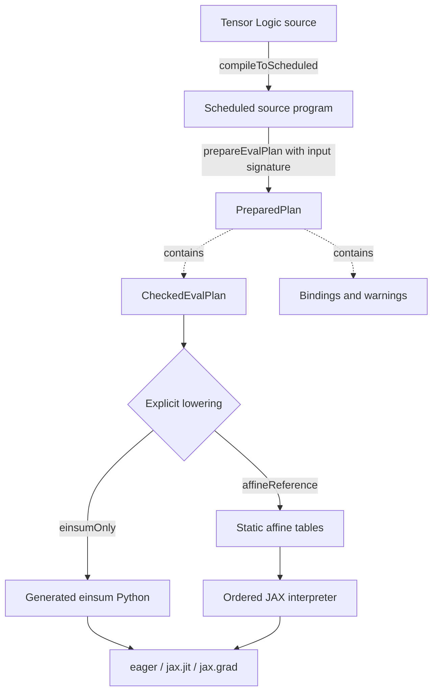
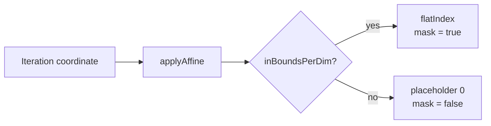

# Backend Eval IR for LeanNCD JAX and PyTorch Execution

## Table of contents

- [Executive summary](#executive-summary)
- [Part I — Normative Design](#part-i--normative-design)
  - [1. Architectural decision and principles](#1-architectural-decision-and-principles)
  - [2. Canonical Backend Eval IR semantics](#2-canonical-backend-eval-ir-semantics)
    - [2.1 Semantic domain and ownership](#21-semantic-domain-and-ownership)
    - [2.2 Contractions and ordered floating-point execution](#22-contractions-and-ordered-floating-point-execution)
    - [2.3 Blocks, graph flow, and scans](#23-blocks-graph-flow-and-scans)
    - [2.4 Invariant matrix](#24-invariant-matrix)
  - [3. Raw and portable representation](#3-raw-and-portable-representation)
    - [3.1 Phase pipeline and ownership](#31-phase-pipeline-and-ownership)
    - [3.2 Identity and independent validation](#32-identity-and-independent-validation)
  - [4. JAX and PyTorch executable architecture](#4-jax-and-pytorch-executable-architecture)
    - [4.1 Why the JAX interpreter can remain purely functional](#41-why-the-jax-interpreter-can-remain-purely-functional)
    - [4.2 JAX and PyTorch interpretations](#42-jax-and-pytorch-interpretations)
    - [4.3 Evidence-indexed executable lowering](#43-evidence-indexed-executable-lowering)
- [Part II — Evidence Record](#part-ii--evidence-record)
  - [5. Current system and evidence](#5-current-system-and-evidence)
    - [5.1 Checked-plan boundary](#51-checked-plan-boundary)
    - [5.2 Ordered reference semantics](#52-ordered-reference-semantics)
    - [5.3 Current JAX lowerings](#53-current-jax-lowerings)
    - [5.4 Evidence validating the experimental JAX bridge](#54-evidence-validating-the-experimental-jax-bridge)
  - [6. Adoption plan and gates](#6-adoption-plan-and-gates)
    - [6.1 Constructor admission](#61-constructor-admission)
    - [6.2 Five adoption gates](#62-five-adoption-gates)
- [Part III — Research Agenda](#part-iii--research-agenda)
  - [7. Staged checked-representation strategy](#7-staged-checked-representation-strategy)
    - [7.1 Stage A: recommended low-risk refinements](#71-stage-a-recommended-low-risk-refinements)
    - [7.2 Stage B: candidate dependent contraction prototype](#72-stage-b-candidate-dependent-contraction-prototype)
    - [7.3 Stage C: candidate scan refinements](#73-stage-c-candidate-scan-refinements)
    - [7.4 Deferred: availability-indexed graph typing](#74-deferred-availability-indexed-graph-typing)
    - [7.5 Rewrite architecture and optimization boundary](#75-rewrite-architecture-and-optimization-boundary)
    - [7.6 Sequencing across threads](#76-sequencing-across-threads)
- [8. Appendices](#8-appendices)
  - [Appendix A: ordinary raw and portable DTOs](#appendix-a-ordinary-raw-and-portable-dtos)
  - [Appendix B: candidate dependent checked contraction core](#appendix-b-candidate-dependent-checked-contraction-core)
  - [Appendix C: candidate checked scan refinements](#appendix-c-candidate-checked-scan-refinements)
  - [Appendix D: JAX and PyTorch executable types](#appendix-d-jax-and-pytorch-executable-types)
- [References](#references)

## Executive summary

The experimental bridge evaluates all 3,832 accepted **Wave C** programs—the landed fragment of
LeanNCD's affine, sum-product execution language—through the checked `EvalPlan` boundary. A checked
plan is one whose local tensor operations and graph wiring have passed Lean's semantic validators.
Every **materialized output**, meaning a source-visible tensor reconstructed from the final positional
store, agrees bit-for-bit with the Lean Dense evaluator in eager JAX on the measured CPU platform.
Representatives for the corpus's structural feature classes also run under `jax.jit`, and curated
fixtures cover integer-affine coordinate maps, empty tensors, graph order, scalar fold order, and
selected gradients.

That evidence is broad structurally and narrow numerically. The corpus is a bounded enumeration over
two axes of extent two, so no tensor in it exceeds four elements, its 3,832 programs collapse to 45
distinct structural feature classes, and five of the twelve tracked features are supplied only by the
curated fixtures. It establishes that the affine grammar is interpreted correctly, and it says nothing
about scale — the evidence base contains no scaling measurement at all
([Section 5.4](#54-evidence-validating-the-experimental-jax-bridge)). That absence matters because the
reference lowering emits one index and one validity bit per iteration coordinate per factor, so its
table size is the product of a term's full iteration domain, contracted axes included. Whether that
path is usable beyond toy scale is therefore an open measurement, not a settled one.

The bridge is therefore a strong semantic reference, but not yet a production boundary: after
checking, Lean emits generated Python source or untyped nested dictionaries and lists. Before the rest
of **Wave F**—the extension that adds checked recurrent scans, whose F0 contract fixtures, F1
context fields, F2 checked plan-block layer, and F3 checked scan graph have landed while the
source-compiler/adapter closure (F4) has not—or production use,
the existing `EvalPlan` should evolve into a phase-separated **Backend Eval IR**: the common,
backend-neutral execution language interpreted by Dense and JAX today, keeping a PyTorch evaluator
possible without committing to build one. **PyTorch is a potential future backend, not scheduled
work**: no client has asked for it, and [Section 7.6](#76-sequencing-across-threads) schedules no
PyTorch implementation. Design decisions that follow keep the IR backend-neutral so a PyTorch
evaluator remains straightforward to add later; they are not a claim that one is being built now.

The design separates meaning from representation maturity. Canonical Backend Eval IR **semantics**
state graph, contraction, binding, block, and scan behavior without choosing a Lean encoding or wire
format. A data-transfer object (**DTO**) is an ordinary tagged record used for construction,
serialization, migration, and path-aware errors; it is not executable. Stage A recommends
low-risk checked-type improvements. The stronger Stage B contraction and Stage C scan encodings are
candidate representations pending measured prototypes, not adopted semantics. Backend-specific
**executables** are separately validated implementation plans. A **kernel** implements one local
semantic assignment; a scan implementation organizes checked base/step kernels and state traversal.

**binary64** names the IEEE-754 64-bit floating-point format;
`reference64SumProduct` names the stricter execution contract governing how operations on those values
are ordered. It specifies left-associated multiplication and addition without asserting false
semiring laws. The ordered affine-table interpreter, which runs from precomputed safe indices and
validity masks, remains the **reference oracle** against which alternative executions are compared.
Pure functional execution is a particular JAX advantage, while PyTorch retains its own tensor,
compilation, and export choices.

The document is organized in three parts, sequenced by what a client needs first rather than by
architectural layer. [Part I](#part-i--normative-design) is normative: the architectural decision
([Section 1](#1-architectural-decision-and-principles)), the canonical semantics every backend must
implement ([Section 2](#2-canonical-backend-eval-ir-semantics)), the structured artifact a client first
needs to cross the Lean/Python boundary ([Section 3](#3-raw-and-portable-representation)), and the
executable architecture — presented as one working decoder before the compact, evidence-indexed
kernels layered on top of it ([Section 4](#4-jax-and-pytorch-executable-architecture)).
[Part II](#part-ii--evidence-record) is the evidence record: what the current bridge has already
demonstrated ([Section 5](#5-current-system-and-evidence)) and the gates a future change must clear
([Section 6](#6-adoption-plan-and-gates)). [Part III](#part-iii--research-agenda) is the research
agenda: staged, not-yet-adopted representation strengthenings
([Section 7](#7-staged-checked-representation-strategy)). [Appendices A-D](#8-appendices) collect the
corresponding type sketches for Parts I and III; they illustrate decisions made in the narrative and
never define semantics by themselves.

## Part I — Normative Design

This part is the sole authority for what every backend must mean and what a client can build against
it: the decision to evolve `EvalPlan` into Backend Eval IR, the canonical semantics every backend must
implement, the structured artifact a client first needs to cross the Lean/Python boundary, and the
executable architecture — presented decoder-first, then the compact-kernel optimizations layered on
top of it. [Part II](#part-ii--evidence-record) is the evidence and gates
that justify this design; [Part III](#part-iii--research-agenda) is the staged, not-yet-adopted
strengthening this design leaves open.

## 1. Architectural decision and principles

The present bridge has four strengths worth preserving: it starts from checked semantics; separates
reference and optimization intent; excludes unsafe indexing structurally; and has full-corpus,
boundary, gradient, low-bit-order, and mutation evidence.

The design response uses four terms throughout the paper. A **portable artifact** is the versioned,
ordinary-data representation exchanged across the Lean/Python boundary. A **semantic fingerprint** is
the canonical encoded form of its semantic identity. **Capability validation** decides whether a backend supports
already-valid semantics; it does not repair them. An **evidence index** is a type-level label for the
numerical claim an executable is allowed to make.

Across the boundary, Lean erases proof-only fields from a checked, prepared plan and canonically
encodes the remaining versioned data as bytes. Python decodes those bytes into an untrusted ordinary
data object, independently revalidates its semantics and backend capabilities, and only then lowers
it to an executable. Concrete tensor values travel separately as a shape plus fixed-endian `UInt64`
binary64 bit patterns, preserving exact values such as signed zero. [Section 3](#3-raw-and-portable-representation)
specifies this exchange and its trust boundary.

Here, **checking** is Lean's semantic validation of a `RawEvalPlan`: it verifies tensor shapes,
slots, affine maps, iteration-basis partitions, and graph flow before privately
constructing a `CheckedEvalPlan`. The remaining risks arise after that point:

| Risk | Current form | Required response |
|---|---|---|
| Untyped boundary | Generated source and nested `dict`/`list` values | Typed, versioned portable artifact |
| Rendering mixed with lowering | Lean constructs Python syntax directly | Structural IR followed by codecs |
| No independent artifact validation | Python trusts emitted structure | Separate semantic, capability, and executable validators |
| Shared coordinate implementation | Dense and lowering reuse primitives | Proof or independent translation oracle |
| Domain-sized affine tables | Index and mask per iteration coordinate | Keep as oracle; add validated compact kernels later |
| Implicit JIT identity | Python containers captured in closures | Stable fingerprints and backend runtime plans |
| Weak dimensional types | Shapes, ranks, and axis partitions are repeated arrays | Prototype staged derivation from signatures, ranked maps, and basis layouts that map semantic axis roles to iteration positions |
| Open floating algebra | Arbitrary operations appear lawful by construction | Closed numeric-mode-indexed operational algebra |
| General scan maps | Invalid writes and look-ahead are expressible then rejected | Prototype admitted pin-mask/successor writes and affine-derived causal descriptors in Stage C |
| Flat lowering mode | Constructor encodes backend choice | Evidence-indexed backend kernel sums |

These are organizational and scalability limitations, not evidence against the Wave C result, as
Part II's Section 5 demonstrates: `EvalPlan` is already the point where backend-relevant meaning
becomes explicit. Lean checks its shapes, affine reads, ordered contractions, and graph flow; Dense
interprets it as the reference semantics; and the JAX experiment interprets the same checked plans
with exact agreement over the measured Wave C corpus. The table above identifies weaknesses in transport, independent
validation, typing, and executable lowering—not a missing semantic language. Introducing a parallel
JAX or PyTorch plan would duplicate these semantics and add a translation-equivalence obligation
without addressing those weaknesses.

**Decision:** evolve the existing `EvalPlan` family into the common Backend Eval IR. Affine reads,
ordered contractions, graph flow, and the planned scan extension belong to that shared semantic
language; lookup tables, einsum, `lax.scan`, compiled PyTorch loops, caches, and exports remain backend
implementations.

The new PyTorch evaluator is an EvalPlan backend. Compatibility with the existing `torch_compile/`
morphism-to-`nn.Module` compiler is explicitly **not** a design constraint.

Backend Eval IR remains an inspectable **deep embedding**: plans are explicit data that interpreters
can traverse, serialize, validate, and analyze, rather than host-language functions that hide their
structure. This is a deliberate contrast with finally-tagless encodings, whose operations are
represented through a host-language interface ([Carette, Kiselyov, and Shan](#ref-finally-tagless)).
Dense execution, portable encoding, capability analysis, JAX lowering, PyTorch lowering, cost
analysis, and proofs are separate interpreters over one closed step language. Centralized traversal,
in the general fold-based style described by [Gibbons](#ref-origami), dispatches each assignment or
scan once and lets an interpreter thread a store or build executable nodes. A **smart constructor**
may provide a convenient validated way to build this data, but must not replace the inspectable
representation needed for serialization, structural proof, corpus generation, and migration. New
operators land with checking, portable validation, reference interpretation, and differential tests
rather than through callbacks, string operators, embedded Python, generic custom calls, or silent
fallback.

This decision leaves four questions. The rest of Part I answers three of them in order: what every
backend must mean ([Section 2](#2-canonical-backend-eval-ir-semantics)), how it crosses a trust
boundary ([Section 3](#3-raw-and-portable-representation)), and how each backend may execute it
([Section 4](#4-jax-and-pytorch-executable-architecture)). The fourth — how strongly Lean should
encode that meaning — is staged, candidate work deferred to Part III's
[Section 7](#7-staged-checked-representation-strategy).

## 2. Canonical Backend Eval IR semantics

This section is the sole authority for what Backend Eval IR means. It is intentionally independent of
Lean encodings, wire codecs, lookup tables, einsum labels, pytrees, modules, devices, and caches.
Dense, JAX, and PyTorch are interpreters of these semantics. Later representations may make some
requirements structural, but do not change their meaning. The appendices are subordinate to this
section: [Appendix A](#appendix-a-ordinary-raw-and-portable-dtos) sketches ordinary transport data,
[Appendices B](#appendix-b-candidate-dependent-checked-contraction-core) and
[C](#appendix-c-candidate-checked-scan-refinements) explore stronger checked encodings, and
[Appendix D](#appendix-d-jax-and-pytorch-executable-types) sketches backend executables.

### 2.1 Semantic domain and ownership

A plan has scoped tensor slots. Each slot belongs to exactly one namespace (outer plan or one block),
has one tensor signature and shape, and cannot be confused with an equally numbered slot in another
scope. Inputs initialize designated outer slots. Steps execute in positional graph order, read only
available slots, and produce designated destination slots. **Materialization** is the ordered
projection that reconstructs source-visible names from the final positional store.

Assignments are **contextual**: a context coordinate is supplied by the enclosing block or scan rather
than generated by the assignment itself, while the output coordinate ranges over the destination
signature. A term's canonical basis is therefore `context ++ output ++ reduction`; iteration order
may permute that basis but must preserve a complete, disjoint classification. The reduction shape
determines multiplicity even when an affine coefficient is zero.

Having defined the term's iteration basis, the remaining question is how each factor uses an
iteration coordinate to address its source tensor. An affine read selects a source slot and maps
iteration coordinate `u` to each source coordinate:

```text
source[d] = bias[d] + sum(coefficients[d, k] * u[k] for k)
```

Coefficients and intermediate coordinates have mathematical-integer meaning. Every source dimension
is bounds-checked before row-major flattening. An out-of-bounds coordinate contributes numeric zero;
it must never alias valid storage. Empty source storage follows the same zero-padding semantics.

These local meanings must survive several representations. A **semantic identity** combines schema
major version, semantic version, and the digest of one canonical portable payload;
[Section 3.2](#32-identity-and-independent-validation) defines those fields precisely. The phase table
below assigns one role to each representation so later sections can add detail without redefining
ownership:

| Phase | Sole owner and semantic role |
|---|---|
| Raw | Untrusted, diagnosable construction/decoded values; may be malformed and never execute |
| Checked | Backend-neutral semantic plan whose local obligations and global evidence have been validated |
| Prepared | A checked plan plus required-input bindings, ordered materialized bindings, and warnings |
| Portable | Canonical ordinary-data projection of a prepared plan; carries versions and semantic identity, never proof authority |
| Executable | Backend-specific validated lowering of one portable semantic plan; only this phase contains implementation choices |

Required-input bindings are length-correct and positionally aligned with plan input slots, with unique
names. Ordered materialized bindings are reconstructed left-to-right and retain existing
last-write-wins behavior, including repeated names. These roles must not be conflated.

[Appendix A](#appendix-a-ordinary-raw-and-portable-dtos) illustrates Raw, Prepared, and Portable
ownership. [Appendix B](#appendix-b-candidate-dependent-checked-contraction-core) and
[Appendix C](#appendix-c-candidate-checked-scan-refinements) illustrate candidate Checked
representations. [Appendix D](#appendix-d-jax-and-pytorch-executable-types) illustrates Executable
ownership. With the phase boundary fixed, the next two subsections define the local contraction
semantics and then the graph/scan semantics that every representation must preserve.

### 2.2 Contractions and ordered floating-point execution

The raw plan's arithmetic contract is `reference64SumProduct`. The name is deliberately not merely
“use 64-bit floats”: it commits to ordered sum-product over binary64, with both the arithmetic and
the permitted operations made explicit in the constructor name itself. For each output coordinate,
the interpreter evaluates factors, reduction coordinates, and terms in stored order:

```text
factorFold([])           = float64(1)
factorFold(xs ++ [x])    = float64(factorFold(xs) * x)
reductionFold([])        = float64(0)
reductionFold(xs ++ [x]) = float64(reductionFold(xs) + x)
termFold([])             = float64(0)
termFold(xs ++ [x])      = float64(termFold(xs) + x)
```

Each accumulator is the left operand. Reduction coordinates use row-major order. Empty factors
produce one; empty reductions and empty term lists produce zero. This is an operational
floating-point specification, not a semiring: it claims neither associativity nor distributivity and
makes no identity claim over all IEEE-754 values. Adding a numeric mode requires a new closed
semantic case with an explicit interpretation.

All nonlinear operations are intended to eventually be supported, but they require a second numeric
contract rather than an extension of this one. `reference64SumProduct` is closed over +/×: its only
claims are evaluation order and the fold equations above. `exp`, `tanh`, `erf`, and other transcendental
functions are not part of that algebra, and their binary64 results are not bit-reproducible across
libm implementations, XLA versions, or devices, so "support every nonlinearity" and "bit-exact ordered
reference" cannot both hold under one contract. This document therefore names a second, separately
closed contract, `reference64Transcendental`, for nonlinear steps: it fixes the function computed and
bounds agreement by a stated per-function ULP tolerance instead of asserting bit-exactness. Differential
testing follows the same split — affine and sum-product steps compare bit-exact against the ordered
reference; nonlinear steps compare within their contract's ULP bound. Neither contract admits a
checked step in the new pipeline yet: `LeanNCD/Eval/Plan/Compile.lean` rejects every pointwise and
axiswise nonlinear statement via `unsupportedNonlin` ahead of either producer, checker, or interpreter
support. This is separate from the legacy DSL evaluator, where `LeanNCD/Eval/Nonlin.lean` already
computes all eight functions today for `Eval.lean`/`Scan.lean` — the same legacy evaluator
[Section 2.3](#23-blocks-graph-flow-and-scans) already marks known-nonconforming and slated for
retirement; its existing formulas ground the table below, but its numeric agreement with the ordered
reference has never been checked.

IEEE-754 mandates correctly-rounded results for `+`, `-`, `×`, `÷`, and `√`; it does not mandate
correctly-rounded transcendentals. Combined with this document's ordered-fold discipline above, every
`AxiswiseFn`'s reduction — softmax's denominator sum, `normalize`'s sum, `l2normalize`'s sum of
squares — is exact by construction. Cross-backend disagreement can only enter through an actual
transcendental primitive call, which four of the eight functions never make:

| Function | Formula | ULP bound | Basis |
|---|---|---|---|
| `relu` | `max(x, 0)` | 0 (exact) | Comparison and select only; no transcendental, no division |
| `leakyrelu` | `x` if `x ≥ 0` else `α·x`, `α = 0.01` (matches PyTorch's `nn.LeakyReLU` default) | 0 (exact) | One IEEE-mandated multiply, given identical `α` bit pattern in every backend |
| `normalize` | `x / sum(x)` | 0 (exact) | Ordered sum plus one IEEE-mandated divide; no transcendental |
| `l2normalize` | `x / sqrt(sum(x^2))` | 0 (exact) | Ordered sum of squares plus IEEE-mandated `sqrt` and divide; no transcendental |
| `sigmoid` | `1 / (1 + exp(-x))` | 2 | One `exp` call, the only source of variance; wrapping arithmetic is exact |
| `tanh` | `tanh(x)` | 2 | One primitive transcendental call, no wrapping arithmetic |
| `gelu` | `x · 0.5 · (1 + tanh(√(2/π) · (x + 0.044715x³)))` — the tanh approximation, chosen because `Float.erf` isn't available in this Lean toolchain (per `Nonlin.lean`'s own rationale) and because it matches JAX's `jax.nn.gelu` default; PyTorch's default is the exact erf form and must pass `approximate='tanh'` to match | 4 | One `tanh` call, same tier as plain `tanh`, doubled only because `1 + tanh(z)` risks cancellation for very negative `x` — an allowance for a named mechanism, not a separate derivation |
| `softmax` | `exp(xᵢ − max(x)) / Σⱼ exp(xⱼ − max(x))` | 2 per element | Max-subtraction and the summation are exact by the ordered-fold discipline; one `exp` call per element, same tier as plain `tanh`/`sigmoid` |

These are reasoned starting bounds, not measurements — and unlike `reference64SumProduct`'s fold order,
which `KernelDenseTest.lean` and `DifferentialTest.lean` pin as exact Lean values today, nothing in
this table has a corresponding Lean constant or test yet. Thread 4
([Section 7.6](#76-sequencing-across-threads)) has landed Dense-only checked support for both
`.pointwise` and `.axiswise` steps, fixing the reference semantics a future JAX lowering must match —
but that alone does not close this table. `relu`, `leakyrelu`, `normalize`, and `l2normalize`'s 0-ULP
bounds are pinned by bit-exact fixtures (real support, the correct and sufficient representation of a
0-ULP bound; not a named Lean constant — an unconsumed `def reluUlpBound : Nat := 0` would be pure
decoration). `sigmoid`, `tanh`, `gelu`, and `softmax`'s nonzero bounds remain unvalidated even for
Dense: turning a reasoned bound into a validated one needs a second backend to differential against,
and none exists yet — the checked pipeline now accepts these steps, but only one interpreter does.
**PyTorch** interpreter support is deferred with no scheduled thread (mirrors
[Section 7.6](#76-sequencing-across-threads) thread 5's own PyTorch deferral). **JAX** support is
blocked solely by `EvalPlanCodegen.lean`'s pre-existing `PlanStep` breakage and is the natural next
slice, not indefinitely deferred like PyTorch. Once a second backend (most likely JAX) gains checked
nonlinear support, re-measure against real output, turn each of the four still-open bounds into an
actual Lean constant with a pinning test the way `reference64SumProduct`'s fold order already has, and
tighten or loosen these numbers accordingly; treat this table as the closing decision Stage A needs
([Section 7.1](#71-stage-a-recommended-low-risk-refinements),
[Section 7.6](#76-sequencing-across-threads) thread 1), not as validated evidence.

### 2.3 Blocks, graph flow, and scans

Contractions explain one assignment; blocks and scans explain how assignments participate in larger
stateful graphs. A **block** is a scoped, acyclic local graph with its own tensor slots, context shape,
input and output ports, and ordered assignments. A **capture** binds an external value or immutable
state snapshot to a block input. A **state** is a persistent tensor history produced by a scan, while a
scratch slot exists only for one block invocation. Causal evidence belongs to the factor reads that
address captured state, not to the capture itself.

An outer **`PlanStep`** is one closed graph instruction, initially either an assignment or a scan.
Every step exposes one uniform graph interface:

```lean
def PlanStep.sourceSlots : PlanStep → Array TensorSlot
def PlanStep.destinationSlots : PlanStep → Array TensorSlot
```

These are derived functions, not stored fields. Assignments derive one destination and their factor
sources; scans derive their external sources and ordered state destinations. `checkPlan`, diagnostics,
and backend traversals must use these functions rather than independently reconstructing graph
dependencies. Broader summaries such as slot provenance or feature sets should be added only when a
second real consumer would otherwise duplicate their derivation; the design does not require a
separate `PlanManifest`.

Nonlinear operations, once supported, become two further `PlanStep` cases rather than fields on
`AssignPlan`, mirroring the source language's existing split at
`LeanNCD/DSL/Ast.lean`: `Nonlin = identity | pointwise PointwiseFn | axiswise AxiswiseFn (Option BoolExpr)`
(`identity` needs no step of its own — it applies no transformation), where `PointwiseFn` covers
`relu`/`sigmoid`/`tanh`/`gelu`/`leakyrelu` and `AxiswiseFn` covers
`softmax`/`normalize`/`l2normalize`. In TL a nonlinearity applies to the whole right-hand side after
aggregation, not per factor, so a field on `AssignPlan` would blur that boundary; a separate step
preserves `AssignPlan` as a pure ordered sum-product under `reference64SumProduct` and lets nonlinear
steps carry `reference64Transcendental` evidence ([Section 2.2](#22-contractions-and-ordered-floating-point-execution))
independently. `PointwiseFn` takes no mask argument by type, so a newly added pointwise function
cannot silently forget masking; `AxiswiseFn` carries its optional predicate explicitly instead.

A **scan** repeatedly invokes base and step blocks to construct complete state histories. Its
**history extents** are the final sizes along advancing axes; subtracting one from each gives the step
domain. A scan has positive history extents and therefore derived predecessor/step extents. Each state names
bounded, distinct advancing dimensions. Complete histories are zero-initialized, then declared base
writes overlay pairwise-disjoint pin-mask regions in source order. A base region may leave dimensions
free and pin others to literals, but it must touch the lower boundary by pinning at least one advancing
dimension to zero. Uncovered boundary cells retain their initialized zero value. Step execution
traverses coordinates in `axisZeroFastest` mixed-radix order and writes the canonical `q + 1`
successor for every advancing dimension. Complete-history materialization is semantic: compact
carries are permitted only when proven to refine it.

Wave F base-pin substitution is mandatory. If UID `u` is pinned to `p[u]`, every RHS affine row is
residualized before block checking:

```text
bias'[d] = bias[d] + sum(coeff[d, u] * p[u] for pinned u)
```

Pinned UIDs are removed from the affine input basis and from the context/output/reduction basis.
Correct destination geometry never excuses an un-specialized RHS.

State-read causality is derived from each factor's checked affine rows, not from a second capture-level
offset. Checked reads retain erasure/alignment evidence to their raw factors and source paths, so a
rejection remains factor-local and the derived descriptor cannot disagree with the address executed.
Relative to invocation coordinate `q`, each advancing-state row has unit coefficient for its matching
context position, zero coefficients for other basis positions, and non-positive bias. An
all-zero bias is valid: reading `G[q]` while the canonical write targets `G[q + 1]` reads the previous
state cell. Look-ahead remains invalid. Global evidence proves that every read is out of bounds and
zero-padded, lies in the zero-initialized boundary region (possibly overlaid by one base write), or has
a unique recurrence producer whose traversal rank is strictly less than the consumer's. Thus strict
causality follows from read geometry, canonical successor writes, and traversal rank rather than from
requiring a nonzero lag.

Every recurrence coordinate reads one immutable snapshot. A block returns one complete collection of
next-state results. Only the scan worker commits that collection atomically after all sibling results
have been computed. Partial updates and read-after-write between sibling states are forbidden.

This snapshot requirement is stated as a target, not as a description of existing behavior. The
current legacy scan evaluator (`LeanNCD/Eval/Scan.lean`) is **known nonconforming**: Wave F F0 pinned a
Jacobi/Gauss-Seidel discriminator fixture in `test/Eval/ScanTest.lean` showing that a later `recur`
statement observes an earlier sibling's just-written value, so permuting two sibling recurrences
changes the result. F0 also pinned a multi-base-write collision fixture showing that the legacy
evaluator silently applies last-write-wins where the checked worker is required to reject. Both
defects are recorded deliberately and remain unfixed; the checked scan worker that would satisfy this
subsection is the F3 target and has no code. A scan backend must therefore not be validated against
the legacy evaluator as an oracle — the two disagree by design until F3 lands.

This divergence is transitional, not permanent: once Backend Eval IR reaches parity, `LeanNCD/Eval/`
retires outright and `EvalPlan` becomes the sole evaluator. F3's checked scan worker is therefore a
replacement target for the legacy evaluator, not a reconciliation with it.

### 2.4 Invariant matrix

The preceding subsections define behavior without committing to arrays, vectors, proofs, or dependent
indices. **Refinement evidence** is a proof or independently validated witness that a transformed plan
or executable preserves its source's observable behavior under the stated numeric contract. The
matrix now connects each semantic requirement to its present enforcement and to the stronger
representation considered in
[Section 7](#7-staged-checked-representation-strategy):

For interpreting the final column, **Stage A** means low-risk changes to validation boundaries and
closed tags, **Stage B** means a prototype of stronger dependent types for contractions, and
**Stage C** means a separate prototype of stronger scan types. “Deferred” marks ideas not proposed
for any of those stages. [Section 7](#7-staged-checked-representation-strategy) motivates and details
this staging.

| Invariant | Semantic requirement | Current enforcement | Candidate stronger encoding |
|---|---|---|---|
| Slot scope and bounds | References stay within one slot namespace | Checker bounds tests and graph evidence | Stage A distinct namespaces; Stage B signature-indexed slots |
| Signature-derived shape | Reads and destinations agree with selected signatures | Repeated-shape comparisons | Stage B shapes derived from slot signatures |
| Positional availability | Every read follows an input or earlier producer | `checkPlan` graph-order evidence | Deferred availability-indexed construction |
| Affine dimensions | Matrix is rectangular; row/bias ranks match source and iteration ranks | Array-length checks | Stage B rank-indexed affine maps |
| Bounds before flattening | Invalid multidimensional coordinates zero-pad and never alias storage | Shared Dense/lowering primitives plus mutations | Executable refinement evidence or independent translation oracle |
| Basis meaning | Context, output, and reduction positions form a complete disjoint basis | Partition checks | Stage B basis permutation with derived projections |
| Ordered numeric folds | Factor, reduction, and term folds are left-associated in source order | Dense semantics and low-bit fixtures | Stage A closed mode and operational fold API |
| Binding alignment | Required names align exactly; materialization remains ordered | Preparation checks and arrays | Stage A length-correct required bindings |
| Block flow | Ports are valid and assignments are acyclic and available | F2 checked-block target; not landed | Checked block-flow evidence |
| Positive scan extents | Predecessor extents cannot underflow | F0 landed contract evidence; F3 checker target not landed | Stage C positive extent witness |
| Advancing dimensions | State dimensions are in range and pairwise distinct | F0 landed contract evidence; F3 structural checks not landed | Stage C bounded distinct-dimension witness |
| Base substitution | Pinned UIDs are residualized and removed from RHS bases | F0 landed legacy-behavior fixtures; F4 compiler target not landed | Stage C raw-to-checked residualization evidence |
| Base initialization | Complete histories start at zero; disjoint pin-mask overlays may leave boundary cells zero | F0 landed policy fixtures; F3 checked worker not landed | Stage C boundary-policy witness plus checked regions |
| Write geometry | Base regions touch the lower boundary; step writes target canonical `q + 1` | F0 landed geometry fixtures; F3 recognition/checks not landed | Stage C checked pin masks and successor witness |
| Causal reads | Per-factor affine descriptors forbid look-ahead, allow zero lag, and resolve recurrence reads to lower-rank producers | F0 landed causality fixtures; F3 certificate not landed | Stage C raw-aligned per-factor descriptor plus global proof |
| Traversal and materialization | Axis-zero-fastest traversal yields complete histories | F0 landed policy fixtures; F3 checked worker not landed | Stage C closed tags and validated witnesses |
| Snapshot and commit | Sibling results share one snapshot and commit atomically | F0 landed defect fixture; F3 immutable worker not landed | Stage A distinct snapshot/result types; Stage C snapshot-policy witness |
| Backend evidence | An optimization cannot claim ordered-reference status | Explicit lowering modes and AST/mutation checks | Stage A evidence-indexed kernels and private constructors |

The matrix separates semantic requirements from implementation choices. `Fin`, vectors,
permutations, arrays plus proofs, and indexed inductives are candidates, not semantics. It is also the
bridge to the staged representation strategy in Part III's Section 7.

Canonical semantics fix what every backend must mean; the next question a client actually hits is how
a checked plan crosses the Lean/Python boundary as a structured, versioned artifact before any backend
runs it at all.

## 3. Raw and portable representation

### 3.1 Phase pipeline and ownership

Raw and portable values are ordinary DTOs (data-transfer objects: tagged records that carry data but
are not executable) built from conventional integers, arrays, tags, bindings, warnings, and version
metadata. A **raw DTO** is the unchecked construction form produced after tagged
wire decoding has recognized every constructor. Unknown tags fail in the preceding decode phase with
a path-aware error; known but invalid values remain in the raw DTO for semantic diagnostics. A
**portable artifact** is its canonically encoded, versioned cross-language envelope after projection
from a prepared plan; it is portable data, not a second semantic language. Both intentionally preserve
offending known data for migration and path-aware diagnostics, and neither executes.
[Appendix A](#appendix-a-ordinary-raw-and-portable-dtos) gives their complete conceptual field
ownership.

The essential trust transition is:

```text
raw DTO
  -> Lean checking
  -> checked Backend Eval IR
  -> portable raw projection
  -> independent Python validation
```

Including preparation and executable lowering gives the complete pipeline:

```text
Lean production:
  RawEvalPlan
  -> Lean semantic checker -> CheckedEvalPlan
  -> PreparedPlan
  -> erasure + canonical encoding -> portable artifact bytes

Python consumption:
  portable artifact bytes
  -> tagged decoding/migration
  -> PortableBackendPlan raw DTO | path-aware decode error
  -> independent semantic validation -> ValidatedPortablePlan
  -> backend capability validation -> capability result
  -> executable lowering -> non-executable candidate
  -> executable validation -> private JAX executable | private PyTorch executable
```

This pipeline instantiates the ownership defined in
[Section 2.1](#21-semantic-domain-and-ownership) rather than redefining it.
Decoding/migration returns an ordinary untrusted DTO and retains precise locations such as
`steps[3].terms[1].factors[2].map.bias`.

### 3.2 Identity and independent validation

A **semantic identity** combines schema major version, semantic version, and a domain-separated digest
of canonical payload bytes. Its canonical string encoding is the semantic fingerprint. The schema
major version marks incompatible wire shapes; the semantic version marks meaning; schema minor and
producer versions are provenance. Numeric mode, ordered bindings, warnings, and exact fixed-endian
`UInt64` float bits have one payload owner. Derived indices, labels, devices, exports, and cache
metadata are excluded from identity.

The three post-decode validations are intentionally separate:

| Phase | Checks | Failure meaning |
|---|---|---|
| Semantic | Tags, slots, signatures, bindings, map ranks, basis permutations, mode, graph flow, positive extents, admitted scan geometry, coverage, uniqueness, causality | Malformed or semantically invalid artifact |
| Capability | Backend dtype, evidence contract, scan implementation, integer range, and feature support | Valid semantics unsupported by the selected backend |
| Executable | Table lengths, masks, safe indices, einsum labels, conversion, candidate alignment, scan refinement, and evidence index | Invalid or mislabeled backend lowering |

Decode applicatively into an untrusted DTO and accumulate path-aware independent errors, following
the error-accumulating composition described by
[McBride and Paterson](#ref-applicative-programming). Only
validator-controlled constructors create immutable `ValidatedPortablePlan` values. Artifact
validation reconstructs every semantic obligation independently of Lean proofs. A validated scan
retains the exact outer signature table used to check captures and destinations. The resulting
`ValidatedPortablePlan` pairs the envelope with a `CheckedPortablePlan` exposing the common table,
numeric mode, aligned checked steps, bindings, and graph evidence described in Appendix A. This is the
defined handoff consumed by executable lowering.

Runtime adapters separately reject wrong input count, name, shape, dtype, and uninitialized slots
before JAX tracing or PyTorch compilation. Backend caches and exports are reproducible derivatives of
the semantic fingerprint; they never replace the portable artifact. Once independent validation has
reconstructed trusted semantics, the backend may choose an implementation; that is the subject of
[Section 4](#4-jax-and-pytorch-executable-architecture) and
[Appendix D](#appendix-d-jax-and-pytorch-executable-types).

## 4. JAX and PyTorch executable architecture

### 4.1 Why the JAX interpreter can remain purely functional

Backend Eval IR is backend-neutral, but its explicit positional store, ordered graph, and explicit
scan state fit JAX's mandatory functional execution model particularly well. The JAX backend should
therefore be a direct pure interpreter rather than another generated-source or object-graph compiler:

```text
AssignPlan : Store -> Store
PlanStep   : Store -> Store
EvalPlan   : Inputs -> Outputs
Scan step  : State × Input -> State × Output
```

After host-side validation and executable lowering, graph execution is composition of pure store
transformations in checked order:

```python
def evaluate(executable, inputs):
    store = place_inputs(executable, inputs)
    for step in executable.steps:  # static traversal while tracing
        store = step(store)
    return materialize_outputs(executable, store)
```

This eliminates JAX-side Python source generation, module hierarchies, parameter registration,
mutable buffers, device-moving methods, and checkpoint object lifecycles. Structural plan metadata
belongs in immutable [pytree auxiliary data](#ref-jax-pytrees); inputs, state tensors, and large lookup
tables remain dynamic pytree leaves. A stable top-level evaluator is keyed by the verified semantic
identity rather than by closure-specific function objects.

One evaluator can then participate compositionally in JAX transformations:

| Transformation | Backend benefit |
|---|---|
| `jax.jit` | Compile the complete pure evaluator |
| `jax.grad` | Differentiate losses through the same evaluator |
| `jax.vmap` | Add batching or independent-coordinate parallelism without a second evaluator |
| `jax.remat` | Add checkpointing without changing Backend Eval IR |
| JAX sharding transformations | Distribute suitable tensor dimensions while retaining explicit semantics |
| JAX export | Derive a deployable executable from the validated evaluator |

This composability is a genuine JAX advantage. A new PyTorch evaluator can also follow a functional
discipline through tensor functions, `torch.func`, functionalization, and `torch.compile`, but purity
is native and transformation-defining in JAX rather than an optional layer over modules and mutation.

Scans receive an additional benefit. `StateSnapshot` is a pytree carry; the pure step consumes it and
returns complete `NextStateResults`, and the scan worker alone forms the next snapshot. This directly
represents snapshot independence and atomic commit. When its refinement gate passes, `jax.lax.scan`
stages one loop instead of unrolling one graph copy per recurrence coordinate. Heterogeneous outer
graph steps remain static traversal outside that loop.

Future stochastic operations should preserve the same discipline by taking and returning explicit
PRNG keys. Random splitting and reproducibility then remain visible dataflow rather than hidden
global state.

Purity does not itself establish `orderedReference64`. `jit`, `vmap`, `remat`, sharding, and
`lax.scan` may change compilation and floating-point behavior; every transformation admitted under
the ordered contract must retain the low-bit and boundary gates. Plan structure and shapes also
remain static compilation inputs, so structural changes may require recompilation. These obligations
lead directly to the admission and adoption gates in
[Section 6](#6-adoption-plan-and-gates).

### 4.2 JAX and PyTorch interpretations

The common lowering protocol does not erase backend differences. The table below shows which choices
belong to each executable rather than to Backend Eval IR:

| Concern | JAX executable | PyTorch executable |
|---|---|---|
| Values | `jax.Array` | `torch.Tensor` |
| Affine reference | Safe-index arrays plus `jnp.where` | Safe-index tensors plus `torch.where` |
| Projection optimization | `jnp.einsum` | `torch.einsum` |
| Ordered folds | [`jax.lax.fori_loop`](#ref-jax-fori-loop) or validated equivalent | Explicit sequential operations or validated compiled loop |
| Graph execution | Static traversal during tracing | Static traversal in eager or compiled execution |
| Differentiation | `jax.grad` | [PyTorch autograd](#ref-torch-autograd) |
| Compilation | [`jax.jit`](#ref-jax-jit) | [`torch.compile`](#ref-torch-compile) |
| Scan optimization | [`jax.lax.scan`](#ref-jax-scan) after refinement | Compiled state loop after refinement |
| Derivative export/cache | [JAX export](#ref-jax-export) or [persistent cache](#ref-jax-persistent-cache) | [`torch.export`](#ref-torch-export) or FX-derived artifact |

Neither backend earns `orderedReference64` — the ordered-reference evidence label defined in
[Section 4.3](#43-evidence-indexed-executable-lowering) below — from sequential-looking source alone:
transformed and compiled execution must pass the low-bit order fixtures; JAX itself documents that
[JIT compilation can change exact numerics](#ref-jax-jit-numerics).

For PyTorch, keep tensor data separate from immutable structure and introduce
`torch.compile`/`torch.export` representations only at the executable boundary. Parameters, modules,
devices, optimizers, and checkpoints are adapter concerns, not Backend Eval IR fields.

### 4.3 Evidence-indexed executable lowering

Backend Eval IR states what execution means. Backend-specific executable IR states how it runs.
An **executable candidate** is a backend lowering that cannot run until validated. A **kernel** is the
implementation selected for one local assignment; a scan implementation contains kernels for its base
and step blocks plus a traversal choice. A **refinement predicate** states that an assignment kernel or
scan implementation realizes its retained semantic source. An **evidence index** records the numerical
claim justified for that implementation, preventing an experimental optimization from being labeled
as ordered reference execution. The corresponding non-copy-ready types are isolated in
[Appendix D](#appendix-d-jax-and-pytorch-executable-types).

Portable affine-table and einsum specifications are ordinary validated data, never semantic
constructors. Lowering produces a non-executable candidate retaining its semantic source. A separate
validator checks table lengths, safe indices, masks, label limits, integer conversion, scan
refinement, and whole-plan alignment before calling a private executable constructor.

JAX and PyTorch have distinct kernel sums and executable types because their implementation choices
differ even though their semantic source is shared. For both, an evidence index separates
`orderedReference64` from `optimizationExperiment`: ordered affine kernels may inhabit the former,
while einsum may inhabit only the latter. A mixed executable derives its aggregate evidence from all
contained assignment kernels, scan child kernels, and scan implementation choices: it is
ordered-reference only if every member is, and is experimental if any member is. Compact affine and
scan implementations require new capability results, refinement predicates, and differential gates.

This section states the design symmetrically for JAX and PyTorch so the IR stays backend-neutral, not
because both are scheduled work: [Section 7.6](#76-sequencing-across-threads) builds this discipline
for JAX only for now, with no PyTorch implementation thread scheduled.

## Part II — Evidence Record

Part I specified the design; this part is the justification record — what the current experimental
bridge has already demonstrated, and the gates any future change, including Part III's candidates,
must clear to keep demonstrating it. Both halves are about validating claims against fixed evidence
standards rather than designing new representations, which is why they sit together even though the
current bridge (Section 5) predates the adoption gates (Section 6) that will govern its successors.
[Part III](#part-iii--research-agenda) covers what is not yet decided.

## 5. Current system and evidence

### 5.1 Checked-plan boundary

The bridge evaluates neither Tensor Logic syntax nor the upstream `lean4-mlir` `NetSpec`. It consumes
LeanNCD's existing checked evaluation plan:



Compilation and checking have already resolved axis syntax, inferred shapes, assigned tensor slots,
classified output and reduction positions, and validated graph dependencies. JAX consumes those
decisions instead of reconstructing them from names or source syntax.

A **tensor signature** records a tensor's shape and scalar dtype. A **tensor slot** is a plan-local
positional identifier for one signature-table entry and the corresponding runtime tensor-store entry.
Compilation replaces source names with these identifiers; slots from different scopes, such as the
outer plan and a scan block, are distinct even when they have the same numeric position. A
**binding** connects a source-visible name to one of these positional slots.

An assignment computes one destination tensor as an ordered sum of **terms**. A term is one
sum-product contribution: for each output coordinate, it enumerates its reduction coordinates,
multiplies an ordered list of **factors** at each coordinate, and adds those products. A factor is one
scalar tensor read selected from a source slot by an affine coordinate map; an out-of-bounds factor
read contributes zero. Empty factor lists therefore contribute the multiplicative identity, while
empty term lists contribute the additive identity.

For example, in `Y[i] := W[i, j] * x[j] + b[i]`, Tensor Logic infers `j` as a reduction
axis because it appears on the right-hand side but not in the output. The assignment writes `Y`. Its
first term reduces over `j` and has two ordered factors, the reads `W[i, j]` and `x[j]`; its second
term has the single factor `b[i]` and no reduction coordinate. The assignment adds those two term
results in that order for each `i`.

| Existing type | Load-bearing content |
|---|---|
| `PreparedPlan` | Checked plan, source-name/slot bindings, warnings |
| `CheckedEvalPlan` | Raw plan plus privately constructed checked assignments |
| `RawEvalPlan` | Tensor signatures, ordered input slots, ordered steps |
| `AssignPlan` | Destination slot, output shape, ordered terms, contraction algebra |
| `TermPlan` | Iteration shape, output/reduction positions, ordered factors |
| `ReadPlan` | Source slot and shape, affine map, out-of-bounds policy |

`checkPlan` verifies tensor shapes and slot bounds, proves a complete disjoint output/reduction
partition, checks affine dimensions, and establishes graph production order and source availability.
`PreparedPlan` adds the ordered bindings needed to pack named inputs and reconstruct materialized
names.

Wave C's `reference64SumProduct` arithmetic contract admits only ordered sum-product over binary64 values.
`binary64` specifies the scalar representation and arithmetic format; `reference64SumProduct`
additionally specifies the identities and evaluation order:

```text
factor identity     = 1.0
factor operation    = multiplication
reduction identity  = 0.0
reduction operation = addition
```

An **iteration basis** is the ordered coordinate axis list over which a term is evaluated.
`TermPlan` classifies every position in that basis as output or reduction. An axis may densify to a
zero affine coefficient while still belonging to the reduction domain and affecting multiplicity.
For iteration coordinate `u`, an affine read computes:

```text
source[d] = bias[d] + sum(coeffs[d, k] * u[k] for k)
```

### 5.2 Ordered reference semantics

The Lean Dense evaluator is the oracle. It executes nodes in checked graph order and preserves source
array order at all three scalar folds:

```text
for output coordinate:
  assignmentAccumulator = 0.0
  for term in assignment order:
    termAccumulator = 0.0
    for reduction coordinate in row-major order:
      product = 1.0
      for factor in factor order:
        product = product * gatherAffine(factor)
      termAccumulator = termAccumulator + product
    assignmentAccumulator = assignmentAccumulator + termAccumulator
```

This is an operational floating-point contract, not a lawful semiring. Merely using binary64 does not
satisfy `reference64SumProduct`: reassociation may change low bits, so an optimized tree reduction can be
algebraically equivalent while violating the mode.

`gatherAffine` applies maps with Lean `Int`, checks every dimension, and returns zero for an invalid
coordinate. Bounds must be checked before row-major flattening; flattening an invalid multidimensional
coordinate first can alias valid storage. Dense and the current lowerer share:

| Coordinate operation | Meaning |
|---|---|
| `allCoords` | Enumerate a shape in row-major order |
| `applyAffine` | Apply coefficient matrix and bias |
| `inBoundsPerDim` | Check every source dimension |
| `flatIndex` | Flatten a valid coordinate in row-major order |

Sharing this vocabulary prevents representational drift but creates a common-mode risk; the
[baseline and backend optimization gates](#62-five-adoption-gates) therefore require independent
validation or proof of the affine lowering.

### 5.3 Current JAX lowerings

A **lowering** translates validated semantics into a concrete candidate implementation. The numerical
claim that candidate may make is established only by executable validation and its evidence index.
`EvalPlanCodegen.lean` exposes two explicit JAX lowering modes and never silently falls back:

| Lowering | Admitted plans | Purpose and numerical status |
|---|---|---|
| `einsumOnly` | Projection reads: zero bias; one unit coefficient per affine row; all iteration positions covered; nonempty terms/assignments; rank within label limits | Demonstrates real `jnp.einsum(..., optimize=False)` generation; optimization experiment, not general reference semantics |
| `affineReference` | Every checked Wave C affine read | Total Wave C reference lowering with ordered folds |

A **projection read** is the restricted affine case in which every source dimension selects one
iteration-basis position with a unit coefficient and zero bias. General affine reads may instead use
biases, scaling, or combinations of basis positions.

The einsum verifier parses generated Python with `ast` and requires the literal `jnp.einsum` call.
Numeric agreement alone would not prove that the intended lowering ran.

For the affine path, Lean precomputes one safe index and validity bit for every factor coordinate:



The placeholder zero only makes the physical gather safe for nonempty storage; the mask defines zero
padding. Static data preserves checked graph, term, and factor order and is currently emitted as
Python dictionary/list literals for a committed generic runtime.

For each factor, that runtime flattens source storage, converts safe indices to `jnp.int64`, gathers,
applies `jnp.where(mask, gathered, 0.0)`, and reshapes over the iteration domain. Empty source storage
uses an explicit all-zero branch, and a zero output extent returns empty storage before gathering.
Thus Lean owns arbitrary-precision address arithmetic and JAX receives only safe physical indices.

The numerical core uses:

1. a sequential `jax.lax.fori_loop` factor fold from float64 one;
2. transpose to `outputPos ++ reductionPos`, then `jax.vmap` over sequential row reductions from
   float64 zero; and
3. a sequential term fold from a float64 zero tensor.

Empty factors yield one; zero reduction extent and empty terms yield zero. Typed constants are created
only during execution after requiring
[`jax_enable_x64`](#ref-jax-x64), avoiding cached float32 identities. The runtime avoids `jnp.sum` and
generalized reductions whose tree order XLA may choose.

Its entry points are `run_assign`, positional graph execution with a full slot store, and named
execution through `requiredInputs` and ordered materialized bindings. Each node writes its destination
before later nodes run; Python traverses the static graph while JAX traces array operations.

Ordinary JAX autodiff applies because indices and masks are static with respect to floating inputs,
while gather, `where`, multiplication, addition, and carried loops remain differentiable. No custom
JVP or VJP is installed. Curated checks include:

```text
Y[i] = A[i + 1]  gives grad(sum(Y), A) = [0, 1, 1]
Y[i] = A[2 * i]  gives grad(sum(Y), A) = [1, 0, 1]
```

Concrete values cross the boundary as shape plus `Float.toBits` `UInt64` payloads. Python views NumPy
`uint64` arrays as `float64` and verifies dtype, shape, and bits, preserving signed zero and avoiding
decimal round-trip ambiguity.

### 5.4 Evidence validating the experimental JAX bridge

Three test runners support different parts of the bridge's correctness claim. In the table, the
**test population** identifies which checked plans are executed, while **observations** identifies
what is inspected: eager execution runs JAX directly; JIT execution runs the compiled JAX program;
gradient checks exercise JAX autodiff; exact Dense agreement compares JAX results with the Lean
Dense `reference64SumProduct` oracle; and AST inspection confirms that the projection experiment actually
emitted `jnp.einsum`.

| Validation runner | Test population | Observations |
|---|---|---|
| Projection einsum smoke | Checked `EvalPlan`s containing only projection reads | AST inspection plus eager, JIT, and gradient execution |
| Curated affine suite | 20 hand-selected source, assignment, and graph boundary cases | Eager and JIT execution, representative gradients, and exact agreement with Dense |
| Wave C corpus | All 3,832 plans accepted by `PropertyOracle.enumPrograms`, collapsing to 45 distinct structural feature masks | Exact eager Dense agreement for every materialized output, plus JIT agreement for one representative of each feature mask |

A separate upstream `NetSpec` smoke test checks that the upstream IR and its toolchain still run in
this environment. Because `NetSpec` is not the LeanNCD execution IR, that smoke test does not validate
the JAX bridge described here.

The 20 curated fixtures add negative-coordinate zero padding; zero coefficients and extents; empty
factors, terms, and source storage; producer/consumer order; factor, reduction, and term order; and
representative gradients. Together with the corpus they provide 65 JIT checks.

Mutation tests demonstrate harness sensitivity: omitting the last corpus case violates the exact
count; corrupting an earlier output defeats a deliberately weakened last-output-only comparison but
not the real full-output check; and coefficient, bounds, fold-order, and feature mutations fail their
target assertions.

**Measured results.** These are observed costs of the whole-corpus runner, not estimates. Both
columns ran on the JAX CPU backend (JAX/JAXlib 0.10.0, Python 3.13, Lean 4.30.0, Apple silicon). The
generated module has identical *size* on both dates, which is consistent with a deterministic
generator but does not establish it: the runner records `artifact_bytes` and no digest, and the earlier
artifact no longer exists to compare. Recording a payload digest here would make the property checkable
and would exercise, at trivial cost, the same canonical-encoding discipline
[Section 3.2](#32-identity-and-independent-validation) requires of the portable artifact:

| Quantity | 2026-08-10 | 2026-08-12 |
|---|---|---|
| Corpus cases / eager mismatches | 3,832 / 0 | 3,832 / 0 |
| Distinct feature masks / total JIT checks | 45 / 65 | 45 / 65 |
| Generated corpus module | 3,424,195 bytes | 3,424,195 bytes |
| Table generation | 13.482 s | 13.214 s |
| Eager verification | 685.535 s | 661.263 s |
| JIT and curated verification | 7.317 s | 7.056 s |

These numbers should be read for what they do and do not establish, because the obvious reading of
them is wrong. The 3.4 MB module is **not** mostly lookup tables: the `safe_index` and `mask` literals
account for 571,459 bytes, about 17%, spread over 28,106 literals, and the remainder is per-case
structural keys, input tensors, and expected outputs replicated across 3,832 independent test cases
(894 bytes per case overall). Nor does the eager time measure table extent: 661 s over 3,832 cases is
about 173 ms per case at iteration domains of two or four coordinates, which is per-case tracing and
dispatch overhead, not gather cost. **Neither figure is evidence about how the affine-table
representation scales.** They bound the cost of *this harness* — useful for judging gate expense, and
the reason the whole-corpus runner is an eleven-minute commitment rather than a quick check.

The scaling concern rested on code inspection alone until now. `buildFactorTable` emits one safe
index and one validity bit per coordinate of `allCoords iterationShape` per factor, and `reductionPos`
indexes into that same `iterationShape`, so a term's table size is the product of its full iteration
domain with contracted axes included — the shape of the contraction's work, not of its source text.
At corpus scale that product is two or four, which is exactly why the tables are a minority of the
artifact here and why this corpus cannot exhibit the growth.
[Section 1](#1-architectural-decision-and-principles) records domain-sized tables as a scalability
risk and [Section 4](#4-jax-and-pytorch-executable-architecture) assigns compact kernels to the
backend executable phase, retaining safe-index arrays as the JAX affine-reference kernel.

**Measured, 2026-08-13**: one mid-sized contraction, `Y[i] := Σⱼ W[i,j]·x[j]` with `i,j` both ranging
over 64 (`KernelDenseTest.scalingProbePlan` — a 4,096-coordinate iteration domain, 1,024× the corpus's
maximum of four), on the same JAX 0.10.0 CPU platform as the table above:

| Quantity | Value |
|---|---|
| Generated artifact | 177,547 bytes |
| Lean check + Dense-verify + render | 66 ms |
| Affine-table path, JIT steady-state call (median of 20) | 34 µs |
| Native `jnp.einsum`, JIT steady-state call (median of 20) | 7 µs |
| Affine-table path, first call (eager) | 340 ms |
| Native `jnp.einsum`, first call (eager) | 15 ms |

Every timed call blocks on `.block_until_ready()` inside the timed region — JAX dispatch is
asynchronous, so a `perf_counter` delta around an unblocked call measures dispatch overhead, not
completion — and the steady-state rows are the median of 20 repeated calls, not one sample; an
earlier single-sample pass understated the steady-state gap by nearly 3× before this methodology
fix. This is decisive for both halves of the concern. **Artifact size**: one fixture at this size is
already 177,547 bytes — about 5% of the entire 3,424,195-byte, 3,832-case corpus, from a single case.
Extrapolating the same linear-in-iteration-domain relationship (not a second measurement) to a size
more typical of real use — say 512×512, 64× this domain — projects to roughly 64× the bytes, on the
order of 11 MB for one contraction. **Runtime speed**, once compiled, is a real gap, smaller than the
raw first-call numbers suggest but larger than a first, less careful pass at this same measurement
found: both paths' first calls pay for XLA compiling internally (the affine runtime's sequential
folds use `jax.lax.fori_loop` and `jax.vmap`, which compile their bodies even outside an outer
`jax.jit`), so the fair comparison is the steady-state call after that one-time cost — 34 µs versus
7 µs, about 4.9× slower, not the 23× the eager numbers alone would imply, but also not the under-2×
an earlier single-sample measurement of this same fixture reported.
[Section 7.6](#76-sequencing-across-threads) thread 5 treats both findings as reasons to move
compact kernels ahead of Wave F and nonlinearity implementation, not the artifact-size finding alone.

**Corpus breadth is structural, not numerical.** `PropertyOracle.enumPrograms` is a deliberately
bounded enumeration, and 3,832 is closer to a redundancy count than a coverage count. Every program
is generated over two axes of extent two, with input tensors `A`/`B` of shape `[2]` and `P` of shape
`[2, 2]`, and has one or two statements; the two-statement cross product is capped at
`twoStmtCap = 40` of 1,806 RHS choices, and `yDepCap = 20`. Three consequences should be read
together with the runner table above:

- the largest tensor anywhere in the corpus has four elements, so the corpus carries no evidence
  about scale, rank, or large contractions;
- the 3,832 programs collapse to 45 distinct structural feature masks, which is why 45 representatives
  are JIT-checked rather than all 3,832;
- the generated grammar reaches only 7 of the 12 tracked feature bits. Negative-coordinate
  invalidity, zero-coefficient rows, zero extents, empty factors, and empty terms are supplied
  **only** by the 20 curated fixtures. The 7-of-12 figure is computed from the emitted feature masks,
  but the curated side is not: `CURATED_FEATURES` is a hardcoded fixture-name-to-bits table, and the
  runner only checks that the generated and curated masks together cover all 12 bits. So the claim
  that a given curated fixture supplies a given feature is asserted by that table, not recomputed
  from the fixture's checked plan — a small but real gap in an otherwise mechanized coverage argument.

So the corpus is strong evidence about structural coverage of Wave C's affine grammar, and the curated
fixtures — not the corpus — carry the boundary cases. Neither speaks to scale.

**Reproducibility, and a gap this evidence has already hit.** Generated artifacts remain in ignored
`.cache` storage. `JaxExperiment` is a non-default Lean library built explicitly by its runners and
does not enter LeanNCD's normal dependency surface; its `globs` cover only the reusable
`EvalPlanCodegen`, so all four executable drivers — `EvalPlanSmoke`, `EvalPlanAffineSmoke`,
`EvalPlanAffineCorpus`, and `BridgeSmoke` — belong to no Lake target and are typechecked only when a
runner invokes `lake env lean --run`.

That gap has already cost evidence. Wave F F1 added `TermPlan.contextPos` and
`AssignPlan.contextShape`; `lake build` stayed green across its whole 8,642-job suite; and all five
hand-built `AssignPlan` literals in `EvalPlanAffineSmoke.lean` silently stopped compiling, because they
were positional anonymous constructors of the pre-F1 arity. Both affine runners were
therefore unrunnable — and the corpus runner with them, since it generates the curated module from the
same file — while this section continued to cite their results. The literals now use named-field
syntax, matching the F1-updated `KernelDenseTest` fixtures and making them robust to future field
additions; the 2026-08-12 column above is the post-fix re-measurement. The durable lesson belongs to
[Section 6.2](#62-five-adoption-gates)'s baseline gate: an evidence claim whose driver no ordinary
build compiles will rot silently behind the next IR change, so that gate must mean *running the
runners*, not restating their previous output.

The supported claim is deliberately bounded:

> For the accepted Wave C corpus and curated boundary fixtures, the table-driven ordered JAX
> interpreter agrees with LeanNCD Dense `reference64SumProduct` evaluation on the measured CPU platform.

This does not establish cross-platform equivalence, scan or nonlinear semantics, production-scale
performance, or proof-level correctness of JAX/XLA. Those limits are exactly what the adoption gates
below exist to close before any successor design may claim more than this bridge already has.

## 6. Adoption plan and gates

Part I's Sections 2-4 define semantics, transport, and execution, and Part III's Section 7 defines the
candidate representations these gates also admit. This section turns those design choices into
admission criteria. Adoption follows evidence gates rather than a fixed implementation sequence: the
current affine-table path remains the oracle while each representation or executable change proves
that it preserves the canonical semantics.

### 6.1 Constructor admission

Here a **constructor** means one closed semantic `PlanStep` case or one backend kernel/scan case, not an
arbitrary host-language callback. Each constructor advances independently through three gates:

1. **Semantic IR gate:** checked producer, checker/evidence, Dense semantics, and positive, negative,
   and mutation-sensitive tests.
2. **Portable schema gate:** canonical encoding, decoding, independent semantic validation,
   compatibility policy, and round-trip tests.
3. **Backend executable gate:** capability declaration, private lowering constructor, executable
   validation, interpreter, refinement/differential evidence, and backend mutation tests.

Wave F may pass the semantic gate before portable or backend support. Until the portable gate lands,
encoding rejects the valid constructor with a typed **schema-admission error**, distinct from the
backend capability result produced only after successful portable validation. Scan constructors must not
appear as inert Lean or wire placeholders before their producer, validation, interpretation, and
tests exist.

For scans, the semantic gate includes contextual blocks, external and state-snapshot captures,
factor-read causality evidence, base substitution, admitted writes, positive complete-history extents,
bounded distinct advancing
dimensions, axis-zero-fastest traversal, immutable snapshots, complete results, atomic commit, and
global coverage/causality. JAX `orderedLoop` and PyTorch `eagerOrderedLoop` are initial reference
implementation targets. `laxScan` and `compiledLoop` require separate refinement evidence. Wavefront,
parallel-prefix, compact-carry, and opaque opcode encodings are not silently admitted.

### 6.2 Five adoption gates

1. **Baseline preservation**
   - The full Lean build remains green.
   - Every JAX runner is *executed*, not cited: the einsum smoke, the 20-fixture curated affine
     suite, and the whole-corpus runner over all 3,832 accepted cases each run to completion.
     Restating a previous run's output does not clear this gate. Because all four runner drivers
     belong to no Lake target ([Section 5.4](#54-evidence-validating-the-experimental-jax-bridge)), a
     green `lake build` is not evidence that they still compile, and an IR field addition can break
     them invisibly — as Wave F F1 did.
   - Mutation, low-bit fold-order, empty-source, graph-order, and gradient evidence remain sensitive
     and passing.
   - Re-measured artifact size and generation/eager/JIT timings are recorded, so table-representation
     cost stays visible as the IR grows rather than being rediscovered later.
   - The empirical claim remains bounded to the measured corpus, fixtures, backend mode, and CPU
     platform; this gate does not establish cross-platform or compiler correctness. In particular the
     corpus bounds evidence to tensors of at most four elements, so it cannot witness scale.

2. **Stage A gate**
   - No semantic or observable behavior changes.
   - Typed errors remain path-locatable.
   - Backend code gains no pervasive casts or equality transports.
   - Assignments and scans expose one derived source/destination interface used by graph checking and
     backend traversal.
   - Cross-scope, binding, evidence-label, and snapshot/result negative tests demonstrate that the new
     boundaries reject their target invalid states.

3. **Stage B prototype gate**
   - Record equality-transport/cast count, elaboration/build-time impact, source compiler complexity,
     raw-to-checked conversion size, diagnostic quality, checker/backend code eliminated, and the
     cost of representative basis and slot rewrites.
   - Representative Wave C source programs and the full corpus compile and execute.
   - Adoption requires a clear net reduction in downstream validation without pervasive proof
     plumbing. Otherwise the candidate is rejected or narrowed.

4. **Stage C scan gate**
   - The Wave F semantic suite covers traversal, complete-history materialization, and all admitted
     base/next write forms.
   - Base-substitution and causality mutations fail their target assertions; zero-lag reads are accepted,
     and malformed affine rows report the aligned factor path.
   - Coupled-state tests verify one immutable snapshot, complete next results, and atomic commit.
   - Dense/JAX/PyTorch differential agreement is required when those backends exist.

5. **Backend optimization gate**
   - Capability checking returns an explicit result.
   - Unsupported semantics produce a typed error; there is no silent fallback.
   - Every optimized constructor carries evidence and refines the ordered reference under its stated
     numeric contract, including relevant low-bit and mutation tests.
   - The executable retains the checked semantic source; backend scheduling metadata does not mutate
     Backend Eval IR.

> **Do not combine the full Wave F implementation and the Stage B contraction-core rewrite in one
> slice.**

The affine proof boundary remains practical: proving Lean lowering and independently validating
concrete artifacts is valuable, while end-to-end verification of Python, JAX/XLA, and PyTorch
compilers is currently disproportionate. Meeting these gates is what turns a research-agenda
candidate, covered next, into an adopted part of Part I.

## Part III — Research Agenda

Everything in this part is explicitly **not adopted**: staged representation strengthenings whose
adoption depends on a measured prototype clearing the gates in [Section 6](#6-adoption-plan-and-gates)
above. Nothing here overrides the canonical semantics fixed in
[Section 2](#2-canonical-backend-eval-ir-semantics).

## 7. Staged checked-representation strategy

[Section 2](#2-canonical-backend-eval-ir-semantics) fixed the semantics; this section asks which
invariants should be enforced by ordinary checking and which should be made unrepresentable by
stronger types. The answer is staged because
structural guarantees have migration, elaboration, proof, rewrite, and diagnostic costs. Stage A is
recommended. Stages B and C remain candidates until their separate gates pass.
[Appendix B](#appendix-b-candidate-dependent-checked-contraction-core) and
[Appendix C](#appendix-c-candidate-checked-scan-refinements) retain the detailed non-copy-ready
sketches so the main argument can compare tradeoffs without presenting experimental syntax as settled.

### 7.1 Stage A: recommended low-risk refinements

These changes encode stable boundaries without requiring the dependent contraction prototype. They
are described completely here; unlike Stages B and C, Stage A has no separate candidate schema in the
appendices. Closing `reference64SumProduct` is this stage's entire numeric-mode content, so the
[Section 2.2](#22-contractions-and-ordered-floating-point-execution) contract split had to be settled
before Stage A closes, not after Wave F: closing only the sum-product mode while treating nonlinear
steps as future scope for the same mode would misrepresent Stage A as complete numeric-mode coverage.
The second closed mode, `reference64Transcendental`, is now specified per function in Section 2.2 —
reasoned starting bounds pending empirical validation once an interpreter accepts nonlinear steps at
all, not yet a source of doubt about whether Stage A's numeric-mode scope is complete.

| # | Refinement | Eliminated invalid state | Required migration | Expected proof burden | Adoption test |
|---|---|---|---|---|---|
| 1 | Distinct slot namespaces | Outer and block slots cannot be accidentally interchanged | Tag current slot references by scope | Small wrappers and erasure lemmas | Existing graph corpus plus cross-scope rejection fixtures |
| 2 | Explicit operational fold order | A backend cannot infer lawful reassociation | Route Dense and ordered interpreters through three named folds | Small equivalence proof to current Dense loops | Factor/reduction/term low-bit mutations |
| 3 | Closed `reference64SumProduct` | Unsupported open scalar operators cannot inhabit this mode | Replace current `reference64` tag and arbitrary fold records | Constructor exhaustiveness and one-to-one migration | All current numeric fixtures bit-exact |
| 4 | Length-correct required-input bindings | Missing or extra prepared input names | Build aligned bindings during preparation; preserve materialized arrays | Alignment construction and name-uniqueness evidence | Missing/extra/name-order and repeated-materialization tests |
| 5 | Private validated executable constructors | Unvalidated candidates cannot execute | Split public lowering candidates from validator-owned constructors | Candidate/source alignment predicate | Constructor privacy tests and lowering mutations |
| 6 | Evidence-indexed backend kernels | Einsum/optimized kernels cannot claim ordered-reference evidence | Aggregate each mixed plan under a common evidence index | Sum-index aggregation and exhaustiveness | Mixed-kernel rejection plus AST/low-bit evidence |
| 7 | Distinct snapshot and next-state result types | Partial mutation and sibling read-after-write through the API | Make workers consume snapshots and return complete result values | Worker boundary and completeness predicate | Coupled-state snapshot/atomic-commit tests |
| 8 | Derived step graph interface | Assignments, scans, checkers, and backends cannot disagree about graph sources or destinations | Route graph validation and consumers through `PlanStep.sourceSlots` and `PlanStep.destinationSlots` | Exhaustive definitions over the closed step sum | Assignment/scan source and multi-destination graph fixtures |

Stage A should preserve behavior and path-local errors. It must not introduce pervasive casts in
backend code. Backend Eval IR remains an inspectable deep embedding with separate Dense, encoding,
capability, JAX, PyTorch, cost, and proof interpreters. Use closed sums and smart constructors rather
than meaning-changing option fields, strings, callbacks, embedded Python, or silent fallback; Lean's
[inductive types](#ref-lean-inductive-types) provide the relevant closed-sum mechanism.

### 7.2 Stage B: candidate dependent contraction prototype

**Status: candidate pending prototype; not canonical and not adopted.**
[Appendix B](#appendix-b-candidate-dependent-checked-contraction-core) proposes
signature-indexed scoped slots, signature-derived source/output shapes, rank-indexed affine maps,
reduction shape plus a basis permutation, and derived iteration shapes and position arrays.
These candidates use the same general value-plus-proof principle as Lean
[subtypes](#ref-lean-subtypes), though the sketches also use indexed structures where one field's type
depends on another.

| Candidate refinement | Invariant made structural | Principal implementation cost | Prototype measurement and gate |
|---|---|---|---|
| Signature-indexed slots | Scope, bounds, and signature ownership | Dependent table parameters and slot erasure | Count equality transports/casts at producers and interpreters |
| Signature-derived shapes | No copied source/output shape disagreement | Dependent projections through assignment terms | Measure source compiler complexity and diagnostic paths |
| Rank-indexed affine maps | Rectangular rows and rank-correct bias | Vector conversion and rank equalities | Measure raw-to-checked conversion code and error quality |
| Reduction shape + basis permutation | Complete disjoint context/output/reduction basis | Permutation construction and proofs | Measure elaboration/build time and proof terms |
| Derived iteration/position arrays | Repeated shape and projection claims disappear | Computation under dependent indices | Count checker/backend fields and validations eliminated |

The prototype must record absolute and comparative measurements for equality transports/casts,
elaboration and build time, source compiler complexity, raw-to-checked conversion size, diagnostic
quality, checker/backend code eliminated, and rewrite ergonomics. At minimum, prototype one basis
permutation and one slot-remapping transformation and count the transports needed to reconstruct a
checked candidate. Adoption requires representative Wave C programs and the complete 3,832-case
corpus to compile and execute without pervasive proof plumbing, while showing a clear net reduction
in downstream validation. Failure of that test retains arrays plus proofs.

Do **not** make Wave F depend on this prototype. In particular, do not combine the full Wave F
implementation and the Stage B contraction-core rewrite in one slice.

### 7.3 Stage C: candidate scan refinements

**Status: Wave F-aligned candidate, separately staged; not canonical and not adopted.**
[Appendix C](#appendix-c-candidate-checked-scan-refinements)
sketches positive history extents, bounded distinct advancing dimensions, zero initialization plus
canonical base and next-state write geometry, affine-derived causal evidence, explicit scan-policy
witnesses, global coverage and producer-uniqueness evidence, and snapshot/result separation.

| Candidate refinement | Local fact made structural | Remaining global proof | Cost and measurable gate |
|---|---|---|---|
| Positive history extents | Predecessor subtraction is total | None beyond raw positivity admission | Conversion/error-code size; zero-extent rejection suite |
| Bounded distinct advancing dimensions | Rank bounds and within-state distinctness | Cross-state coverage/compatibility | Constructor burden; duplicate/out-of-range mutations |
| Closed base/next write geometry | Arbitrary destination maps cannot execute | Base-region disjointness and recurrence producer uniqueness | Recognition complexity; pin-mask and successor mutation suite |
| Affine-derived causal descriptor | No duplicated capture offset; no look-ahead | Boundary initialization and earlier-producer causality | Diagnostic quality; zero-lag and look-ahead mutations |
| Coverage/producer evidence | — | Every admitted read resolves to zero padding, boundary initialization, or one earlier producer | Proof/checker runtime; coupled-state coverage corpus |
| Explicit policy witnesses | Workers cannot infer traversal, boundary, snapshot, or materialization conventions | Policy admission during checking | Raw-tag and policy-mismatch mutations |
| Snapshot/result separation | One immutable read view and complete result boundary | Worker refines atomic commit | API migration size; sibling-state snapshot tests |

Stage C passes only with Wave F base-substitution, traversal, snapshot/commit, complete-history, and
causality semantics intact. Its gate includes base-substitution and causality mutations, coupled-state
tests, and Dense/JAX/PyTorch differential agreement when those interpreters exist.

### 7.4 Deferred: availability-indexed graph typing

Stages B and C strengthen local operations and scans without threading graph availability through
every constructor. **Availability-indexed graph typing** would instead index each successive step by
the slots produced so far, making an unavailable read impossible to construct. “Indexed” means that
this changing set of available slots appears in the Lean type: if inputs provide slots 0 and 1, the
first step can read only those slots; after it produces slot 2, the next step's type permits reads
from 0, 1, or 2. A read from a not-yet-produced slot would then fail during Lean elaboration rather
than later graph validation. The practical
graph-level compromise remains an ordinary raw graph plus aligned checked-step evidence. The sketch
below uses the Appendix A common interfaces and therefore does not depend on adopting Stage B.
`CheckedTensorScope`, `CheckedAssignment`, and `CheckedScan` are abstract: a scope supplies a slot type
and signature lookup, while assignments and scans supply checked semantic steps over that scope.

```lean
inductive CheckedPlanStep (table : CheckedTensorScope) (mode : NumericMode)
  | assign (assignment : CheckedAssignment table mode)
  | scan   (scan : CheckedScan table mode)

structure CheckedEvalPlan where
  raw          : RawEvalPlan
  table        : CheckedTensorScope
  inputSlots   : Vector table.Slot raw.inputSlots.size
  checkedSteps : Vector (CheckedPlanStep table raw.numericMode) raw.steps.size
  signatureAligned : eraseSignatures table = raw.tensorSigs
  inputAligned : eraseSlots inputSlots = raw.inputSlots
  aligned      : eraseSteps checkedSteps = raw.steps
  graphValid   : GraphAvailabilityAndProduction table inputSlots checkedSteps
```

Availability-indexed construction could make unavailable reads unrepresentable, but would thread a
changing slot environment through heterogeneous steps. That raises decoding, migration, construction,
equality-transport, and path-aware diagnostic costs. Prototype gates would have to show fewer graph
checks, acceptable build time, and equally precise errors on representative programs. Until then,
ordinary raw graphs plus `GraphAvailabilityAndProduction` are the deliberate practical compromise.
Do not index semantic types by versions, backend capabilities, devices, compilation keys, caches, or
future operator families.

### 7.5 Rewrite architecture and optimization boundary

Execution optimization creates two different transformation problems that must not be conflated.
A semantic-plan rewrite changes the Backend Eval IR graph while claiming equivalent behavior. An
executable refinement keeps the checked semantic plan fixed and selects a different backend
implementation. The refinement evidence defined in
[Section 2.4](#24-invariant-matrix) establishes the required behavioral relation. A
**capability result** is the typed supported/unsupported output of the capability validation
introduced in [Section 1](#1-architectural-decision-and-principles). The executable path is the safer
and expected path for most near-term optimization.

| Transformation class | Examples | Result | Required authority |
|---|---|---|---|
| Semantic-plan rewrite | Dead-step elimination, common-subexpression elimination, slot compaction, basis canonicalization | Newly checked Backend Eval IR | Rewrite validation plus equivalence/refinement evidence |
| Executable refinement | Affine tables, einsum, loop fusion, compact gathers, `lax.scan`, compiled PyTorch loops | Backend executable retaining its semantic source | Capability result, executable validation, and kernel refinement evidence |

The current representations have deliberately different rewrite properties:

| Representation | Rewrite ergonomics | Consequence |
|---|---|---|
| Raw DTO | Ordinary arrays and records are easy to reconstruct, but may be invalid | Appropriate construction surface for a semantic rewrite candidate |
| Checked Backend Eval IR | Private constructors prevent direct mutation | A changed plan must return through semantic checking |
| Candidate Stage B core | Indices derive more invariants but may require equality transport when ranks, bases, or slots change | Rewrite cost is an explicit prototype adoption metric |
| Backend executable | Kernel choices and schedules are backend-owned | Preferred optimization surface when semantic graph meaning need not change |

Five constraints make semantic rewrites nontrivial:

1. Positional slot changes must update the signature table, input slots, every read and destination,
   and both required-input and ordered materialized bindings.
2. A basis change must update iteration shape, context/output/reduction projections, and every affine
   coefficient column together.
3. `reference64SumProduct` forbids factor, reduction, or term reassociation merely because it is
   algebraically valid over a semiring.
4. Scan rewrites can invalidate coverage, producer uniqueness, traversal, snapshot, commit, or
   causality evidence.
5. A rewritten graph and the original graph have distinct canonical payloads and semantic identities
   even when a refinement establishes observational equivalence. The digest inputs are defined fully
   in [Section 3.2](#32-identity-and-independent-validation).

When the first semantic rewrite is implemented, it must follow this boundary:

```text
checked/prepared source
  -> ordinary rewrite candidate
  -> one explicit slot renaming applied to plan and bindings
  -> semantic rechecking
  -> newly checked rewritten plan
  -> equivalence/refinement evidence against the retained source
```

The slot renaming must be one shared value used for tensor signatures, input slots, read sources,
destinations, required bindings, and materialized bindings; separate remapping logic at each consumer
would recreate the drift risk the rewrite layer is meant to remove. A rewrite trace may record old and
new slot/step correspondence for diagnostics and provenance, but it is not Backend Eval IR semantics
and does not enter semantic identity. The source and rewritten identities may be linked as provenance.

No generic `SlotRenaming`, `RewriteResult`, pass registry, or rewrite combinator framework should be
implemented before selecting the first real semantic rewrite. The Stage A
`PlanStep.sourceSlots`/`destinationSlots` interface is sufficient preparation. Most optimization
should begin as executable refinement, where the original checked plan remains the ordered oracle and
no semantic slot renumbering is needed;
[Section 4](#4-jax-and-pytorch-executable-architecture) defines that executable boundary.
The distinction mirrors two established ways to justify compiler transformations: prove a compiler
pass correct, as in [Leroy's verified compiler back-end](#ref-leroy), or validate each proposed
transformation, as in [Alive2](#ref-alive2).

The staged Lean representation now has a coherent semantic owner, but it is not itself a safe
cross-language artifact; [Section 3](#3-raw-and-portable-representation) already covers how semantic
data crosses the Lean/Python trust boundary as ordinary DTOs without serializing proofs.

### 7.6 Sequencing across threads

The preceding sections describe six threads that are easy to assume are strictly ordered when they
are not: closing the numeric-mode contract, measuring affine-table scaling, Wave F's scan work,
nonlinearity support, compact/evidence-indexed kernels, and closing Stage A's remaining narrow
refinements. Five are now settled, in different senses — thread 1 is a closed *decision*, not yet
empirically checked; thread 2 is a closed *measurement*; threads 5 and 6 are closed outright,
implemented and tested; thread 3 (Wave F, F0-F5) is now closed outright too, as of 2026-08-20 —
and settling the first two changed the recommended order for what was then still open. Thread numbers below are stable identifiers other sections cite by number
([Section 2.2](#22-contractions-and-ordered-floating-point-execution) cites thread 1,
[Section 5.4](#54-evidence-validating-the-experimental-jax-bridge) cites thread 5) — they are not a
reading order. As of thread 4's Dense-only close (2026-08-21), all six threads are settled; the
table's row order reflects the sequence in which threads were scoped and settled, not open/closed
status. Wave F (thread 3) is Part I work, not a Part III candidate; it appears here only because its
timing relative to the others needed stating. This remains a
planning default, not a gate enforced anywhere in [Section 6](#6-adoption-plan-and-gates) — re-derive
the table's order if a reason emerges, but don't re-litigate it without one.

**Most of Stage A didn't exist as code, but not uniformly, and less of it is missing now.** Item
numbers below are [Section 7.1](#71-stage-a-recommended-low-risk-refinements)'s own `#` column, not
a positional count of this paragraph's claims. **`PlanStep` now exists** (Wave F F3): it is the
closed `.assign`/`.scan` sum in `LeanNCD/Eval/Plan/RawStep.lean`, `RawEvalPlan.steps` is an
`Array PlanStep`, and `RawPlanBlock` (same file) gives each block its own `tensorSigs` table with
its own `inputs`/`outputs` indices — F4 then made scan steps reachable from source syntax. So the
real codebase today is `RawEvalPlan` → `CheckedEvalPlan` → `PreparedPlan` over assignment AND scan
steps, with `AssignPlan`/`TermPlan`/`ReadPlan` remaining the assignment-side hierarchy. What is
still genuinely absent is narrower than this paragraph used to claim: **distinct slot namespaces**
(item 1) — `TensorSlot` is a bare `abbrev TensorSlot := Nat` (`Types.lean:38`) shared by outer and
block slots alike, so block scoping is structural, not type-level — and **distinct snapshot and
next-state result types** (item 7), where the *behavior* is implemented and checked
(`runDenseScan` binds an immutable `oldStates` snapshot per iteration, accumulates `nextStates`,
and commits simultaneously; `checkScanPlan` admits only `snapshotPolicy = .immutablePreStep`) but
both are plain `Array DenseTensor` locals rather than the distinct types Stage A specifies. Flat
`Nat` slots therefore remain. Item 3's closed `reference64SumProduct` constructor (closed by thread
6) has since been deleted outright by thread 4's own cleanup (ruling 3) — the `NumericMode` type and
`RawEvalPlan.numericMode` field no longer exist — though the arithmetic contract they named, ordered
sum-product over binary64, is unchanged and still holds structurally. Two further items also have
correct, tested *behavior* now
surfaced as the distinct API Stage A specifies, also closed by thread 6: `Dense.lean`'s
`runDenseAssignAt` builds its source-declared, non-flattened factor/reduction/term order from three
named fold functions, `factorFold`/`reductionFold`/`termFold` (item 2); `prepareEvalPlan` now builds
its one required-input binding per name into `RequiredBindings` (item 4), a private-constructor,
`List.Perm`-checked wrapper in `Prepared.lean`. Executable lowering itself already existed before
thread 5 — `EvalPlanCodegen.lean`'s `einsumOnly`/`affineReference` modes are the basis of every
measurement in [Section 5.4](#54-evidence-validating-the-experimental-jax-bridge) — and thread 5 has
now closed what was missing around it (items 5, 6): the validated, evidence-indexed *type-level
discipline*, not lowering itself. The *checked* phase already gated on private constructors
(`CheckedEvalPlan`/`CheckedAssignPlan` in `Eval/Plan/Check.lean`); the *executable* phase now gates
the same way — `LeanNCD/Eval/Plan/Executable.lean`'s private-constructor `JaxKernel`/`JaxExecutable`,
buildable only through `validateAndConstructKernel`/`validateAndConstructExecutable` after
`validateAffineTable`/`validateEinsum` pass, distinguishing `orderedReference64` from
`optimizationExperiment` evidence in the type system exactly as this section calls for. This matters
for sequencing: thread 3 was left holding the Stage A pieces nothing else claims (items 1, 7, 8), and
of those **item 8 is now built** — `PlanStep.sourceSlots` and `PlanStep.destinationSlots`
(`EvalPlan.lean:39` and `:45`) are exhaustive derived accessors over the closed step sum, and
`checkPlan` routes destination production and scan-step source reads through them. One deliberate
exception is documented at the definition: `checkPlan` keeps a direct per-term/per-factor loop for
`.assign` source reads, because flattening through `sourceSlots` would lose the `ti`/`fi` locators
`invalidForwardRead` reports. Items 1 and 7 are still open as *type-level* refinements, per the
paragraph above. Threads 5 and 6 between
them closed the remainder — items 2 through 6 — none blocked on thread 3, and cheaper than thread 3's
scope since most were API-surface or validator work over already-correct lowering behavior
rather than new graph structure.

| Thread | Item | Status | Depends on | Why |
|---|---|---|---|---|
| 1 | Pin `reference64Transcendental`'s per-function ULP bounds | **Specified**, not validated | Nothing | [Section 2.2](#22-contractions-and-ordered-floating-point-execution) gives reasoned starting bounds with no Lean constant or test behind them yet, unvalidated against any real backend output. [Section 7.1](#71-stage-a-recommended-low-risk-refinements) no longer flags the *absence* of a contract as blocking Stage A's close. |
| 2 | Run the affine-table scaling measurement: one mid-sized contraction, timed and sized | **Measured** | Nothing | [Section 5.4](#54-evidence-validating-the-experimental-jax-bridge): one 4,096-coordinate contraction is already ~5% of the entire corpus's artifact size, and its compiled steady-state runtime is measurably (~5×) slower than native `jnp.einsum`. Both findings reordered thread 5 below. |
| 6 | Closed Stage A's remaining refinements: explicit named factor/reduction/term fold functions in `Dense.lean` (`factorFold`/`reductionFold`/`termFold`), `reference64SumProduct` as the actual closed `NumericMode` constructor (renamed from the open `reference64` tag), and length-correct `RequiredBindings` in `Prepared.lean` | **Done** | Nothing | The three Stage A items neither thread 3 nor thread 5 needed. Cheaper than either — two of the three surfaced already-correct, already-tested behavior as a named API/type, not building new structure. Blocked on nothing and blocked nothing else, so it ran right after the other zero-dependency threads, in parallel with threads 5/3/4. |
| 5 | Compact/evidence-indexed kernels for JAX ([Section 4.3](#43-evidence-indexed-executable-lowering)) | **Done** | Thread 2's outcome | Artifact size grows too fast for the affine-table oracle to stay usable past near-term needs, and its compiled steady-state runtime is a real, measured gap, not merely comparable. Built the validated, evidence-indexed executable-lowering discipline Stage A describes (private validated constructors, evidence-indexed kernels — [Section 7.1](#71-stage-a-recommended-low-risk-refinements)) around the lowering that already existed via the experimental JAX bridge, not a second lowering: `LeanNCD/Eval/Plan/Executable.lean`'s `ExecutionEvidence`, kernel/plan `Candidate` types, and private-constructor `JaxKernel`/`JaxExecutable`, gated by `validateAffineTable`/`validateEinsum` (the latter also closes a validation gap found in review — rejecting nonzero-bias and dropped-projection-axis einsum candidates the way `EvalPlanCodegen.lean`'s pre-existing `lowerFactor` already does). **JAX only**: the PyTorch backend (also sketched in Appendix D) is explicitly out of scope here — no client has asked for it, so it is deferred with no scheduled thread, not merely sequenced later. |
| 3 | Continue Wave F (F4: source compiler, adapter, and differential gate) | **Done** — Wave F (F0-F5) is complete (2026-08-20) | Nothing beyond what F0/F1/F2/F3 already landed | This *is* Backend Eval IR's scan-half implementation per [Section 2.3](#23-blocks-graph-flow-and-scans) reaching source-level closure, not prerequisite work backend IR waits on — F2 and F3 already built the block-scoped slot tables and the `PlanStep` assign/scan interface that section requires (as hand-built checked plans, not reachable from source syntax), and implemented the immutable-pre-step snapshot and simultaneous next-state commit *as worker behavior*, though not yet as the distinct types Stage A item 7 asks for. F4 taught the source compiler and adapter to reach them and added the differential gate: `prepareEvalPlan` now compiles a `ScanStmt.scan` into a `PlanStep.scan`, and 21 scan programs agree bit-for-bit across the compiled checked path, `evalScheduled`, and an independent scan-free unrolling (see the F4 completion record in [`wave_f_scanplan_proposal.md`](wave_f_scanplan_proposal.md#f4---source-compiler-adapter-and-differential-gate)). **Wave F is now finished**: F5 (adversarial audit and handoff — checker/error mutation matrix, import-direction audit, updated capability manifest) landed 2026-08-20; see its completion record in the same file and the published [`wave_f_capability_manifest.md`](wave_f_capability_manifest.md) for what the checked-scan boundary now accepts, rejects, and still leaves for a later wave. Neither F4 nor F5 included JAX scan lowering or execution, so the non-default `JaxExperiment` target still does not build — that remains a later, unscheduled wave, not a Wave F gap. Proceeded independently of threads 1, 2, and 4, subject to [Section 7.2](#72-stage-b-candidate-dependent-contraction-prototype)'s existing constraint against combining it with the Stage B rewrite. Thread 5's completion (above) did not unblock anything here — the "after thread 5" sequencing in earlier drafts of this table was a priority ordering (thread 5 addressed a measured, worsening gap; thread 3 did not depend on thread 5's output), not a real dependency, and thread 3 was never blocked on it. |
| 4 | Implement nonlinearity: new `PlanStep` pointwise/axiswise cases, Dense/JAX interpreter support | **Done** — Dense-only (2026-08-21) | Thread 1 (specified). The former dependency on thread 3 is **discharged**: `PlanStep` exists (`RawStep.lean`) as of F3. | `PlanStep` now has `.pointwise`/`.axiswise` (thread 4), checked and executed by Dense, reachable from top-level source syntax, serving as the reference semantics a future JAX lowering must match; scan-block nonlinearity stays rejected (deliberate scope boundary, [Section 2.2](#22-contractions-and-ordered-floating-point-execution) above). **PyTorch**: no client has asked for it, so PyTorch interpreter support is deferred with no scheduled thread, not merely sequenced later — mirrors thread 5's own PyTorch deferral above. **JAX**: blocked solely by `EvalPlanCodegen.lean`'s pre-existing `PlanStep`/`CheckedPlanStepEvidence` breakage (confirmed by directly running `lake build JaxExperiment`, unrelated to this thread — see thread 3's row above); repairing that file and adding `.pointwise`/`.axiswise` JAX lowering on top of the now backend-neutral checked types (`RawPointwisePlan`/`RawAxiswisePlan`/`CheckedPointwisePlan`/`CheckedAxiswisePlan`) is the natural next slice, not indefinitely deferred like PyTorch. |

## 8. Appendices

The Lean fragments in Appendices A-D are architectural sketches. They are deliberately
**non-copy-ready**: names, universe parameters, equality transport, and constructor ergonomics must
be validated in the relevant prototype. A sketch records a design candidate, not adoption, and never
overrides the semantics in [Section 2](#2-canonical-backend-eval-ir-semantics).

| Appendix | Supports | Status |
|---|---|---|
| A | [Section 3](#3-raw-and-portable-representation) raw/portable ownership and independent validation | Ordinary DTO design recommended as the transport direction |
| B | [Section 7.2](#72-stage-b-candidate-dependent-contraction-prototype) Stage B contraction refinements | Candidate pending measured prototype |
| C | [Section 7.3](#73-stage-c-candidate-scan-refinements) Stage C scan refinements | Wave F-aligned candidate independent of Stage B adoption |
| D | [Section 4](#4-jax-and-pytorch-executable-architecture) executable validation and evidence indexing | Backend-specific design sketch |

### Appendix A: ordinary raw and portable DTOs

This appendix makes the [Section 3](#3-raw-and-portable-representation) trust boundary concrete. The
first group represents unchecked plan semantics with ordinary data; the second separates required and
materialized bindings; the final group adds preparation, versioning, identity, and independent
validation. None of these records is an executable backend plan.

```lean
structure RawSlotRef where
  val : Nat

structure RawAffineMap where
  coefficients : Array (Array Int)
  bias         : Array Int

structure RawReadPlan where
  sourceSlot : RawSlotRef
  map        : RawAffineMap
  oobPolicy  : RawOutOfBoundsPolicy

structure RawBasisLayout where
  canonicalToIteration : Array Nat

structure RawTermPlan where
  reductionShape : Array Nat
  basisLayout    : RawBasisLayout
  factors        : Array RawReadPlan

structure RawAssignPlan where
  contextShape    : Array Nat
  destinationSlot : RawSlotRef
  terms           : Array RawTermPlan

structure RawPlanBlock where
  contextShape : Array Nat
  tensorSigs   : Array TensorSignature
  inputs       : Array RawSlotRef
  assignments  : Array RawAssignPlan
  outputs      : Array RawSlotRef

structure RawStateSlot where
  destination   : RawSlotRef
  advancingDims : Array Nat

inductive RawCaptureSource
  | external (slot : RawSlotRef)
  | state    (state : Nat)

structure RawCapture where
  source     : RawCaptureSource
  blockInput : RawSlotRef

structure RawStateWrite where
  blockOutput   : RawSlotRef
  state         : Nat
  destinationMap : RawAffineMap

inductive RawIterationOrder
  | axisZeroFastest

inductive RawBoundaryPolicy
  | zeroThenCheckedBaseWrites

inductive RawSnapshotPolicy
  | immutablePreStep

inductive RawMaterializationPolicy
  | completeHistory

structure RawScanPlan where
  historyExtents : Array Nat
  states         : Array RawStateSlot
  baseBlock      : RawPlanBlock
  stepBlock      : RawPlanBlock
  baseCaptures   : Array RawCapture
  stepCaptures   : Array RawCapture
  baseWrites     : Array RawStateWrite
  stepWrites     : Array RawStateWrite
  iterationOrder : RawIterationOrder
  boundaryPolicy : RawBoundaryPolicy
  snapshotPolicy : RawSnapshotPolicy
  materializationPolicy : RawMaterializationPolicy

inductive RawPlanStep
  | assign (assignment : RawAssignPlan)
  | scan   (scan : RawScanPlan)

inductive NumericMode
  | reference64SumProduct

structure RawEvalPlan where
  tensorSigs  : Array TensorSignature
  inputSlots  : Array RawSlotRef
  steps       : Array RawPlanStep
  numericMode : NumericMode
```

The raw DTO intentionally permits bad slot numbers, ragged coefficients, invalid permutations, zero
history extents, duplicate dimensions, and arbitrary write maps. Captures identify only a state and
block input; state-read offsets remain owned by each factor's affine map. The wire decoder retains
unknown policy tags as decode data before attempting to construct the closed raw DTO. This is how
decoding and migrations retain the offending value and produce errors such as
`steps[3].terms[1].factors[2].map.bias: expected source rank 4, got 3`. It is not executable.
Shapes are not copied into raw reads or assignments: even diagnostics derive expected source and
output shapes from the referenced signature when that reference is valid.

Bindings have different checked semantics:

```lean
structure RawSlotBinding where
  name : String
  slot : RawSlotRef

structure RawPlanBindings where
  requiredInputs : Array RawSlotBinding
  materialized   : Array RawSlotBinding

structure SlotBinding where
  name : String
  slot : TensorSlot

inductive BindingsError
  | notAPermutation (expectedSlots observedSlots : Array TensorSlot)
  | duplicateName   (name : String)

structure RequiredBindings where private mk ::
  inputSlots : Array TensorSlot
  bindings   : Array SlotBinding
  aligned    : (bindings.map (·.slot)).toList.Perm inputSlots.toList

def checkBindings (inputSlots : Array TensorSlot) (bindings : Array SlotBinding) :
    Except BindingsError RequiredBindings := ...

structure PlanBindings where
  requiredInputs    : RequiredBindings
  materializedNames : Array SlotBinding
```

This is what Wave C actually shipped (`Eval/Plan/Prepared.lean`), not the positional-`Vector` design
once sketched here. `RequiredBindings.aligned` is a `List.Perm`, not positional/`Vector` equality, and
that is the load-bearing choice, not an incidental relaxation: `Adapter.lean`'s `pack` resolves every
binding by NAME, never by array position, and `AdapterTest.lean`'s Check 5 exists specifically to
exercise a reordered `bindings` array and confirm `pack` still resolves it correctly. A
positional-equality proof (`bindings.map (·.slot) = inputSlots`) would make that reordering fixture
inexpressible and would make the whole name-indirection design pointless. `checkBindings` is the only
public constructor; besides the permutation check it also rejects a duplicate binding name
(`BindingsError.duplicateName`), a malformation slot-`Perm` alone cannot catch, since two distinct
slots can each appear exactly once in the permutation while still sharing a name. Materialized
bindings remain a separate, ordinary array (`PlanBindings.materializedNames`), may repeat names, and
are reconstructed left-to-right with last-write-wins — conflating the two would either lose
required-input totality or incorrectly ban an existing materialization behavior.

One honest limit remains, undisguised by the type: `RequiredBindings` proves `bindings` aligned
against its OWN stored `inputSlots` field, not against the enclosing `PreparedPlan`'s actual
`plan.raw.inputSlots`. The two agree for every plan `prepareEvalPlan` produces only because it is the
sole real producer that builds both together from the same array — that is producer discipline, not a
type-level guarantee `PlanBindings`/`PreparedPlan`'s own public constructors close off.

```lean
structure PreparedPlan where
  plan     : CheckedEvalPlan
  bindings : PlanBindings
  warnings : Array EvalWarning

structure BridgeSchemaVersion where
  major : Nat
  minor : Nat

structure PortableBackendPlan where
  raw      : RawEvalPlan
  bindings : RawPlanBindings
  warnings : Array EvalWarning

structure CheckedTensorScope where
  Slot      : Type
  signature : Slot → TensorSignature

opaque CheckedAssignment : CheckedTensorScope → NumericMode → Type
opaque CheckedScan       : CheckedTensorScope → NumericMode → Type

def CheckedScan.baseScope (scan : CheckedScan outer mode) : CheckedTensorScope := ...
def CheckedScan.stepScope (scan : CheckedScan outer mode) : CheckedTensorScope := ...
def CheckedScan.baseAssignments (scan : CheckedScan outer mode) :
    Array (CheckedAssignment scan.baseScope mode) := ...
def CheckedScan.stepAssignments (scan : CheckedScan outer mode) :
    Array (CheckedAssignment scan.stepScope mode) := ...

inductive CheckedPortableStep (table : CheckedTensorScope) (mode : NumericMode)
  | assign (assignment : CheckedAssignment table mode)
  | scan   (scan : CheckedScan table mode)

def CheckedPortableStep.sourceSlots :
    CheckedPortableStep table mode → Array table.Slot := ...

def CheckedPortableStep.destinationSlots :
    CheckedPortableStep table mode → Array table.Slot := ...

structure CheckedPortablePlan (payload : PortableBackendPlan) where private mk ::
  table          : CheckedTensorScope
  mode           : NumericMode
  inputSlots     : Vector table.Slot payload.raw.inputSlots.size
  steps          : Vector (CheckedPortableStep table mode) payload.raw.steps.size
  bindings       : PlanBindings
  warnings       : Array EvalWarning
  modeAligned    : mode = payload.raw.numericMode
  planAligned    : eraseCheckedPlan table inputSlots steps = payload.raw
  bindingsAligned : eraseCheckedBindings bindings = payload.bindings
  warningsAligned : warnings = payload.warnings
  graphValid     : GraphAvailabilityAndProduction table inputSlots steps

structure BackendSemanticIdentity where
  schemaMajor     : Nat
  semanticVersion : String
  payloadDigest   : String

structure BackendArtifactEnvelope where
  schemaVersion   : BridgeSchemaVersion
  producerVersion : String
  semanticVersion : String
  fingerprint     : String
  payload         : PortableBackendPlan

structure ValidatedPortablePlan where private mk ::
  envelope         : BackendArtifactEnvelope
  checked          : CheckedPortablePlan envelope.payload
  identity         : BackendSemanticIdentity
  authentic        : identity = recomputeSemanticIdentity envelope
  fingerprintValid : envelope.fingerprint = encodeSemanticIdentity identity
```

These fields implement the identity and payload ownership specified in
[Section 3.2](#32-identity-and-independent-validation). Exact floats use fixed-endian `UInt64` bits.
`CheckedTensorScope`, `CheckedAssignment`, and `CheckedScan` are intentionally abstract semantic
interfaces. Appendix B may implement the assignment interface with dependent slots; Appendix C
implements the scan interface without requiring that choice. Appendix D consumes only these common
interfaces and the explicit `.table` and `.mode` fields of `CheckedPortablePlan`.

`CheckedPortablePlan.bindingsAligned` is a round-trip property, not the coupling gap named above: it
ties the checked `bindings` back to `payload.bindings` (a `RawPlanBindings`), which is itself an
unvalidated raw array pair — the same raw DTO that "intentionally permits bad slot numbers" elsewhere
in this appendix. Round-tripping to a possibly-malformed raw value does not establish that
`payload.bindings.requiredInputs`'s slots equal `payload.raw.inputSlots`; nothing in this candidate
closes that gap either. `RequiredBindings.inputSlots`-vs-`payload.raw.inputSlots` alignment remains
producer discipline in the portable candidate exactly as it is in the shipped in-Lean-only phase — a
real limit of today's design, not one this appendix resolves, and closing it (if ever wanted) is a
distinct, unadopted question from the round-trip property `bindingsAligned` actually states.

### Appendix B: candidate dependent checked contraction core

**Status: candidate pending prototype; not canonical and not adopted.** This is the full Stage B
schema introduced in [Section 7.2](#72-stage-b-candidate-dependent-contraction-prototype), not a
source-compatible implementation prescription. It explores whether slot, rank, and basis invariants
can become structural without making construction, diagnostics, or rewriting worse.

```lean
inductive SlotScope
  | outer
  | block

structure SignatureTable (scope : SlotScope) (n : Nat) where
  signatures : Vector TensorSignature n

abbrev SlotRef {n : Nat} (table : SignatureTable scope n) := Fin n

def slotSignature (table : SignatureTable scope n) (slot : SlotRef table) :
    TensorSignature := table.signatures[slot]

def slotShape (table : SignatureTable scope n) (slot : SlotRef table) :
    Vector Nat (slotSignature table slot).rank := ...

structure RankedAffineMap (sourceRank iterationRank : Nat) where
  coefficients : Vector (Vector Int iterationRank) sourceRank
  bias         : Vector Int sourceRank

structure BasisLayout (contextShape outputShape reductionShape : Array Nat) where
  canonicalToIteration :
    Equiv.Perm (Fin (contextShape.size + outputShape.size + reductionShape.size))

def BasisLayout.canonicalShape (layout : BasisLayout c o r) : Array Nat :=
  c ++ o ++ r

def BasisLayout.iterationShape (layout : BasisLayout c o r) : Array Nat :=
  permute layout.canonicalShape layout.canonicalToIteration

def BasisLayout.contextPos (layout : BasisLayout c o r) : Vector (Fin layout.iterationShape.size) c.size := ...
def BasisLayout.outputPos (layout : BasisLayout c o r) : Vector (Fin layout.iterationShape.size) o.size := ...
def BasisLayout.reductionPos (layout : BasisLayout c o r) : Vector (Fin layout.iterationShape.size) r.size := ...

inductive ContractionAlgebra : NumericMode → Type
  | reference64SumProduct :
      ContractionAlgebra .reference64SumProduct

structure ReadPlan (table : SignatureTable scope n) (iterationRank : Nat) where
  source : SlotRef table
  map    : RankedAffineMap (slotSignature table source).rank iterationRank
  oob    : OutOfBoundsPolicy.zeroPad

structure TermPlan (table : SignatureTable scope n)
    (contextShape outputShape : Array Nat) where
  reductionShape : Array Nat
  basisLayout    : BasisLayout contextShape outputShape reductionShape
  factors        : Array (ReadPlan table basisLayout.iterationShape.size)

structure AssignPlan (table : SignatureTable scope n) (mode : NumericMode) where
  contextShape : Array Nat
  destination  : SlotRef table
  terms        : Array (TermPlan table contextShape (slotShape table destination).toArray)
  algebra      : ContractionAlgebra mode
```

`SlotRef table` is not merely `Fin n` with a detached array nearby: the table parameter fixes the
namespace, so an outer slot cannot be used in a block with the same length. A read's source rank and
an assignment's output shape come from the selected signatures and cannot disagree with copied
metadata.

`RankedAffineMap` keeps coefficients in Lean `Int`. Negative and oversized intermediate coordinates
remain valid under zero padding; conversion to backend integer indices occurs only after
per-dimension bounds checks. Its vector dimensions make every row width and bias length structural.

The semantic term basis is `context ++ output ++ reduction`. In this candidate, `BasisLayout` is a
permutation from that basis to iteration order. Consequently `iterationShape`, `contextPos`,
`outputPos`, and `reductionPos` are functions, not stored claims. Partition completeness,
disjointness, and shape projection follow from the permutation. Densified zero coefficients still
retain their canonical reduction axes and therefore their multiplicity. `ContractionAlgebra` encodes,
but does not redefine, the operational contract in
[Section 2.2](#22-contractions-and-ordered-floating-point-execution); the `reference64SumProduct`
arithmetic contract (thread 6; no longer a dedicated `NumericMode` constructor, since thread 4
deleted that type) already corresponds one-to-one to this candidate's `.reference64SumProduct` case
— that correspondence held at the non-dependent level even before the deletion, independent of
whether this dependent sketch is ever adopted. The prototype gates in
[Section 6](#6-adoption-plan-and-gates), including rewrite ergonomics, still decide whether this
sketch should replace arrays plus proofs.

### Appendix C: candidate checked scan refinements

**Status: candidate pending a separate Wave F-aligned prototype; not canonical and not adopted.**

This appendix elaborates [Section 7.3](#73-stage-c-candidate-scan-refinements) while preserving the
scan semantics fixed in [Section 2.3](#23-blocks-graph-flow-and-scans). The sketch is deliberately
parameterized over the checked local-kernel boundary. It can be
instantiated by the current/Stage A Wave C assignment and block representation and therefore does not
depend on adopting Appendix B. A later Stage B instantiation must preserve the same interface.
Raw scan DTOs use `Nat`, arrays, raw affine maps, and closed policy tags so they remain diagnosable.

```lean
structure CheckedLocalKernelInterface (mode : NumericMode) where
  Block       : Type
  BlockInput  : Block → Type
  BlockOutput : Block → Type
  RawRead     : Type
  CheckedRead : Block → Type
  scope        : Block → CheckedTensorScope
  contextShape : (block : Block) → Array Nat
  assignments  : (block : Block) → Array (CheckedAssignment (scope block) mode)
  inputSlot    : BlockInput block → (scope block).Slot
  outputSlot   : BlockOutput block → (scope block).Slot
  inputsAligned  : BlockInputsAlignWithScope block inputSlot
  outputsAligned : BlockOutputsAlignWithScope block outputSlot assignments
  reads        : (block : Block) → Array (CheckedRead block)
  eraseRead    : CheckedRead block → RawRead
  readPath     : CheckedRead block → PlanPath

structure PositiveExtent where
  value    : Nat
  positive : 0 < value

abbrev HistoryExtents (k : Nat) := Vector PositiveExtent k

def stepExtents (history : HistoryExtents k) : Vector Nat k :=
  history.map (fun e => e.value - 1)

structure AdvancingDims (destination : TensorSignature) (k : Nat) where
  dims     : Vector (Fin destination.rank) k
  distinct : dims.toArray.Nodup

structure StateSlot (OuterSlot : Type) (outerSignature : OuterSlot → TensorSignature)
    (k : Nat) where
  destination   : OuterSlot
  advancingDims : AdvancingDims (outerSignature destination) k

inductive BaseAxisPlacement (extent : Nat)
  | free
  | pinned (coordinate : Fin extent)

structure BaseWriteGeometry
    (OuterSlot : Type) (outerSignature : OuterSlot → TensorSignature)
    (state : StateSlot OuterSlot outerSignature k) where
  axes : Vector (BaseAxisPlacement ·) (outerSignature state.destination).rank
  touchesLowerBoundary :
    AtLeastOneAdvancingAxisPinnedToZero state.advancingDims axes

structure NextStateWrite (state : StateSlot OuterSlot outerSignature k)
    (sourceOutput : kernel.BlockOutput block) where
  -- Destination is the canonical successor selected by the current step coordinate.
  writesCanonicalSuccessor : WritesAtQPlusOne state sourceOutput

structure StateCapture (state : Fin stateCount) where
  blockInput : kernel.BlockInput block

structure CausalReadEvidence
    (read : kernel.CheckedRead block)
    (state : StateSlot OuterSlot outerSignature k) where
  rawRead           : kernel.RawRead
  erasureAligned    : kernel.eraseRead read = rawRead
  diagnosticPath    : PlanPath
  pathAligned       : kernel.readPath read = diagnosticPath
  descriptor        : DerivedStateReadDescriptor read state
  descriptorAligned : descriptor = deriveDescriptorFromAffineRows read state
  nonPositive       : descriptor.contextBias.all (· ≤ 0)
```

Positive history extents make predecessor subtraction total, so step extents are derived rather than
stored and compared. Advancing dimensions are bounded by the destination signature rank and distinct;
neither property can be invalidated by a backend.

Checked writes do not contain arbitrary affine destination maps. The checker recognizes a per-axis
pin/free mask for each base write, requires at least one advancing dimension pinned to zero, and proves
all declared regions for a state pairwise disjoint. At most one admitted region can leave any axis
free; additional disjoint regions are fully pinned points. Complete histories are first zero-filled,
then declared regions are overlaid in order, so uncovered boundary cells need no synthetic producer.
Step writes admit only the canonical successor geometry.

Captures identify state and block input only. `CausalReadEvidence` is derived separately for every
checked factor read from its affine rows. `erasureAligned` and `pathAligned` connect that read to the
raw factor and exact diagnostic path; `descriptorAligned` prevents the descriptor from disagreeing
with the address actually executed. A zero context bias is admitted: the read coordinate at invocation
`q` is `r = q`. At an initialized boundary it observes zero or the unique base overlay; in the interior
its producer invocation is `p = q - 1` because that invocation wrote `(q - 1) + 1`. Global evidence
establishes this classification and the producer's smaller `axisZeroFastest` rank.

```lean
structure StateSnapshot
    (scan : CheckedScanPlan mode kernel OuterSlot outerSignature) where
  histories : StateTensorTuple scan.states

structure NextStateResults
    (scan : CheckedScanPlan mode kernel OuterSlot outerSignature) where
  results  : StateResultTuple scan.states
  complete : CoversEveryStateExactlyOnce results

def runStepBlock
    (snapshot : StateSnapshot scan)
    (coord : StepCoordinate scan.stepExtents) :
    NextStateResults scan := ...

private def commitNext
    (snapshot : StateSnapshot scan)
    (next : NextStateResults scan) :
    StateSnapshot scan := ...
```

Blocks consume an immutable `StateSnapshot` and return a distinct complete
`NextStateResults`. Only the scan worker can call private `commitNext`, making partial update,
read-after-write between sibling states, and block-owned mutation impossible.

```lean
inductive IterationOrder | axisZeroFastest
inductive BoundaryPolicy | zeroThenCheckedBaseWrites
inductive SnapshotPolicy | immutablePreStep
inductive MaterializationPolicy | completeHistory

structure CheckedScanPlan
    (mode : NumericMode)
    (kernel : CheckedLocalKernelInterface mode)
    (OuterSlot : Type)
    (outerSignature : OuterSlot → TensorSignature) where
  historyExtents : HistoryExtents k
  states         : Vector (StateSlot OuterSlot outerSignature k) stateCount
  baseBlock      : kernel.Block
  stepBlock      : kernel.Block
  baseCaptures   : CheckedBaseCaptures OuterSlot states kernel baseBlock
  stepCaptures   : CheckedStepCaptures OuterSlot states kernel stepBlock
  baseWrites     : CheckedBaseWrites states baseBlock
  stepWrites     : CheckedNextWrites states stepBlock
  baseDisjoint   : BaseRegionsPairwiseDisjoint states baseWrites
  causality      : ScanCausality states stepBlock stepCaptures baseWrites stepWrites
  iterationOrder : IterationOrder.axisZeroFastest
  boundaryPolicy : BoundaryPolicy.zeroThenCheckedBaseWrites
  snapshotPolicy : SnapshotPolicy.immutablePreStep
  materializationPolicy : MaterializationPolicy.completeHistory

def CheckedScanPlan.asCheckedScan
    (scan : CheckedScanPlan mode kernel OuterSlot outerSignature) :
    CheckedScan
      { Slot := OuterSlot, signature := outerSignature }
      mode := ...
```

Base captures are external. Step captures may bind external values or immutable state snapshots.
Causal evidence is derived from each factor read in `stepBlock`, not stored in the capture. Base
blocks have empty recurrence context; step context is derived from `stepExtents`; scratch slots live
for one invocation; initial Wave F blocks contain assignments rather than nested scans.

`asCheckedScan` is the adapter to the common interface introduced in Appendix A. A current/Stage A
kernel interface and a future Stage B kernel interface may instantiate the same scan structure; both
must expose their block-local checked reads, inputs, outputs, and numeric mode through
`CheckedLocalKernelInterface mode`.

Wave F base-pin substitution remains mandatory. If UID `u` is pinned to `p[u]`, every RHS affine row
is residualized before checked block construction:

```text
bias'[d] = bias[d] + sum(coeff[d, u] * p[u] for pinned u)
```

Pinned UIDs are removed from the affine input basis and canonical context/output/reduction basis. The
admitted base geometry separately retains the destination pin/free region. Correct destination
placement can therefore never mask an un-specialized RHS.

### Appendix D: JAX and PyTorch executable types

**Status: backend-specific executable design sketch; non-copy-ready.** These types are not Backend
Eval IR semantics. They make the candidate/refinement/evidence protocol in
[Section 4.3](#43-evidence-indexed-executable-lowering) concrete using Appendix A's abstract
`CheckedTensorScope`, `CheckedAssignment`, and `CheckedScan` interfaces. Appendix B and Appendix C are
candidate implementations of those interfaces, not prerequisites for executable separation. `TorchKernel`
and `SomeTorchKernel` sketch the PyTorch side of the same protocol for design symmetry only —
[Section 7.6](#76-sequencing-across-threads) schedules no PyTorch implementation, so these are further
from being buildable than their JAX counterparts, which themselves depend on Appendix A/B's
not-yet-built dependent types (see thread 5's own scope note).

```lean
inductive ExecutionEvidence
  | orderedReference64
  | optimizationExperiment

structure AffineTableRead (table : CheckedTensorScope) where
  source    : table.Slot
  safeIndex : Array Nat
  validMask : Array Bool

structure OrderedAffineTableKernel (table : CheckedTensorScope)
    (mode : NumericMode) where
  semanticAssignment : CheckedAssignment table mode
  tables             : Array (Array (AffineTableRead table))
  tableRefinement    : TablesRefineAssignment semanticAssignment tables

structure EinsumOperand (table : CheckedTensorScope) where
  source : table.Slot
  axes   : Array Nat

structure EinsumExperimentKernel (table : CheckedTensorScope)
    (mode : NumericMode) where
  semanticAssignment : CheckedAssignment table mode
  destination        : table.Slot
  operands           : Array (EinsumOperand table)
  outputAxes         : Array Nat
  projectionRefinement :
    ProjectionExperimentRefinement
      semanticAssignment destination operands outputAxes

inductive JaxKernel (evidence : ExecutionEvidence)
    (table : CheckedTensorScope) (mode : NumericMode)
  | orderedAffine :
      OrderedAffineTableKernel table mode →
      JaxKernel .orderedReference64 table mode
  | einsum :
      EinsumExperimentKernel table mode →
      JaxKernel .optimizationExperiment table mode

inductive TorchKernel (evidence : ExecutionEvidence)
    (table : CheckedTensorScope) (mode : NumericMode)
  | orderedAffine :
      OrderedAffineTableKernel table mode →
      TorchKernel .orderedReference64 table mode
  | einsum :
      EinsumExperimentKernel table mode →
      TorchKernel .optimizationExperiment table mode

structure SomeJaxKernel (table : CheckedTensorScope) (mode : NumericMode) where
  evidence : ExecutionEvidence
  kernel   : JaxKernel evidence table mode

structure SomeTorchKernel (table : CheckedTensorScope) (mode : NumericMode) where
  evidence : ExecutionEvidence
  kernel   : TorchKernel evidence table mode
```

Affine-table validation proves table length equals iteration-domain size, every true entry is the
correct row-major address, every physical index is safe for nonempty storage, and empty storage takes
the no-gather branch. Einsum axes are structural positions rather than characters; an interpreter may
render labels only after checking backend limits.

The evidence index is decisive: only ordered affine-table/reference constructors inhabit
`orderedReference64`; einsum only inhabits `optimizationExperiment`. The same rule applies separately
to JAX and PyTorch, so neither can attach reference evidence after constructing an experimental
kernel. Compact affine kernels require a future evidence contract, validator, and differential gate.
`aggregateEvidence` returns `orderedReference64` only when every execution component has that
evidence; any experimental kernel or scan implementation makes the enclosing scan or plan
`optimizationExperiment`. (Thread 5's shipped JAX implementation names this function
`aggregateEvidenceList` — `LeanNCD/Eval/Plan/Executable.lean` — the same fold-over-an-array-of-
evidences concept under an `Array`-reflecting suffix, not a second, undocumented concept.)

```lean
inductive JaxExecStep (evidence : ExecutionEvidence)
    (table : CheckedTensorScope) (mode : NumericMode)
  | kernel (kernel : JaxKernel evidence table mode)
  | scan   (scan : JaxExecScan evidence table mode)

structure SomeJaxExecStep (table : CheckedTensorScope) (mode : NumericMode) where
  evidence : ExecutionEvidence
  step     : JaxExecStep evidence table mode

structure JaxExecutableCandidate where
  source : ValidatedPortablePlan
  steps  : Array (SomeJaxExecStep source.checked.table source.checked.mode)
  evidence : ExecutionEvidence
  aggregated : evidence = aggregateEvidence (steps.map (·.evidence))

structure JaxExecutable (evidence : ExecutionEvidence) where private mk ::
  candidate : JaxExecutableCandidate
  evidenceAligned : evidence = candidate.evidence
  valid     : JaxExecutableWellFormed candidate

inductive TorchExecStep (evidence : ExecutionEvidence)
    (table : CheckedTensorScope) (mode : NumericMode)
  | kernel (kernel : TorchKernel evidence table mode)
  | scan   (scan : TorchExecScan evidence table mode)

structure SomeTorchExecStep (table : CheckedTensorScope) (mode : NumericMode) where
  evidence : ExecutionEvidence
  step     : TorchExecStep evidence table mode

structure TorchExecutableCandidate where
  source : ValidatedPortablePlan
  steps  : Array (SomeTorchExecStep source.checked.table source.checked.mode)
  evidence : ExecutionEvidence
  aggregated : evidence = aggregateEvidence (steps.map (·.evidence))

structure TorchExecutable (evidence : ExecutionEvidence) where private mk ::
  candidate : TorchExecutableCandidate
  evidenceAligned : evidence = candidate.evidence
  valid     : TorchExecutableWellFormed candidate
```

Candidates are ordinary, inspectable lowering results and cannot execute. Backend validators alone
call the private executable constructors after proving whole-plan alignment to the retained semantic
source. For scans, validation also proves that `baseKernels` and `stepKernels` align one-for-one with
`semanticPlan.baseAssignments` and `semanticPlan.stepAssignments`. Public evaluation APIs accept only
refined executables.

```lean
inductive JaxScanImplementation : ExecutionEvidence → Type
  | orderedLoop : JaxScanImplementation .orderedReference64
  | laxScan     : JaxScanImplementation .optimizationExperiment

structure SomeJaxScanImplementation where
  evidence       : ExecutionEvidence
  implementation : JaxScanImplementation evidence

inductive TorchScanImplementation : ExecutionEvidence → Type
  | eagerOrderedLoop : TorchScanImplementation .orderedReference64
  | compiledLoop     : TorchScanImplementation .optimizationExperiment

structure SomeTorchScanImplementation where
  evidence       : ExecutionEvidence
  implementation : TorchScanImplementation evidence

structure JaxExecScan (evidence : ExecutionEvidence)
    (outer : CheckedTensorScope) (mode : NumericMode) where private mk ::
  semanticPlan   : CheckedScan outer mode
  baseKernels    : Array (SomeJaxKernel semanticPlan.baseScope mode)
  stepKernels    : Array (SomeJaxKernel semanticPlan.stepScope mode)
  implementation : SomeJaxScanImplementation
  aggregated     :
    evidence = aggregateEvidence
      (baseKernels.map (·.evidence) ++ stepKernels.map (·.evidence) ++
        #[implementation.evidence])
  refinement     :
    JaxScanRefines evidence semanticPlan baseKernels stepKernels implementation.implementation

structure TorchExecScan (evidence : ExecutionEvidence)
    (outer : CheckedTensorScope) (mode : NumericMode) where private mk ::
  semanticPlan   : CheckedScan outer mode
  baseKernels    : Array (SomeTorchKernel semanticPlan.baseScope mode)
  stepKernels    : Array (SomeTorchKernel semanticPlan.stepScope mode)
  implementation : SomeTorchScanImplementation
  aggregated     :
    evidence = aggregateEvidence
      (baseKernels.map (·.evidence) ++ stepKernels.map (·.evidence) ++
        #[implementation.evidence])
  refinement     :
    TorchScanRefines evidence semanticPlan baseKernels stepKernels implementation.implementation
```

`orderedReference64` requires bit-exact comparison and only admits implementations shown to preserve
the ordered contract. `optimizationExperiment` is the general non-reference evidence class for
experimental kernels and scan implementations, including the current einsum, `laxScan`, and
`compiledLoop` constructors; it makes no general production numerical claim. A future optimized
production contract must state testable treatment of finite values, infinities, NaNs, signed zero,
overflow, and tolerance. Evidence participates in results and cache keys.

## References

- <a id="ref-lean-inductive-types"></a>Lean,
  [Inductive Types](https://lean-lang.org/theorem_proving_in_lean4/Inductive-Types/)
- <a id="ref-lean-subtypes"></a>Lean,
  [Subtypes](https://lean-lang.org/doc/reference/latest/Basic-Types/Subtypes/)
- <a id="ref-applicative-programming"></a>McBride and Paterson,
  [Applicative Programming with Effects](https://doi.org/10.1017/S0956796807006326)
- <a id="ref-origami"></a>Gibbons,
  [Origami Programming](https://www.cs.ox.ac.uk/jeremy.gibbons/publications/origami.pdf)
- <a id="ref-finally-tagless"></a>Carette, Kiselyov, and Shan,
  [Finally Tagless, Partially Evaluated](https://doi.org/10.1017/S0956796809007205)
- <a id="ref-leroy"></a>Leroy,
  [A Formally Verified Compiler Back-end](https://doi.org/10.1145/1538788.1538814)
- <a id="ref-alive2"></a>Lopes et al.,
  [Alive2](https://doi.org/10.1145/3453483.3454030)
- <a id="ref-jax-pytrees"></a>JAX,
  [Custom pytrees](https://docs.jax.dev/en/latest/custom_pytrees.html)
- <a id="ref-jax-jit"></a>JAX,
  [`jax.jit`](https://docs.jax.dev/en/latest/_autosummary/jax.jit.html)
- <a id="ref-jax-fori-loop"></a>JAX,
  [`jax.lax.fori_loop`](https://docs.jax.dev/en/latest/_autosummary/jax.lax.fori_loop.html)
- <a id="ref-jax-scan"></a>JAX,
  [`jax.lax.scan`](https://docs.jax.dev/en/latest/_autosummary/jax.lax.scan.html)
- <a id="ref-jax-x64"></a>JAX,
  [X64 configuration](https://docs.jax.dev/en/latest/default_dtypes.html)
- <a id="ref-jax-jit-numerics"></a>JAX,
  [JIT changes exact output numerics](https://docs.jax.dev/en/latest/faq.html#jit-changes-the-exact-numerics-of-outputs)
- <a id="ref-jax-persistent-cache"></a>JAX,
  [Persistent compilation cache](https://docs.jax.dev/en/latest/persistent_compilation_cache.html)
- <a id="ref-jax-export"></a>JAX,
  [Export and serialization](https://docs.jax.dev/en/latest/export/export.html)
- <a id="ref-torch-compile"></a>PyTorch,
  [`torch.compile`](https://docs.pytorch.org/docs/stable/generated/torch.compile.html)
- <a id="ref-torch-export"></a>PyTorch,
  [`torch.export`](https://docs.pytorch.org/docs/stable/export.html)
- <a id="ref-torch-autograd"></a>PyTorch,
  [Autograd mechanics](https://docs.pytorch.org/docs/stable/notes/autograd.html)
