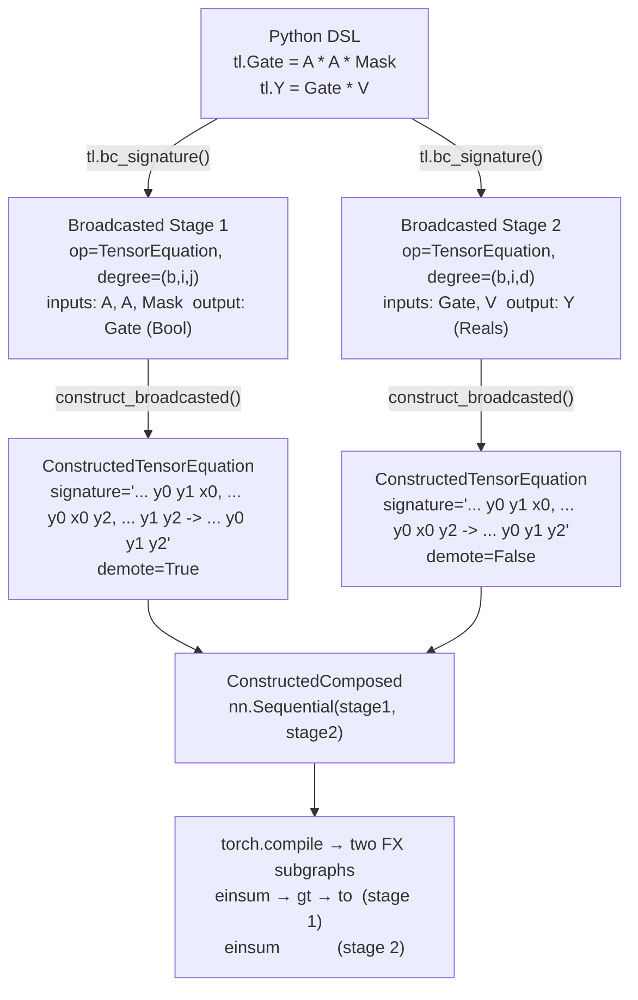
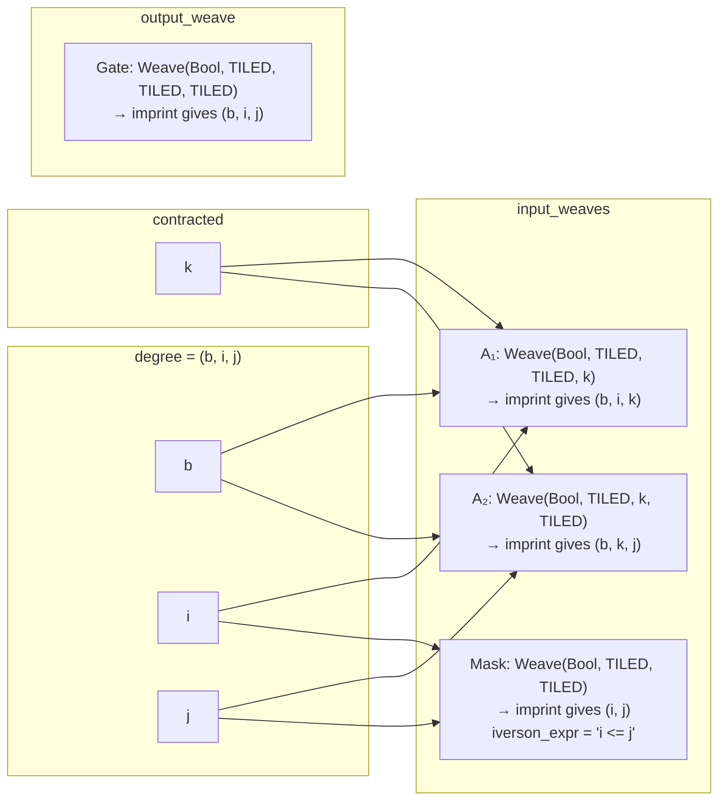
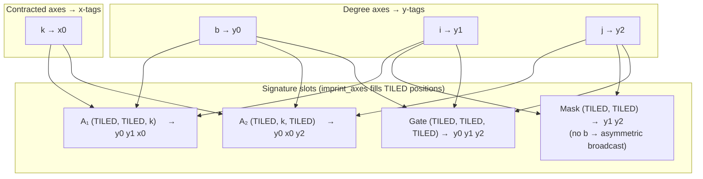
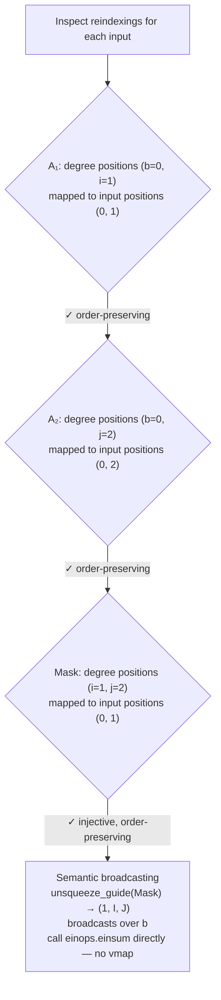
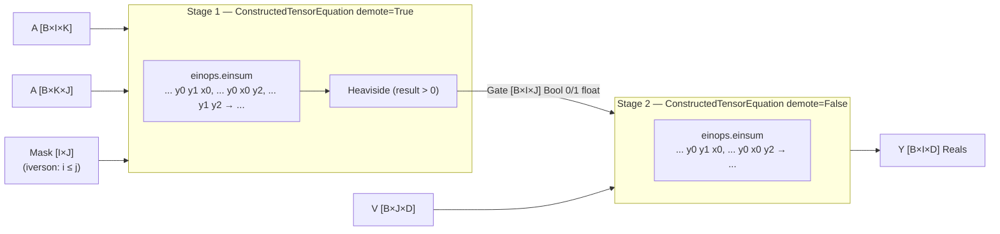
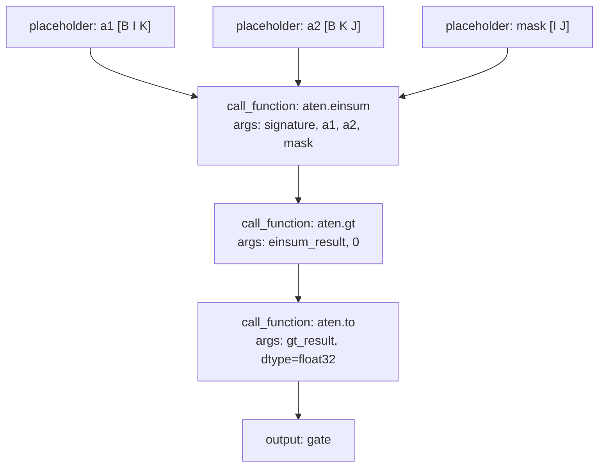
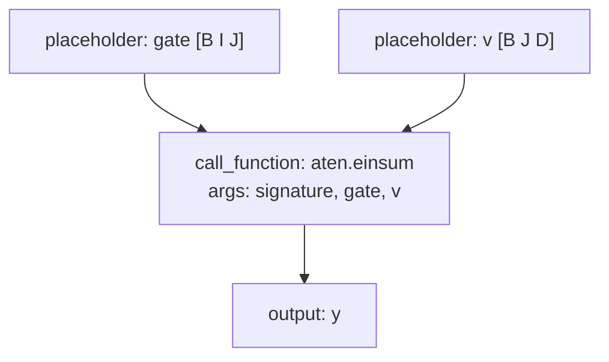

# Compiling Br Diagrams to PyTorch: How pyncd Works

This document explains how pyncd compiles a categorical diagram in the
broadcasted category **Br** into a runnable `torch.nn.Module`. It is aimed at
readers who know the mathematics and are comfortable with Python but have not
read the `torch_compile/` source. A brief background section describes the
relevant PyTorch internals; the main content is the pyncd compilation pipeline.

---

## 1. The Big Picture

A Br morphism expressed in pyncd's DSL passes through three stages before it
can be executed:

```
Python DSL (TensorDSL / operator constructors)
      │
      │  .bc_signature()
      ▼
Broadcasted[Datatype, Axis, Operator]        ← categorical representation
      │
      │  ConstructedModule.construct()
      ▼
torch.nn.Module (ConstructedModule subclass) ← executable PyTorch module
      │
      │  torch.compile  (optional)
      ▼
Compiled kernel (Triton / C++)               ← optimised native code
```

The first two stages are pure Python and live entirely in pyncd. The third
stage is PyTorch's own compiler and is described briefly in Section 6.

---

## 2. Stage 1 — DSL to `Broadcasted`: `bc_signature()`

The DSL (`data_structure/TensorDSL.py`) records tensor declarations and
equations in a `TL` registry object. When you call `tl.bc_signature()`, the
registry converts each `TensorEquation` into a `Broadcasted` morphism by
calling `TensorEquation.bc_signature()` (`data_structure/TensorLogic.py`).

A `Broadcasted[B, A, Op]` (`data_structure/BroadcastedCategory.py:170`) has
four fields:

```python
@dataclass(frozen=True)
class Broadcasted[B: Datatype, A: Axis, O: Operator](Morphism[Array[B, A]]):
    operator:      O                    # what kind of computation
    input_weaves:  tuple[Weave[B, A]]  # shape of each input tensor
    output_weaves: tuple[Weave[B, A]]  # shape of each output tensor
    reindexings:   tuple[StrideCategory[A]]  # how degree maps to each input
```

The **degree** of a `Broadcasted` is the tuple of axes shared across all
reindexings' domains — the loop indices that broadcasting iterates over. It is
derived by calling `weave.imprint_to_degree()` on any input weave.

### The `Weave` object

A `Weave[B, A]` (`BroadcastedCategory.py:96`) represents the shape of one
tensor wire bundle:

```python
@dataclass(frozen=True)
class Weave[B: Datatype, A: Axis](Term):
    datatype: B                          # Reals(), Natural(), Bool(), …
    _shape:   tuple[A | WeaveMode] = () # axes or TILED placeholders
```

Each position in `_shape` is either a concrete `Axis` (a contracted/local
dimension) or `WeaveMode.TILED` (a degree dimension filled in by broadcasting).
The key method `target()` strips `TILED` slots to give the actual tensor shape;
`imprint()` replaces `TILED` slots with concrete degree axes.

### What `bc_signature()` produces

For an equation like `Y[i,j] = W[i,k] * X[k,j]` with `i, j` as degree axes
and `k` as the contracted axis:

- `degree()` → `(i, j)`
- `input_weaves` → `[Weave(Reals, (TILED, k)), Weave(Reals, (k, TILED))]`
- `output_weaves` → `[Weave(Reals, (TILED, TILED))]`
- `reindexings` → one `StrideCategory` per input, encoding which degree
  indices appear in that input's shape

---

## 3. Stage 2 — `Broadcasted` to `nn.Module`: `ConstructedModule.construct()`

The entry point (`torch_compile/torch_compile.py:42`) is a class method that
pattern-matches on the morphism type:

```python
@classmethod
def construct(cls, target: cat.Morphism) -> ConstructedModule:
    match target:
        case cat.Rearrangement():  return ConstructedRearrangement(target)
        case cat.ProductOfMorphisms(): return ConstructedProduct(target)
        case cat.Composed():       return ConstructedComposed(target)
        case cat.Block():          return ConstructedBlock(target)
        case cat.Broadcasted():    return cls.construct_broadcasted(target)
```

For `Broadcasted` morphisms, `construct_broadcasted()` looks up the operator
type in two registries:

```python
@classmethod
def construct_broadcasted(cls, target: cat.Broadcasted) -> ConstructedModule:
    op_type = type(target.operator)
    if op_type in cls.operation_registry:
        return cls.operation_registry[op_type](target)   # full nn.Module
    elif op_type in cls.functions_registry:
        return Lambda(target)                            # thin callable wrapper
    else:
        raise NotImplementedError(...)
```

---

## 4. The Operator Registry: `ConstructedModule` Subclasses

Each subclass is registered with `operation_key=<OperatorClass>` and handles
one Br operator type.

### 4.1 `ConstructedTensorEquation` — einsum contractions

Handles `TensorEquation` operators: the core of the semiring algebra. Its
`__init__` generates an einops contraction string and stores a `demote` flag
for Bool outputs; its `forward` runs the einsum and applies Heaviside if
needed.

**Einsum signature generation** (`generate_tensor_equation_signature`,
`torch_compile.py:217`):

1. Degree axes get tags `y0, y1, …`.
2. Contracted axes (those that appear in inputs but not in the degree) get
   shared tags `x0, x1, …`, assigned by UID identity so the same axis in two
   different input weaves gets the same tag.
3. For each input weave, `imprint_axes()` places degree tags at `TILED`
   positions and contracted tags at `Axis` positions.
4. The result is an einops string such as `"... y0 x0, ... x0 y1 -> ... y0 y1"`.

```python
class ConstructedTensorEquation(ConstructedModule, operation_key=cat.TensorEquation):
    def __init__(self, target):
        self.signature = generate_tensor_equation_signature(target)
        self.demote    = isinstance(target.output_weaves[0].datatype, cat.Bool)

    def forward(self, *xs):
        result = einops.einsum(*xs, self.signature)
        if self.demote:
            return (result > 0).to(result.dtype)   # Heaviside for Bool output
        return result
```

### 4.2 `ConstructedEinops` — axis rearrangement with contraction

Handles `Einops` operators. Generates a signature with
`generate_einops_signature()` using the operator's pre-computed axis mapping
rather than UID identity.

### 4.3 `ConstructedLinear` — learned linear layers

Handles `Linear` operators. Extracts `in_size` and `out_size` from the input
and output weave shapes, then constructs a `Multilinear` module
(`torch_utilities.py:40`) — a multi-dimensional generalisation of `nn.Linear`
that uses `torch.tensordot` for the contraction and supports optional bias.
The result is then wrapped by `broadcast_func()`.

```python
class ConstructedLinear(ConstructedModule, operation_key=ops.Linear):
    def __init__(self, target):
        self.module = Multilinear(in_size, out_size, bias)
        self.func   = broadcast_func(target, self.module.forward)

    def forward(self, *xs):
        return self.func(*xs)
```

### 4.4 `ConstructedEmbedding` — learned embeddings

Wraps `nn.Embedding` for `Embedding` operators. The embedding table is indexed
by a `Natural`-typed input weave; the output weave carries `Reals`.

### 4.5 `ConstructedNorm` — layer normalisation

Wraps `nn.LayerNorm` for `Normalize` operators. The normalised axes are read
from the output weave shape.

### 4.6 `ConstructedRearrangement` — axis permutation

A no-op at runtime (pure Python metadata). `Rearrangement` morphisms encode
axis reorderings that are absorbed into the einsum signatures of adjacent
operators; they produce no PyTorch ops themselves.

### 4.7 `Lambda` — functional operators

Operators registered via `ConstructedModule.add_function()` become `Lambda`
instances. The function is looked up in `functions_registry` and wrapped by
`broadcast_func()`. Built-in examples:

| Operator | PyTorch function |
|---|---|
| `SoftMax` | `torch.softmax(x, dim=…)` |
| `AdditionOp` | `lambda x, y: x + y` |
| `Elementwise` | `torch.relu` |
| `WeightedTriangularLower` | custom `weighted_triangular_lower()` |

---

## 5. Broadcasting: `broadcast_func()`

Every `ConstructedModule` wraps its core function with `broadcast_func()`
(`torch_compile.py:170`), which selects a broadcasting strategy by inspecting
the `Broadcasted` morphism's `reindexings`.

### The four strategies

**1. Explicit dim** — when the function accepts a `dim=` argument (e.g.
`softmax`) and the contracted axis has a fixed position in the tensor. The
displacement (rightmost local-axis offset) is computed by `get_displacement()`
(`bcast.py:66`) and passed directly:

```python
return lambda *xs: func(*xs, dim=displacement)
```

**2. Implicit lower** — when the local axes are already at the trailing
positions and no degree axes appear in the input (`displacement == -1`). The
function is called as-is with no reshaping.

**3. Semantic broadcasting** — when all reindexings are order-preserving
injections (checked by `is_semantically_broadcastable()`, `bcast.py:29`).
Inputs are reshaped with `unsqueeze_guide()` to align their axes with the
degree dimensions; no vmap is needed.

**4. vmap** — the general case. `broadcast_vmap()` (`bcast.py:99`) walks the
degree axes bottom-up and yields `(in_dims, out_dims)` pairs indicating which
axis in each input and output corresponds to the current degree index. The
function is lifted iteratively:

```python
for input_loc, output_loc in broadcast_vmap(target):
    func = torch.vmap(func, in_dims=input_loc, out_dims=output_loc)
```

Each `torch.vmap` call vectorises one degree axis; the final `func` accepts
tensors whose leading dimensions are the full degree.

---

## 6. Composite Morphisms

### `ConstructedComposed` — sequential composition

Wraps `cat.Composed` as a chain of submodules stored in `nn.Sequential`. The
`forward` method threads tensors through the chain, unpacking tuple outputs at
each step:

```python
class ConstructedComposed(ConstructedModule):
    def __init__(self, target):
        self.chain = nn.Sequential(
            *[ConstructedModule.construct(m) for m in target.content]
        )

    def forward(self, *xs):
        for module in self.chain:
            xs = to_tuple(module(*xs))
        return xs
```

### `ConstructedProduct` — parallel morphisms

Wraps `cat.ProductOfMorphisms`. Each morphism in the product is applied to its
own slice of the input tuple, determined by `target.partition(xs)`. Outputs
are concatenated into a flat tuple.

### `ConstructedBlock` — repetition

Wraps `cat.Block`. If the repetition count is greater than one, constructs
`repetition` independent copies of the body as an `nn.Sequential`, threading
the output of each copy as input to the next. A single repetition is simply
`ConstructedModule.construct(target.body)`.

---

## 7. PyTorch Compilation Background

This section describes what happens when `torch.compile` is applied to a
`ConstructedModule`. It can be skipped if you are only interested in how
pyncd builds the module.

### The three-stage pipeline

`torch.compile(module)` passes the module through three stages:

1. **TorchDynamo** intercepts Python bytecode execution and records tensor
   operations as nodes in an `fx.Graph` (a linked list of `fx.Node` objects,
   each carrying an ATen operator, its arguments, and its outputs). Python
   control flow that depends on non-tensor values — such as `if self.demote:`
   — is **specialised**: Dynamo takes one branch, records it, and emits a
   *guard* that checks the specialised value on future calls. If Dynamo cannot
   trace a piece of code it emits a **graph break**, compiling what it has so
   far and continuing afterwards in the Python interpreter.

2. **AOTAutograd** traces both the forward and backward passes at compile
   time, producing two static `fx.GraphModule` objects (forward and backward).
   It also applies *functionalization* — rewriting in-place ops into
   out-of-place equivalents — so the graph is a pure function.

3. **TorchInductor** lowers each ATen op into a loop-level IR
   (`Pointwise`, `Reduction`, `ExternKernel`), fuses adjacent elementwise and
   reduction nodes into single kernels, and generates either Triton (GPU) or
   C++ / OpenMP (CPU) source code that is compiled and cached.

### What this means for pyncd modules

- `self.demote` (the Bool-output flag on `ConstructedTensorEquation`) is a
  plain Python `bool`. Dynamo specialises on it: a Bool-output equation and a
  Reals-output equation compile to separate cached kernels.
- `self.signature` (the einops string) is a Python constant. Dynamo reads it
  as a `ConstantVariable` and embeds it directly in the FX graph node for
  `aten.einsum`.
- `torch.vmap` introduced by `broadcast_func()` is supported natively by
  Dynamo and does not cause graph breaks.
- The `gt` and `to` ops that implement the Heaviside demotion are pointwise.
  Inductor can fuse them into the epilogue of the einsum reduction kernel
  (when the einsum is lowered as a `Reduction` rather than delegated to
  cuBLAS), so the Bool output path adds no extra memory round-trips.

---

## 8. Bool Semiring in the Compilation Pipeline

pyncd's bool semiring is implemented at two levels that are worth keeping
distinct: the **symbolic level** (pyncd Python objects describing the
computation) and the **runtime level** (PyTorch ops that execute it).

### Symbolic level: `Bool`, Iverson AST, `iverson_expr`

`Bool` (`BroadcastedCategory.py`) is a frozen dataclass with no fields — a
marker that annotates `Weave` and `Array` objects to signal binary-valued data.
It is propagated through the pyncd expression tree but never becomes a PyTorch
tensor or FX node.

Predicate expressions (e.g. `q <= x`) are represented as an AST of
`IversonBinOp`, `IversonUnaryOp`, and `IversonConst` nodes
(`data_structure/TensorExpr.py`). The `RawAxis` class is monkey-patched so
that comparison operators produce these AST nodes directly:

```python
q <= x   # → IversonBinOp('<=', q, x)
```

The predicate AST is consumed during `bc_signature()` to determine which input
weaves carry `Bool()` datatypes, then serialised to a string (`iverson_expr`)
stored on the `Weave` for display by `tsncd`. By the time
`ConstructedTensorEquation` is constructed the predicate structure is gone;
only the `demote` flag remains.

Tensors are declared as predicate-valued via `TL.predicate()`:

```python
tl = TL()
i, j, k = axes('i j k')
tl.Out.predicate(i, j)          # marks Out as Bool-typed
tl.Out[i, j] = tl.A[i, k] * tl.B[k, j]
bc_sig = tl.bc_signature()      # output_weaves[0].datatype == Bool()
```

### Runtime level: Heaviside demotion

The bool semiring uses real arithmetic for the contraction and applies a
post-hoc threshold. `ConstructedTensorEquation.__init__` sets
`self.demote = isinstance(output_weaves[0].datatype, Bool)`. In `forward`:

```python
result = einops.einsum(*xs, self.signature)
if self.demote:
    return (result > 0).to(result.dtype)   # H(x) = (x > 0)
```

This realises the boolean semiring: the real-valued sum `Σ A[i,k] * B[k,j]`
is positive if and only if there exists a `k` for which both factors are
positive, matching the `∃`-semantics of contraction in the Bool semiring.

### What the FX graph looks like

Dynamo specialises on `self.demote`. The `demote=True` graph:

```text
placeholder:   x0
placeholder:   x1
call_function: einsum  [aten.einsum, ("... i x0, ... x0 j -> ... i j", [x0, x1])]
call_function: gt      [aten.gt,     (einsum, 0)]
call_function: to      [aten.to,     (gt, dtype)]
output:        to
```

The `demote=False` graph ends at `einsum`. Inductor can fuse `gt` and `to`
into the einsum epilogue for small contractions; for large matrix multiplies
it delegates the einsum to cuBLAS and emits a separate pointwise kernel.

### Full mapping: symbolic → runtime → compiler

```text
pyncd symbolic object         Runtime PyTorch        Compiler handling
──────────────────────────    ──────────────────────  ──────────────────────────────
Bool()  marker datatype   →   (no tensor)         →  EQUALS_MATCH guard on demote
IversonBinOp  AST node    →   (discarded)         →  not in FX graph
iverson_expr  string      →   (metadata for tsncd)→  not in FX graph
self.demote = True        →   if-branch taken     →  specialised; two cached kernels
einops.einsum(…)          →   aten.einsum         →  Reduction or ExternKernel
(result > 0).to(dtype)   →   aten.gt + aten.to   →  fused into einsum epilogue
```

---

## 9. Worked Example: Causal Masked Two-Hop Graph Attention

This section traces a richer computation end-to-end through the pipeline. It
involves three inputs in one stage, the Bool semiring with an Iverson predicate,
asymmetric broadcasting, and composition of two `Broadcasted` morphisms.

### The equations

```text
Gate[b, i, j]  =  [∃k : A[b,i,k] ∧ A[b,k,j]]  ∧  Mask[i, j]    (Bool output)
Y[b, i, d]     =  Σ_j  Gate[b, i, j] · V[b, j, d]              (Reals output)
```

`Mask[i, j]` carries the Iverson predicate `[i ≤ j]` (causal masking). In the
DSL:

```python
tl = TL()
b, i, j, k, d = axes('b i j k d')

tl.A.predicate(b, i, k)       # Bool adjacency
tl.Mask.predicate(i, j)       # Bool causal mask, iverson_expr = "i <= j"
tl.Gate.predicate(b, i, j)    # Bool output of Stage 1
# tl.V and tl.Y are Reals (default)

tl.Gate[b, i, j] = tl.A[b, i, k] * tl.A[b, k, j] * tl.Mask[i, j]
tl.Y[b, i, d]    = tl.Gate[b, i, j] * tl.V[b, j, d]
```

### Overall pipeline



### Stage 1 — `bc_signature()`

`Gate[b,i,j] = A[b,i,k] * A[b,k,j] * Mask[i,j]` has degree `(b, i, j)` and
contracted axis `k`. The Iverson predicate `"i <= j"` on `Mask` was serialised
into `iverson_expr` at declaration time. During `bc_signature()` it sets
`Mask`'s weave datatype to `Bool()`, then the AST is discarded — by the time
`ConstructedTensorEquation` is constructed, only the `Bool()` datatype on the
weave remains.



### Stage 1 — einsum signature generation

`generate_tensor_equation_signature()` assigns tags by axis UID identity: the
same `Axis` object always gets the same tag regardless of which weave it appears
in.



Full signature: `"... y0 y1 x0, ... y0 x0 y2, ... y1 y2 -> ... y0 y1 y2"`.

The `...` is the einops ellipsis: it matches any extra leading batch dimensions beyond those pyncd explicitly names. `Mask`'s slot is `... y1 y2` (no `y0`) because `b` is absent from its weave; the `...` matches zero dimensions there and einops broadcasts Mask over `b` automatically.

### Stage 1 — broadcasting strategy

`broadcast_func()` must decide how to lift the core einsum over the degree axes
`(b, i, j)`. It does this by inspecting each input's **reindexing** — the map
from degree positions to that input's axis positions:

| Input | Degree axes present  | Degree pos → input pos |
|-------|----------------------|------------------------|
| A₁    | b (pos 0), i (pos 1) | 0→0, 1→1               |
| A₂    | b (pos 0), j (pos 2) | 0→0, 2→1               |
| Mask  | i (pos 1), j (pos 2) | 1→0, 2→1               |

The check is whether each mapping is **order-preserving and injective**: degree
axes appear in the same relative order inside the input tensor (no axis is
repeated or swapped). The diagram below traces this check for each input; all
three pass, so `is_semantically_broadcastable()` returns `True` and the cheapest
strategy — no `vmap` — is selected.



Instead, `unsqueeze_guide()` computes the `unsqueeze` positions needed to align
each input's axes with the degree. Mask is the interesting case: it has no `b`
axis, so a unit dimension is inserted at position 0, giving shape `(1, I, J)`.
PyTorch then broadcasts that dimension over `b` during the einsum. A₁ and A₂
already have their degree axes in the right positions and need no reshaping.

The alternative — `vmap` — would be used when any reindexing is non-injective
or out-of-order (e.g. an input reuses a degree axis, or its axes appear in
a different order than the degree). `vmap` handles the general case but adds
overhead; semantic broadcasting avoids it entirely when the structure permits.

### Stage 1 — `ConstructedTensorEquation` and Bool demotion

```python
class ConstructedTensorEquation(ConstructedModule, operation_key=cat.TensorEquation):
    def __init__(self, target):
        self.signature = "... y0 y1 x0, ... y0 x0 y2, ... y1 y2 -> ... y0 y1 y2"
        self.demote    = True   # output_weaves[0].datatype == Bool()

    def forward(self, a1, a2, mask):
        result = einops.einsum(a1, a2, mask, self.signature)
        # result[b,i,j] = Σ_k  a1[b,i,k] * a2[b,k,j] * mask[i,j]
        # Bool semiring: > 0  iff  ∃k where both adjacencies hold AND mask[i,j]=1
        return (result > 0).to(result.dtype)
```

The Iverson predicate `[i ≤ j]` has completely vanished from the computational
graph. Its only lasting effect is that `mask` is a 0/1 tensor materialised
before this module is called; it participates in the real-valued sum like any
other factor.

### Stage 2 — `bc_signature()` and construction

`Y[b,i,d] = Gate[b,i,j] * V[b,j,d]` is structurally a batched matmul. Gate is
now a `Weave(Bool, (TILED, TILED, j))` — Bool-typed input, Reals output.

```text
degree = (b, i, d)     tags: b→y0, i→y1, d→y2
contracted: j → x0

Gate (TILED, TILED, j)    →  "y0 y1 x0"
V    (TILED, j, TILED)    →  "y0 x0 y2"
Y    (TILED, TILED, TILED) →  "y0 y1 y2"

signature = "... y0 y1 x0, ... y0 x0 y2 -> ... y0 y1 y2"
demote    = False    (output_weaves[0].datatype == Reals())
```

### Composition



The `forward` loop in `ConstructedComposed` threads the tuple `(gate,)` out of
Stage 1 into Stage 2 together with `V`, which is passed through from the
top-level input partition.

### FX graphs after `torch.compile`

Dynamo specialises on each module's `self.demote` flag independently, producing
two compiled subgraphs.

**Stage 1 FX graph** (`demote=True`):



Inductor can fuse `gt` and `to` into the epilogue of the reduction kernel when
the einsum is lowered as a `Reduction` node. For large tensors it may delegate
to cuBLAS and emit a separate pointwise kernel — at most one extra memory
round-trip.

**Stage 2 FX graph** (`demote=False`):



### What makes this harder than a plain matmul

| Complexity | matmul | this example |
| --- | --- | --- |
| Number of inputs | 2 | 3 (Stage 1), 2 (Stage 2) |
| Datatypes | uniform Reals | Bool inputs, Bool→Reals handoff |
| Iverson predicate | none | `iverson_expr = "i <= j"` on Mask |
| Broadcasting | symmetric | asymmetric — Mask missing `b` |
| Heaviside demotion | never | Stage 1 only |
| FX subgraphs | 1 | 2 (separate `demote` specialisations) |
| Composition | none | `ConstructedComposed` with partition |

The Iverson predicate's contribution to compilation is entirely structural: it
annotates `Mask`'s weave with `Bool()` at DSL time, which flows into
`output_weaves[0].datatype == Bool()` in Stage 1, which sets `demote=True`,
which Dynamo specialises on to produce the `gt → to` epilogue. The expression
`"i <= j"` itself never appears in any PyTorch op.

---

## Summary

| Stage | pyncd object | Key method / class |
| --- | --- | --- |
| DSL declaration | `TL`, `TensorEquation` | `tl.bc_signature()` |
| Categorical IR | `Broadcasted`, `Weave`, `Axis` | `bc_signature()` on each operator |
| Operator dispatch | `ConstructedModule` | `.construct()`, `operation_registry` |
| Einsum/contraction | `ConstructedTensorEquation` | `generate_tensor_equation_signature()` |
| Einops rearrangement | `ConstructedEinops` | `generate_einops_signature()` |
| Learned linear | `ConstructedLinear`, `Multilinear` | `torch.tensordot` |
| Embedding | `ConstructedEmbedding` | `nn.Embedding` |
| Normalisation | `ConstructedNorm` | `nn.LayerNorm` |
| Functional ops | `Lambda` | `functions_registry` + `broadcast_func()` |
| Broadcasting | `broadcast_func()` | `vmap`, reshape, or `dim=` |
| Sequential composition | `ConstructedComposed` | `nn.Sequential` chain |
| Parallel morphisms | `ConstructedProduct` | `target.partition()` |
| Repetition | `ConstructedBlock` | `nn.Sequential` copies |
| Bool semiring | `demote` flag | Heaviside `(x > 0).to(dtype)` |
| PyTorch compilation | `torch.compile` | Dynamo → AOTAutograd → Inductor |
