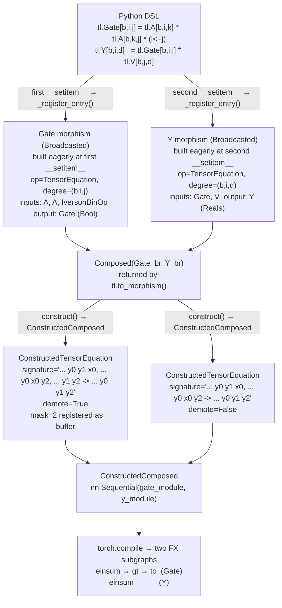
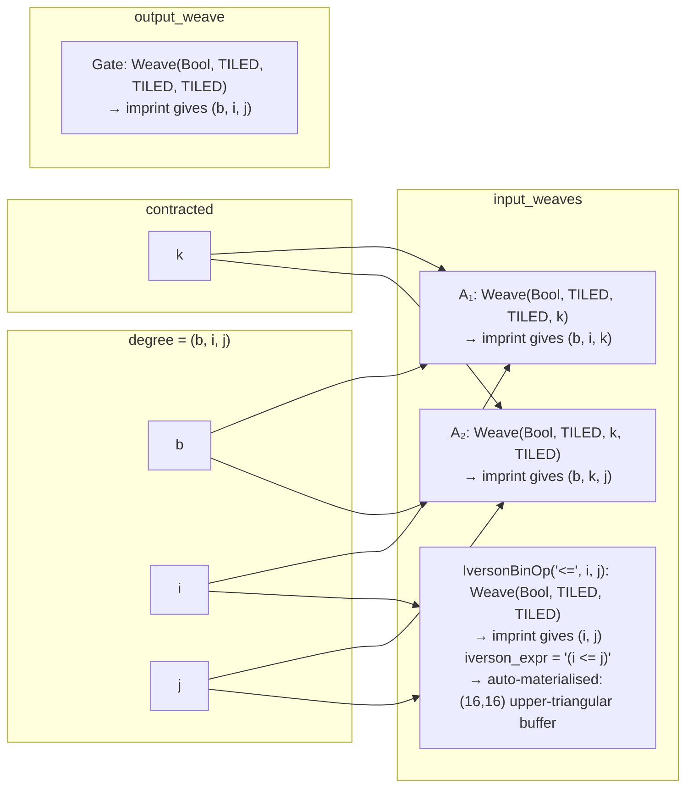
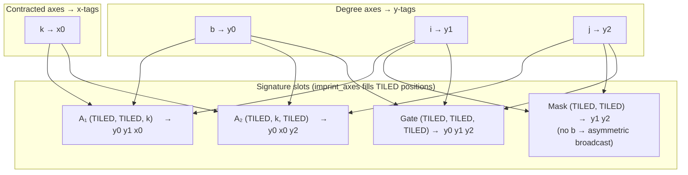
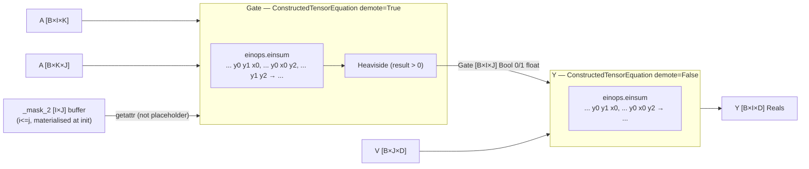
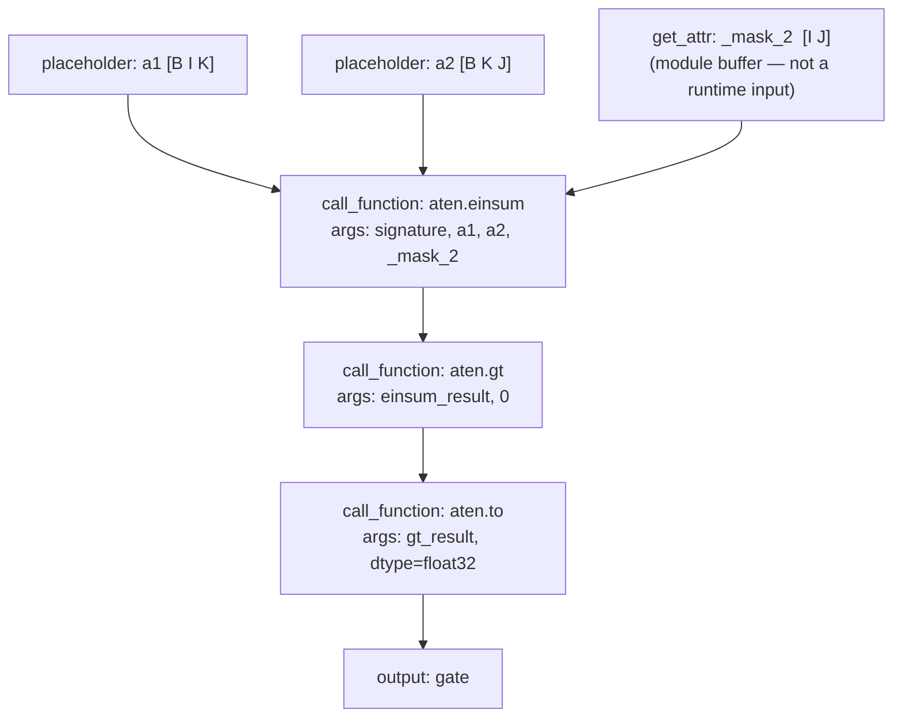
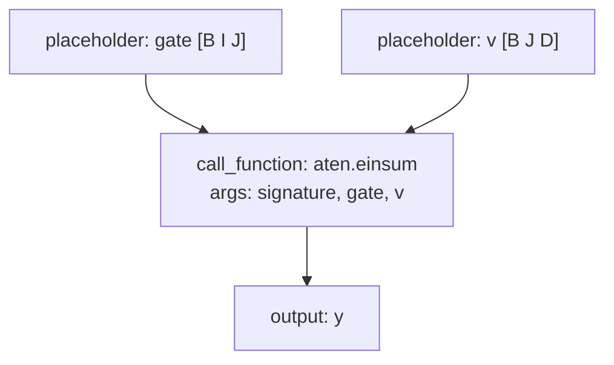

# Compiling Br Diagrams to PyTorch: How pyncd Works

This document explains how pyncd compiles a categorical diagram in the
broadcasted category **Br** into a runnable `torch.nn.Module`. It is aimed at
readers who know the mathematics and are comfortable with Python but have not
read the `torch_compile/` source. A brief background section describes the
relevant PyTorch internals; the main content is the pyncd compilation pipeline.

---

## 1. The Big Picture

A Br morphism expressed in pyncd's DSL passes through three stages before it
can be executed:

```
Python DSL (TensorDSL / operator constructors)
      │
      │  __setitem__  →  _register_entry()   ← called once per equation,
      │    · _build_rhs_morphism()               eagerly at assignment time
      │        creates TensorEquation, calls
      │        TensorEquation.bc_signature()
      │        → Broadcasted
      │    · _build_sum_morphism()           ← for + expressions (SumExpr)
      │        builds Broadcasted per term,
      │        → Composed(ProductOfMorphisms,
      │             AdditionOp Broadcasted)
      │    · IversonExpr AST retained in
      │        each Broadcasted's operator.rhs
      │
      │  to_morphism()                       ← collects stored morphisms;
      │                                         no additional compilation
      ▼
Broadcasted or Composed[…]                   ← categorical representation
      │
      │  ConstructedModule.construct()
      │    · materialise_iverson()           ← Iverson predicates whose axes
      │        called per IversonExpr factor    carry concrete sizes are evaluated
      │        with sized axes                  to float {0,1} tensors here and
      │        → register_buffer(_mask_i)       stored as nn.Module buffers;
      │      unsized axes → UserWarning,        unsized predicates fall through
      │        caller must supply tensor        to the caller-provided path
      ▼
torch.nn.Module (ConstructedModule subclass) ← executable PyTorch module
      │  · Iverson buffers move with .to(device)
      │  · forward() slots buffers into einsum alongside caller tensors
      │
      │  torch.compile  (optional)
      │    · buffers appear as get_attr nodes (constants), not placeholders
      ▼
Compiled kernel (Triton / C++)               ← optimised native code
```

The first two stages are pure Python and live entirely in pyncd. The third
stage is PyTorch's own compiler and is described briefly in Section 7.
Stage 1 is **eager**: morphisms are built at `__setitem__` time, not deferred
to a separate compilation call. `to_morphism()` is the handoff between Stage 1
and Stage 2 — it returns whatever was built, with no further computation.
Iverson materialisation is a sub-step of Stage 2: the `IversonExpr` AST
travels through Stage 1 inside each `Broadcasted`'s `operator.rhs` and is
consumed at the top of Stage 2 by `ConstructedTensorEquation.__init__`. By the
time `forward()` is called the predicate tensor is already a module buffer — it
is never re-evaluated at runtime.

---

## 2. Stage 1 — DSL to Categorical IR: Eager Morphism Construction

The DSL (`data_structure/TensorDSL.py`) records tensor declarations and
equations in a `TL` registry object. Each `__setitem__` assignment
(e.g. `tl.Y[i,j] = tl.W[i,k] * tl.X[k,j]`) immediately calls
`_register_entry()`, which builds and stores the corresponding categorical
morphism before the next assignment runs. The user calls `tl.to_morphism()` at
the end to collect the stored morphisms; `to_morphism()` itself does no
additional compilation.

Two build paths exist inside `_register_entry()`:

- **`_build_rhs_morphism()`** — for a `RHSExpression` (a single `*`-chain of
  tensors and predicates). Creates a `TensorEquation`, unifies cross-equation
  axis identities via the shared `_ctx`, applies the context, then calls
  `TensorEquation.bc_signature()` (`data_structure/TensorLogic.py`) to produce
  a `Broadcasted` morphism.

- **`_build_sum_morphism()`** — for a `SumExpr` (a `+` of two or more
  `RHSExpression` terms, written `tl.A[i] + tl.B[i]`). Calls
  `_build_rhs_morphism()` once per term to get a `Broadcasted` per term,
  collects them in a `ProductOfMorphisms`, then appends an
  `AdditionOp`-backed `Broadcasted` that sums the term outputs elementwise.
  The result is `Composed(ProductOfMorphisms(term_0, term_1, …), AdditionOp_br)`.

`tl.bc_signature()` remains available as a shorthand for single-equation
programs; it calls `to_equation()` then `TensorEquation.bc_signature()`
directly and raises if more than one equation is registered.

A `Broadcasted[B, A, Op]` (`data_structure/BroadcastedCategory.py:170`) has
four fields:

```python
@dataclass(frozen=True)
class Broadcasted[B: Datatype, A: Axis, O: Operator](Morphism[Array[B, A]]):
    operator:      O                    # what kind of computation
    input_weaves:  tuple[Weave[B, A]]  # shape of each input tensor
    output_weaves: tuple[Weave[B, A]]  # shape of each output tensor
    reindexings:   tuple[StrideCategory[A]]  # how degree maps to each input
```

The **degree** of a `Broadcasted` is the tuple of axes shared across all
reindexings' domains — the loop indices that broadcasting iterates over. It is
derived by calling `weave.imprint_to_degree()` on any input weave.

### The `Weave` object

A `Weave[B, A]` (`BroadcastedCategory.py:96`) represents the shape of one
tensor wire bundle:

```python
@dataclass(frozen=True)
class Weave[B: Datatype, A: Axis](Term):
    datatype: B                          # Reals(), Natural(), Bool(), …
    _shape:   tuple[A | WeaveMode] = () # axes or TILED placeholders
```

Each position in `_shape` is either a concrete `Axis` (a contracted/local
dimension) or `WeaveMode.TILED` (a degree dimension filled in by broadcasting).
The key method `target()` strips `TILED` slots to give the actual tensor shape;
`imprint()` replaces `TILED` slots with concrete degree axes.

### What `bc_signature()` produces

For an equation like `Y[i,j] = W[i,k] * X[k,j]` with `i, j` as degree axes
and `k` as the contracted axis:

- `degree()` → `(i, j)`
- `input_weaves` → `[Weave(Reals, (TILED, k)), Weave(Reals, (k, TILED))]`
- `output_weaves` → `[Weave(Reals, (TILED, TILED))]`
- `reindexings` → one `StrideCategory` per input, encoding which degree
  indices appear in that input's shape

### Iverson predicates in `bc_signature()`

When a tensor equation's RHS contains an inline predicate (e.g.
`tl.Score[q, x] * (q <= x)`), the `RawAxis` comparison operators produce
`IversonExpr` AST nodes at Python evaluation time — before `bc_signature()`
is ever called:

```python
q <= x   # → IversonBinOp('<=', q, x)   via RawAxis.__le__
```

During `bc_signature()`, each factor in `operator.rhs` is inspected.
`TensorRef` factors become `Reals()`-typed weaves as usual. `IversonExpr`
factors are assigned a `Bool()`-typed `Weave` whose `_shape` contains only
`TILED` slots — the predicate has no contracted axes of its own, only degree
axes. Two things are stored on the weave for downstream use:

- `iverson_expr` — a serialised string form of the AST (e.g. `"(i <= j)"`)
  stored on the `Weave` for display by the `tsncd` visualiser.
- The `IversonExpr` AST itself — retained in `target.operator.rhs`, not
  discarded, so that Stage 2 can consume it.

The AST travels through Stage 1 as a typed entry in `operator.rhs` and is
consumed at the top of Stage 2 by `ConstructedTensorEquation.__init__`, which
calls `materialise_iverson` to evaluate it into a float `{0, 1}` tensor. If
every axis in the predicate carries a concrete integer size the tensor is
built once at construction time and stored as an `nn.Module` buffer; if any
axis is unsized a `UserWarning` is issued and the caller must supply the
pre-built tensor at runtime. See Section 4.1 for the full materialisation
machinery.

### Sum expressions: `SumExpr` → `Composed`

A `+` between `IndexedTensor` or `RHSExpression` objects produces a `SumExpr`,
which is handled by `_build_sum_morphism()`:

1. Each additive term is compiled via `_build_rhs_morphism()` to a
   `Broadcasted` morphism (the standard path).
2. The per-term morphisms are wrapped in a `ProductOfMorphisms`.
3. An `AdditionOp`-backed `Broadcasted` (`AdditionOp_br`) is constructed over
   the shared output degree, with one all-`TILED` input weave per term and one
   all-`TILED` output weave.
4. The final result is `Composed(content=(ProductOfMorphisms(…), AdditionOp_br))`.

At runtime, `ConstructedComposed` threads the output tuple of
`ConstructedProduct` — one tensor per term — into `Lambda(AdditionOp)`, which
applies `lambda x, y: x + y` (or `functools.reduce` for more than two terms).

```python
tl = TL()
i = real_axis('i', 16)
tl.Out[i] = tl.A[i] + tl.B[i]
morph = tl.to_morphism()
# morph: Composed(
#   ProductOfMorphisms(
#     Broadcasted(TensorEquation(A), …),   # A[i] term
#     Broadcasted(TensorEquation(B), …),   # B[i] term
#   ),
#   Broadcasted(AdditionOp(), …)           # elementwise sum
# )
module = ConstructedModule.construct(morph)
# ConstructedComposed(ConstructedProduct(…), Lambda(AdditionOp))
```

The `AdditionOp_br` `Broadcasted` is dispatched via the `functions_registry`
to `Lambda` exactly as a standalone `AdditionOp` would be (Section 4.7); the
difference is only in how it is assembled — here it arrives as the second
element of a `Composed` chain rather than as a top-level morphism.

---

## 3. Stage 2 — Categorical IR to `nn.Module`: `ConstructedModule.construct()`

The entry point (`torch_compile/torch_compile.py:42`) is a class method that
pattern-matches on the morphism type. Stage 1 may produce a `Broadcasted`
(single-chain assignment), a `Composed(ProductOfMorphisms, AdditionOp_br)`
(additive sum), or a `Composed` of multiple entries (multi-equation `TL`);
all are handled by the same match:

```python
@classmethod
def construct(cls, target: cat.Morphism) -> ConstructedModule:
    match target:
        case cat.Rearrangement():  return ConstructedRearrangement(target)
        case cat.ProductOfMorphisms(): return ConstructedProduct(target)
        case cat.Composed():       return ConstructedComposed(target)
        case cat.Block():          return ConstructedBlock(target)
        case cat.Broadcasted():    return cls.construct_broadcasted(target)
```

For `Broadcasted` morphisms, `construct_broadcasted()` looks up the operator
type in two registries:

```python
@classmethod
def construct_broadcasted(cls, target: cat.Broadcasted) -> ConstructedModule:
    op_type = type(target.operator)
    if op_type in cls.operation_registry:
        return cls.operation_registry[op_type](target)   # full nn.Module
    elif op_type in cls.functions_registry:
        return Lambda(target)                            # thin callable wrapper
    else:
        raise NotImplementedError(...)
```

For `TensorEquation` operators this dispatches to `ConstructedTensorEquation`,
which is where any `IversonExpr` factors in `operator.rhs` are materialised
into `nn.Module` buffers. The dispatch itself is unaware of Iverson predicates
— all Iverson-specific logic lives inside `ConstructedTensorEquation.__init__`
(Section 4.1).

---

## 4. The Operator Registry: `ConstructedModule` Subclasses

Each subclass is registered with `operation_key=<OperatorClass>` and handles
one Br operator type.

### 4.1 `ConstructedTensorEquation` — einsum contractions

Handles `TensorEquation` operators: the core of the semiring algebra. Its
`__init__` generates an einops contraction string, stores a `demote` flag
for Bool outputs, and auto-materialises any Iverson predicate factors whose
axes have concrete sizes. Its `forward` fills in pre-built masks from buffers
before calling `einops.einsum`, then applies Heaviside if needed.

**Einsum signature generation** (`generate_tensor_equation_signature`,
`torch_compile.py:217`):

1. Degree axes get tags `y0, y1, …`.
2. Contracted axes (those that appear in inputs but not in the degree) get
   shared tags `x0, x1, …`, assigned by UID identity so the same axis in two
   different input weaves gets the same tag.
3. For each input weave, `imprint_axes()` places degree tags at `TILED`
   positions and contracted tags at `Axis` positions.
4. The result is an einops string such as `"... y0 x0, ... x0 y1 -> ... y0 y1"`.

**Iverson materialisation** (`torch_compile/materialise.py`):

When a `TensorEquation` RHS contains an inline Iverson factor (e.g. `q <= x`),
`__init__` calls `materialise_iverson` to evaluate the predicate expression
tree into a concrete float `{0, 1}` tensor and stores it as an `nn.Module`
buffer. The buffer moves to the correct device automatically with `.to(device)`.

If any axis in the Iverson expression has no concrete integer size, a
`UserWarning` is issued and the factor falls through to the caller-provided
path — the caller must pass the pre-built tensor at that position in `*xs`.

```python
class ConstructedTensorEquation(ConstructedModule, operation_key=cat.TensorEquation):
    def __init__(self, target):
        self.signature = generate_tensor_equation_signature(target)
        self.demote    = isinstance(target.output_weaves[0].datatype, cat.Bool)
        # _factor_slots[i]: buffer name if Iverson is auto-materialised, else None
        self._factor_slots = []
        for i, factor in enumerate(target.operator.rhs):
            if isinstance(factor, TensorRef):
                self._factor_slots.append(None)
            else:
                try:
                    buf = materialise_iverson(factor)
                    self.register_buffer(f'_mask_{i}', buf)
                    self._factor_slots.append(f'_mask_{i}')
                except ValueError:
                    warnings.warn(...)   # unsized axis — caller must supply
                    self._factor_slots.append(None)
        self._caller_positions = [i for i, s in enumerate(self._factor_slots) if s is None]

    def forward(self, *xs):
        caller_idx = 0
        full_tensors = []
        for slot in self._factor_slots:
            if slot is not None:
                full_tensors.append(getattr(self, slot))  # pre-built buffer
            else:
                full_tensors.append(xs[caller_idx])       # caller-provided
                caller_idx += 1
        result = einops.einsum(*full_tensors, self.signature)
        if self.demote:
            return (result > 0).to(result.dtype)          # Heaviside for Bool output
        return result
```

**Example — sized axes, Iverson auto-materialised:**

```python
from data_structure.TensorDSL import TL, real_axis

q = real_axis('q', 4)   # _size = Integer(4)
x = real_axis('x', 4)
tl = TL()
tl.Attn[q, x] = tl.Score[q, x] * (q <= x)   # morphism built eagerly here

module = ConstructedModule.construct(tl.to_morphism())
# _mask_1 registered as buffer: [[1,1,1,1],[0,1,1,1],[0,0,1,1],[0,0,0,1]]
# Caller supplies only Score — no Mask argument needed:
result = module(Score)   # shape (4, 4)
```

**Example — unsized axes, caller provides Mask:**

```python
from data_structure.TensorDSL import TL, axes

q, x = axes('q x')   # no size — materialisation deferred
tl = TL()
tl.Attn[q, x] = tl.Score[q, x] * (q <= x)   # morphism built eagerly here

module = ConstructedModule.construct(tl.to_morphism())
# UserWarning: RHS factor 1 has unsized axes — pass it as caller input
Mask = torch.triu(torch.ones(n, n))   # built by caller
result = module(Score, Mask)          # Mask passed explicitly
```

### 4.2 `ConstructedEinops` — axis rearrangement with contraction

Handles `Einops` operators. Generates a signature with
`generate_einops_signature()` using the operator's pre-computed axis mapping
rather than UID identity.

### 4.3 `ConstructedLinear` — learned linear layers

Handles `Linear` operators. Extracts `in_size` and `out_size` from the input
and output weave shapes, then constructs a `Multilinear` module
(`torch_utilities.py:40`) — a multi-dimensional generalisation of `nn.Linear`
that uses `torch.tensordot` for the contraction and supports optional bias.
The result is then wrapped by `broadcast_func()`.

```python
class ConstructedLinear(ConstructedModule, operation_key=ops.Linear):
    def __init__(self, target):
        self.module = Multilinear(in_size, out_size, bias)
        self.func   = broadcast_func(target, self.module.forward)

    def forward(self, *xs):
        return self.func(*xs)
```

### 4.4 `ConstructedEmbedding` — learned embeddings

Wraps `nn.Embedding` for `Embedding` operators. The embedding table is indexed
by a `Natural`-typed input weave; the output weave carries `Reals`.

### 4.5 `ConstructedNorm` — layer normalisation

Wraps `nn.LayerNorm` for `Normalize` operators. The normalised axes are read
from the output weave shape.

### 4.6 `ConstructedRearrangement` — axis permutation

A no-op at runtime (pure Python metadata). `Rearrangement` morphisms encode
axis reorderings that are absorbed into the einsum signatures of adjacent
operators; they produce no PyTorch ops themselves.

### 4.7 `Lambda` — functional operators

Operators registered via `ConstructedModule.add_function()` become `Lambda`
instances. The function is looked up in `functions_registry` and wrapped by
`broadcast_func()`. Built-in examples:

| Operator | PyTorch function |
|---|---|
| `SoftMax` | `torch.softmax(x, dim=…)` |
| `AdditionOp` | `lambda x, y: x + y` |
| `Elementwise` | `torch.relu` |
| `WeightedTriangularLower` | custom `weighted_triangular_lower()` |

---

## 5. Broadcasting: `broadcast_func()`

`ConstructedTensorEquation` and `ConstructedEinops` encode broadcasting
structurally in their einops signature strings — the tag assignments produced
by `generate_tensor_equation_signature()` and `generate_einops_signature()`
determine which inputs contain which degree axes, and einops handles the
implicit broadcast. The other operator subclasses (`Lambda`,
`ConstructedLinear`, `ConstructedEmbedding`, `ConstructedNorm`) each wrap
their core function with `broadcast_func()` (`torch_compile.py:170`), which
selects a broadcasting strategy by inspecting the `Broadcasted` morphism's
`reindexings`.

### The four strategies

**1. Explicit dim** — when the function accepts a `dim=` argument (e.g.
`softmax`) and the contracted axis has a fixed position in the tensor. The
displacement (rightmost local-axis offset) is computed by `get_displacement()`
(`bcast.py:66`) and passed directly:

```python
return lambda *xs: func(*xs, dim=displacement)
```

**2. Implicit lower** — when the local axes are already at the trailing
positions and no degree axes appear in the input (`displacement == -1`). The
function is called as-is with no reshaping.

**3. Semantic broadcasting** — when all reindexings are order-preserving
injections (checked by `is_semantically_broadcastable()`, `bcast.py:29`).
Inputs are reshaped with `unsqueeze_guide()` to align their axes with the
degree dimensions; no vmap is needed.

**4. vmap** — the general case. `broadcast_vmap()` (`bcast.py:99`) walks the
degree axes bottom-up and yields `(in_dims, out_dims)` pairs indicating which
axis in each input and output corresponds to the current degree index. The
function is lifted iteratively:

```python
for input_loc, output_loc in broadcast_vmap(target):
    func = torch.vmap(func, in_dims=input_loc, out_dims=output_loc)
```

Each `torch.vmap` call vectorises one degree axis; the final `func` accepts
tensors whose leading dimensions are the full degree.

---

## 6. Composite Morphisms

### `ConstructedComposed` — sequential composition

Wraps `cat.Composed` as a chain of submodules stored in `nn.Sequential`. The
`forward` method threads tensors through the chain, unpacking tuple outputs at
each step:

```python
class ConstructedComposed(ConstructedModule):
    def __init__(self, target):
        self.chain = nn.Sequential(
            *[ConstructedModule.construct(m) for m in target.content]
        )

    def forward(self, *xs):
        for module in self.chain:
            xs = to_tuple(module(*xs))
        return xs
```

### `ConstructedProduct` — parallel morphisms

Wraps `cat.ProductOfMorphisms`. Each morphism in the product is applied to its
own slice of the input tuple, determined by `target.partition(xs)`. Outputs
are concatenated into a flat tuple.

### `ConstructedBlock` — repetition

Wraps `cat.Block`. If the repetition count is greater than one, constructs
`repetition` independent copies of the body as an `nn.Sequential`, threading
the output of each copy as input to the next. A single repetition is simply
`ConstructedModule.construct(target.body)`.

---

## 7. PyTorch Compilation Background

This section describes what happens when `torch.compile` is applied to a
`ConstructedModule`. It can be skipped if you are only interested in how
pyncd builds the module.

### The three-stage pipeline

`torch.compile(module)` passes the module through three stages:

1. **TorchDynamo** intercepts Python bytecode execution and records tensor
   operations as nodes in an `fx.Graph`. Python control flow that depends on
   non-tensor values — such as `if self.demote:` — is **specialised**: Dynamo
   takes one branch, records it, and emits a *guard* that checks the
   specialised value on future calls. If Dynamo cannot trace a piece of code
   it emits a **graph break**, compiling what it has so far and continuing
   afterwards in the Python interpreter.

2. **AOTAutograd** lowers the Dynamo-level graph to an ATen-level
   `fx.GraphModule` and separately traces the backward pass. It also applies
   *functionalization* — rewriting in-place ops into out-of-place equivalents
   — so the graph is a pure function.

3. **TorchInductor** lowers each ATen op into a loop-level IR
   (`Pointwise`, `Reduction`, `ExternKernel`), fuses adjacent elementwise and
   reduction nodes into single kernels, and generates either Triton (GPU) or
   C++ / OpenMP (CPU) source code that is compiled and cached.

### FX graphs

An **FX graph** (`torch.fx.Graph`) is the intermediate representation that
flows between the three stages above — a flat, ordered list of `Node` objects,
each recording one operation. The graph is wrapped in an `fx.GraphModule`,
which is a regular `nn.Module` whose `forward` method is the graph itself.

Each node has four fields:

| field | meaning |
| --- | --- |
| `op` | kind of operation: `placeholder` (input), `get_attr` (module attribute), `call_function`, `call_method`, `call_module`, `output` |
| `name` | local variable name for this node's result |
| `target` | what to call — a function, method name, or attribute path |
| `args` / `kwargs` | inputs, referencing earlier nodes by identity |

The `op` field determines what a node *is*:

- **`placeholder`** — a runtime input; its value is unknown at compile time.
- **`get_attr`** — a value read from the module object (a buffer, parameter,
  or constant); its tensor is fixed at compile time and can be inlined or
  specialised on by the compiler.
- **`call_function`** — an ordinary Python function call (e.g. `einops.einsum`,
  `operator.gt`, or an `aten.*` op).

The distinction between `placeholder` and `get_attr` matters for pyncd: a
pre-materialised Iverson buffer (`_mask_2`) appears as `get_attr`, while the
caller's `A` and `V` tensors appear as `placeholder`. Dynamo can specialise on
the buffer's shape and values at compile time; the caller tensors are dynamic.

FX graphs exist at two levels corresponding to stages 1 and 2:

- **Dynamo-level (pre-ATen):** uses whatever ops the Python code called —
  `einops.einsum`, Python comparisons, etc. This is what `torch._dynamo.export`
  returns with `aten_graph=False` and is the level shown in Section 9.
- **ATen-level:** every op decomposed into the core ATen operator set
  (`aten.bmm`, `aten.view`, `aten.permute`, …). This is what Inductor receives
  at stage 3. `aten_graph=True` in `torch._dynamo.export` gives this level.

### What this means for pyncd modules

- `self.demote` (the Bool-output flag on `ConstructedTensorEquation`) is a
  plain Python `bool`. Dynamo specialises on it: a Bool-output equation and a
  Reals-output equation compile to separate cached kernels.
- `self.signature` (the einops string) is a Python constant. Dynamo reads it
  as a `ConstantVariable` and embeds it directly in the FX graph node for
  `aten.einsum`.
- `torch.vmap` introduced by `broadcast_func()` is supported natively by
  Dynamo and does not cause graph breaks.
- The `gt` and `to` ops that implement the Heaviside demotion are pointwise.
  Inductor can fuse them into the epilogue of the einsum reduction kernel
  (when the einsum is lowered as a `Reduction` rather than delegated to
  cuBLAS), so the Bool output path adds no extra memory round-trips.

---

## 8. Bool Semiring in the Compilation Pipeline

pyncd's bool semiring is implemented at two levels that are worth keeping
distinct: the **symbolic level** (pyncd Python objects describing the
computation) and the **runtime level** (PyTorch ops that execute it).

### Symbolic level: `Bool`, Iverson AST, `iverson_expr`

`Bool` (`BroadcastedCategory.py`) is a frozen dataclass with no fields — a
marker that annotates `Weave` and `Array` objects to signal binary-valued data.
It is propagated through the pyncd expression tree but never becomes a PyTorch
tensor or FX node.

Predicate expressions (e.g. `q <= x`) are represented as an AST of
`IversonBinOp`, `IversonUnaryOp`, and `IversonConst` nodes
(`data_structure/TensorExpr.py`). The `RawAxis` class is monkey-patched so
that comparison operators produce these AST nodes directly:

```python
q <= x   # → IversonBinOp('<=', q, x)
```

During `bc_signature()`, the AST determines which input weaves carry `Bool()`
datatypes and is serialised to a string (`iverson_expr`) stored on the `Weave`
for display by `tsncd`. The AST is **retained** in `target.operator.rhs` and
consumed by `ConstructedTensorEquation.__init__` to materialise the predicate
tensor (see below).

Tensors are declared as predicate-valued via `TL.predicate()`:

```python
tl = TL()
i, j, k = axes('i j k')
tl.Out.predicate(i, j)          # marks Out as Bool-typed
tl.Out[i, j] = tl.A[i, k] * tl.B[k, j]   # morphism built eagerly; Bool output_weave
morph = tl.to_morphism()        # morph.output_weaves[0].datatype == Bool()
```

### Iverson materialisation

When an inline Iverson factor appears in the RHS (e.g. `tl.Score[q,x] * (q <= x)`),
`ConstructedTensorEquation.__init__` calls `materialise_iverson`
(`torch_compile/materialise.py`) to evaluate the expression tree into a
concrete float `{0, 1}` tensor at module construction time.

`materialise_iverson` works as follows:

1. `_iverson_axes(factor)` collects all `RawAxis` leaves in **left-before-right
   DFS order**, including duplicates for repeated axes. Each leaf becomes one
   independent positional dimension.
2. One `torch.arange` grid tensor is built per leaf, shaped so that only
   dimension `i` is non-unit for the `i`-th leaf.
3. `_eval` traverses the AST in the same DFS order, consuming grids one per
   `RawAxis` leaf via an iterator. PyTorch broadcasting expands the per-leaf
   tensors to the full shape automatically when they are combined.
4. Comparison operators produce `float()` tensors of `{0.0, 1.0}`.

**Repeated axes and the diagonal trace.** An axis appearing more than once in
the predicate (e.g. `(q < x) & (x < k)` has `x` at two leaves) gets two
independent grid dimensions. The einops signature emits the same tag twice
(`x0 x0`), which contracts along the diagonal — correctly computing
`∑_x [(q<x) & (x<k)]`. The tensor for `axes = (q, x, x, k)` has shape
`(Q, X, X, K)` with `T[q, x1, x2, k] = [(q < x1) & (x2 < k)]`:

```python
q = real_axis('q', 3); x = real_axis('x', 4); k = real_axis('k', 5)
t = materialise_iverson((q < x) & (x < k))
# t.shape == (3, 4, 4, 5)
# t[qi, x1, x2, ki] == float((qi < x1) and (x2 < ki))
```

**Supported expression nodes:**

| Node | Evaluation |
| --- | --- |
| `RawAxis` | next positional grid (consumes from iterator) |
| `IversonConst(Integer(v))` | `torch.tensor(float(v))` |
| `IversonBinOp('<' / '<=' / '>' / '>=' / '==')` | `(l op r).float()` |
| `IversonBinOp('+' / '-' / '*')` | `l op r` (arithmetic) |
| `IversonBinOp('&' / '\|')` | `(l.bool() op r.bool()).float()` |
| `IversonUnaryOp('abs' / '-' / 'not')` | `.abs()` / `-v` / `(~v.bool()).float()` |

**Sized vs unsized axes.** If every `RawAxis` leaf has `_size: nm.Integer`,
the tensor is built at `__init__` time and stored as a named buffer
(`_mask_{i}` where `i` is the factor's position in `rhs`). The buffer moves
to the correct device automatically with `.to(device)`. If any axis is unsized
(`_size: nm.FreeNumeric`), a `UserWarning` is issued and the factor falls
through to the caller-provided path — the caller must pass the pre-built tensor
at that position in `*xs`.

### Runtime level: Heaviside demotion

The bool semiring uses real arithmetic for the contraction and applies a
post-hoc threshold. `ConstructedTensorEquation.__init__` sets
`self.demote = isinstance(output_weaves[0].datatype, Bool)`. In `forward`:

```python
result = einops.einsum(*full_tensors, self.signature)
if self.demote:
    return (result > 0).to(result.dtype)   # H(x) = (x > 0)
```

This realises the boolean semiring: the real-valued sum `Σ A[i,k] * B[k,j]`
is positive if and only if there exists a `k` for which both factors are
positive, matching the `∃`-semantics of contraction in the Bool semiring.

### What the FX graph looks like

Dynamo specialises on `self.demote`. With a pre-materialised mask registered
as a buffer, the mask appears as a `get_attr` node rather than a `placeholder`
— it is a module constant, not a runtime input. The `demote=True` graph for
`Score[q,x] * [q<=x]` with sized axes:

```text
get_attr:      mask   [_mask_1, shape (Q, X)]
placeholder:   score  [shape (Q, X)]
call_function: einsum [aten.einsum, ("... y0 y1, ... y0 y1 -> ... y0 y1", [score, mask])]
call_function: gt     [aten.gt, (einsum, 0)]
call_function: to     [aten.to, (gt, dtype)]
output:        to
```

With unsized axes (caller-provided mask), `mask` becomes a `placeholder` instead.
The `demote=False` graph ends at `einsum`. Inductor can fuse `gt` and `to`
into the einsum epilogue for small contractions; for large matrix multiplies
it delegates the einsum to cuBLAS and emits a separate pointwise kernel.

### Full mapping: symbolic → runtime → compiler

```text
pyncd symbolic object           Runtime PyTorch         Compiler handling
────────────────────────────    ───────────────────────  ──────────────────────────────
Bool()  marker datatype     →   (no tensor)          →  EQUALS_MATCH guard on demote
IversonBinOp  AST node      →   materialise_iverson  →  get_attr (buffer) in FX graph
  (all axes sized)                → register_buffer
IversonBinOp  AST node      →   (caller supplies)    →  placeholder in FX graph
  (any axis unsized)
iverson_expr  string        →   (metadata for tsncd) →  not in FX graph
self.demote = True          →   if-branch taken      →  specialised; two cached kernels
einops.einsum(…)            →   aten.einsum          →  Reduction or ExternKernel
(result > 0).to(dtype)     →   aten.gt + aten.to    →  fused into einsum epilogue
```

---

## 9. Worked Example: Causal Masked Two-Hop Graph Attention

This section traces a richer computation end-to-end through the pipeline. It
involves three inputs in one stage, the Bool semiring with an Iverson predicate,
asymmetric broadcasting, and composition of two `Broadcasted` morphisms.

### The equations

```text
Gate[b, i, j]  =  [∃k : A[b,i,k] ∧ A[b,k,j]]  ∧  [i ≤ j]    (Bool output)
Y[b, i, d]     =  Σ_j  Gate[b, i, j] · V[b, j, d]            (Reals output)
```

The causal mask `[i ≤ j]` is expressed as an inline Iverson predicate rather
than a named tensor. Because `i` and `j` have concrete sizes, it will be
auto-materialised as a module buffer at construction time — the caller never
needs to supply it.

```python
tl = TL()
b = real_axis('b', 8)
i = real_axis('i', 16)   # concrete size → Iverson auto-materialised
j = real_axis('j', 16)
k, d = axes('k d')       # unsized (contracted / output feature dim)

tl.A.predicate(b, i, k)       # Bool adjacency
tl.Gate.predicate(b, i, j)    # Bool output of Gate equation
# tl.V and tl.Y are Reals (default)

tl.Gate[b, i, j] = tl.A[b, i, k] * tl.A[b, k, j] * (i <= j)
tl.Y[b, i, d]    = tl.Gate[b, i, j] * tl.V[b, j, d]
```

`(i <= j)` is an `IversonBinOp('<=', i, j)` node. Because both `i` and `j`
carry `_size = Integer(16)`, `ConstructedTensorEquation.__init__` calls
`materialise_iverson(i <= j)` at construction time, producing a `(16, 16)`
upper-triangular float tensor, and registers it as buffer `_mask_2`.

### Overall pipeline



### Gate equation — morphism construction

`Gate[b,i,j] = A[b,i,k] * A[b,k,j] * (i<=j)` is an `RHSExpression`, so the
first `__setitem__` call dispatches to `_build_rhs_morphism()`. This creates
a `TensorEquation` with degree `(b, i, j)` and contracted axis `k`, then calls
`TensorEquation.bc_signature()` to produce the Gate `Broadcasted`. During
`bc_signature()`, the inline Iverson factor `(i <= j)` is assigned a `Bool()`
datatype and its serialised form is stored in `iverson_expr` on the weave for
display by `tsncd`. The Iverson AST is retained in `target.operator.rhs` and
later consumed by `materialise_iverson` at Stage 2 construction time.



### Gate equation — einsum signature

`generate_tensor_equation_signature()` assigns tags by axis UID identity: the
same `Axis` object always gets the same tag regardless of which weave it appears
in.



Full signature: `"... y0 y1 x0, ... y0 x0 y2, ... y1 y2 -> ... y0 y1 y2"`.

The `...` is the einops ellipsis: it matches any extra leading batch dimensions beyond those pyncd explicitly names. `Mask`'s slot is `... y1 y2` (no `y0`) because `b` is absent from its weave; the `...` matches zero dimensions there and einops broadcasts Mask over `b` automatically.

### Gate equation — broadcasting

`generate_tensor_equation_signature()` asserts `is_mappable_broadcast(target)` —
a structural check that all reindexings are order-preserving injections — then
uses each input's reindexing `η` to select which degree tags appear in that
input's signature slot:

| Input | Degree axes present  | Degree pos → input pos | Signature slot  |
|-------|----------------------|------------------------|-----------------|
| A₁    | b (pos 0), i (pos 1) | 0→0, 1→1               | `... y0 y1 x0`  |
| A₂    | b (pos 0), j (pos 2) | 0→0, 2→1               | `... y0 x0 y2`  |
| Mask  | i (pos 1), j (pos 2) | 1→0, 2→1               | `... y1 y2`     |

Mask omits `b`, so its slot is `... y1 y2` with no `y0`. The einops ellipsis
`...` matches zero batch dimensions for Mask specifically; einops broadcasts it
over the `b` dimension automatically when it aligns tensors for the contraction.
No explicit reshaping or vmap is involved — the broadcast is entirely declarative,
expressed in the tag assignment and resolved by einops at runtime.

### Gate equation — construction

```python
class ConstructedTensorEquation(ConstructedModule, operation_key=cat.TensorEquation):
    def __init__(self, target):
        self.signature = "... y0 y1 x0, ... y0 x0 y2, ... y1 y2 -> ... y0 y1 y2"
        self.demote    = True   # output_weaves[0].datatype == Bool()
        # factor 0: TensorRef(A)  → None (caller supplies)
        # factor 1: TensorRef(A)  → None (caller supplies)
        # factor 2: IversonBinOp('<=', i, j), both sized → auto-materialise
        self._factor_slots     = [None, None, '_mask_2']
        self._caller_positions = [0, 1]
        self.register_buffer('_mask_2', materialise_iverson(i <= j))
        # _mask_2: shape (16, 16), upper-triangular {0,1} float tensor

    def forward(self, a1, a2):          # only A tensors — no mask argument
        full_tensors = [a1, a2, self._mask_2]
        result = einops.einsum(*full_tensors, self.signature)
        # result[b,i,j] = Σ_k  a1[b,i,k] * a2[b,k,j] * mask[i,j]
        # Bool semiring: > 0  iff  ∃k where both hold AND i<=j
        return (result > 0).to(result.dtype)
```

**How `materialise_iverson` evaluates `i <= j`:**

`_iverson_axes(IversonBinOp('<=', i, j))` walks the AST left-before-right and
collects the two `RawAxis` leaves in order: `[i, j]`. Both have
`_size = Integer(16)`, so materialisation proceeds without error.

One grid tensor is built per leaf, shaped so only its own dimension is non-unit:

```python
i_grid = torch.arange(16).float().reshape(16, 1)   # shape (16,  1)
j_grid = torch.arange(16).float().reshape( 1, 16)  # shape ( 1, 16)
```

`_eval` traverses the AST, consuming grids from an iterator. For
`IversonBinOp('<=', i, j)` it reads `l = i_grid` (16×1) and `r = j_grid`
(1×16), then returns `(l <= r).float()`. PyTorch broadcasts the two tensors to
shape (16, 16), and entry `[r, c]` equals `float(r <= c)` — an upper-triangular
matrix of ones:

```text
[[1, 1, 1, …, 1],
 [0, 1, 1, …, 1],
 [0, 0, 1, …, 1],
 …
 [0, 0, 0, …, 1]]
```

This tensor is registered as `_mask_2` and never recomputed. The `forward`
method slots it between the two `A` tensors in `full_tensors` and passes all
three to `einops.einsum`.

### Y equation — morphism construction

`Y[b,i,d] = Gate[b,i,j] * V[b,j,d]` is an `RHSExpression`, so the second
`__setitem__` call dispatches to `_build_rhs_morphism()`. The shared `_ctx`
has already recorded the Gate output axes from the first assignment, so
axis unification between Gate's output and Y's RHS reference is applied before
`bc_signature()` is called. Gate is treated as a
`Weave(Bool, (TILED, TILED, j))` — Bool-typed input, Reals output.

```text
degree = (b, i, d)     tags: b→y0, i→y1, d→y2
contracted: j → x0

Gate (TILED, TILED, j)    →  "y0 y1 x0"
V    (TILED, j, TILED)    →  "y0 x0 y2"
Y    (TILED, TILED, TILED) →  "y0 y1 y2"

signature = "... y0 y1 x0, ... y0 x0 y2 -> ... y0 y1 y2"
demote    = False    (output_weaves[0].datatype == Reals())
```

### Composition



The `forward` loop in `ConstructedComposed` threads the tuple `(gate,)` out of
the Gate module into the Y module together with `V`. The caller passes only
`(A, A, V)` — the mask is never a runtime argument.

### FX graphs after `torch.compile`

Dynamo specialises on each module's `self.demote` flag independently, producing
two compiled subgraphs.

**Gate FX graph** (`demote=True`, mask auto-materialised as buffer):



The mask is a `get_attr` node — Dynamo inlines the buffer as a constant.
Inductor can fuse `gt` and `to` into the epilogue of the reduction kernel when
the einsum is lowered as a `Reduction` node. For large tensors it may delegate
to cuBLAS and emit a separate pointwise kernel — at most one extra memory
round-trip.

**Y FX graph** (`demote=False`):



### Generated forward code

The graphs above are produced by running both modules through
`torch._dynamo.export`. Two levels are shown: the **Dynamo-level** graph
(pre-ATen, `aten_graph=False`) is closest to pyncd's own representation and
connects directly to the compilation stages; the **ATen-level** graph
(`aten_graph=True`) is what Inductor receives and compiles to native code.

**Gate — Dynamo-level forward** (pre-ATen; buffers appear as `get_attr`, not
`placeholder`):

```python
def forward(self, a1, a2):               # caller supplies only the two A tensors
    mask = self._mask_2                  # get_attr — constant (16,16) upper-triangular
                                         # tensor produced by materialise_iverson(i<=j)
                                         # at ConstructedTensorEquation.__init__
    result = einops.einsum(
        a1, a2, mask,
        '... y0 y1 x0, ... y0 x0 y2, ... y1 y2 -> ... y0 y1 y2'
    )                                    # TensorEquation contraction (Section 4.1)
                                         # x0 = contracted axis k
                                         # y0,y1,y2 = degree axes b,i,j
                                         # mask slot '... y1 y2' omits y0 →
                                         #   einops broadcasts mask over b
    gt     = result > 0                  # Heaviside demotion step 1
    return gt.to(torch.float32)          # Heaviside demotion step 2
                                         # both from: self.demote=True (Bool output)
```

**Gate — ATen-level forward** (what Inductor compiles; einops expands to bmm +
elementwise mul):

```python
def forward(self, a1, a2):
    B = aten.sym_size.int(a1, 0)               # symbolic batch size

    # einops decomposes '... y0 y1 x0, ... y0 x0 y2' into a batched matmul
    a1_bmm = aten.view(
        aten.permute(aten.unsqueeze(a1, 3), [0, 1, 3, 2]), [B, 16, 16]
    )                                           # (B, I, K) — A[b,i,k]
    a2_bmm = aten.view(
        aten.permute(aten.unsqueeze(a2, 3), [0, 3, 2, 1]), [B, 16, 16]
    )                                           # (B, K, J) — A[b,k,j]
    contracted = aten.bmm(a1_bmm, a2_bmm)      # (B, I, J): Σ_k A[b,i,k]*A[b,k,j]

    # '... y1 y2' mask factor: align (16,16) buffer to broadcast over b
    mask   = self._tensor_constant0             # get_attr — _mask_2 renamed by Dynamo
    mask_b = aten.permute(                      # (I, J) → (1, I, J, 1)
        aten.unsqueeze(aten.unsqueeze(mask, 2), 3), [2, 0, 1, 3]
    )
    result = aten.permute(
        aten.view(contracted, [B, 16, 1, 16]), [0, 1, 3, 2]
    )                                           # reshape bmm result to align with mask
    gated  = aten.mul(result, mask_b)           # elementwise: (B,I,J) * (1,I,J)
    flat   = aten.view(gated, [B, 16, 16])      # (B, I, J)

    # Heaviside demotion — self.demote=True, specialised by Dynamo
    bits   = aten.gt.Scalar(flat, 0)
    return aten._to_copy(bits, dtype=torch.float32)
```

Key observations at the ATen level:

- The three-input einops contraction decomposes to **two separate ATen ops**: `bmm` for the `k`-contraction and `mul` for the elementwise masking. Inductor sees these as a `Reduction` followed by a `Pointwise`, which it may fuse into a single kernel.
- The mask buffer (`_mask_2`) is renamed `_tensor_constant0` by Dynamo when embedded as a constant. It remains a `get_attr` node — never a `placeholder` — so its value is fixed at compile time.
- Inductor can fuse `gt` and `_to_copy` into the epilogue of the preceding `Pointwise` kernel, so the Bool output adds no extra memory round-trip in the fused case.

**Y — Dynamo-level forward** (structurally a batched matmul; no mask, no
demotion):

```python
def forward(self, gate, v):    # gate is the Bool-float output from Gate
    return einops.einsum(
        gate, v,
        '... y0 y1 x0, ... y0 x0 y2 -> ... y0 y1 y2'
    )                          # no gt/to_copy: self.demote=False (Reals output)
                               # j contracted via shared tag x0
                               # gate and v both carry all degree axes → symmetric
```

At the ATen level the Y graph is the same bmm + reshape pattern as Gate's
contraction step, without the mask multiplication or Heaviside epilogue — a
single `aten.bmm` lowered directly to a cuBLAS/oneDNN call on accelerators.

### What makes this harder than a plain matmul

| Complexity | matmul | this example |
| --- | --- | --- |
| Number of inputs | 2 | 3 (Gate), 2 (Y) |
| Datatypes | uniform Reals | Bool inputs, Bool→Reals handoff |
| Iverson predicate | none | `(i <= j)` inline; auto-materialised as buffer |
| Broadcasting | symmetric | asymmetric — Mask missing `b` |
| Heaviside demotion | never | Gate only |
| FX subgraphs | 1 | 2 (separate `demote` specialisations) |
| Composition | none | `ConstructedComposed` with partition |

The Iverson predicate's contributions to compilation are:

- **Buffer materialisation**: `(i <= j)` is evaluated once at construction time
  as a `(16, 16)` float tensor and stored as `_mask_2`. The expression never
  appears in any PyTorch op or runtime argument.
- **Bool input annotation**: the Iverson factor's weave carries `Bool()`,
  recording predicate semantics for display by `tsncd`.

The Bool **output** — which drives `demote=True` and the Heaviside epilogue —
comes from `tl.Gate.predicate(b, i, j)`, not from the inline Iverson factor.
Dynamo specialises on `demote` to produce two separate cached kernels: one with
the `gt → to` epilogue for Gate, one without for Y.

---

## Summary

| Stage | pyncd object | Key method / class |
| --- | --- | --- |
| DSL assignment (single chain) | `TL`, `_build_rhs_morphism` | `__setitem__` → `bc_signature()` internally |
| DSL assignment (additive sum) | `TL`, `_build_sum_morphism` | `__setitem__` → `Composed(ProductOfMorphisms, AdditionOp_br)` |
| Categorical IR retrieval | `TL` | `tl.to_morphism()` |
| Categorical IR | `Broadcasted`, `Weave`, `Axis` | `bc_signature()` on each operator |
| Operator dispatch | `ConstructedModule` | `.construct()`, `operation_registry` |
| Einsum/contraction | `ConstructedTensorEquation` | `generate_tensor_equation_signature()` |
| Einops rearrangement | `ConstructedEinops` | `generate_einops_signature()` |
| Learned linear | `ConstructedLinear`, `Multilinear` | `torch.tensordot` |
| Embedding | `ConstructedEmbedding` | `nn.Embedding` |
| Normalisation | `ConstructedNorm` | `nn.LayerNorm` |
| Functional ops | `Lambda` | `functions_registry` + `broadcast_func()` |
| Broadcasting | `broadcast_func()` | `vmap`, reshape, or `dim=` |
| Sequential composition | `ConstructedComposed` | `nn.Sequential` chain |
| Parallel morphisms | `ConstructedProduct` | `target.partition()` |
| Repetition | `ConstructedBlock` | `nn.Sequential` copies |
| Bool semiring | `demote` flag | Heaviside `(x > 0).to(dtype)` |
| PyTorch compilation | `torch.compile` | Dynamo → AOTAutograd → Inductor |
