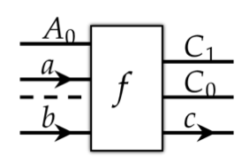
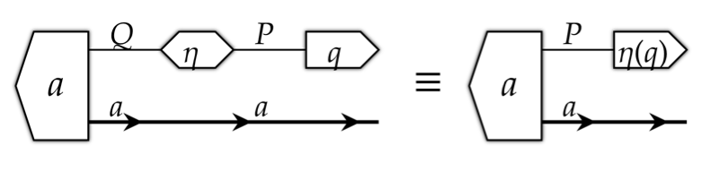
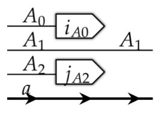
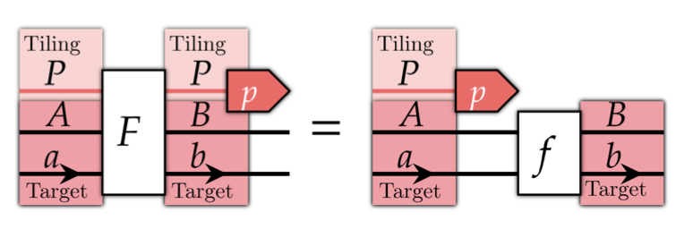
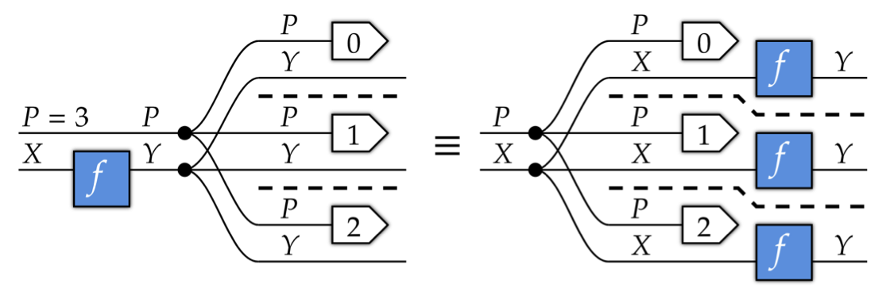

# Weaves, Wires, and Morphisms: Overview

Abbott & Zardini (MIT LIDS), arXiv:2604.07242v2, April 2026.

---

## Contents

1. [Motivation](#motivation)
2. [Terms and UIDs](#the-term-system)
3. [Product Categories](#the-product-category-framework)
4. [The Stride Category St](#the-axis-stride-category-st)
   - [Objects](#objects-in-st)
   - [Morphisms](#morphisms-in-st)
5. [The Broadcasted Category Br](#the-array-broadcasted-category-br)
   - [Objects](#objects-in-br)
   - [Morphisms](#morphisms-in-br)
   - [Broadcasting and Weaves](#broadcasting)
   - [Lift Operations](#lift-operations)
   - [Autoalignment](#autoalignment)
   - [Operator Fusion](#operator-fusion)
   - [Operators](#concrete-operators)
6. [A Contravariant Functor Connecting St and Br](#a-contravariant-functor-connecting-st-and-br)
7. [End-to-End Example: Transformer](#end-to-end-example-transformer)
8. [Math-to-Python Reference](#math-to-python-reference)
9. [Code Examples](#code-examples)
10. [Further Reading](#further-reading)

---

## Motivation

PyTorch's broadcasting semantics, inherited from NumPy, are informal and difficult to reason about mathematically. This paper provides a categorical framework in which deep learning models are **algebraic terms** — formal expressions built from a small set of construction rules. The same term simultaneously supports:

- **Executable compilation** to PyTorch (via pyncd) or other targets
- **Diagrammatic rendering** as Neural Circuit Diagrams (via tsncd)
- **Algebraic manipulation** using category-theoretic rewriting

Broadcasting — running an operation in parallel over additional axes — is formalized as a categorical construction expressible in terms of two product categories, the axis-stride category **St** and the array-broadcasted category **Br**. We start from product categories rather than **Vect** as we need to decompose arrays into their constituent axes.

---

## The Term System

**Paper:** Section 2 — **Python:** [data_structure/Term.py](../data_structure/Term.py)

A term language provides a representational interface to the categorical ingredients (entities). Every object in this language is a **term**, and terms are constructed compositionally from simpler terms.

Mathematical entities are distinct from the terms used to represent them so that the same underlying entity can be expressed as notation, a diagram, or code.

### Mathematical Encoding

$\Gamma$ is a set of **mathematical entities**. These entities are objects, morphisms, or products of either. $\Gamma$ has a family of $k$-indexed **core properties** $\pi_k : \Gamma_{k,i} \to \Gamma_{k,f}$, the basic structure maps that define what entities can refer to. These include $k = \text{dom}$, $k = \text{cod}$, $k = \text{composition}$, $k = {\otimes}$ (monoidal product), etc.

A **constructed term system** is the representation layer: a set $G$ of terms and an **interpretation function** $V_G : G \to \Gamma$ that says which mathematical entity each term denotes (we also have $V_G^{-1} :\Gamma \to G$). For each core property $\pi_k$, the term system provides an internal counterpart $p_k : G_{k,i} \to G_{k,f}$ such that evaluating inside the term system agrees with evaluating in $\Gamma$ after interpretation (soundness).

Terms are of two kinds:

- **Root terms** $G_r$ — the atoms of the term system. A root term is not assembled from smaller recoverable inputs; instead it carries **metadata** tags from which all relevant core properties can be computed directly. Root terms represent primitive, irreducible concepts — the specific choices of lone objects and root morphisms that distinguish one product category from another. In pyncd, `Axis` (carrying a UID and a size), `StrideMorphism` (carrying domain and coefficient matrix), and `Broadcasted` (carrying operator, weaves, and reindexings) are all root terms.

- **Construction rules** $T_c : G_{c,i} \to G_{c,f}$ build terms from smaller pieces. The output term is a **data wrapper around its inputs**: $G_{c,f}$ literally embeds $G_{c,i}$ inside itself, which is what the paper calls *contravariant* — the output contains the input rather than being derived from it. This guarantees a **recovery function** $\hat{T}_c : \text{img}(T_c) \to G_{c,i}$ satisfying $\hat{T}_c \circ T_c = \text{Id}$: the inputs can always be unwrapped from the output. In pyncd, `Composed`, `ProductOfMorphisms`, `Rearrangement`, and `Block` are construction rules common to every product category.

A **UTerm** (uniquely-identified term) is a term that carries a **UID** — a randomly-generated integer identifier — as one of its fields. The UID is the term's identity: two UTerms with the same UID are treated as the same entity everywhere in an expression, regardless of other field values. Plain `Term`s have no UID because their identity is fully determined by their contents. UTerms include `Axis`, `BlockTag`, and `FreeNumeric` — things whose identity must be tracked independently of their current field values.

**Placeholder terms** are partially-instantiated terms with open slots represented by UIDs. A UID acts as a free variable in an expression: imposing $\text{uid}_a = \text{uid}_b$ unifies the two slots and propagates the substitution through the term. This is the mechanism behind autoalignment: two terms composed via `@` have their boundary axes unified by merging UIDs.

Terms are represent in pyncd as follows:

| Math concept | Python class | Notes |
| --- | --- | --- |
| Construction rule / term | `Term` | Frozen `@dataclass`; reconstructable from fields |
| UTerm (term with identity) | `UTerm` | Adds `uid: UID[Self]` field |
| Unique identifier | `UID[T]` | class for UIDs containing unique id + optional name (for readability); `T` is the `UTerm` subclass being identified (e.g. `UID[Axis]`), stored as `_type: Type[T]` |
| Immutable sequence $\Pi_i T$ | `Prod[T]` | Type alias for `tuple[T, ...]`; `T` is a static type annotation only, with no runtime representation |
| Equality / axis alignment | `EqualityClass`, `Context` | Merges UIDs to declare axes equal |

A `Context` is a collection of UID equality declarations. When two axes are identified as the same (e.g. during `@` composition), their UIDs are declared equal and grouped into an `EqualityClass` — a set of UIDs sharing one canonical representative. If a later declaration overlaps an existing class, the two classes are merged. Once all equalities are accumulated, `apply(expr)` walks the expression tree and rewrites every UID in each class to the canonical one, so every occurrence of "the same axis" carries an identical UID regardless of where it originated. In short, `Context` is a union-find structure over UIDs: feed it equality pairs, merge overlapping groups, then call `apply()` to make the equalities concrete throughout the tree.

---

## The Product Category Framework

**Paper:** Section 3 — **Python:** [data_structure/ProductCategory.py](../data_structure/ProductCategory.py)

A **product category** is a monoidal category whose monoidal product is the categorical product (which therefore has projection morphisms into elements of the product). Both $\mathbf{St}$ and $\mathbf{Br}$ are product categories: their objects are (possibly empty) tuples of lone objects, and the monoidal product is tuple concatenation. The construction rules, $\mathbf{Composed}$, $\mathbf{ProductOfMorphisms}$, $\mathbf{Rearrangement}$, $\mathbf{Block}$, are generic across any product category so that a single parametric framework covers both.

$\mathbf{Prod}[L, M]$ denotes the product category (objects, morphisms, and categorical axioms). In Python this is split across two types: `ProdObject[L]` for objects and `ProdCategory[L, M]` for morphisms. Every morphism carries explicit `dom: ProdObject[L]` and `cod: ProdObject[L]` fields, so the same `L` parameter determines both what lone objects are and what the endpoints of morphisms look like. (`Prod[T]` is unrelated, it is simply a type alias for `tuple[T, ...]` used as a generic sequence type inside `ProdObject` and elsewhere)

The type parameters $L$ and $M$ are filled in differently for each concrete category. $L$ is always a UTerm  (it needs a UID for alignment) and is the smallest irreducible unit of the domain:

| Category | $L$ (lone object) | $M$ (root morphism) |
| --- | --- | --- |
| $\mathbf{St}$ | `Axis` — a named axis with a UID and size $\in\mathbb{N}$ (axis $i$ is often denoted as $A_i$) | `StrideMorphism` |
| $\mathbf{Br}$ | `Array` — a pair $[a, A]$ of a `Datatype` $a$ ($\mathbb{N}$, $\mathbb{R}$, or $\mathbb{N}_n$, i.e. 1..$n$, in pyncd) and a shape $A \in \text{Ob}(\mathbf{St})$ | `Broadcasted` |

An object in $\mathbf{St}$ is thus a tuple of axes; an object in $\mathbf{Br}$ is a tuple of typed arrays, each indexed by one axis.

### Objects in ProdCategory

**Objects** $A \in \text{Ob}(\mathcal{C})$ are finite products of lone objects $A_i \in L$:

$$A = \Pi_{i \in I} A_i$$

The **unit object** is the empty product $\mathbf{1} = \Pi_{i \in \emptyset} A_i$. The identity morphism on any object is a `Rearrangement` with mapping $(0, 1, 2, \ldots)$.

A Python `ProdObject[L]` object is a thin wrapper whose sole field, `content: Prod[L]`, stores a tuple of lone objects. The sequence $A_1, A_2, \ldots, A_n \in L$ constitutes the product $A = A_1 \times A_2 \times \cdots \times A_n$. The wrapper exists so that an empty tuple is a valid object (the unit $\mathbf{1}$) and so that the type system can distinguish a product object from a bare tuple. For example, in $\mathbf{St}$ a `ProdObject[Axis]` representing $(\mathtt{batch}, \mathtt{seq}, \mathtt{dim})$ holds `content = (batch_axis, seq_axis, dim_axis)` where each entry is an `Axis` instance.

### Morphisms in ProdCategory

The Python type alias for morphisms captures the grammar
of morphism forms:

```python
type ProdCategory[L, M: Morphism] = (
 M
 | Rearrangement[L]
 | Composed[L, ProdCategory[L, M]]
 | ProductOfMorphisms[L, ProdCategory[L, M]]
 | Block[L, ProdCategory[L, M]]
)
```

The first two are the core primitives; the remaining three are structural.

**1. Root morphisms** $m \in M$ — the category-specific primitive operations. Abstract in `ProductCategory`; concretely `StrideMorphism` in **St** and `Broadcasted` in **Br**.

**2. Rearrangements** — given a domain $A = \Pi_{i \in I} A_i$ and a mapping $\mu : J \to I$, a rearrangement $[\mu]_{(A_i)_{i \in I}} : \Pi_{i \in I} A_i \to \Pi_{j \in J} A_{\mu(j)}$ selects the $\mu(j)$-th input as its $j$-th output. Defining $\text{count}[\mu](i) = \#\{j \in J |\mu(j) = i\}$
deletion of input $i$ is expressed by having $\text{count}[\mu](i)=0$ and copying by having $\text{count}[\mu](i)>1$.

- **Python:** `Rearrangement[L]` with `mapping: Prod[int]` and `_dom: Prod[L]`.

**3. Sequential composition** — a tuple of morphisms $f_1, f_2, \ldots, f_n$ applied left-to-right (diagrammatic order). $\text{dom}()$ is the domain of the first; $\text{cod}()$ is the codomain of the last.

- **Python:** `Composed[L, M]` with `content: Prod[M]`.

**4. Parallel product** — morphisms $f_1 \otimes f_2 \otimes \cdots \otimes f_n$ applied simultaneously on disjoint sub-products. $\text{dom}()$ and $\text{cod}()$ are the concatenations of the individual domains and codomains. Satisfies **bifunctoriality**: $(f ; g) \otimes (h ; k) \equiv (f \otimes h) ; (g \otimes k)$.

- **Python:** `ProductOfMorphisms[L, M]` with `content: Prod[M]`.

**5. Block** — a morphism decorated with display metadata (`title`, `fill_color`) and a `repetition` count (e.g., $\times 6$ for a stacked transformer layer). Transparent to the categorical semantics; passes $\text{dom}()$ and $\text{cod}()$ through from the body.

- **Python:** `Block[L, M]` with `body: M` and `block_tag: BlockTag`.

After describing one more ingredient for the **product categories** we're interested in we turn to specific instantiations.

### Elemental Categories

**Paper:** Definition 6

A product category is **elemental** if each object $X$ has a distinguished set of **elements** $\text{El}(X) \subseteq \mathcal{C}(\mathbf{1}, X)$ — morphisms from the unit object (which is terminal in a Cartesian category) — rich enough to uniquely determine morphisms: if $x \mathbin{;} f = x \mathbin{;} g$ for all $x \in \text{El}(X)$, then $f = g$. Elements of a product are tuples of elements of the factors:

$$\text{El}(\Pi_{i \in I} A_i) = \{ \Pi_{i \in I} a_i \mid a_i \in \text{El}(A_i) \}.$$

In particular, $|\text{El}(\Pi_{i \in I} A_i)| = \prod_{i \in I} |\text{El}(A_i)|$, and $|\text{El}(\mathbf{1})| = 1$.

Both **St** and **Br** are elemental categories. Elements are diagrammed as left-pointing pentagons and notated inline as $\langle x | : \mathbf{1} \to X$. The co-versions are right-pointing pentagons and notated inline as $| x \rangle :  X \to \mathbf{1}$.

---

## The Axis-Stride Category **St**

**Paper:** Definition 8 — **Python:** [data_structure/StrideCategory.py](../data_structure/StrideCategory.py)

**St** is an elemental Cartesian product category (Cartesian means that the categorical product corresponds to the usual Cartesian product in **Set**). Its role is to describe array *shapes* and the *coordinate transforms* between them, independently of any array data.

### Objects in St

**Objects** in **St** are **axes** and products of axes:

- A lone object is an **axis** $A$; a UTerm carrying a UID and a size $|A| \in \mathbb{N}$. The UID serves as the axis's identity across an expression; the size is itself a `FreeNumeric` (another UTerm indicating an indeterminate size) until configured.
- A product object $\Pi_{i \in I} A_i \in \text{Ob}(\mathbf{St})$ is a **shape** — the ordered set of multi-index coordinates $(a_i)_{i \in I}$ of an array. $I$ is the ordered index set of an array's axes, so $i \in I$ ranges over axis positions.
- The unit object $\mathbf{1}$ is the empty product, corresponding to a scalar shape.

In Python, `Axis` is the abstract base (`UTerm`); `RawAxis` is the concrete subclass used for unspecialized axes. `Axis.named('h')` creates an axis whose UID carries the name $h$ and whose size is a free numeric also named $|h|$.

In summary, **St** objects represent axes index sets of a given shape. Each index can be represented as a vector of length $I$ whose elements are integer-valued.

### Morphisms in St

**Morphisms** in **St** are **finite linear transforms**: maps $\eta : \Pi_{i \in I} A_i \to \Pi_{j \in J} B_j$ that describe how input coordinates relate to output coordinates. Each output coordinate $j$ is a linear combination of input coordinates:

$$(\Pi_{i \in I} a_i) ; \eta = \Pi_{j \in J}(\sum_{i \in I} \Lambda^\eta_{ij} \cdot a_i)$$

where $\Lambda^\eta \in \mathbb{N}^{I \times J}$ is the coefficient matrix (keep in mind the notation for elements: $(\Pi_{i \in I} a_i)$ represents a morphism $\mathbf{1}\to \Pi_{i \in I} A_i$ denoted $\langle \Pi_{i\in I} a_i |$). A rearrangement $\eta$ has $\Lambda^\eta_{i,j} = 1$ iff $\mu(j)=i$. The identity morphism of object $\Pi_{i \in I} A_i$ has $\Lambda^\eta$ equal to the identity matrix.

In Python, `StrideMorphism` stores `_dom: Prod[Axis]` and `_cod_stride: Prod[tuple[Axis, Prod[Numeric]]]`. `_cod_stride` bundles the codomain axes and the coefficient matrix into a single field: each entry is a pair of one codomain axis and a tuple of coefficients — one per domain axis — forming one column of $\Lambda^\eta$. Keeping them paired ensures the two are always in lockstep. `cod()` recovers the codomain by stripping the coefficients: `ProdObject.from_iter(axis for axis, _ in self._cod_stride)`. An optional `name` field carries display metadata. For example, the convolution-shift $x = x' + w$ is

```python
StrideMorphism.from_matrix(
 (1, 1), 
 dom_names=("x'", "w"),
 cod_names=("x",),
 name="+"
).
```

Similarly, duplication $\eta(p) = (p, p)$ (mapping one input axis to two output axes both equal) uses two rows each with a single coefficient of 1:

```python
StrideMorphism.from_matrix(
 (1,), # first output = 1·p
 (1,), # second output = 1·p
 dom_names=("p",),
 cod_names=("p", "p")
)
```

The identity, permutation, duplication, and deletion ($\eta = ()$) are all special cases of linear transforms and appear as `Rearrangement` morphisms in **St**.

In summary, **St** morphisms represent linear transformations between the index vectors of the domain and codomain. In addition to copy and deletion of axes these linear transformation allow for arithmetic to be performed as indices are transformed. Convolution (where filters are slid over a two dimensional array) is one example of where this arithmetic structure is used. Another example is the one dimensional representation of arrays in computer memory. Slices of the array are recovered as loops of different stride through the one dimensional arrangment.

---

## The Array-Broadcasted Category **Br**

**Paper:** Definitions 9–13 — **Python:** [data_structure/BroadcastedCategory.py](../data_structure/BroadcastedCategory.py), [data_structure/Operators.py](../data_structure/Operators.py)

**Br** is the category of deep learning models. Its objects represent products of arrays (tensors) with each array represented as a collection of axes $A=\{A_i\}_{i \in I}$ (an object/shape in **St**) with an output datatype $a$.

**Br** is a deletion product category, capturing both deterministic (**Set**) and probabilistic (**Stoch**) computation.

In this section we also introduce the diagrammatic conventions (following string diagrams) for representing **Br**.

### Objects in Br

**Objects** in **Br** are **arrays** $[a, A]$:

- $a \in \mathbf{Dt}$ is a **datatype** — the kind of value stored at each coordinate. Common datatypes are `Reals` ($\mathbb{R}$, continuous and differentiable) and `Natural(max_value)` ($\mathbb{N}_{<v}$, discrete values used as token indices in embeddings).
- $A \in \text{Ob}(\mathbf{St})$ is a **shape** — a product of axes that indexes the array's coordinates.
- An array $[a, A]$ has an $\text{El}([a,A])$-family of values $x_{i_A} : \mathbf{1} \to [a,A]$ supplying an output value in $a$ and an index in $A$. An array is therefore a function from index tuples to values. As previously noted, $\text{El}(A)$ is the **set of elements** of the shape $A$ (the set of index tuples). For $A = (a_1, \ldots, a_n)$ with axis sizes $s_1, \ldots, s_n$, this is the Cartesian product $\{0,\ldots,s_1{-}1\} \times \cdots \times \{0,\ldots,s_n{-}1\}$. Categorically, $\text{El}(A)$ is the set of morphisms $\mathbf{1} \to A$ (global elements). 

A product object $\Pi_{i \in I} [a_i, A_i]$ in **Br** is a tuple of arrays — the inputs or outputs of an operation.

In Python, `Array[B, A]` stores `datatype: B` and `_shape: Prod[A]`. `Reals()` and `Natural.template('v')` are the concrete datatypes. Objects are generally not constructed directly; they are computed from morphism `dom()` and `cod()` methods.

In summary, objects of **Br** represent the set of arrays indexed by shape `A` mapping to datatype `B`. The elements of the object representing the array are index tuples paired with an element of the datatype `B` which indicates the array value at that index.

### Morphisms in Br

**Morphisms** in **Br** are **broadcasted operations** $F : \Pi_{i \in I} [a_i, A_i] \to \Pi_{j \in J} [b_j, B_j]$. Diagrammatically, we illustrate an example morphism $f$ taking array inputs $[a, A_0]$ and $[b, \mathbf{1}]$ (a scalar-shaped array with datatype $b$) to produce output $[c, C_0C_1]$ (an array with datatype $c$ and shape $C_0C_1$).  The dashed line on the input side groups $[a, A_0]$ and $[b, \mathbf{1}]$ into an array product (a tuple of inputs), while the output wires $C_1$, $C_0$, and $c$ represent the shape axes and base datatype of the codomain. When the base datatype is $\mathbb{R}$, the datatype (line with arrow) may be omitted

Before describing broadcasting in detail, we note that the bracket notation $[a, \cdot]$ defines a structured relationship between **St** and **Br**: it sends shapes to arrays and sends rearrangements to reindexing morphisms — contravariantly. This is developed in its own section after **Br** is fully defined.

### Broadcasting

**Broadcasting** describes how a base operation is lifted to run in parallel over additional axes. The key property is compositionality: lifting an operation over an additional axis is a systematic transformation, and broadcasts over shared axes compose predictably.

A broadcasted operation separates two concerns: the *base operation* (what computation is performed on a single tile) and the *broadcasting structure* (which axes are looped over and how each input is indexed at each step). The loop domain is called the **degree** $P \in \text{Ob}(\mathbf{St})$. A **tiling axis** is an axis of an input array that is looped over by $P$ rather than operated on directly by the base operation. For each input $i$, a reindexing morphism $\eta_i : P \to Q_i$ in **St** specifies, for each degree coordinate $p \in P$, which coordinate $\eta_i(p) \in Q_i$ to read from that input's tiling axes — selecting the slice the base operation sees at that step. Different inputs can have different tiling shapes $Q_i$: an input with $\eta_i = \text{id}$ is indexed normally across all of $P$, while an input with $\eta_i = ()$ (the constant map to the empty shape) is broadcast across all of $P$ — its single value is reused at every step.

Given a stride morphism $\eta : P \to Q$ in **St** and a base datatype $a$, the **identity reindexing** $[a, \eta] : [a, Q] \to [a, P]$ is a morphism in **Br** whose action on elements $(a_i)_{i \in \text{El}(Q)}$ is:

$$(a_i)_{i \in \text{El}(Q)} ; [a, \eta] = (a_{\eta(p)})_{p \in \text{El}(P)}$$

 In other words, $[a, \eta]$ relabels coordinates without changing any data values — it reads from position $\eta(p)$ of the input for each output position $p$. Diagramatically, reindexing is represented with a hexagon. This is the categorical counterpart of array indexing: a stride morphism $\eta$ in **St** lifts to a pure reindexing in **Br**.  When $\eta$ is an element $\langle q | : \mathbf{1} \to Q$ (a single coordinate), $[a, q]$ recovers the **index** morphism $[a, q] : [a, Q] \to [a, \mathbf{1}]$, selecting a single slice. As an example the figure corresponds to a slice `X[i,:,j]`.

**Batch lifting** Given a morphism $f : X \to Y$ in **Br** and a shape $P \in \text{Ob}(\mathbf{St})$, the batch lift $[f, P] : [X, P] \to [Y, P]$ runs $f$ independently once for each coordinate in $P$ (where $[X, P]$ and $[Y, P]$ are the inputs and outputs of $f$ each extended by the extra batch shape $P$ — concretely, every array in $X$ (resp. $Y$) gains $P$ as an additional set of axes). The defining property is:

$$[f, P] ; [Y, p] = [X, p] ; f$$

 That is: applying the batch-lifted operation and then slicing the output at index $|p\rangle$ gives the same result as slicing the input at $|p\rangle$ first and then applying $f$ directly. There is no interaction between different positions in $P$ — the batch lift is exactly $f$ run independently at each index, and this equation is the formal statement that slicing commutes with $f$ and diagrammed as shown for $X=[a,A]$, $Y=[b,B]$, and $F=[f,P]$.

**Definition 11** formalizes batch lifting using the **copy remapping** $\delta^P : P \to \mathbf{1}$, the unique morphism in **St** that deletes all axes of $P$ (the stride morphism with empty codomain). Applied to $[Y, P]$ in **Br**, the rearrangement $[\delta^P]_{[Y,P]}$ produces one copy of $[Y, P]$ for each coordinate $p \in \text{El}(P)$ — the product structure turns the single deletion into $|\text{El}(P)|$ independent copies. The formal statement is:
$$[f, P] ; [\delta^P]_{[Y,P]} ; \prod_{p \in \text{El}(P)} [Y, p] = [\delta^P]_{[X,P]} ; \left(\prod_{p \in \text{El}(P)} [X, p] ; f\right)$$
This is most easily understood with the following diagramatic example where

$P$ is a single axis of size 3. We see how $f$ is commuted through the copy operation creating 3 independent copies (executed on separate GPU cores).

To describe a general broadcasted operation we specify, for each input axis, whether it is a **tiling axis** (looped over by the degree $P$) or a **target axis** (operated on directly by the base operation). A **weave** is a Boolean vector $(w_i)_{i \in I}$ that makes this assignment: $w_i = 1$ marks axis $i$ as a target axis; $w_i = 0$ marks it as a tiling axis. An associated permutation $\Omega_w$ reorganises the axes so that all tiling axes appear first and all target axes second.

A broadcasted operation is built from four ingredients (Definition 13):

1. **A base operation** — the core computation, provided as an `Operator` subclass (e.g., `Linear`, `Einops`, `SoftMax`, `Elementwise`, `Normalize`, `Embedding`, `AdditionOp`, `WeightedTriangularLower`).

2. **Reindexings** $(\eta_i)_{i \in I}$ from **St** — the base operation runs once per coordinate $p \in P$, where $P \in \text{Ob}(\mathbf{St})$ is the *degree* shape (the same loop domain for every input, equal to `reindexings[i].dom()` for all $i$). For `Einops`, $P$ equals the retained (output) index space of the signature — all output indices become degree axes, with contracted indices as the only target axes in the input weaves. For `Elementwise`, $P$ equals the full array shape with all positions TILED. For `Linear`, `SoftMax`, `Embedding`, `Normalize`, `AdditionOp`, and `WeightedTriangularLower`, $P$ is empty and all input/output axes are target positions in the weaves. (The examples below show $P$ as a batch dimension for illustrative clarity; calling `Einops.template()` with a full batched signature, e.g. `'b i k, b k j -> b i j'`, produces $P = (b,i,j)$.) The reindexing $\eta_i : P \to Q_i$ is a linear transform that says, for each loop coordinate $p$, which coordinate $\eta_i(p) \in Q_i$ to read from input $i$'s tiling axes. All inputs share the same loop $P$; the reindexings let them access their data differently:

   | Case | Tensor equation | $P$ | $\eta$ |
   | --- | --- | --- | --- |
   | **Identity** — both inputs batched the same way | $C[b,i,j] = A[b,i,k] B[b,k,j]$ | $(b)$ | $\eta_A = \eta_B = \text{id}$ |
   | **Deletion** — $B$ broadcast across batches | $C[b,i,j] = A[b,i,k] B[k,j]$ | $(b)$ | $\eta_A = \text{id}$ <br> $\eta_B = ()$ |
   | **Duplication** — diagonal slice | $Y[p,j] = X[p,p,j]$ | $(p)$ | $\eta_X(p) = (p,p)$ |
   | **Projection** — outer product, each input indexed by one output axis | $C[i,j] = A[i] B[j]$ | $(i,j)$ | $\eta_A(i,j) = i$ <br> $\eta_B(i,j) = j$ |
   | **Affine scaling** — strided 1-D convolution; $s \in \mathbb{N}$ is a fixed stride constant baked into the `StrideMorphism` coefficient matrix, not an axis | $Y[b,p] = \sum_w X[b, s{\cdot}p+w] W[w]$ | $(b,p)$ | $\eta_X(b,p) = (b, s{\cdot}p)$ <br> $\eta_W = ()$ |

   In Python, the tuple of reindexings is stored as the `reindexings: Prod[StrideCategory[A]]` field on the `Broadcasted` dataclass — the root morphism of **Br** that packages all four ingredients together. On a GPU, the loop $P$ is what gets tiled: each processor is assigned a small chunk of $P$'s coordinates, loads only the corresponding slice of each input, and works entirely in fast on-chip memory.

3. **Input weaves** $(w_i)_{i \in I}$ — for each input array, a **weave** partitions its axes into *target* axes (operated on by the base operation) and *tiling* axes (the broadcasted batch dimensions, looped over by $P$). For each $p \in P$ the reindexing $\eta_i(p)$ supplies the concrete tiling coordinates, selecting the slice of input $i$ that the base operation sees at that iteration. Different inputs can have different tiling shapes $Q_i$ — connected to the shared loop $P$ through possibly non-trivial reindexings — which is what allows one input to be broadcast across all of $P$ while another is indexed into normally. See [Weaves](#weaves) below.

4. **Output weaves** $(t_j)_{j \in J}$ — same structure for outputs. The degree loop $P$ also drives the outputs: for each $p \in P$ the base operation produces one output tile, which is written into the output array at tiling position $p$. Unlike inputs (which can each have a distinct tiling shape $Q_i$ via the reindexings), every output tiles over exactly $P$, so the canonical split is $B_j \otimes P$ rather than $B_j \otimes Q_i$. The output weave $t_j$ records where in the output array's memory layout the $P$ positions sit relative to the target axes $B_j$.

#### Weaves

**Motivation.** GPUs achieve efficiency by splitting an operation's work across many parallel cores, each with a small fast on-chip memory (SMEM) and access to slow global DRAM. The key strategy is *tiling*: partition a large axis into small tiles, assign one tile per core, and have each core load only its tile from DRAM and run the base operation entirely in SMEM. For this to work, every axis of every array must be classified as one of two kinds:

- A **tiling axis** is distributed across cores. Each core is responsible for one tile of coordinates along this axis and loads only that slice from DRAM. It is never seen by the base operation directly; the reindexing $\eta_i$ tells each core which slice to load.
- A **target axis** is loaded fully into a single core's SMEM and operated on directly by the base operation. Its total size must fit within the core's memory budget.

FlashAttention (Abbott & Zardini, 2025, §3.2) computes
$$O[b,h,q,d] = \sum_x \text{SoftMax}_x(\sum_k Q[b,h,q,k]  K[h,x,k]) V[h,x,d]$$
where $Q[b,h,q,k]$, $K[h,x,k]$, and $V[h,x,d]$ are the query, key, and value tensors: $b$ is the batch axis, $h$ indexes attention heads, $q$ and $x$ index query and key/value positions respectively, and $k$, $d$ are the head dimensions. The query axis $q$ is tiled across GPU cores — each core processes a $g_q$-sized block of query positions in SMEM — while the head dimensions $k$ and $d$ are target axes loaded fully per core. Streaming the key/value position axis $x$ through in tiles avoids materialising the full $q \times x$ attention score matrix in DRAM, achieving a ×6 throughput gain over standard PyTorch. A **weave** records this classification axis-by-axis for every array so the compiler can determine, for each tile of $P$, which slice of each array to load.

Formally (Definition 12), a **weave** is a boolean family $(w_i)_{i \in I}$ indexed by the axes of an array: $w_i = 1$ marks a **target** axis; $w_i = 0$ marks a **tiling** axis. From this family the paper derives a permutation $\Omega_w : I \to I$ with the **canonical** split form (all target axes first, then all tiling axes) as its **domain**, mapping to the actual **interleaved** axis order of the array. The inverse permutation $\Omega_w^{-1}$ maps from the interleaved order to canonical form (needed to recover the target/tiling partition from an array's memory layout).

In pyncd the boolean family is encoded directly in the weave's `_shape` field: a sequence — one entry per axis of array $i$ — where each entry is either:

- A concrete **`Axis` object** — a **target axis**. The base operation acts on this axis directly: it may contract over it (like the $k$ dimension in a dot product), pass it through as a free index, or produce it as output. The base operation sees exactly the sub-array formed by all target axes.
- **`WeaveMode.TILED`** — a **tiling axis**. This axis is not seen by the base operation at all. It is provided externally by the reindexing loop: at each degree coordinate $p \in P$, the reindexing $\eta_i(p)$ supplies the concrete index values for every `TILED` slot in the weave.

**Simple example — `Linear` applied row-wise:** $Y[b, s, j] = \sum_i X[b, s, i]  W[i, j]$, base op `'i -> j'`, $P = (b, s)$.

| Array | Shape | Weave `_shape` | Axis roles |
| --- | --- | --- | --- |
| $X[b,s,i]$ | $(b, s, i)$ | `(TILED, TILED, i)` | $b,s$ tiling — looped by $P$; $i$ target — contracted |
| $W[i,j]$ | $(i, j)$ | `(i, j)` | all target — no tiling axes, same $W$ for all $(b,s)$ |
| $Y[b,s,j]$ | $(b, s, j)$ | `(TILED, TILED, j)` | $b,s$ tiling — filled from $P$; $j$ target — produced by Linear |

$j$ is a target axis on the output side because it is produced by the base op, not by the broadcast loop.

**Complex example — multi-head attention with broadcast K and V:** The full attention computation (ignoring softmax and mask) runs in two broadcasted operations sharing degree $P = (b)$.

**Step 1 — QK score:** $S[b, h, q, x] = \sum_k Q[b, h, q, k]  K[h, x, k]$, base op `'h q k, h x k -> h q x'`.

| Array | Shape | Weave `_shape` | Axis roles |
| --- | --- | --- | --- |
| $Q[b,h,q,k]$ | $(b,h,q,k)$ | `(TILED, h, q, k)` | $b$ tiling — looped by $P$, reindexed by identity; $h,q$ target free; $k$ target contracted |
| $K[h,x,k]$ | $(h,x,k)$ | `(h, x, k)` | all target — no tiling axes, same $K$ reused for every $b$ |
| $S[b,h,q,x]$ | $(b,h,q,x)$ | `(TILED, h, q, x)` | $b$ tiling — filled from $P$; $h,q,x$ target — produced by Einops |

**Step 2 — value aggregation:** $O[b, h, q, d] = \sum_x S[b, h, q, x]  V[h, x, d]$, base op `'h q x, h x d -> h q d'`.

| Array | Shape | Weave `_shape` | Axis roles |
| --- | --- | --- | --- |
| $S[b,h,q,x]$ | $(b,h,q,x)$ | `(TILED, h, q, x)` | $b$ tiling — looped by $P$, reindexed by identity; $h,q$ target free; $x$ target contracted |
| $V[h,x,d]$ | $(h,x,d)$ | `(h, x, d)` | all target — no tiling axes, same $V$ reused for every $b$ |
| $O[b,h,q,d]$ | $(b,h,q,d)$ | `(TILED, h, q, d)` | $b$ tiling — filled from $P$; $h,q,d$ target — produced by Einops |

The single `TILED` entry at position 0 of $Q$'s (and $S$'s) weave means: "the first axis in memory is a batch axis — supply its index from the reindexing loop, not from the base op." $K$ and $V$ have no `TILED` entries: both are shared across all batch coordinates, loaded once per core into SMEM. The contraction axis $k$ (step 1) and $x$ (step 2) appear in input weaves but not in the output weave — they are consumed by the base op.

In Python, `Weave[B, A]` stores `datatype: B` and `_shape: Prod[A | WeaveMode]`. `WeaveMode` is a single-member enum (`WeaveMode.TILED`) used as a typed sentinel: the union `A | WeaveMode` means each position in `_shape` holds either a concrete `Axis` object (target) or the `TILED` placeholder (tiling).

The full type of the broadcasted operation is:

$$F : \Pi_{i \in I}[a_i,  \text{dom}([\Omega_{w_i}]_{A_i \otimes Q_i})]
\longrightarrow
\Pi_{j \in J}[b_j,  \text{dom}([\Omega_{t_j}]_{B_j \otimes P})]$$

Here $\Omega_{w_i}$ is the unweave rearrangement in **St** associated with input weave $w_i$. The subscript $A_i \otimes Q_i$ follows the standard rearrangement notation $[\mu]_{(A_i)_{i \in I}}$, where the subscript specifies the **domain** objects. The domain of $[\Omega_{w_i}]_{A_i \otimes Q_i}$ is therefore the **canonical** split form $A_i \otimes Q_i$ (all target axes $A_i$ first, then all tiling axes $Q_i$); the permutation $\Omega_{w_i}$ maps it to the actual **interleaved** axis order of the array. The $\text{dom}(\cdot)$ in the formula extracts $A_i \otimes Q_i$ as the canonical shape of input $i$. The output side is analogous: $\Omega_{t_j}$ maps from the canonical split form $B_j \otimes P$ to the interleaved output shape.

**Relation to covariant and contravariant indices.** The input/output weave structure is the pyncd analogue of the covariant/contravariant index distinction in classical tensor analysis. A target axis appearing in an **input weave** is being *consumed* by the operator — it plays the role of a contravariant (upper) index that is contracted against a matching lower index. A target axis appearing in an **output weave** is being *produced* — it plays the role of a covariant (lower) index. Composition enforces the matching rule: `Context.append_iter` unifies the output (covariant) axes of one morphism with the input (contravariant) axes of the next, exactly as classical contraction requires one upper and one lower index. The degree axes — `TILED` positions shared across both input and output weaves — correspond to the free indices that appear on both sides of a tensor equation and are neither contracted nor produced.

In Python:

```python
@dataclass(frozen=True)
class Broadcasted[B: Datatype, A: Axis, O: Operator](Morphism[Array[B, A]]):
 operator: O
 input_weaves: Prod[Weave[B, A]]
 output_weaves: Prod[Weave[B, A]]
 reindexings: Prod[StrideCategory[A]]
```

`dom()` is computed from input weaves and reindexing codomains; `cod()` from output weaves and the shared degree $P$ (= `reindexings[i].dom()`, equal for all $i$).

### Key special cases

| Operation | How it appears in **Br** |
| --- | --- |
| Row-wise (batch) operation | Reindexing is identity; tiling axis = batch axis |
| Transposition | `Rearrangement` with swapped mapping |
| Diagonalization $\mathbf{y}[p,:] = \mathbf{x}[p,p,:]$ | Reindexing $\eta(p) = (p, p)$ |
| Repetition $\mathbf{y}[p,:] = \mathbf{x}[:]$ | Reindexing $\eta = ()$ (deletion) |
| Einsum contraction | `Einops` operator with matching weaves |
| Linear layer | `Linear` operator; target axes = input/output axes |
| Convolution | `StrideMorphism` shift $(x' + w)$ composed with `Linear` |

### Lift Operations

**Paper:** Definitions 10–11, pp. 12–13 — **Python:** [construction_helpers/lift.py](../construction_helpers/lift.py)

Operations in **Br** are defined at a fixed shape, but in practice the same operation must run at many shapes: a linear layer over one token must extend to a sequence, then to a batch, then across heads. A **lift** performs this axis extension without changing what the operation computes on any individual input — and does so compositionally, distributing over sequential composition and parallel products so that lifting twice equals lifting once by the combined shape.

A lift extends an object or morphism in **Br** by a shape or morphism from **St**, adding new axes to an existing expression in a principled way. The four lifts correspond to the four combinations of what is being extended and what it is extended by:

| | Extended by $P \in \text{Ob}(\mathbf{St})$ | Extended by $\eta : P \to Q \in \text{Hom}(\mathbf{St})$ |
|---|---|---|
| Array product $X \in \text{Ob}(\mathbf{Br})$ | Object-object lift $[X, P]$ | Object-morphism lift $[X, \eta]$ |
| Morphism $f \in \text{Hom}(\mathbf{Br})$ | Batch lift $[f, P]$ (Def 11) | Broadcasted-stride lift |

These are not independent. The batch lift maps between object lifts: $[f, P] : [X, P] \to [Y, P]$.

#### Object-Object Lift $[X, P]$

For an array product $X = \Pi_{i \in I}[a_i, A_i] \in \text{Ob}(\mathbf{Br})$ and a shape $P \in \text{Ob}(\mathbf{St})$:

$$[X, P] = \Pi_{i \in I}[a_i,\, A_i \otimes P]$$

The lift prepends the axes of $P$ to each array's shape. It is a purely object-level construction — no morphism is produced. Its primary role is to name the domain and codomain that the batch lift $[f, P]$ maps between.

#### Object-Morphism Lift $[X, \eta]$ (Def 10)

Defs 9 and 10 together make $[a, \cdot]$ a contravariant functor $\mathbf{St} \to \mathbf{Br}$: it sends **St** objects $A$ to **Br** objects $[a, A]$ (arrays), and **St** morphisms $\eta : P \to Q$ to **Br** morphisms $[a, \eta] : [a, Q] \to [a, P]$ (reindexings), reversing the direction. Functoriality — $[a, \text{id}_A] = \text{id}_{[a,A]}$ and $[a, \eta \mathbin{;} \mu] = [a, \mu] \mathbin{;} [a, \eta]$ — follows directly from the element-action equation in Def 10. The object-morphism lift uses the morphism half of this functor.

For an array product $X = \Pi_{i \in I}[a_i, A_i] \in \text{Ob}(\mathbf{Br})$ and a stride morphism $\eta : P \to Q \in \text{Hom}(\mathbf{St})$:

$$[X, \eta] = \Pi_{i \in I}[a_i,\, \text{id}_{A_i} \otimes \eta], \qquad [X, \eta] : [X, Q] \to [X, P]$$

Here $\text{id}_{A_i} \otimes \eta : A_i \otimes P \to A_i \otimes Q$ is a **St** morphism, so each bracket $[a_i, \text{id}_{A_i} \otimes \eta]$ is a **Br** morphism (reindexing) $[a_i, A_i \otimes Q] \to [a_i, A_i \otimes P]$. It leaves the $A_i$ coordinates unchanged and pulls back along $\eta$ in the $P$/$Q$ coordinates:

$$(a_{k,\,\ell})_{k \in \text{El}(A_i),\,\ell \in \text{El}(Q)} \mathbin{;} [a_i, \text{id}_{A_i} \otimes \eta] = (a_{k,\,\eta(p)})_{k \in \text{El}(A_i),\,p \in \text{El}(P)}$$

The lift produces a reindexing morphism in **Br** that permutes coordinates without touching data values. It is **contravariant** in $\eta$: a stride morphism $\eta : P \to Q$ yields a **Br** morphism going $[X, Q] \to [X, P]$, reading from position $\eta(p)$ of the source for each output position $p$.

The special case $\eta = \langle q | : \mathbf{1} \to Q$ (a single element of $Q$) recovers the **index** morphism $[X, q] : [X, Q] \to [X, \mathbf{1}]$, selecting one slice of each array.

#### Batch Lift $[f, P]$ (Def 11)

For a morphism $f : X \to Y$ in **Br** and a shape $P \in \text{Ob}(\mathbf{St})$, the **batch lift** $[f, P] : [X, P] \to [Y, P]$ runs $f$ once independently for each coordinate in $P$. The defining property is:

$$[f, P] \mathbin{;} [Y, q] = [X, q] \mathbin{;} f \qquad \forall\, q : \mathbf{1} \to |P| \tag{Eq. 3}$$

Slicing the output at $q$ after applying $[f, P]$ gives the same result as slicing the input at $q$ first and then applying $f$ directly. The computation at each position $q \in P$ depends only on the $q$-th input slice.

The full structural definition (Def 11) makes the independence of positions explicit via the copy remapping $\delta^P : P \to \mathbf{1}$, the unique morphism in **St** that deletes all axes of $P$:

$$[f, P] \mathbin{;} [\delta^P]_{[Y,P]} \mathbin{;} \prod_{p \in \text{El}(P)} [Y, p] \;=\; [\delta^P]_{[X,P]} \mathbin{;} \left(\prod_{p \in \text{El}(P)} [X, p] \mathbin{;} f\right) \tag{Eq. 2}$$

Eq. 2 shows that $[f, P]$ factors into $|\text{El}(P)|$ independent copies of $f$ — one per degree coordinate — with no data flow between positions. This independence is exactly what makes the batch axis suitable for parallel GPU execution.

The batch lift is defined recursively on the structure of $f$, using the fact that lifting distributes over composition and products: $[f \mathbin{;} g,\, P] = [f, P] \mathbin{;} [g, P]$ and $[f \otimes g,\, P] = [f, P] \otimes [g, P]$. When $f$ is a broadcasted operation (Def 13), lifting reduces to the broadcasted-stride lift below.

#### Broadcasted-Stride Lift

Given a broadcasted operation $F$ (Def 13) with degree $P$ and reindexings $(\eta_i : P \to Q_i)_{i \in I}$, and a stride morphism $\eta : P' \to Q$ in $\text{Hom}(\mathbf{St})$, the broadcasted-stride lift extends $F$'s degree from $P$ to $P' \otimes P$:

- **Reindexings**: each $\eta_i : P \to Q_i$ is replaced by $\eta \otimes \eta_i : P' \otimes P \to Q \otimes Q_i$, prepending $\eta$ so the loop now runs over $P' \otimes P$ and threads the new coordinates through $\eta$.
- **Weaves**: each input and output weave gains $|\text{cod}(\eta)|$ additional tiling entries prepended — one per axis of $Q$ — marking the new axes as tiling axes.

The base operation $f$ is unchanged; the lift only enlarges the loop domain and extends the tiling structure.

### Autoalignment

**Paper:** Section 5.1.1 — **Python:** [construction_helpers/composition.py](../construction_helpers/composition.py)

The `@` operator overloads `Morphism.__matmul__` to compose two morphisms $f; g$ (the left and right operands) with automatic axis alignment. When $\text{cod}(f)$ and $\text{dom}(g)$ differ in the number of axes, identity morphisms are inserted via `morphism_object_lift` to reconcile the mismatch. Once both sides have the same number of axes, a `Context` is built by pairing axes positionally and adding equality classes. Applying the context substitutes canonical UIDs throughout the composed expression, unifying named axes.

For example:

```python
qk_matmul @ softmax @ mask @ sv_matmul
```

At each `@`, the codomain axes of the left term are aligned with the domain axes of the right. Fresh unnamed axes generated by `SoftMax.template()` are renamed by the alignment context to match named axes from adjacent operations.

### Operator Fusion

Autoalignment builds a `Composed([br1, br2])` — two `Broadcasted` nodes in sequence with a materialized intermediate tensor between them. On a GPU, each materialized intermediate is a round-trip to high-bandwidth memory (HBM): the first kernel writes its output to HBM, and the second kernel reads it back before any computation begins. For large models this memory traffic dominates runtime — arithmetic throughput is rarely the bottleneck. **Operator fusion** is the inverse of composition: collapsing a `Composed` into a single `Broadcasted` that computes the same result within a single kernel, keeping the intermediate in on-chip SRAM or registers and never writing it to HBM. FlashAttention is the canonical instance — fusing the QK matmul, softmax, and SV matmul into one tiled kernel reduces attention's HBM traffic from $O(n^2)$ to $O(n)$ in sequence length.

**Example.** Consider two chained einsum morphisms:

```
H[i,j] = W1[i,k] X[k,j]      # br1: degree=(i,j), contracted k
Y[i,m] = W2[j,m] H[i,j]      # br2: degree=(i,m), contracted j
```

The intermediate tensor `H` exists only to feed `br2`. Fusing gives a single morphism:

```
Y[i,m] = W2[j,m] W1[i,k] X[k,j]    # degree=(i,m), contracted j and k
```

`H`'s axes `(i,j)` — which were `br1`'s degree and `br2`'s contracted domain — disappear: `j` becomes a contracted index in the fused equation and `i` is retained in the merged degree. The external inputs `W1`, `W2`, `X` become the inputs of the single fused `Broadcasted`.

**Algebraic justification.** Wenig, Rump, Blacher, and Giesen (2025) §6 prove a denesting theorem for einsum. In their notation, $\#(I \to J;\ T_1, \ldots, T_n)$ denotes the einsum with input index structure $I$ (one index set per tensor), output index structure $J$ (the retained indices), and tensor arguments $T_1, \ldots, T_n$; indices in $I$ but not $J$ are contracted. The nested form

$$\#(J \to L;\ \#(I \to J;\ T_1, \ldots, T_n),\ T_{n+1}, \ldots, T_m)$$

can be rewritten as a flat einsum over all inputs by computing the pushout of the index symbol graphs of the two expressions. The pushout identifies shared index symbols between the inner output and the outer inputs, producing a merged index structure in which the inner output never appears. The outer contracted indices (those in $J$ but not $L$) subsume the inner's degree. This is exactly the fusion step above: $J = (i,j)$, $L = (i,m)$, so $j$ (in $J$ but not $L$) becomes contracted in the flat equation.

In pyncd, the pushout is resolved automatically via UID identity: the axes of `br1`'s output weave are the same `Axis` objects as those in `br2`'s reindexings (autoalignment ensured this). Constructing the fused morphism therefore requires no name-matching — identify which UIDs are shared, take the union of the two `rhs` sets, set `lhs_indices` to the surviving degree, and call `bc_signature()`.

**Conditions for fusion.** Three conditions must hold:

1. **No branching** — the intermediate tensor is consumed only by `br2`. If any other morphism also reads it, materialization cannot be avoided.
2. **Operator compatibility** — `br1`'s operator must compose inline. An `Elementwise` nonlinearity (ReLU, σ) fuses freely, absorbed into the `operator` field of the merged `TensorEquation`. A `SoftMax` or `Normalize` cannot fuse across a contraction boundary: normalization requires the full reduction to complete before any outer loop element can be computed.
3. **Shape coherence** — `cod(br1)` must match `dom(br2)` exactly. This is guaranteed when the two morphisms were composed via `@`, since autoalignment has already unified the boundary UIDs.

No `fuse()` method exists in pyncd today. When implemented, the entry point would be a pass over `Composed` segments: for each pair `(br1, br2)` satisfying the three conditions, construct a merged `TensorEquation` with the union of both `rhs` entries and `lhs_indices` drawn from `br2`'s output, then replace the two-node segment with `bc_signature()` of the merged equation.

### Concrete Operators

**Python:** [data_structure/Operators.py](../data_structure/Operators.py)

Operators are `Operator` subclasses (frozen dataclasses) that implement `template()` to produce a fully-specified `Broadcasted` morphism:

| Operator | Description |
| --- | --- |
| `Einops.template('q h k, x h k -> h q x')` | General einsum; parses signature into weaves and reindexings |
| `Linear.template(input_size, output_size, name)` | Learned linear layer |
| `SoftMax.template()` | Normalization along one target axis |
| `Elementwise.template()` | Elementwise nonlinearity ($\sigma$, ReLU, etc.) |
| `Normalize.template()` | RMSNorm; same shape in and out |
| `Embedding.template(embedding_size)` | Discrete $\to$ real; input datatype is `Natural` |
| `AdditionOp.template()` | Elementwise addition of two arrays of the same shape |
| `WeightedTriangularLower.template()` | Causal mask; used in attention |

---

## A Contravariant Functor Connecting St and Br

The bracket notation is overloaded: for a fixed datatype $a \in \mathbf{Dt}$, it denotes both objects and morphisms of **Br** depending on what occupies its second slot.

- **Objects** (Def 9): $[a,\cdot]$ acting on **St** object $A$ yields the **Br** object $[a, A]$ — an array with datatype $a$ and shape $A$.
- **Morphisms** (Def 10): $[a,\cdot]$ acting on **St** morphism $\eta : P \to Q$ yields the **Br** morphism $[a, \eta] : [a, Q] \to [a, P]$ — a reindexing that pulls values back along $\eta$.

Together these make $[a, \cdot]$ a **contravariant functor** $\mathbf{St}^{\mathrm{op}} \to \mathbf{Br}$. The two functoriality conditions are proved in [functor_proof.md](../functor_proof.md): contravariant composition $[a, \eta \mathbin{;} \mu] = [a, \mu] \mathbin{;} [a, \eta]$ is the primary result, and identity preservation $[a, \text{id}_A] = \text{id}_{[a,A]}$ follows as a corollary. Since $a$ plays no role in either proof (it labels values but is never touched by the index arithmetic), functoriality holds for every $a \in \mathbf{Dt}$, yielding a family $\{[a, \cdot]\}_{a \in \mathbf{Dt}}$. Arrays with mixed datatypes $\Pi_{i \in I} [a_i, A_i]$ are reindexed componentwise, one $[a_i, \eta]$ per factor, via the product structure of **Br**. The family $\{[a, \cdot]\}_{a \in \mathbf{Dt}}$ can be unified into a single bifunctor $[\cdot, \cdot] : \mathbf{Dt} \times \mathbf{St}^{\mathrm{op}} \to \mathbf{Br}$, covariant in the first slot; this is cleanest when $\mathbf{Dt}$ is treated as a discrete category (no non-identity morphisms) so that the datatype slot contributes no additional functoriality obligations.

The contravariancy is the categorical expression of **pullback**: a stride morphism $\eta : P \to Q$ maps coordinates forward ($P \to Q$), so it pulls array values backward ($[a, Q] \to [a, P]$), reading from position $\eta(p)$ in the source for each output position $p \in P$.

---

## End-to-End Example: Transformer

**Python:** [minimum_working_example.py](../minimum_working_example.py)

The transformer is built by composing the operators above:

```python
# Attention core: qk multiply → softmax → mask → sv multiply
qk_matmul = ops.Einops.template('q h k, x h k -> h q x')
softmax = ops.SoftMax.template()
mask = ops.WeightedTriangularLower().template()
sv_matmul = ops.Einops.template('h q x, x h k -> q h k')
_attention_core = Block.template(
 qk_matmul @ softmax @ mask @ sv_matmul,
 title='Attention Core', fill_color='#C5BEDF'
)

# Attention layer: project Q, K, V → attention core → project output
Lq = ops.Linear.template(('m',), 2, 'q') # [x, m] → [x, h, k] (2 output axes)
Lk = ops.Linear.template(('m',), 2, 'k')
Lv = ops.Linear.template(('m',), 2, 'v')
Lo = ops.Linear.template(2, ('m',), 'o') # [h, k] → [m]
_attention_layer = (Lq * Lk * Lv) @ _attention_core @ Lo

# Transformer layer: attention + FFN (feed-forward network: Linear → ReLU → Linear), each with residual + norm, repeated 6 times
_transformer = Block.template(
 res(_attention_layer) @ res(ffn_layer()),
 title='Transformer Layer', repetition=6
)

# Full model: embedding → 6× transformer → aggregator
_transformer_model = embedding @ _transformer @ aggregator
```

Each `*` creates a `ProductOfMorphisms` ($\otimes$, parallel); each `@` creates a `Composed` ($;$, sequential) with autoalignment. The result is a single algebraic term that can be:

- Sent as JSON via WebSocket to the TypeScript renderer (`wst.send_term(...)`)
- Printed as a category diagram (`dpl.print_category(...)`)
- Compiled to a PyTorch module (via `torch_compile/`)

---

## Math-to-Python Reference

| Paper definition | Python class / function | File |
| --- | --- | --- |
| Term (construction rule) | `Term` | `data_structure/Term.py` |
| UTerm (with UID) | `UTerm` | `data_structure/Term.py` |
| Unique identifier | `UID[T]` | `data_structure/Term.py` |
| Named variable | `DynamicName` | `data_structure/Term.py` |
| Immutable sequence $\Pi_i T$ | `Prod[T]` | `data_structure/Term.py` |
| Equality class / alignment | `EqualityClass`, `Context` | `data_structure/Term.py` |
| Product category $\mathbf{Prod}[L,M]$ | `ProdCategory[L, M]` | `data_structure/ProductCategory.py` |
| Product object $\Pi_{i \in I} L_i$ | `ProdObject[L]` | `data_structure/ProductCategory.py` |
| Root morphism $m \in M$ | `Morphism[L]` (abstract) | `data_structure/ProductCategory.py` |
| Sequential composition $;$ | `Composed[L, M]` | `data_structure/ProductCategory.py` |
| Parallel product $\otimes$ | `ProductOfMorphisms[L, M]` | `data_structure/ProductCategory.py` |
| Rearrangement $[\mu]$ | `Rearrangement[L]` | `data_structure/ProductCategory.py` |
| Block $B$ | `Block[L, M]` | `data_structure/ProductCategory.py` |
| Axis $A$ with size $\lvert A \rvert$ (Def 8) | `Axis` / `RawAxis` | `data_structure/StrideCategory.py` |
| Shape $\Pi_{i \in I} A_i$ (Def 8) | `ProdObject[Axis]` | `data_structure/StrideCategory.py` |
| Finite affine transform $\eta$ (Def 8) | `StrideMorphism` | `data_structure/StrideCategory.py` |
| Datatype $a \in \mathbf{Dt}$ (Def 9) | `Datatype`, `Reals`, `Natural` | `data_structure/BroadcastedCategory.py` |
| Array $[a, A]$ (Def 9) | `Array[B, A]` | `data_structure/BroadcastedCategory.py` |
| Weave $w_i \in \{0,1\}$ (Def 12) | `Weave[B, A]`, `WeaveMode` | `data_structure/BroadcastedCategory.py` |
| Broadcasted operation $F$ (Def 13) | `Broadcasted[B, A, O]` | `data_structure/BroadcastedCategory.py` |
| Base operator $f$ | `Operator` subclass | `data_structure/Operators.py` |
| Autoalignment $@$ | `composition`, `align_composed` | `construction_helpers/composition.py` |
| Batch lift $[f, P]$ (Def 11) | Product structure of `Broadcasted` | `data_structure/BroadcastedCategory.py` |
| Reindexing $[a, \eta]$ (Def 10) | `reindexings` field of `Broadcasted` | `data_structure/BroadcastedCategory.py` |

---

## Code Examples

Concrete pyncd code for each mathematical object and construction in the paper. All examples use the actual class APIs.

### Term System (§2)

```python
from data_structure.Term import UTerm, UID, Context, EqualityClass
from data_structure.StrideCategory import RawAxis, StrideMorphism

# UTerm: a term whose identity is its UID, not its field values.
# RawAxis is a UTerm; .named() creates an axis whose UID carries the name.
batch = RawAxis.named('batch')   # uid.name = 'batch'; size = FreeNumeric named '|batch|'
head  = RawAxis.named('h')

# UID: accessed directly
batch.uid          # UID[RawAxis] — randomly-generated integer with name='batch'

# Context: union-find over UIDs. Used to unify axes after @ composition.
# Build a simple stride morphism f; g to demonstrate UID unification.
f = StrideMorphism.from_matrix((1,), dom_names=('p',), cod_names=('q',))
g = StrideMorphism.from_matrix((1,), dom_names=('q',), cod_names=('r',))
composed_term = (f, g)  # illustrative tuple; f.cod() and g.dom() carry matching axes

axis_from_f_cod = list(f.cod())[0]   # RawAxis named 'q' (codomain of f)
axis_from_g_dom = list(g.dom())[0]   # RawAxis named 'q' (domain of g)

ctx = Context()
ctx.append_iter([axis_from_f_cod, axis_from_g_dom])  # declares these two UIDs equal
unified = ctx.apply(composed_term)  # rewrites all UIDs to canonical form throughout

# EqualityClass: one group of unified UIDs with a chosen canonical representative
axis_a = RawAxis.named('a')
axis_b = RawAxis.named('b')
axis_c = RawAxis.named('c')
ec = EqualityClass.from_iter([axis_a, axis_b, axis_c])
# ec.canonical is the axis with the largest UID (the canonical representative)
# ec.bucket   is {axis_a.uid, axis_b.uid, axis_c.uid}
```

### Product Category (§3)

```python
from data_structure.ProductCategory import ProdObject, Rearrangement, Block
from data_structure.StrideCategory import RawAxis
import data_structure.Operators as ops

batch  = RawAxis.named('batch')
seq    = RawAxis.named('seq')
dim    = RawAxis.named('dim')
p_axis = RawAxis.named('p')

# Product object Π_{i∈I} A_i
shape = ProdObject(content=(batch, seq, dim))       # explicit
shape = ProdObject.from_iter([batch, seq, dim])     # from iterable

# Identity morphism on a shape → Rearrangement(mapping=(0,1,2), _dom=(...))
id_morph = shape.identity()

# Rearrangement [μ]: mapping[j] = i means output j reads input i
# Swap first two axes: (batch, seq, dim) → (seq, batch, dim)
swap = Rearrangement(mapping=(1, 0, 2), _dom=(batch, seq, dim))

# Copy axis 0 to both outputs: (p,) → (p, p)
copy = Rearrangement(mapping=(0, 0), _dom=(p_axis,))

# Delete axis 0 (empty codomain): (p,) → ()
delete = Rearrangement(mapping=(), _dom=(p_axis,))

# Sequential composition (;) via @ operator
f = ops.Linear.template(1, 1, 'f')
g = ops.Linear.template(1, 1, 'g')
fg = f @ g      # → Composed[L, M]

# Parallel product (⊗) via * operator
f_times_g = f * g   # → ProductOfMorphisms[L, M]

# Block: decorates a morphism with display metadata
attn = ops.Einops.template('q h k, x h k -> h q x')
ffn  = ops.Linear.template(1, 1, 'ffn')
block = Block.template(
    attn @ ffn,             # first positional argument (named 'target')
    title='Transformer Layer',
    fill_color='#C5BEDF',
    repetition=6           # renders as ×6
)
```

### Axis-Stride Category St (Def 8)

```python
from data_structure.StrideCategory import RawAxis, StrideMorphism

# Axis (lone object of St): UTerm with UID and symbolic size
batch = RawAxis.named('batch')   # size = FreeNumeric; configured later
seq   = RawAxis.named('s')
dim   = RawAxis.named('d')

# Shape (product object in St)
shape = ProdObject.from_iter([batch, seq, dim])   # (batch, s, d) ∈ Ob(St)

# StrideMorphism η: affine map Π_i A_i → Π_j B_j
# Each row of from_matrix() is one output coordinate's coefficient vector.

# Identity on p: (p,) → (p,)
id_η = StrideMorphism.from_matrix(
    (1,), dom_names=('p',), cod_names=('p',)
)

# Duplication η(p) = (p, p): (p,) → (p, p)  [diagonal-slice reindexing]
dup_η = StrideMorphism.from_matrix(
    (1,),   # first output  = 1·p
    (1,),   # second output = 1·p
    dom_names=('p',), cod_names=('p', 'p')
)

# Projection onto i from (i,j): (i,j) → (i,)  [outer-product reindexing for A]
proj_i = StrideMorphism.from_matrix(
    (1, 0), dom_names=('i', 'j'), cod_names=('i',)
)

# Projection onto j from (i,j): (i,j) → (j,)  [outer-product reindexing for B]
proj_j = StrideMorphism.from_matrix(
    (0, 1), dom_names=('i', 'j'), cod_names=('j',)
)

# Convolution shift x = x' + w: (x', w) → (x,)
conv_shift = StrideMorphism.from_matrix(
    (1, 1), dom_names=("x'", "w"), cod_names=("x",), name="+"
)

# Strided convolution with stride s baked into the coefficient:
# y[p] = x[s·p + w]  →  η(p, w) = s·p + w, but p and w are separate
# (used inside a Broadcasted with degree P=(p,) and target axes w)
strided_η = StrideMorphism.from_matrix(
    (s, 1), dom_names=('p', 'w'), cod_names=('x',)
    # note: s must be Integer(stride_value) for a fixed stride constant
)
```

### Array-Broadcasted Category Br (Def 9)

```python
from data_structure.BroadcastedCategory import Array, Reals, Natural

# Datatype a ∈ Dt
real  = Reals()                           # ℝ — continuous, differentiable
token = Natural.template('vocab')         # ℕ_{<vocab}; 'vocab' is FreeNumeric placeholder
token = Natural(max_value=Integer(50257)) # ℕ_{<50257} — concrete

# Array [a, A] (lone object of Br)
x = Array(datatype=Reals(), _shape=(batch, seq, dim))     # [ℝ, (batch,s,d)]
e = Array(datatype=Natural.template('v'), _shape=(seq,))  # [ℕ_{<v}, (s,)]

# Objects are rarely constructed directly; normally recovered from morphism endpoints:
f.dom()   # → ProdObject[Array]: one Array per input wire
f.cod()   # → ProdObject[Array]: one Array per output wire
```

### Weave (Def 12)

```python
from data_structure.BroadcastedCategory import Weave, WeaveMode

# Weave: _shape entries are Axis (target, w_i=1) or WeaveMode.TILED (tiling, w_i=0).
# Entry order matches the array's actual memory axis order.

# X[b, s, i]: b and s are tiling axes; i is a target axis
weave_X = Weave(datatype=Reals(), _shape=(WeaveMode.TILED, WeaveMode.TILED, i_axis))

# W[i, j]: no tiling axes — same weights used for every (b, s)
weave_W = Weave(datatype=Reals(), _shape=(i_axis, j_axis))

# Y[b, s, j]: b and s are tiling (filled from degree P); j is a target output
weave_Y = Weave(datatype=Reals(), _shape=(WeaveMode.TILED, WeaveMode.TILED, j_axis))

# Extract just the target axes
weave_X.target()                    # Array(Reals(), _shape=(i_axis,))

# Fill TILED slots with concrete degree axes P = (batch, seq)
weave_X.imprint_to_degree([batch, seq])
# → Array(Reals(), _shape=(batch, seq, i_axis))  ← full array shape in memory
```

### Reindexing $[a, \eta]$ (Def 10)

For an array product $X = \Pi_{i \in I}[a_i, A_i] \in \text{Ob}(\mathbf{Br})$ and a stride morphism $\eta : P \to Q \in \text{Hom}(\mathbf{St})$:

$$[X, \eta] = \Pi_{i \in I}[a_i, \text{id}_{A_i} \otimes \eta], \qquad [X, \eta] : [X, Q] \to [X, P]$$

where each component $[a_i, \text{id}_{A_i} \otimes \eta] : [a_i, A_i \otimes Q] \to [a_i, A_i \otimes P]$ acts on elements by $(a_{k,\ell})_{k \in \text{El}(A_i),\,\ell \in \text{El}(Q)} \mathbin{;} [a_i, \text{id}_{A_i} \otimes \eta] = (a_{k,\,\eta(p)})_{k \in \text{El}(A_i),\,p \in \text{El}(P)}$.

`object_morphism_lift(base=X, lift_by=η)` builds `Identity.template(segment, η)` for each array segment of `X`. `Identity` is an `Operator` that represents the reindexing as a `Broadcasted` with $\eta$ as its reindexing and the identity on target axes.

```python
from construction_helpers.lift import object_morphism_lift

# The reindexings field of a Broadcasted stores one η_i : P → Q_i per input.
# These are StrideMorphisms in St; they are applied during compilation to select
# the input slice that the base operator sees at each degree coordinate p ∈ P.

# Direct construction: object_morphism_lift lifts η into a Br morphism [a,η]
# [a, η] : [a, Q] → [a, P]
reindexing = object_morphism_lift(
    base=Array(Reals(), _shape=(q_axis,)),   # source array [a, Q]
    lift_by=stride_η                          # η : P → Q in St
)
# result: a Broadcasted that permutes coordinates without changing values

# Slice morphism [a, q] : [a, Q] → [a, 1]  — selects a single coordinate q
# Element q is a Rearrangement with mapping selecting one index
element_q = Rearrangement(mapping=(0,), _dom=(q_axis,))  # 1 → Q picks index 0
slice_morph = object_morphism_lift(
    base=Array(Reals(), _shape=(q_axis,)),
    lift_by=element_q
)
```

### Object-Object Lift $[X, P]$ and Batch Lift $[f, P]$ (Def 11)

For an array product $X = \Pi_{i \in I}[a_i, A_i] \in \text{Ob}(\mathbf{Br})$ and a shape $P \in \text{Ob}(\mathbf{St})$:

$$[X, P] = \Pi_{i \in I}[a_i, A_i \otimes P]$$

For a morphism $f : X \to Y \in \text{Ob}(\mathbf{Br})$ and a shape $P \in \text{Ob}(\mathbf{St})$, the batch lift $[f, P] : [X, P] \to [Y, P]$ satisfies:

$$[f, P] \mathbin{;} [Y, q] = [X, q] \mathbin{;} f$$

`object_object_lift` promotes bare `Datatype` inputs to scalar arrays (`_shape=()`, i.e. shape $\mathbf{1}$) before prepending. `morphism_object_lift` implements $[f, P]$ by structural recursion: `Rearrangement` → lift the domain; `Composed`/`ProductOfMorphisms` → distribute; `Block` → recurse into body; `Broadcasted` → delegate to `broadcasted_stride_lift`.

```python
from construction_helpers.lift import object_object_lift, morphism_object_lift
from data_structure.BroadcastedCategory import Array, Reals
from data_structure.StrideCategory import RawAxis
from data_structure.ProductCategory import ProdObject
import data_structure.Operators as ops

batch = RawAxis.named('batch')
seq   = RawAxis.named('s')
dim   = RawAxis.named('d')

# Object-object lift [X, P]: prepend shape P to every array in X
# [X, P] = Π_i [a_i, A_i ⊗ P]
batch_shape = ProdObject.from_iter([batch])
X = ProdObject.from_iter([Array(Reals(), _shape=(seq, dim))])   # X = [ℝ, (s,d)]

X_batched = object_object_lift(base=X, lift_by=batch_shape)
# → ProdObject([Array(Reals(), _shape=(batch, seq, dim))])       # [X, P] = [ℝ, (b,s,d)]

# Batch lift [f, P]: lift morphism f over shape P
# [f, P] : [X, P] → [Y, P]
f = ops.Linear.template(1, 1, 'f')
f_batched = morphism_object_lift(base=f, lift_by=batch_shape)
# equivalently, using the >> operator (P >> f lifts f over P):
f_batched = batch_shape >> f

# The defining property [f,P] ; [Y,p] = [X,p] ; f is satisfied by construction:
# applying f_batched and then slicing at coordinate p
# gives the same result as slicing first and then applying f.
```

### Broadcasted-Stride Lift

For a broadcasted operation $F$ (Def 13) with degree $P$ and a stride morphism $\eta : P' \to Q$ in **St**, the broadcasted-stride lift extends $F$ to degree $P' \otimes P$:

- **Input/output weaves**: prepend $|\text{cod}(\eta)|$ tiling segments — the new axes are tiling axes pushed to the front of each weave's `_shape`.
- **Reindexings**: $\eta_i' = \eta \otimes \eta_i$ — the new stride morphism is prepended to each existing reindexing $\eta_i$.

This corresponds to weaving an additional tiling axis $P'$ around the entire broadcasted expression, so that the base operation now runs once per coordinate in $P' \otimes P$ rather than just $P$.

`lift_by` accepts either a `StrideMorphism` or a `ProdObject` of axes; the latter is treated as the identity stride morphism, so the reindexings gain an identity prefix and the weaves gain correspondingly many `TILED` entries. The `>>` operator dispatches to all four lifts based on operand types: `ProdObject >> ProdObject` → `object_object_lift`; `StrideMorphism >> ProdObject` → `object_morphism_lift`; `ProdObject >> Morphism` → `morphism_object_lift`; `StrideMorphism >> Broadcasted` → `broadcasted_stride_lift`.

```python
from construction_helpers.lift import broadcasted_stride_lift

# Extend broadcasted operation F (degree P) by stride morphism η : P' → Q
F_lifted = broadcasted_stride_lift(base=F, lift_by=stride_η)
# → F with each weave prepended by TILED entries for cod(η),
#   and each reindexing η_i replaced by η ⊗ η_i
#
# Equivalently, using >> on a Broadcasted:
F_lifted = F >> stride_η
```

### Broadcasted Operation (Def 13)

```python
from data_structure.Operators import Einops, Linear, SoftMax, Elementwise
from data_structure.Operators import Normalize, Embedding, AdditionOp, WeightedTriangularLower
from data_structure.BroadcastedCategory import Broadcasted

# Operators are constructed via .template() which returns a Broadcasted
# with placeholder UIDs for all axes.

# Einops: degree P = retained (output) indices; contracted indices are target-only in inputs
matmul  = Einops.template('b i k, b k j -> b i j')   # P=(b,i,j); η_A=η_B=id on b
# broadcast B across batches (deletion reindexing for B)
bcast   = Einops.template('b i k, k j -> b i j')     # P=(b,i,j); η_B=()
# outer product: each input indexed by one output axis
outer   = Einops.template('i, j -> i j')              # P=(i,j); η_A projects i, η_B projects j
# QK attention score
qk_score = Einops.template('q h k, x h k -> h q x')

# Other operators: P = empty (all axes target), scalar degree
linear    = Linear.template(('m',), 2, 'q')           # [x,m] → [x,h,k]; P=1
softmax   = SoftMax.template()
normalize = Normalize.template()
elementwise = Elementwise.template()
embedding = Embedding.template(embedding_size=64)      # input datatype Natural
addition  = AdditionOp.template()
mask      = WeightedTriangularLower().template()

# degree P: the shared loop domain over all inputs
op = Einops.template('b i k, b k j -> b i j')
op.degree()      # ProdObject({b, i, j}) — axes looped over
op.dom()         # ProdObject([Array(ℝ,(b,i,k)), Array(ℝ,(b,k,j))])
op.cod()         # ProdObject([Array(ℝ,(b,i,j))])

# Direct construction (normally done by Operator.template()):
b = Broadcasted(
    operator=my_op,
    input_weaves=(weave_X, weave_W),
    output_weaves=(weave_Y,),
    reindexings=(identity_η, deletion_η)  # one StrideMorphism η_i : P → Q_i per input
)
```

### Autoalignment via @ (§5.1.1)

```python
# @ calls align_axes then align_composed automatically.
# Fresh UIDs from one template() are unified with named UIDs from the adjacent term.

# Multi-step chain: UIDs propagate through all boundaries
attention = qk_score @ SoftMax.template() @ mask @ sv_score

# When arities differ, identity morphisms are inserted on the smaller side
# before the Context is built:
(Lq * Lk * Lv) @ attention_core   # Lq*Lk*Lv has 3 outputs; core may have fewer inputs
```

### Numeric Configuration (§2, Def 8)

```python
from term_utilities.generate_config import NumericConfig

# All axes created by .named() or Operator.template() carry FreeNumeric sizes.
# NumericConfig collects them and substitutes concrete Integers.

model = embedding @ transformer @ aggregator    # all sizes are FreeNumeric

config = NumericConfig.template(model)          # scan model tree, collect FreeNumerics
config.assign_values(                           # assign by axis name
    batch=32, s=512, d=768, h=12, k=64, v=50257
)

concrete_model = config(model)    # config(x) = config.apply_context(x)
# now all FreeNumerics matching those names are replaced by Integer values
```

---

## Further Reading

**Acset representation.** The categories **St** and **Br** described above can also be represented as attributed C-sets (acsets) in the sense of Patterson et al. (2022) — a tabular, schema-driven alternative to the term representation. This is not part of pyncd; it is an analytical layer built on top of it. See [acset.md](acset.md).
