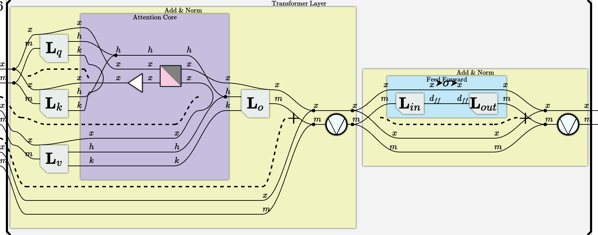

# Transformer Example

An $L$-layer decoder-only transformer, assuming token embeddings are already
computed. The layer iteration is represented explicitly as a Scan over the layer
axis $\ell$: each step maps the hidden state $H[\ell, x, m]$ to $H[\ell+1, x, m]$
using per-layer weights $W_Q[\ell,\ldots]$, $W_K[\ell,\ldots]$, etc. (untied —
each layer has independent parameters). In the TL DSL, the $\ell$ index on
weights is realised by $L$ independent module instances chained with $@$, one
per layer. Axes and tensor-logic equations are given first; the TL DSL
translation follows.

---

## 1. Mathematical Tensor Logic

### Axes

| Symbol | Role | Typical size |
|---|---|---|
| $\ell$ | layer index | $L$ |
| $x$ | query token position | 512 |
| $x'$ | key/value token position | 512 |
| $m$ | model (embedding) dimension | 512 |
| $h$ | attention head | 8 |
| $k$ | head dimension | 64 |
| $d_{ff}$ | FFN hidden dimension | 2048 |

A trailing dot marks a normalisation axis (softmax or RMSnorm sums over that
index). $[x' \leq x]$ is an Iverson bracket — 1 when the predicate holds, 0
otherwise. The Scan iterates the step function below for $\ell = 0, \ldots, L-1$;
the $L$-layer output is $H[L, x, m]$.

### Attention sub-layer at step $\ell$

**Q, K, V projections** (contract $m$):

$$Q[\ell, x, h, k] = W_Q[\ell, h, k, m]\, H[\ell, x, m] \tag{1}$$
$$K[\ell, x', h, k] = W_K[\ell, h, k, m]\, H[\ell, x', m] \tag{2}$$
$$V[\ell, x', h, k] = W_V[\ell, h, k, m]\, H[\ell, x', m] \tag{3}$$

**QK scores → softmax** (contract $k$, normalise over $x'$):

$$\text{Comp}[\ell, h, x, x'.] = \text{softmax}\!\left(Q[\ell, x, h, k]\, K[\ell, x', h, k]\right) \tag{4}$$

**Causal mask + renormalise** (normalise over $x'$):

$$S[\ell, h, x, x'.] = \text{normalize}\!\left(\text{Comp}[\ell, h, x, x']\, [x' \leq x]\right) \tag{5}$$

**SV aggregation** (contract $x'$):

$$\text{Out}[\ell, x, h, k] = S[\ell, h, x, x']\, V[\ell, x', h, k] \tag{6}$$

**Output projection** (contract $h, k$):

$$\text{Attn}[\ell, x, m] = W_O[\ell, m, h, k]\, \text{Out}[\ell, x, h, k] \tag{7}$$

**Attention residual + RMSnorm** (normalise over $m$):

$$A[\ell, x, m.] = \text{rmsnorm}\!\left(\text{Attn}[\ell, x, m] + H[\ell, x, m]\right) \tag{8}$$

### FFN sub-layer at step $\ell$

**FFN in** — linear then ReLU (contract $m$):

$$F[\ell, x, d_{ff}] = \text{relu}\!\left(W_{\text{in}}[\ell, d_{ff}, m]\, A[\ell, x, m]\right) \tag{9}$$

**FFN out** (contract $d_{ff}$):

$$Y[\ell, x, m] = W_{\text{out}}[\ell, m, d_{ff}]\, F[\ell, x, d_{ff}] \tag{10}$$

### Scan recurrence

**Initialisation** (token embeddings):

$$H[0, x, m] = X[x, m] \tag{11}$$

**FFN residual + RMSnorm → next hidden state** (normalise over $m$):

$$H[\ell+1, x, m.] = \text{rmsnorm}\!\left(Y[\ell, x, m] + A[\ell, x, m]\right) \tag{12}$$

The layer axis $\ell$ has size $L$, a hyperparameter (e.g. $L = 12$ for
GPT-2 base, $L = 96$ for GPT-3).  In the TL DSL, $L$ is the argument to
`transformer_stack(L)`, which allocates one independent `transformer_layer()`
per step; equivalently it is the length of the `layers` list in the PyTorch
code.  Weights are untied across layers — $W_Q[\ell,\ldots]$,
$W_K[\ell,\ldots]$, etc.\ are distinct tensors for each $\ell$.

---

## 2. TL DSL

Every computational step is expressed as a TL equation. When the same external
tensor feeds multiple equations in a program, `TL.to_morphism()` threads it
through the live pool automatically — no structural fork is needed.
`cat.Block.template()` wraps sub-graphs purely for display grouping.

```python
import data_structure.Category as cat
from data_structure.TensorDSL import TL, real_axis, softmax, normalize, relu

# Concrete axis sizes — required for LayerNorm and Iverson materialisation.
SEQ, D, H, K, DFF = 512, 512, 8, 64, 2048

def _m():     return real_axis('m',      D)
def _h():     return real_axis('h',      H)
def _k():     return real_axis('k',      K)
def _d_ff():  return real_axis('d_{ff}', DFF)


# ---------------------------------------------------------------------------
# Attention sub-layer + residual + RMSnorm
# ---------------------------------------------------------------------------
# H is an external tensor referenced in Q/K/V projections and in the final
# residual sum. TL.to_morphism() assigns H a single live-pool slot and routes
# it to every step that needs it.

def attn_res() -> cat.BroadcastedCategory:
    tl = TL()
    q = real_axis('q', SEQ)
    x = real_axis('x', SEQ)   # key/value token position
    m = _m(); h = _h(); k = _k()

    # Q/K/V projections (H threaded to all three)
    tl.Query[q, h, k]   = tl.W_Q[h, k, m] * tl.H[q, m]
    tl.Key[x, h, k]     = tl.W_K[h, k, m] * tl.H[x, m]
    tl.Value[x, h, k]   = tl.W_V[h, k, m] * tl.H[x, m]

    # QK scores → softmax (contract k)
    tl.Comp[h, q, x]    = softmax(tl.Query[q, h, k] * tl.Key[x, h, k])

    # Causal mask + renormalise (sized axes → Iverson auto-materialised)
    tl.S[h, q, x]       = normalize(tl.Comp[h, q, x] * (x <= q))

    # SV aggregation (contract x)
    tl.AttnOut[q, h, k] = tl.S[h, q, x] * tl.Value[x, h, k]

    # Output projection (contract h, k)
    tl.Attn[q, m]       = tl.W_O[m, h, k] * tl.AttnOut[q, h, k]

    # Residual + RMSnorm — H is threaded, no fork needed
    tl.A[q, m]          = normalize(tl.Attn[q, m] + tl.H[q, m])

    return cat.Block.template(
        tl.to_morphism(),
        title='Attention + Add & Norm', fill_color='#F1F4C1',
    )


# ---------------------------------------------------------------------------
# FFN sub-layer + residual + RMSnorm
# ---------------------------------------------------------------------------
# A (the attention output, FFN input) feeds both the FFN computation and the
# residual sum. TL.to_morphism() threads A automatically.

def ffn_res() -> cat.BroadcastedCategory:
    tl = TL()
    q = real_axis('q', SEQ); m = _m(); d = _d_ff()

    tl.F[q, d]   = relu(tl.W_in[d, m] * tl.A[q, m])
    tl.Y[q, m]   = tl.W_out[m, d] * tl.F[q, d]

    # Residual + RMSnorm — A is threaded, no fork needed
    tl.Out[q, m] = normalize(tl.Y[q, m] + tl.A[q, m])

    return cat.Block.template(
        tl.to_morphism(),
        title='FFN + Add & Norm', fill_color='#C1E8F7',
    )


# ---------------------------------------------------------------------------
# Transformer layer (one Scan step)
# ---------------------------------------------------------------------------

def transformer_layer() -> cat.BroadcastedCategory:
    return cat.Block.template(
        attn_res() @ ffn_res(),
        title='Transformer Layer', fill_color='#F3F3F4',
    )


# ---------------------------------------------------------------------------
# Transformer stack: L layers with independent (untied) weight parameters
# ---------------------------------------------------------------------------
# Each call to transformer_layer() allocates a fresh set of TL weight tensors,
# realising the per-layer weights W_Q[l,...], W_K[l,...], ... of the math.
# Chaining with @ composes them into a single morphism H[x,m] → H'[x,m].
#
# Weight-tied variant (same parameters shared across all L steps):
#   tl = TL(); tl.H[x, m, 0] = tl.X[x, m]
#   tl.H.recur(real_axis('l', L), transformer_layer())
#   return tl.to_morphism()

def transformer_stack(L: int) -> cat.BroadcastedCategory:
    from functools import reduce
    layers = reduce(lambda a, b: a @ b, (transformer_layer() for _ in range(L)))
    return cat.Block.template(layers, title='Transformer Stack', fill_color='#F3F3F4')
```

---

## 3. Diagram

The TypeScript renderer in `tsncd` can display any pyncd morphism. Start the WebSocket server and the dev server in two terminals, then run the snippet below to push the diagram.

**Terminal 1 — WebSocket relay server** (from `pyncd/`):

```bash
python run_server.py
```

**Terminal 2 — TypeScript diagram frontend** (from `tsncd/`):

```bash
npm run dev          # opens http://localhost:3000
```

**Send the diagram** (from `pyncd/`):

```python
import asyncio
import websocket_transfer.websockets_transfer as wst

async def main():
    diagram = transformer_stack(L=2)   # use small L — each layer is a visible sub-block
    await wst.send_term(diagram)

asyncio.run(main())
```

`transformer_stack(L)` returns a `Block(Composed([layer_1, ..., layer_L]))` where each layer is itself a `Block(Composed([attn_res, ffn_res]))`. The TypeScript renderer lays these out as nested coloured boxes: the outermost `'Transformer Stack'` block, one `'Transformer Layer'` block per step, and inside each layer the `'Attention + Add & Norm'` and `'FFN + Add & Norm'` sub-blocks.

### Rendered diagram

The diagram below is the actual tsncd output — rendered by the TypeScript front-end, screenshotted with Puppeteer at 2× device pixel ratio. Each coloured nested box corresponds to a `Block` in the pyncd morphism. Wires carry axis labels (`x`, `m`, `h`, `k`, `d_ff`). Dashed wires are the residual copy produced by the `(0, 0)` Rearrangement; solid wires carry computed tensors.



Left block (yellow, "Add & Norm" → purple "Attention Core"): Q/K/V linear projections (**L**_q, **L**_k, **L**_v), QK matmul, softmax (white triangle), causal mask (grey triangle), SV matmul, output projection **L**_o, residual addition (+) and normalisation (⊽). Right block (blue, "Feed Forward" inside yellow "Add & Norm"): FFN-in projection **L**_in, ReLU, FFN-out projection **L**_out, residual addition and normalisation.

---

## 4. PyTorch

Each `LayerNorm` carries learned weight and bias parameters.  The causal mask
is pre-materialised once — it is not recomputed each forward call.

```python
import torch
import torch.nn as nn
import torch.nn.functional as F
import einops
from dataclasses import dataclass

SEQ, D, H, K, DFF = 512, 512, 8, 64, 2048

# Pre-materialised causal mask — lower-triangular (SEQ × SEQ).
# In the compiled module this is a named buffer registered at __init__ time.
causal_mask = torch.tril(torch.ones(SEQ, SEQ))


# ---------------------------------------------------------------------------
# Attention sub-layer + residual + RMSnorm
# ---------------------------------------------------------------------------

def attn_res_forward(W_Q, H, W_K, W_V, W_O, *, norm_s, norm_a):
    """norm_s: LayerNorm(SEQ)  norm_a: LayerNorm(D)"""
    Query   = einops.einsum(W_Q, H,       'h k m, q m -> q h k')
    Key     = einops.einsum(W_K, H,       'h k m, x m -> x h k')
    Value   = einops.einsum(W_V, H,       'h k m, x m -> x h k')

    scores  = einops.einsum(Query, Key,   'q h k, x h k -> h q x')
    Comp    = torch.softmax(scores, dim=-1)
    S       = norm_s(Comp * causal_mask)

    AttnOut = einops.einsum(S, Value,     'h q x, x h k -> q h k')
    Attn    = einops.einsum(W_O, AttnOut, 'm h k, q h k -> q m')
    return norm_a(Attn + H)


# ---------------------------------------------------------------------------
# FFN sub-layer + residual + RMSnorm
# ---------------------------------------------------------------------------

def ffn_res_forward(W_in, A, W_out, *, norm_ffn):
    """norm_ffn: LayerNorm(D)"""
    F_act = torch.relu(einops.einsum(W_in, A,   'd m, q m -> q d'))
    Y     = einops.einsum(W_out, F_act,          'm d, q d -> q m')
    return norm_ffn(Y + A)


# ---------------------------------------------------------------------------
# Transformer layer = attention block → FFN block
# ---------------------------------------------------------------------------

@dataclass
class LayerWeights:
    W_Q:     torch.Tensor   # (H, K, D)
    W_K:     torch.Tensor   # (H, K, D)
    W_V:     torch.Tensor   # (H, K, D)
    W_O:     torch.Tensor   # (D, H, K)
    W_in:    torch.Tensor   # (DFF, D)
    W_out:   torch.Tensor   # (D, DFF)
    norm_s:  nn.LayerNorm   # LayerNorm(SEQ)
    norm_a:  nn.LayerNorm   # LayerNorm(D)
    norm_ffn: nn.LayerNorm  # LayerNorm(D)


def transformer_layer_forward(H: torch.Tensor, w: LayerWeights) -> torch.Tensor:
    A = attn_res_forward(w.W_Q, H, w.W_K, w.W_V, w.W_O,
                         norm_s=w.norm_s, norm_a=w.norm_a)
    return ffn_res_forward(w.W_in, A, w.W_out, norm_ffn=w.norm_ffn)


# ---------------------------------------------------------------------------
# Transformer stack: L independent layers (untied weights)
# ---------------------------------------------------------------------------

def transformer_stack_forward(
    H: torch.Tensor,             # (SEQ, D) — input token embeddings
    layers: list[LayerWeights],
) -> torch.Tensor:               # (SEQ, D)
    for w in layers:
        H = transformer_layer_forward(H, w)
    return H


# ---------------------------------------------------------------------------
# Instantiation
# ---------------------------------------------------------------------------

def make_layer() -> LayerWeights:
    return LayerWeights(
        W_Q    = torch.randn(H, K, D),
        W_K    = torch.randn(H, K, D),
        W_V    = torch.randn(H, K, D),
        W_O    = torch.randn(D, H, K),
        W_in   = torch.randn(DFF, D),
        W_out  = torch.randn(D, DFF),
        norm_s  = nn.LayerNorm(SEQ),
        norm_a  = nn.LayerNorm(D),
        norm_ffn = nn.LayerNorm(D),
    )

L      = 12
layers = [make_layer() for _ in range(L)]
H_0    = torch.randn(SEQ, D)      # input token embeddings
H_L    = transformer_stack_forward(H_0, layers)   # (SEQ, D)
```

---

## Appendix A. PyRel Translation

The rules below translate each of the twelve tensor-logic equations into PyRel, following the conventions in [`tensor_logic_in_pyrel.md`](tensor_logic_in_pyrel.md). Weight tensors are declared as `model.Relationship`; derived tensors as `model.Concept`. Python names that would clash with builtins are suffixed `_rel` (e.g. `K_rel`, `S_rel`, `F_rel`).

Equations with a trailing `.` — softmax in (4), normalize in (5), RMSnorm in (8) and (12) — are expanded into explicit intermediate bindings per the `.`-indexed normalization rules in `tensor_logic_in_pyrel.md`. Equation (4) requires an intermediate `Score` relation because the two aggregation steps (contract `k`, then normalize over `x'`) cannot be chained in a single `where` block.

```python
from relationalai.semantics.std.math import exp, sqrt
from relationalai.std import Integer, Float

D = 512  # model dimension — used as RMSnorm denominator

# Axis refs, reused across all rules
ell, x, xp = Integer.ref(), Integer.ref(), Integer.ref()
m, h, k, d = Integer.ref(), Integer.ref(), Integer.ref(), Integer.ref()
```

---

### Equations (1)–(3): Q, K, V projections

Each projection contracts over `m`; the layer index `ell` and the shared dimension index `m` pin the join.

```python
# (1)  Q[ell,x,h,k] = W_Q[ell,h,k,m] H[ell,x,m]
vwq, vh = Float.ref(), Float.ref()
where(W_Q(ell,h,k,m,vwq), H(ell,x,m,vh)).define(
    Q.new(ell=ell, x=x, h=h, k=k, val=sum(vwq*vh).per(ell,x,h,k))
)

# (2)  K[ell,x',h,k] = W_K[ell,h,k,m] H[ell,x',m]
vwk, vh = Float.ref(), Float.ref()
where(W_K(ell,h,k,m,vwk), H(ell,xp,m,vh)).define(
    K_rel.new(ell=ell, xp=xp, h=h, k=k, val=sum(vwk*vh).per(ell,xp,h,k))
)

# (3)  V[ell,x',h,k] = W_V[ell,h,k,m] H[ell,x',m]
vwv, vh = Float.ref(), Float.ref()
where(W_V(ell,h,k,m,vwv), H(ell,xp,m,vh)).define(
    V_rel.new(ell=ell, xp=xp, h=h, k=k, val=sum(vwv*vh).per(ell,xp,h,k))
)
```

---

### Equation (4): QK scores and softmax

The score contracts over `k`; softmax then normalizes over `x'`. An intermediate `Score` relation separates the two aggregation steps.

```python
# Intermediate: raw QK score (contract k)
vq, vkv = Float.ref(), Float.ref()
where(Q(ell,x,h,k,vq), K_rel(ell,xp,h,k,vkv)).define(
    Score.new(ell=ell, h=h, x=x, xp=xp, val=sum(vq*vkv).per(ell,h,x,xp))
)

# (4)  Comp[ell,h,x,x'.] = softmax(Q[ell,x,h,k] K[ell,x',h,k])
# Softmax over xp for each (ell,h,x); max-shifted for numerical stability.
vs = Float.ref()
where(Score(ell,h,x,xp,vs),
      smax := max(vs).per(ell,h,x),
      sexp := exp(vs - smax),
      z    := sum(sexp).per(ell,h,x)).define(
    Comp.new(ell=ell, h=h, x=x, xp=xp, val=sexp/z)
)
```

---

### Equation (5): Causal mask and renormalization

The Iverson bracket `[x' ≤ x]` becomes a `where` filter; the surviving rows are renormalized by dividing by their sum.

```python
# (5)  S[ell,h,x,x'.] = normalize(Comp[ell,h,x,x'] [x'≤x])
vc = Float.ref()
where(Comp(ell,h,x,xp,vc),
      xp <= x,
      z := sum(vc).per(ell,h,x)).define(
    S_rel.new(ell=ell, h=h, x=x, xp=xp, val=vc/z)
)
```

---

### Equation (6): SV aggregation

Contract over `x'`; join `S_rel` and `V_rel` on `(ell, h, xp)`.

```python
# (6)  Out[ell,x,h,k] = S[ell,h,x,x'] V[ell,x',h,k]
vs, vv = Float.ref(), Float.ref()
where(S_rel(ell,h,x,xp,vs), V_rel(ell,xp,h,k,vv)).define(
    Out.new(ell=ell, x=x, h=h, k=k, val=sum(vs*vv).per(ell,x,h,k))
)
```

---

### Equation (7): Output projection

Contract over `h, k`; join `W_O` and `Out` on `(ell, h, k)`.

```python
# (7)  Attn[ell,x,m] = W_O[ell,m,h,k] Out[ell,x,h,k]
vwo, vo = Float.ref(), Float.ref()
where(W_O(ell,m,h,k,vwo), Out(ell,x,h,k,vo)).define(
    Attn.new(ell=ell, x=x, m=m, val=sum(vwo*vo).per(ell,x,m))
)
```

---

### Equation (8): Attention residual + RMSnorm

The trailing `.` on `m` expands to RMSnorm: compute the residual, then divide each element by the root-mean-square of the full `m` slice.

```python
# (8)  A[ell,x,m.] = rmsnorm(Attn[ell,x,m] + H[ell,x,m])
va, vh = Float.ref(), Float.ref()
where(Attn(ell,x,m,va), H(ell,x,m,vh),
      r   := va + vh,
      rms := sqrt(sum(r*r).per(ell,x) / D)).define(
    A.new(ell=ell, x=x, m=m, val=r/rms)
)
```

---

### Equations (9)–(10): FFN sub-layer

ReLU is applied elementwise to the already-contracted sum (same pattern as `sigm` in example 3 of `tensor_logic_in_pyrel.md`).

```python
# (9)  F[ell,x,d] = relu(W_in[ell,d,m] A[ell,x,m])
vwi, va = Float.ref(), Float.ref()
where(W_in(ell,d,m,vwi), A(ell,x,m,va)).define(
    F_rel.new(ell=ell, x=x, d=d, val=max(0.0, sum(vwi*va).per(ell,x,d)))
)

# (10) Y[ell,x,m] = W_out[ell,m,d] F[ell,x,d]
vwout, vf = Float.ref(), Float.ref()
where(W_out(ell,m,d,vwout), F_rel(ell,x,d,vf)).define(
    Y.new(ell=ell, x=x, m=m, val=sum(vwout*vf).per(ell,x,m))
)
```

---

### Equations (11)–(12): Scan recurrence

Equation (11) seeds the base case by copying token embeddings into layer 0. Equation (12) is a recursive rule advancing `ell` by one.

> **Note:** recursive aggregation through a self-referential `Relationship` is a known open issue in PyRel (see *Limitations* in [`tensor_logic_in_pyrel.md`](tensor_logic_in_pyrel.md)). The rules below express the intended semantics; as a workaround they can be unrolled over concrete `ell` values.

```python
# (11) H[0,x,m] = X[x,m]
vx = Float.ref()
where(X(x,m,vx)).define(H(0, x, m, vx))

# (12) H[ell+1,x,m.] = rmsnorm(Y[ell,x,m] + A[ell,x,m])
vy, va = Float.ref(), Float.ref()
where(Y(ell,x,m,vy), A(ell,x,m,va),
      r   := vy + va,
      rms := sqrt(sum(r*r).per(ell,x) / D)).define(
    H(ell+1, x, m, r/rms)
)
```
